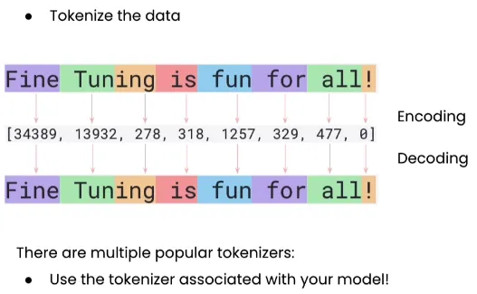

# LLM 微調步驟: Tokenizing

原文: [LLM fine-tuning step: Tokenizing](https://teetracker.medium.com/llm-fine-tuning-step-tokenizing-caebb280cfc2)

標記化(Tokenization)是微調 LLM 的關鍵階段，要求我們：

- `Encode the input` 這通常是指導文本的一種形式，例如問題。
- `Decode the output` 通常是呼叫 `generate()` 方法後的響應。

## Tokenization 是什麼?

簡單來說，就是使用字典（tokenizer 類別的實例）將單字轉換成電腦可以更好理解的東西，也就是數字化。當然，這是一個簡化的解釋，如下圖所示:



### 範例 (encode 和 decode)

```python
from transformers import AutoTokenizer

tokenizer = AutoTokenizer.from_pretrained("chat gpt")

text = "Hi, how are you?"

encoded_text = tokenizer(text)["input_ids"]

decoded_text = tokenizer.decode(encoded_text)

print("Decoded tokens back into text: ", decoded_text)
```

### 範例 (preprocessing)

```python
import datasets

def tokenizing(example):
    #
    # Callback for each examples
    # examples["question"] is a list containing str.
    # 
    if "question" in example and "answer" in example:
      text = example["question"][0] + example["answer"][0]
    elif "input" in example and "output" in example:
      text = example["input"][0] + example["output"][0]
    else:
      text = example["text"][0]

    tokenizer.pad_token = tokenizer.eos_token
    tokenized_inputs = tokenizer(
        text,
        return_tensors="np",
        padding=True,
    )

    max_length = min(
        tokenized_inputs["input_ids"].shape[1],
        2048
    )
    tokenizer.truncation_side = "left"
    tokenized_inputs = tokenizer(
        text,
        return_tensors="np",
        truncation=True,
        max_length=max_length
    )

    return tokenized_inputs

finetuning_dataset_loaded = datasets.load_dataset("json", data_files=filename, split="train")

tokenized_dataset = finetuning_dataset_loaded.map(
    tokenizing,
    batched=True,
    batch_size=1,
    drop_last_batch=True
)

print(tokenized_dataset)

'''
output:
Dataset({
    features: ['question', 'answer', 'input_ids', 'attention_mask'],
    num_rows: 1400
})
'''
```

### 範例 (prompting)

```python
from transformers import AutoTokenizer

def infer(text, model, tokenizer, max_input_tokens=1000, max_output_tokens=100):
  # Tokenize
  input_ids = tokenizer.encode(
          text,
          return_tensors="pt",
          truncation=True,
          max_length=max_input_tokens
  )

  # Generate
  device = model.device
  generated_tokens_with_prompt = model.generate(
    input_ids=input_ids.to(device),
    max_length=max_output_tokens
  )

  # Decode
  generated_text_with_prompt = tokenizer.batch_decode(generated_tokens_with_prompt, skip_special_tokens=True)

  # Strip the prompt
  generated_text_answer = generated_text_with_prompt[0][len(text):]

  return generated_text_answer

tokenizer = AutoTokenizer.from_pretrained("chat gpt")
model = AutoModelForCausalLM.from_pretrained("chat gpt")

infer("hello, how to write loop in Python?", model, tokenizer)
```
