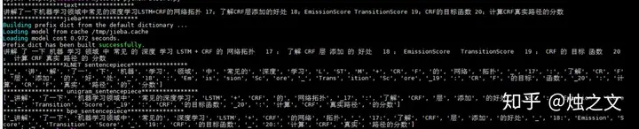

# sentencepiece 原理與實踐

原文: [sentencepiece原理与实践](https://www.zhihu.com/tardis/zm/art/159200073?source_id=1003)

## 前言

前段時間在看到 XLNET，Transformer-XL 等預訓練模式時，看到源代碼都用到 sentencepiece 模型，當時不清楚。經過這段時間實踐和應用，覺得這個方法和工具值得 NLP 領域推廣和應用。今天就分享下 sentencepiece 原理以及實踐效果。

## 原理

`sentencepiece` 由谷歌將一些詞-語言模型相關的論文進行複現，開發了一個開源工具——訓練自己領域的 `sentencepiece` 模型，該模型可以代替預訓練模型(BERT,XLNET)中詞表的作用。開源代碼地址為：`https://github.com/google/sentencepiece`。

其原理就相當於：提供四種關於詞的切分方法。這裡跟中文的分詞作用是一樣的，但從思路上還是有區分的。通過使用我感覺：在中文上，就是把經常在一起出現的字組合成一個詞語；在英文上，它會把英語單詞切分更小的語義單元，減少詞表的數量。

例如 "機器學習領域" 這個文本，按 jieba 會分 "機器/學習/領域"，但你想要粒度更大的切分效果，如 “機器學習/領域” 或者不切分，這樣更有利於模型捕捉更多 N-gram 特徵。為實現這個，你可能想到把對應的大粒度詞加到詞表中就可以解決，但是添加這類詞是很消耗人力。然而對於該問題，`sentencepiece` 可以得到一定程度解決，甚至完美解決你的需求。

模型在訓練中主要使用統計指標，比如出現的頻率，左右連接度等，還有困惑度來訓練最終的結果。了解算法細節可以去 githup 上查看相關論文。

## 安裝

GitHub 官網提供了二種安裝方式，第一種是通過 vcpkg：

```bash
git clone https://github.com/Microsoft/vcpkg.git
cd vcpkg
./bootstrap-vcpkg.sh
./vcpkg integrate install
./vcpkg install sentencepiece
```

第二種方式通過 C++ 方式安裝，需要依賴的包有：

- cmake
- C++11 compiler
- gperftools library (optional, 10-40% performance improvement can be obtained.)

安裝步驟先從 githup 把源碼 download 下來，然後:

```bash
% cd /path/to/sentencepiece
% mkdir build
% cd build
% cmake ..
% make -j $(nproc)
% sudo make install
% sudo ldconfig -v
```

## 訓練

安裝成功，就可以用自己的領域文本數據進行訓練，訓練的代碼指令為：

```bash
spm_train --input='/home/deploy/sentencepiece/news_corpus.txt' --model_prefix='/home/deploy/sentencepiece/mypiece' --vocab_size=320000 --character_coverage=1 --model_type='bpe' 
```

參數說明：

- `input` 訓練語料，形式為一行一段文本
- `model_prefix` 模型輸出的路徑
- `vocab_size` 訓練後詞表的大小，數量愈大訓練愈慢，太小(<4000)可能訓練不了
- `character_coverage` 模型中覆蓋的字符數，預設是 0.995，中文語料設置為 1
- `model_type` 訓練時模型的類別: [unigram(default), bpe, char, word]
- `max_sentence_length` 最大句子長度，默認是 4192，長度按 byte 來計算，意味一個中文字代表長度為 2
- `max_sentencepiece_length` 最大的句子長度，默認是 16
- `seed_sentencepiece_size` 控制句子數量，默認是 100w
- `num_threads` 線程數，默認是 16
- `use_all_vocab` 使用所有的 tokens 作為詞庫，不過只對 word/char 模型管用
- `input_sentence_size` 訓練器最大加載量，默認是 0

## 測試

模型訓練完成後，可以調用模型進行效果測試。在調用模型前，先安裝對應的 python 套件：

```bash
pip install sentencepiece
```

具體來說，我使用大小約 1G 的 NLP 訓練相關的語料庫，分別 `unigram` 和 `bpe` 兩個模型。另外，我還對比了 XLNET 開源的中文 sentencepiece 模型，以及 jieba 分詞效果。

```python
def sentence_piece():
    import sentencepiece as spm
    sp = spm.SentencePieceProcessor()

    text="讲解了一下机器学习领域中常见的深度学习LSTM+CRF的网络拓扑 17：了解CRF层添加的好处 18： 
           EmissionScore TransitionScore 19：CRF的目标函数 20：计算CRF真实路径的分数"

    print("*****************text****************")
    print(text)
    print("*****************jieba****************")
    print(' '.join(jieba.cut(text)))

    print("*****************XLNET sentencepiece****************")
    sp.Load("/home/deploy/pre_training/spiece.model")
    print(sp.EncodeAsPieces(text))

    print("***************** unigram_sentencepiece****************")
    sp.Load("/home/deploy/pre_training/sentencepiece/mypiece_unigram.model")
    print(sp.EncodeAsPieces(text))

    print("***************** bpe_sentencepiece****************")
    sp.Load("/home/deploy/pre_training/sentencepiece/mypiece_pbe.model")
    print(sp.EncodeAsPieces(text))
```

測試結果如下：



## 結論

從測試結果可以看出：sentencpiece 更趨於輸出更大粒度的詞，就像把 “機器學習領域中” 放在一起，說明這個詞在詞料庫中出現的頻率。

XLNET 中別人開源的模型跨領域表現的不好，在面對自己應用場景時，需要自己訓練。另外，與 jieba 對比，會發現夜間切分的可能不是一個語言詞，例如 "的網路"，但這個 N-gram 特徵對模型來說影響不大。

就個人來說，我覺得 sentencpiece 還是給我帶來了一定的驚喜，後續我會用它在下游任務上進行測試，再進一步驗證它的效果，比如 text-cnn 文本分類。不過，我覺得它有改進空間的，像切分如 "的網路" 這樣的結果，加一個失效詞處理流程，可能會更好。


