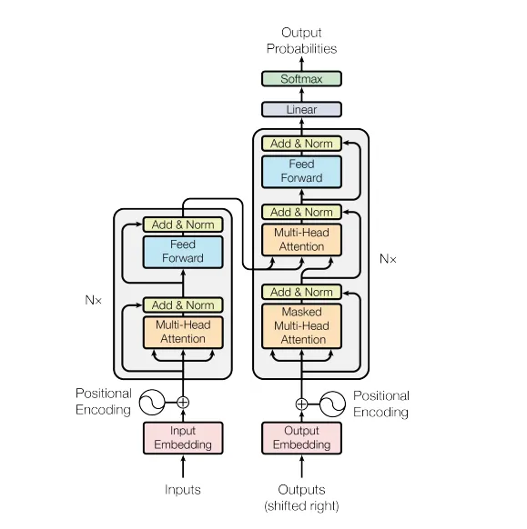
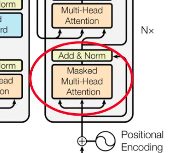
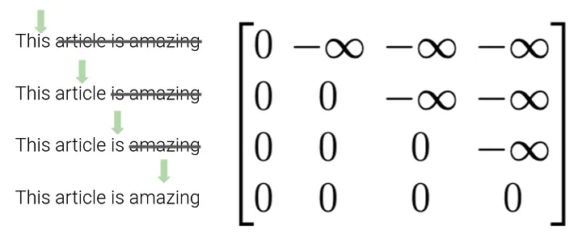
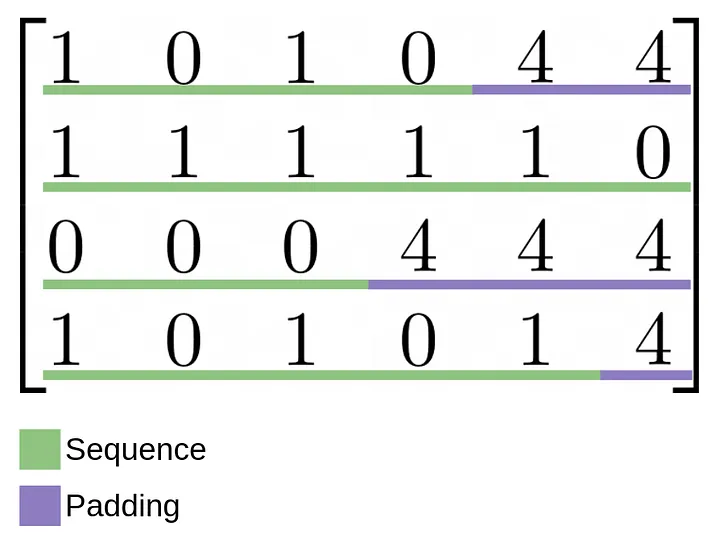

# PyTorch nn.Transformer() 模塊的詳細指南

原文:[A detailed guide to PyTorch’s nn.Transformer() module.](https://towardsdatascience.com/a-detailed-guide-to-pytorchs-nn-transformer-module-c80afbc9ffb1)

論文：“Attention is all you need” 提出了一種構建神經網絡的創新方法。該論文提出了一種由重複的編碼器和解碼器塊組成的編碼器-解碼器神經網絡。結構如下：



左邊的塊是編碼器，右邊的塊是解碼器。如果您還不了解該模型的各個部分，我強烈建議您閱讀哈佛大學的 [The Annotated Transformer 指南](https://nlp.seas.harvard.edu/2018/04/03/attention.html)，其中他們從頭開始在 PyTorch 中編碼了 Transformer 模型。我不會在本教程中介紹 “multi-head attention” 或 “feed-forward layers” 等重要概念，因此在繼續閱讀之前您應該了解它們。

PyTorch 和 Tensorflow 等現代 Python 庫已經包含通過 import 輕鬆訪問的 transformer 模型。然而，它不僅僅是導入模型並插入它。今天我將解釋如何使用和調整 PyTorch `nn.Transformer()` 模塊。

## 第一步

### Imports

首先，我們需要導入 PyTorch 和我們將要使用的其他一些套件：

```python
import torch
import torch.nn as nn
import torch.optim as optim

import math
import numpy as np
```

### Basic transformer structure

現在，讓我們仔細看看 transformer 模塊。我建議首先閱讀 [PyTorch 的相關文檔](https://pytorch.org/docs/stable/generated/torch.nn.Transformer.html#torch.nn.Transformer)。正如他們所解釋的，沒有強制參數。該模塊附帶“Attention is all you need”模型超參數。要使用它，我們首先創建一個簡單的 PyTorch 模型。我只會更改一些默認參數，這樣我們的模型就不會花費不必要的長時間來訓練。我將這些參數作為我們類別的一部分：

```python
class Transformer(nn.Module):
    def __init__(
        self,
        num_tokens,
        dim_model,
        num_heads,
        num_encoder_layers,
        num_decoder_layers,
        dropout_p,
    ):
        super().__init__()

        # Layers
        self.transformer = nn.Transformer(
            d_model=dim_model,
            nhead=num_heads,
            num_encoder_layers=num_encoder_layers,
            num_decoder_layers=num_decoder_layers,
            dropout=dropout_p,
        )

    def forward(self):
        pass
```

### Positional encoding

transformer 塊不關心輸入序列的順序。這當然是一個問題。說 “I ate a pizza with pineapple” 和 “a pineapple ate I with pizza” 是不一樣的。值得慶幸的是，我們有一個解決方案：位置編碼(positional encoding)。這是一種重視元素的位置的方法。可以在[此處](https://kazemnejad.com/blog/transformer_architecture_positional_encoding/)找到其工作原理的詳細說明，但快速解釋是我們為每個元素創建一個向量，表示其相對於序列中每個其他元素的位置。位置編碼遵循這個看起來非常複雜的公式，在實踐中，我們真的不需要理解：


為了組織和可重用性，讓我們為位置編碼層創建一個單獨的類別（看起來很難，但實際上只是公式、dropout 和殘差連接）:

```python
class PositionalEncoding(nn.Module):
    def __init__(self, dim_model, dropout_p, max_len):
        super().__init__()
        # Modified version from: https://pytorch.org/tutorials/beginner/transformer_tutorial.html
        # max_len determines how far the position can have an effect on a token (window)
        
        # Info
        self.dropout = nn.Dropout(dropout_p)
        
        # Encoding - From formula
        pos_encoding = torch.zeros(max_len, dim_model)
        positions_list = torch.arange(0, max_len, dtype=torch.float).view(-1, 1) # 0, 1, 2, 3, 4, 5
        division_term = torch.exp(torch.arange(0, dim_model, 2).float() * (-math.log(10000.0)) / dim_model) # 1000^(2i/dim_model)
        
        # PE(pos, 2i) = sin(pos/1000^(2i/dim_model))
        pos_encoding[:, 0::2] = torch.sin(positions_list * division_term)
        
        # PE(pos, 2i + 1) = cos(pos/1000^(2i/dim_model))
        pos_encoding[:, 1::2] = torch.cos(positions_list * division_term)
        
        # Saving buffer (same as parameter without gradients needed)
        pos_encoding = pos_encoding.unsqueeze(0).transpose(0, 1)
        self.register_buffer("pos_encoding",pos_encoding)
        
    def forward(self, token_embedding: torch.tensor) -> torch.tensor:
        # Residual connection + pos encoding
        return self.dropout(token_embedding + self.pos_encoding[:token_embedding.size(0), :])
```

## 完成我們的模型

現在我們有了 PyTorch 中唯一未包含的層，我們已準備好完成我們的模型。在添加位置編碼之前，我們需要一個嵌入層，以便將序列中的每個元素轉換為我們可以操作的向量（而不是固定整數）。我們還需要一個最終的線性層，以便我們可以將模型的輸出轉換為我們所需輸出的維度。最終模型應如下所示：

```python
class Transformer(nn.Module):
    """
    Model from "A detailed guide to Pytorch's nn.Transformer() module.", by
    Daniel Melchor: https://medium.com/p/c80afbc9ffb1/
    """
    # Constructor
    def __init__(
        self,
        num_tokens,
        dim_model,
        num_heads,
        num_encoder_layers,
        num_decoder_layers,
        dropout_p,
    ):
        super().__init__()

        # INFO
        self.model_type = "Transformer"
        self.dim_model = dim_model

        # LAYERS
        self.positional_encoder = PositionalEncoding(
            dim_model=dim_model, dropout_p=dropout_p, max_len=5000
        )

        self.embedding = nn.Embedding(num_tokens, dim_model)

        self.transformer = nn.Transformer(
            d_model=dim_model,
            nhead=num_heads,
            num_encoder_layers=num_encoder_layers,
            num_decoder_layers=num_decoder_layers,
            dropout=dropout_p,
        )

        self.out = nn.Linear(dim_model, num_tokens)

    def forward(
        self,
        src,
        tgt,
    ):
        # Src size must be (batch_size, src sequence length)
        # Tgt size must be (batch_size, tgt sequence length)

        # Embedding + positional encoding - Out size = (batch_size, sequence length, dim_model)
        src = self.embedding(src) * math.sqrt(self.dim_model)
        tgt = self.embedding(tgt) * math.sqrt(self.dim_model)
        src = self.positional_encoder(src)
        tgt = self.positional_encoder(tgt)

        # we permute to obtain size (sequence length, batch_size, dim_model),
        src = src.permute(1, 0, 2)
        tgt = tgt.permute(1, 0, 2)

        # Transformer blocks - Out size = (sequence length, batch_size, num_tokens)
        transformer_out = self.transformer(src, tgt)
        out = self.out(transformer_out)

        return out
```

我知道......它看起來非常令人生畏，但如果您了解每個部分的作用，它實際上是一個非常容易實現的模型。

## 目標掩蔽 (Masking)

您可能還記得模型結構中有一個特殊的塊，稱為 “masked multi-head attention”：



那麼……什麼是 masking？ 在我向您解釋之前，讓我們快速回顧一下當我們將張量輸入模型時，它們發生了什麼。首先，我們嵌入並編碼（位置編碼）我們的源張量。然後，我們的源張量被編碼成一個難以理解的編碼張量，我們將其與嵌入和編碼的（位置）目標向量一起輸入到解碼器中。為了讓我們的模型學習，我們不能只向它展示整個目標張量！這只會直接給他答案。

解決這個問題的方法是使用 masking tensor。該張量由大小（序列長度 x 序列長度）組成，因為對於序列中的每個元素，我們都會向模型顯示另一個元素。該矩陣將被添加到我們的目標向量中，因此該矩陣將由變壓器可以訪問元素的位置處的零組成，並在不能訪問元素的位置處由負無窮大組成。圖解說明可能會對您有更多幫助：




## 掩碼填充 (Padding Masking)

如果您不知道，張量是可以存儲在 GPU 中的矩陣，並且由於它們是矩陣，因此所有維度必須具有相同大小的元素。當然，在處理 NLP 或不同大小的圖像等任務時，這種情況不會發生。因此，我們使用所謂的“特殊令牌”。這些標記使我們的模型能夠知道句子的開頭在哪裡 (<SOS>)、句子的結尾在哪裡 (<EOS>) 以及哪些元素正好填充剩餘空間，以便我們的矩陣具有sam 序列大小(<PAD>) 。這些標記還必須轉換為其相應的整數 id（在我們的示例中，它們分別為 2、3 和 4）。填充序列看起來像這樣：



為了告訴我們的模型這些標記應該是不相關的，我們使用一個二進制矩陣，其中填充標記所在的位置有 True 值，沒有填充標記的位置有 False：


