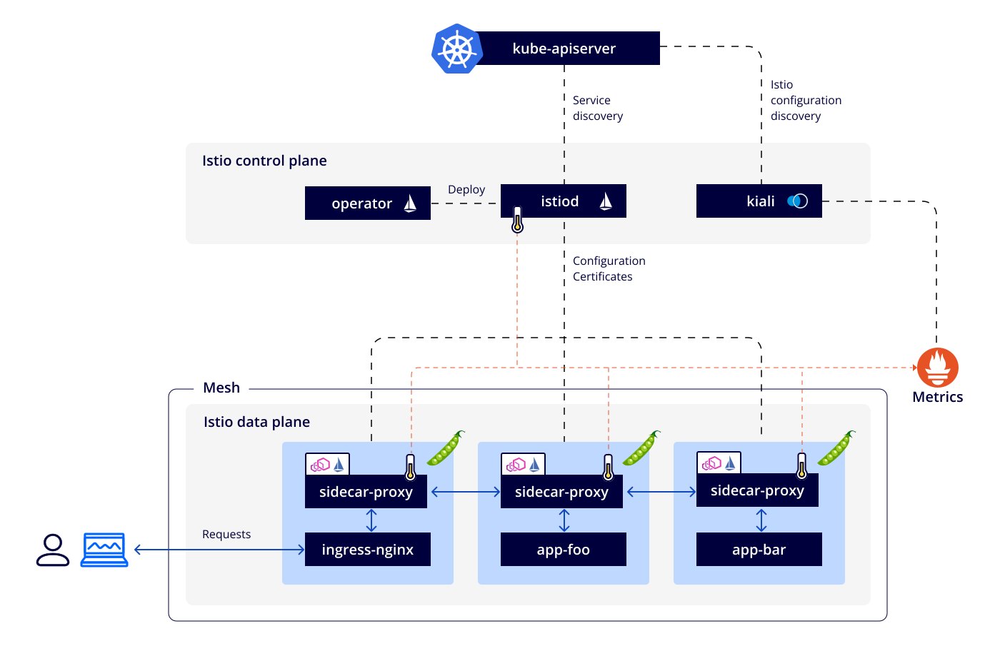
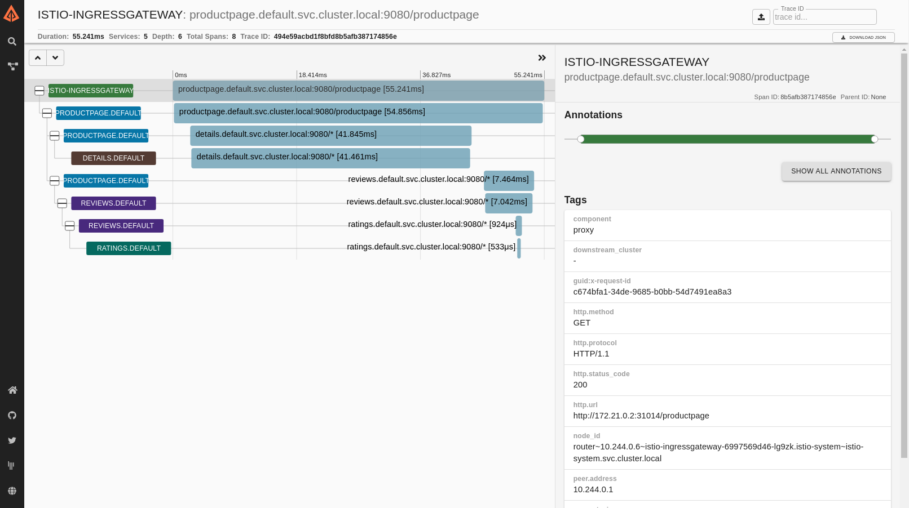

# 可觀測性



Istio 為網格內所有的服務通信生成詳細的遙測數據。這種遙測技術提供了服務行為的可觀測性，使運維人員能夠排查故障、維護和優化應用程序，而不會給服務的開發人員帶來任何額外的負擔。通過 Istio，運維人員可以全面了解到受監控的服務如何與其他服務以及 Istio 組件進行交互。

Istio 生成以下類型的遙測數據，以提供對整個服務網格的可觀測性：

- `Metrics`: Istio 基於 4 個監控的黃金標識（延遲、流量、錯誤、飽和度）生成了一系列服務指標。 Istio 還為網格控制平面提供了更詳細的指標。除此以外還提供了一組默認的基於這些指標的網格監控儀表板。
- `Distributed Traces`: Istio 為每個服務生成分佈式追踪 span，運維人員可以理解網格內服務的依賴和調用流程。
- `Access Logs`: 當流量流入網格中的服務時，Istio 可以生成每個請求的完整記錄，包括源和目標的元數據。此信息使運維人員能夠將服務行為的審查控製到單個工作負載實例的級別。

## 指標

指標（Metric）提供了一種以聚合的方式監控和理解行為的方法。

為了監控服務行為，Istio 為服務網格中所有出入網格，以及網格內部的服務流量都生成了指標。這些指標提供了關於行為的信息，例如總流量數、錯誤率和請求響應時間。

除了監控網格中服務的行為外，監控網格本身的行為也很重要。 Istio 組件可以導出自身內部行為的指標，以提供對網格控制平面的功能和健康情況的洞察能力。

### 代理級別指標

Istio 指標收集從 sidecar 代理（Envoy）開始。每個代理為通過它的所有流量（入站和出站）生成一組豐富的指標。代理還提供關於它本身管理功能的詳細統計信息，包括配置信息和健康信息。

Envoy 生成的指標提供了資源（例如監聽器和集群）粒度上的網格監控。因此，為了監控 Envoy 指標，需要了解網格服務和 Envoy 資源之間的連接。

Istio 允許運維人員在每個工作負載實例上選擇生成和收集哪個 Envoy 指標。默認情況下，Istio 只支持 Envoy 生成的統計數據的一小部分，以避免依賴過多的後端服務，還可以減少與指標收集相關的 CPU 開銷。然而，運維人員可以在需要時輕鬆地擴展收集到的代理指標集。這支持有針對性地調試網絡行為，同時降低了跨網格監控的總體成本。

[Envoy 文檔](https://www.envoyproxy.io/docs/envoy/latest/)包括了 [Envoy 統計信息](https://www.envoyproxy.io/docs/envoy/latest/intro/arch_overview/observability/statistics.html?highlight=statistics)收集的詳細說明。 Envoy 統計裡的操作手冊提供了有關控制代理級別指標生成的更多信息。

代理級別指標的例子：

```html
envoy_cluster_internal_upstream_rq{response_code_class="2xx",cluster_name="xds-grpc"} 7163

envoy_cluster_upstream_rq_completed{cluster_name="xds-grpc"} 7164

envoy_cluster_ssl_connection_error{cluster_name="xds-grpc"} 0

envoy_cluster_lb_subsets_removed{cluster_name="xds-grpc"} 0

envoy_cluster_internal_upstream_rq{response_code="503",cluster_name="xds-grpc"} 1
```

### 服務級別指標

除了代理級別指標之外，Istio 還提供了一組用於監控服務通信的面向服務的指標。這些指標涵蓋了四個基本的服務監控需求：延遲、流量、錯誤和飽和度情況。 Istio 帶有一組默認的儀表板，用於監控基於這些指標的服務行為。

默認情況下，標準 Istio 指標會導出到 Prometheus。

服務級別指標的使用完全是可選的。運維人員可以選擇關閉指標的生成和收集來滿足自身需要。

服務級別指標的例子：

```html
istio_requests_total{
  connection_security_policy="mutual_tls",
  destination_app="details",
  destination_canonical_service="details",
  destination_canonical_revision="v1",
  destination_principal="cluster.local/ns/default/sa/default",
  destination_service="details.default.svc.cluster.local",
  destination_service_name="details",
  destination_service_namespace="default",
  destination_version="v1",
  destination_workload="details-v1",
  destination_workload_namespace="default",
  reporter="destination",
  request_protocol="http",
  response_code="200",
  response_flags="-",
  source_app="productpage",
  source_canonical_service="productpage",
  source_canonical_revision="v1",
  source_principal="cluster.local/ns/default/sa/default",
  source_version="v1",
  source_workload="productpage-v1",
  source_workload_namespace="default"
} 214
```

### 控制平面指標

Istio 控制平面還提供了一組自我監控指標。這些指標容許監控 Istio 自己的行為（這與網格內的服務有所不同）。

有關這些被維護指標的更多信息，請查看[參考文檔](https://istio.io/latest/zh/docs/reference/commands/pilot-discovery/#metrics)。

## 分佈式追踪

分佈式追踪通過監控流經網格的單個請求，提供了一種監控和理解行為的方法。追踪使網格的運維人員能夠理解服務的依賴關係以及在服務網格中的延遲源。

Istio 支持通過 Envoy 代理進行分佈式追踪。代理自動為其應用程序生成追踪 span，只需要應用程序轉發適當的請求上下文即可。

Istio 支持很多追踪系統，包括 Zipkin、Jaeger、LightStep、Datadog。運維人員控制生成追踪的採樣率（每個請求生成跟踪數據的速率）。這允許運維人員控製網格生成追踪數據的數量和速率。

更多關於 Istio 分佈式追踪的信息可以在分佈式追踪 FAQ 中找到。

Istio 為單個請求生成的分佈式追踪示例：



## 訪問日誌

訪問日誌提供了一種從單個工作負載實例的角度監控和理解行為的方法。

Istio 能夠以一組可配置的格式為服務流量生成訪問日誌，使操作員可以完全控制日誌記錄的方式、內容、時間和地點。有關更多信息，請參閱獲取 Envoy 的訪問日誌。

Istio 訪問日誌示例：

```bash
[2019-03-06T09:31:27.360Z] "GET /status/418 HTTP/1.1" 418 - "-" 0 135 5 2 "-" "curl/7.60.0" "d209e46f-9ed5-9b61-bbdd-43e22662702a" "httpbin:8000" "127.0.0.1:80" inbound|8000|http|httpbin.default.svc.cluster.local - 172.30.146.73:80 172.30.146.82:38618 outbound_.8000_._.httpbin.default.svc.cluster.local
```
