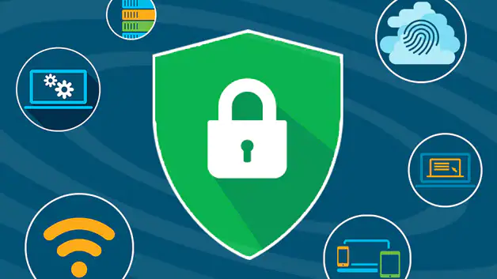

# 安全

將單一應用程序分解為微服務可提供各種好處，包括更好的靈活性、可伸縮性以及服務復用的能力。但是，微服務也有特殊的安全需求：

- 為了抵禦中間人攻擊，需要流量加密。
- 為了提供靈活的服務訪問控制，需要雙向 TLS 和細粒度的訪問策略。
- 要確定誰在什麼時候做了什麼，需要審計工具。

Istio Security 嘗試提供全面的安全解決方案來解決所有這些問題。本頁概述瞭如何使用 Istio 的安全功能來保護您的服務，無論您在何處運行它們。特別是 Istio 安全性可以減輕針對您的數據、端點、通信和平台的內部和外部威脅。

Istio 安全功能提供強大的身份，強大的策略，透明的 TLS 加密，認證，授權和審計（AAA）工具來保護你的服務和數據。 Istio 安全的目標是：

- 默認安全：應用程序代碼和基礎設施無需更改
- 深度防禦：與現有安全系統集成以提供多層防禦
- 零信任網絡：在不受信任的網絡上構建安全解決方案
