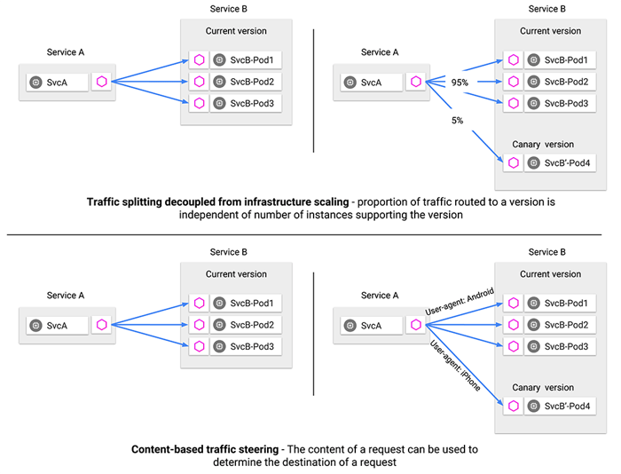

# 流量管理



Istio 的流量路由規則可以讓您很容易的控制服務之間的流量和 API 調用。 Istio 簡化了服務級別屬性的配置，比如熔斷器、超時和重試，並且能輕鬆的設置重要的任務，如 A/B 測試、金絲雀發布、基於流量百分比切分的概率發布等。它還提供了開箱即用的故障恢復特性，有助於增強應用的健壯性，從而更好地應對被依賴的服務或網絡發生故障的情況。

Istio 的流量管理模型源於和服務一起部署的 Envoy 代理。網格內服務發送和接收的所有流量（data plane流量）都經由 Envoy 代理，這讓控製網格內的流量變得異常簡單，而且不需要對服務做任何的更改。

## Istio 流量管理介绍

為了在網格中導流，Istio 需要知道所有的 endpoint 在哪和屬於哪個服務。為了定位到 service registry(服務註冊中心)，Istio 會連接到一個服務發現系統。例如，如果您在 Kubernetes 集群上安裝了 Istio，那麼它將自動檢測該集群中的服務和 endpoint。
使用此服務註冊中心，Envoy 代理可以將流量定向到相關服務。大多數基於微服務的應用程序，每個服務的工作負載都有多個實例來處理流量，稱為負載均衡池。默認情況下，Envoy 代理基於輪詢調度模型在服務的負載均衡池內分發流量，按順序將請求發送給池中每個成員，一旦所有服務實例均接收過一次請求後，重新回到第一個池成員。

Istio 基本的服務發現和負載均衡能力為您提供了一個可用的服務網格，但它能做到的遠比這多的多。在許多情況下，您可能希望對網格的流量情況進行更細粒度的控制。作為 A/B 測試的一部分，您可能想將特定百分比的流量定向到新版本的服務，或者為特定的服務實例子集應用不同的負載均衡策略。您可能還想對進出網格的流量應用特殊的規則，或者將網格的外部依賴項添加到服務註冊中心。通過使用 Istio 的流量管理 API 將流量配置添加到 Istio，就可以完成所有這些甚至更多的工作。

和其他 Istio 配置一樣，這些 API 也使用 Kubernetes 的自定義資源定義（CRD）來聲明，您可以像示例中看到的那樣使用 YAML 進行配置。

接下來分別介紹每個流量管理 API 以及如何使用它們。這些資源包括：

- Virtual services
- Destination rules
- Gateways
- Service entries
- Sidecars


## Virtual services

虛擬服務（Virtual Service） 和目標規則（Destination Rule） 是 Istio 流量路由功能的關鍵拼圖。虛擬服務讓您配置如何在服務網格內將請求路由到服務，這基於 Istio 和平台提供的基本的連通性和服務發現能力。每個虛擬服務包含一組路由規則，Istio 按順序評估它們，Istio 將每個給定的請求匹配到虛擬服務指定的實際目標地址。您的網格可以有多個虛擬服務，也可以沒有，取決於您的使用場景。

### 為什麼使用虛擬服務？

虛擬服務在增強 Istio 流量管理的靈活性和有效性方面，發揮著至關重要的作用，通過對客戶端請求的目標地址與真實響應請求的目標工作負載進行解耦來實現。虛擬服務同時提供了豐富的方式，為發送至這些工作負載的流量指定不同的路由規則。

為什麼這如此有用？就像在介紹中所說，如果沒有虛擬服務，Envoy 會在所有的服務實例中使用 **輪詢** 的負載均衡策略分發請求。您可以用您對工作負載的了解來改善這種行為。例如，有些可能代表不同的版本。這在 A/B 測試中可能有用，您可能希望在其中配置基於不同服務版本的流量百分比路由，或指引從內部用戶到特定實例集的流量。

使用虛擬服務，您可以為一個或多個主機名指定流量行為。在虛擬服務中使用路由規則，告訴 Envoy 如何發送虛擬服務的流量到適當的目標。路由目標地址可以是同一服務的不同版本，也可以是完全不同的服務。

一個典型的用例是將流量發送到被指定為服務子集的服務的不同版本。客戶端將虛擬服務視為一個單一實體，將請求發送至虛擬服務主機，然後 Envoy 根據虛擬服務規則把流量路由到不同的版本。例如，“20% 的調用轉到新版本”或“將這些用戶的調用轉到版本 2”。

這允許您創建一個金絲雀發布，逐步增加發送到新版本服務的流量百分比。流量路由完全獨立於實例部署，這意味著實現新版本服務的實例可以根據流量的負載來伸縮，完全不影響流量路由。相比之下，像 Kubernetes 這樣的容器編排平台只支持基於實例縮放的流量分發，這會讓情況變得複雜。您可以在使用 Istio 進行金絲雀部署的文章裡閱讀到更多用虛擬服務實現金絲雀部署的內容。

虛擬服務可以讓您：

- 通過單個虛擬服務處理多個應用程序服務。如果您的網格使用 Kubernetes，可以配置一個虛擬服務處理特定命名空間中的所有服務。映射單一的虛擬服務到多個“真實”服務特別有用，可以在不需要客戶適應轉換的情況下，將單體應用轉換為微服務構建的複合應用系統。您的路由規則可以指定為“對 monolith.com 的 URI 調用轉到 microservice A”等等。

- 和網關整合併配置流量規則來控制出入流量。

在某些情況下，您還需要配置目標規則來使用這些特性，因為這是指定服務子集的地方。在一個單獨的對像中指定服務子集和其它特定目標策略，有利於在虛擬服務之間更簡潔地重用這些規則。在下一章節您可以找到更多關於目標規則（Destination Rule）的內容。

### 虛擬服務示例

下面的虛擬服務根據請求是否來自特定的用戶，把它們路由到服務的不同版本。

```yaml
apiVersion: networking.istio.io/v1alpha3
kind: VirtualService
metadata:
  name: reviews
spec:
  hosts:
  - reviews
  http:
  - match:
    - headers:
        end-user:
          exact: jason
    route:
    - destination:
        host: reviews
        subset: v2
  - route:
    - destination:
        host: reviews
        subset: v3
```

#### hosts 字段

使用 `hosts` 字段列舉虛擬服務的主機——即用戶指定的目標或是路由規則設定的目標。這是客戶端向服務發送請求時使用的一個或多個地址。

```yaml
hosts:
- reviews
```

虛擬服務主機名可以是 IP 地址、DNS 名稱，或者依賴於平台的一個簡稱（例如 Kubernetes 服務的短名稱），隱式或顯式地指向一個完全限定域名（FQDN）。您也可以使用通配符（“*”）前綴，讓您創建一組匹配所有服務的路由規則。虛擬服務的 hosts 字段實際上不必是 Istio 服務註冊的一部分，它只是虛擬的目標地址。這讓您可以為沒有路由到網格內部的虛擬主機建模。

#### 路由規則

在 http 字段包含了虛擬服務的路由規則，用來描述匹配條件和路由行為，它們把 HTTP/1.1、HTTP2 和 gRPC 等流量發送到 `hosts` 字段指定的目標（您也可以用 tcp 和 tls 片段為 TCP 和未終止的 TLS 流量設置路由規則）。一個路由規則包含了指定的請求要流向哪個目標地址，具有 0 或多個匹配條件，取決於您的使用場景。

**匹配條件**

示例中的第一個路由規則有一個條件，因此以 `match` 字段開始。在本例中，您希望此路由應用於來自 ”jason“ 用戶的所有請求，所以使用 headers、end-user 和 exact 字段選擇適當的請求。

```yaml
- match:
   - headers:
       end-user:
         exact: jason
```

**Destination**

`route` 部分的 destination 字段指定了符合此條件的流量的實際目標地址。與虛擬服務的 hosts 不同，destination 的 host 必須是存在於 Istio 服務註冊中心的實際目標地址，否則 Envoy 不知道該將請求發送到哪裡。可以是一個有代理的服務網格，或者是一個通過服務入口被添加進來的非網格服務。本示例運行在 Kubernetes 環境中，host 名為一個 Kubernetes 服務名：

```yaml
route:
- destination:
    host: reviews
    subset: v2
```

!!! tip
    請注意，在該示例和本頁其它示例中，為了簡單，我們使用 Kubernetes 的短名稱設置 destination 的 host。在評估此規則時，Istio 會添加一個基於虛擬服務命名空間的域後綴，這個虛擬服務包含要獲取主機的完全限定名的路由規則。在我們的示例中使用短名稱也意味著您可以復制並在任何喜歡的命名空間中嘗試它們。

    只有在目標主機和虛擬服務位於相同的 Kubernetes 命名空間時才可以使用這樣的短名稱。因為使用 Kubernetes 的短名稱容易導致配置出錯，我們建議您在生產環境中指定完全限定的主機名。

`destination` 片段還指定了 Kubernetes 服務的子集，將符合此規則條件的請求轉入其中。在本例中子集名稱是 v2。您可以在目標規則章節中看到如何定義服務子集。

#### 路由規則優先級

路由規則按從上到下的順序選擇，虛擬服務中定義的第一條規則有最高優先級。本示例中，不滿足第一個路由規則的流量均流向一個默認的目標，該目標在第二條規則中指定。因此，第二條規則沒有 match 條件，直接將流量導向 v3 子集。

```yaml
- route:
  - destination:
      host: reviews
      subset: v3
```

我們建議提供一個默認的“無條件”或基於權重的規則（見下文）作為每一個虛擬服務的最後一條規則，如案例所示，從而確保流經虛擬服務的流量至少能夠匹配一條路由規則。

#### 路由規則的更多內容

正如上面所看到的，路由規則是將特定流量子集路由到指定目標地址的強大工具。您可以在流量端口、header 字段、URI 等內容上設置匹配條件。例如，這個虛擬服務讓用戶發送請求到兩個獨立的服務：ratings 和 reviews，就好像它們是 http://bookinfo.com/ 這個更大的虛擬服務的一部分。虛擬服務規則根據請求的 URI 和指向適當服務的請求匹配流量。

```yaml
apiVersion: networking.istio.io/v1alpha3
kind: VirtualService
metadata:
  name: bookinfo
spec:
  hosts:
    - bookinfo.com
  http:
  - match:
    - uri:
        prefix: /reviews
    route:
    - destination:
        host: reviews
  - match:
    - uri:
        prefix: /ratings
    route:
    - destination:
        host: ratings
...

  http:
  - match:
      sourceLabels:
        app: reviews
    route:
...
```

有些匹配條件可以使用精確的值，如前綴或正則。

您可以使用 AND 向同一個 match 塊添加多個匹配條件，或者使用 OR 向同一個規則添加多個 match 塊。對於任何給定的虛擬服務也可以有多個路由規則。這可以在單個虛擬服務中使路由條件變得隨您所願的複雜或簡單。匹配條件字段和備選值的完整列表可以在 HTTPMatchRequest 參考中找到。

另外，使用匹配條件您可以按百分比”權重“分發請求。這在 A/B 測試和金絲雀發布中非常有用：

```yaml
spec:
  hosts:
  - reviews
  http:
  - route:
    - destination:
        host: reviews
        subset: v1
      weight: 75
    - destination:
        host: reviews
        subset: v2
      weight: 25
```

您也可以使用路由規則在流量上執行一些操作，例如：

- 添加或刪除 header。
- 重寫 URL。
- 為調用這一目標地址的請求設置重試策略。

## Destination rules

與虛擬服務一樣，目標規則也是 Istio 流量路由功能的關鍵部分。您可以將虛擬服務視為將流量如何路由到給定目標地址，然後使用目標規則來配置該目標的流量。在評估虛擬服務路由規則之後，目標規則將應用於流量的“真實”目標地址。

特別是，您可以使用目標規則來指定命名的服務子集，例如按版本為所有給定服務的實例分組。然後可以在虛擬服務的路由規則中使用這些服務子集來控製到服務不同實例的流量。

目標規則還允許您在調用整個目的地服務或特定服務子集時定制 Envoy 的流量策略，比如您喜歡的負載均衡模型、TLS 安全模式或熔斷器設置。在目標規則參考中可以看到目標規則選項的完整列表。

### 負載均衡選項

默認情況下，Istio 使用輪詢的負載均衡策略，實例池中的每個實例依次獲取請求。 Istio 同時支持如下的負載均衡模型，可以在 DestinationRule 中為流向某個特定服務或服務子集的流量指定這些模型。

- Random：請求以隨機的方式轉到池中的實例。
- Weighted：請求根據指定的百分比轉到實例。
- Least requests: 請求被轉到最少被訪問的實例。

### 目標規則示例

在下面的示例中，目標規則為 my-svc 目標服務配置了 3 個具有不同負載均衡策略的子集：

```yaml
apiVersion: networking.istio.io/v1alpha3
kind: DestinationRule
metadata:
  name: my-destination-rule
spec:
  host: my-svc
  trafficPolicy:
    loadBalancer:
      simple: RANDOM
  subsets:
  - name: v1
    labels:
      version: v1
  - name: v2
    labels:
      version: v2
    trafficPolicy:
      loadBalancer:
        simple: ROUND_ROBIN
  - name: v3
    labels:
      version: v3
```

每個子集都是基於一個或多個 labels 定義的，在 Kubernetes 中它是附加到像 Pod 這種對像上的鍵/值對。這些標籤應用於 Kubernetes 服務的 Deployment 並作為 metadata 來識別不同的版本。

除了定義子集之外，目標規則對於所有子集都有默認的流量策略，而對於該子集，則有特定於子集的策略覆蓋它。定義在 subsets 上的默認策略，為 v1 和 v3 子集設置了一個簡單的隨機負載均衡器。在 v2 策略中，輪詢負載均衡器被指定在相應的子集字段上。

## Gateway

使用網關為網格來管理入站和出站流量，可以讓您指定要進入或離開網格的流量。網關配置被用於運行在網格邊界的獨立 Envoy 代理，而不是服務工作負載的 sidecar 代理。

與 Kubernetes Ingress API 這種控制進入系統流量的其他機制不同，Istio 網關讓您充分利用流量路由的強大能力和靈活性。您可以這麼做的原因是 Istio 的網關資源可以配置 4-6 層的負載均衡屬性，如對外暴露的端口、TLS 設置等。作為替代應用層流量路由（L7）到相同的 API 資源，您綁定了一個常規的 Istio 虛擬服務到網關。這讓您可以像管理網格中其他數據平面的流量一樣去管理網關流量。

網關主要用於管理進入的流量，但您也可以配置出口網關。出口網關讓您為離開網格的流量配置一個專用的出口節點，這可以限制哪些服務可以或應該訪問外部網絡，或者啟用出口流量安全控制為您的網格添加安全性。您也可以使用網關配置一個純粹的內部代理。

### Gateway 示例

下面的示例展示了一個外部 HTTPS 入口流量的網關配置：

```yaml
apiVersion: networking.istio.io/v1alpha3
kind: Gateway
metadata:
  name: ext-host-gwy
spec:
  selector:
    app: my-gateway-controller
  servers:
  - port:
      number: 443
      name: https
      protocol: HTTPS
    hosts:
    - ext-host.example.com
    tls:
      mode: SIMPLE
      serverCertificate: /tmp/tls.crt
      privateKey: /tmp/tls.key
```

這個網關配置讓 HTTPS 流量從 ext-host.example.com 通過 443 端口流入網格，但沒有為請求指定任何路由規則。為想要工作的網關指定路由，您必須把網關綁定到虛擬服務上。正如下面的示例所示，使用虛擬服務的 `gateways` 字段進行設置：

```yaml
apiVersion: networking.istio.io/v1alpha3
kind: VirtualService
metadata:
  name: virtual-svc
spec:
  hosts:
  - ext-host.example.com
  gateways:
    - ext-host-gwy
```

## Service Entry

使用服務入口（Service Entry） 來添加一個入口到 Istio 內部維護的服務註冊中心。添加了服務入口後，Envoy 代理可以向服務發送流量，就好像它是網格內部的服務一樣。配置服務入口允許您管理運行在網格外的服務的流量，它包括以下幾種能力：

- 為外部目標 redirect 和轉發請求，例如來自 web 端的 API 調用，或者流向遺留老系統的服務。
- 為外部目標定義重試、超時和故障注入策略。
- 添加一個運行在虛擬機的服務來擴展您的網格。

您不需要為網格服務要使用的每個外部服務都添加服務入口。默認情況下，Istio 配置 Envoy 代理將請求傳遞給未知服務。但是，您不能使用 Istio 的特性來控制沒有在網格中註冊的目標流量。

### Service Entry 示例

下面示例的 `mesh-external` 服務入口將 `ext-resource` 外部依賴項添加到 Istio 的服務註冊中心：

```yaml
apiVersion: networking.istio.io/v1alpha3
kind: ServiceEntry
metadata:
  name: svc-entry
spec:
  hosts:
  - ext-svc.example.com
  ports:
  - number: 443
    name: https
    protocol: HTTPS
  location: MESH_EXTERNAL
  resolution: DNS
```

您指定的外部資源使用 hosts 字段。可以使用完全限定名或通配符作為前綴域名。

您可以配置虛擬服務和目標規則，以更細粒度的方式控製到服務入口的流量，這與網格中的任何其他服務配置流量的方式相同。例如，下面的目標規則調整了使用服務入口配置的 `ext-svc.example.com` 外部服務的連接超時：

```yaml
apiVersion: networking.istio.io/v1alpha3
kind: DestinationRule
metadata:
  name: ext-res-dr
spec:
  host: ext-svc.example.com
  trafficPolicy:
    connectionPool:
      tcp:
        connectTimeout: 1s
```

## Sidecar

默認情況下，Istio 讓每個 Envoy 代理都可以訪問來自和它關聯的工作負載的所有端口的請求，然後轉發到對應的工作負載。您可以使用 sidecar 配置去做下面的事情：

- 微調 Envoy 代理接受的端口和協議集。
- 限制 Envoy 代理可以訪問的服務集合。

您可能希望在較龐大的應用程序中限制這樣的 sidecar 可達性，配置每個代理能訪問網格中的任意服務可能會因為高內存使用量而影響網格的性能。

您可以指定將 sidecar 配置應用於特定命名空間中的所有工作負載，或者使用 workloadSelector 選擇特定的工作負載。例如，下面的 sidecar 配置將 bookinfo 命名空間中的所有服務配置為僅能訪問運行在相同命名空間和 Istio 控制平面中的服務（Istio 的 egress 和遙測功能需要使用）：

```yaml
apiVersion: networking.istio.io/v1alpha3
kind: Sidecar
metadata:
  name: default
  namespace: bookinfo
spec:
  egress:
  - hosts:
    - "./*"
    - "istio-system/*"
```

## 網絡彈性和測試

除了為您的網格導流之外，Istio 還提供了可選的故障恢復和故障注入功能，您可以在運行時動態配置這些功能。使用這些特性可以讓您的應用程序運行穩定，確保服務網格能夠容忍故障節點，並防止局部故障級聯影響到其他節點。

### 超時

超時是 Envoy 代理等待來自給定服務的答复的時間量，以確保服務不會因為等待答复而無限期的掛起，並在可預測的時間範圍內調用成功或失敗。 HTTP 請求的默認超時時間是 15 秒，這意味著如果服務在 15 秒內沒有響應，調用將失敗。

對於某些應用程序和服務，Istio 的缺省超時可能不合適。例如，超時太長可能會由於等待失敗服務的回复而導致過度的延遲；而超時過短則可能在等待涉及多個服務返回的操作時觸發不必要地失敗。為了找到並使用最佳超時設置，Istio 允許您使用虛擬服務按服務輕鬆地動態調整超時，而不必修改您的業務代碼。下面的示例是一個虛擬服務，它對 ratings 服務的 v1 子集的調用指定 10 秒超時：

```yaml
apiVersion: networking.istio.io/v1alpha3
kind: VirtualService
metadata:
  name: ratings
spec:
  hosts:
  - ratings
  http:
  - route:
    - destination:
        host: ratings
        subset: v1
    timeout: 10s
```

### 重試

重試設置指定如果初始調用失敗，Envoy 代理嘗試連接服務的最大次數。通過確保調用不會因為臨時過載的服務或網絡等問題而永久失敗，重試可以提高服務可用性和應用程序的性能。重試之間的間隔（25ms+）是可變的，並由 Istio 自動確定，從而防止被調用服務被請求淹沒。 HTTP 請求的默認重試行為是在返回錯誤之前重試兩次。

與超時一樣，Istio 默認的重試行為在延遲方面可能不適合您的應用程序需求（對失敗的服務進行過多的重試會降低速度）或可用性。您可以在虛擬服務中按服務調整重試設置，而不必修改業務代碼。您還可以通過添加每次重試的超時來進一步細化重試行為，並指定每次重試都試圖成功連接到服務所等待的時間量。下面的示例配置了在初始調用失敗後最多重試 3 次來連接到服務子集，每個重試都有 2 秒的超時。

```yaml
apiVersion: networking.istio.io/v1alpha3
kind: VirtualService
metadata:
  name: ratings
spec:
  hosts:
  - ratings
  http:
  - route:
    - destination:
        host: ratings
        subset: v1
    retries:
      attempts: 3
      perTryTimeout: 2s
```

### 熔断器

熔斷器是 Istio 為創建具有彈性的微服務應用提供的另一個有用的機制。在熔斷器中，設置一個對服務中的單個主機調用的限制，例如並發連接的數量或對該主機調用失敗的次數。一旦限制被觸發，熔斷器就會“跳閘”並停止連接到該主機。使用熔斷模式可以快速失敗而不必讓客戶端嘗試連接到過載或有故障的主機。

熔斷適用於在負載均衡池中的“真實”網格目標地址，您可以在目標規則中配置熔斷器閾值，讓配置適用於服務中的每個主機。下面的示例將 v1 子集的reviews服務工作負載的並發連接數限制為 100：

```yaml
apiVersion: networking.istio.io/v1alpha3
kind: DestinationRule
metadata:
  name: reviews
spec:
  host: reviews
  subsets:
  - name: v1
    labels:
      version: v1
    trafficPolicy:
      connectionPool:
        tcp:
          maxConnections: 100
```

### 故障注入

在配置了網絡，包括故障恢復策略之後，可以使用 Istio 的故障注入機制來為整個應用程序測試故障恢復能力。故障注入是一種將錯誤引入系統以確保系統能夠承受並從錯誤條件中恢復的測試方法。使用故障注入特別有用，能確保故障恢復策略不至於不兼容或者太嚴格，這會導致關鍵服務不可用。

與其他錯誤注入機制（如延遲數據包或在網絡層殺掉 Pod）不同，Istio 允許在應用層注入錯誤。這使您可以注入更多相關的故障，例如 HTTP 錯誤碼，以獲得更多相關的結果。

您可以注入兩種故障，它們都使用虛擬服務配置：

- 延遲：延遲是時間故障。它們模擬增加的網絡延遲或一個超載的上游服務。
- 終止：終止是崩潰失敗。他們模仿上游服務的失敗。終止通常以 HTTP 錯誤碼或 TCP 連接失敗的形式出現。

例如，下面的虛擬服務為千分之一的訪問 ratings 服務的請求配置了一個 5 秒的延遲：

```yaml
apiVersion: networking.istio.io/v1alpha3
kind: VirtualService
metadata:
  name: ratings
spec:
  hosts:
  - ratings
  http:
  - fault:
      delay:
        percentage:
          value: 0.1
        fixedDelay: 5s
    route:
    - destination:
        host: ratings
        subset: v1
```

### 和您的應用程序一起運行

Istio 故障恢復功能對應用程序來說是完全透明的。在返迴響應之前，應用程序不知道 Envoy sidecar 代理是否正在處理被調用服務的故障。這意味著，如果在應用程序代碼中設置了故障恢復策略，那麼您需要記住這兩個策略都是獨立工作的，否則會發生衝突。例如，假設您設置了兩個超時，一個在虛擬服務中配置，另一個在應用程序中配置。應用程序為服務的 API 調用設置了 2 秒超時。而您在虛擬服務中配置了一個 3 秒超時和重試。在這種情況下，應用程序的超時會先生效，因此 Envoy 的超時和重試嘗試會失效。

雖然 Istio 故障恢復特性提高了網格中服務的可靠性和可用性，但應用程序必須處理故障或錯誤並採取適當的回退操作。例如，當負載均衡中的所有實例都失敗時，Envoy 返回一個 HTTP 503 代碼。應用程序必須實現回退邏輯來處理 HTTP 503 錯誤代碼。

