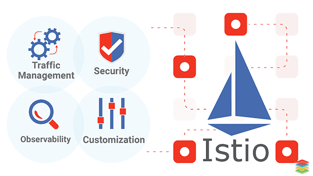

# Istio 是什麼？

雲平台令使用它們的公司受益匪淺。但不可否認的是，上雲會給 DevOps 團隊帶來壓力。為了可移植性，開發人員必須使用 **微服務** 來構建應用，同時運維人員也正在管理著極端龐大的混合雲和多雲的部署環境。 Istio 允許您連接、保護、控制和觀察服務。

從較高的層面來說，Istio 有助於降低這些部署的複雜性，並減輕開發團隊的壓力。它是一個完全開源的服務網格，作為透明的一層接入到現有的分佈式應用程序裡。它也是一個平台，擁有可以集成任何日誌、遙測和策略系統的 API 接口。 Istio 多樣化的特性使您能夠成功且高效地運行分佈式微服務架構，並提供保護、連接和監控微服務的統一方法。

## 服務網格是什麼？

Istio 解決了開發人員和運維人員所面臨的從 **單體應用** 向 **分佈式微服務架構** 轉變的挑戰。了解它是如何做到這一點的可以讓我們更詳細地理解 Istio 的服務網格。

**服務網格** 用來描述組成這些應用程序的微服務網絡以及它們之間的交互。隨著服務網格的規模和復雜性不斷的增長，它將會變得越來越難以理解和管理。它的需求包括服務發現、負載均衡、故障恢復、度量和監控等。服務網格通常還有更複雜的運維需求，比如 A/B 測試、金絲雀發布、速率限制、訪問控制和端到端認證。

Istio 提供了對整個服務網格的行為洞察和操作控制的能力，以及一個完整的滿足微服務應用各種需求的解決方案。

## 為什麼使用 Istio？

通過負載均衡、服務間的身份驗證、監控等方法，Istio 可以輕鬆地創建一個已經部署了服務的網絡，而服務的代碼 ==只需很少更改甚至無需更改==。通過在整個環境中部署一個特殊的 sidecar 代理為服務添加 Istio 的支持，而代理會攔截微服務之間的所有網絡通信，然後使用其控制平面的功能來配置和管理 Istio，這包括：

- 為 HTTP、gRPC、WebSocket 和 TCP 流量自動負載均衡。
- 通過豐富的路由規則、重試、故障轉移和故障注入對流量行為進行細粒度控制。
- 可插拔的策略層和配置 API，支持訪問控制、速率限制和配額。
- 集群內（包括集群的入口和出口）所有流量的自動化度量、日誌記錄和追踪。
- 在具有強大的基於身份驗證和授權的集群中實現安全的服務間通信。

Istio 為可擴展性而設計，可以滿足不同的部署需求。

## 核心特性

Istio 以統一的方式提供了許多跨服務網絡的關鍵功能：

### 流量管理

Istio 簡單的規則配置和流量路由允許您控制服務之間的流量和 API 調用過程。 Istio 簡化了服務級屬性（如熔斷器、超時和重試）的配置，並且讓它輕而易舉的執行重要的任務（如 A/B 測試、金絲雀發布和按流量百分比劃分的分階段發布）。

有了更好的對流量的可視性和開箱即用的故障恢復特性，您就可以在問題產生之前捕獲它們，無論面對什麼情況都可以使調用更可靠，網絡更健壯。

### 安全

Istio 的安全特性解放了開發人員，使其只需要專注於應用程序級別的安全。 Istio 提供了底層的安全通信通道，並為大規模的服務通信管理認證、授權和加密。有了 Istio，服務通信在默認情況下就是受保護的，可以讓您在跨不同協議和運行時的情況下實施一致的策略——而所有這些都只需要很少甚至不需要修改應用程序。

Istio 是獨立於平台的，可以與 Kubernetes（或基礎設施）的網絡策略一起使用。但它更強大，能夠在網絡和應用層面保護pod到 pod 或者服務到服務之間的通信。

### 可觀察性

Istio 健壯的追踪、監控和日誌特性讓您能夠深入的了解服務網格部署。通過 Istio 的監控能力，可以真正的了解到服務的性能是如何影響上游和下游的；而它的定制 Dashboard 提供了對所有服務性能的可視化能力，並讓您看到它如何影響其他進程。

Istio 的 Mixer 組件負責策略控制和遙測數據收集。它提供了後端抽象和中介，將一部分 Istio 與後端的基礎設施實現細節隔離開來，並為運維人員提供了對網格與後端基礎實施之間交互的細粒度控制。

所有這些特性都使您能夠更有效地設置、監控和加強服務的 SLO。當然，底線是您可以快速有效地檢測到並修復出現的問題。