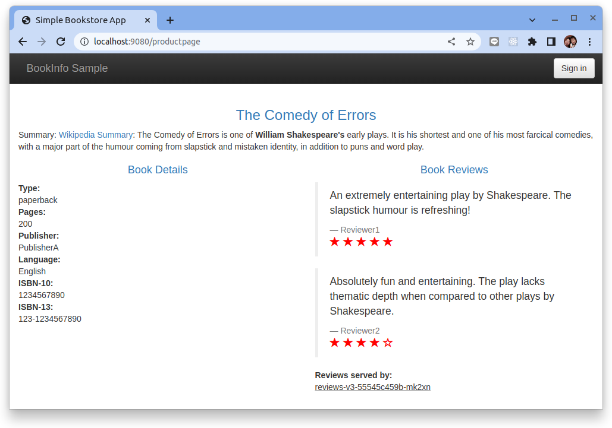
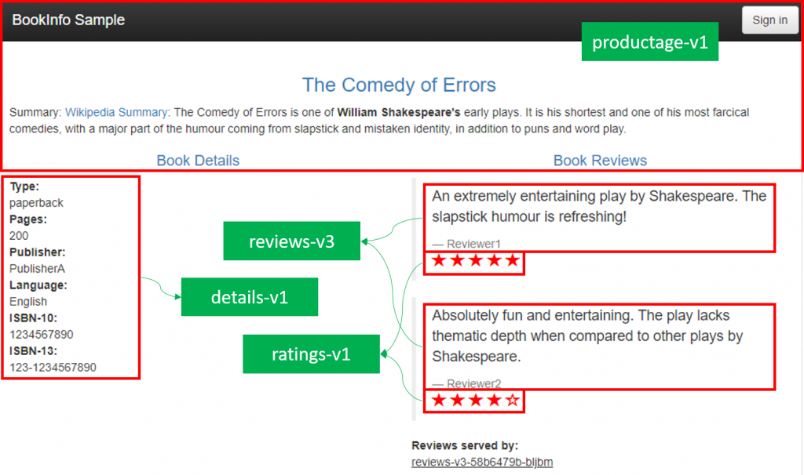
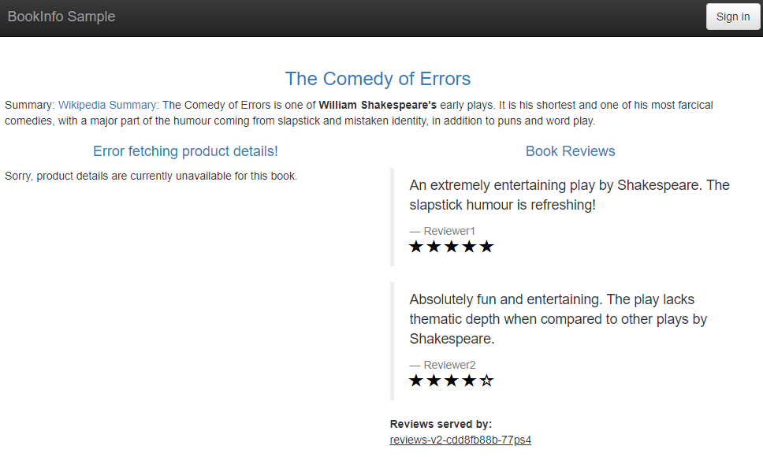
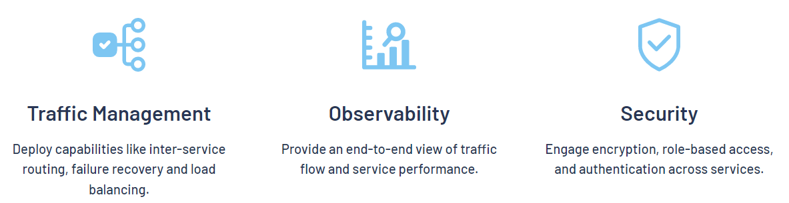

# Bookinfo 應用

這個示例部署了一個用於演示多種 Istio 特性的應用，該應用由四個單獨的微服務構成。

這個應用模仿線上書店的一個分類頁面，頁面上會顯示一本書的信息。主要會顯示一本書的描述，書籍的細節（ISBN、頁數等），以及關於這本書的一些評論。

Bookinfo 應用分為四個單獨的微服務：

- `productpage`: 這個微服務會調用 `details` 和 `reviews` 兩個微服務，用來生成頁面。
- `details`: 這個微服務中包含了書籍的信息。
- `reviews`: 這個微服務中包含了書籍相關的評論。它還會調用 `ratings` 微服務。
- `ratings`: 這個微服務中包含了由書籍評價組成的評級信息。

`reviews` 微服務有 3 個版本：

- v1 版本不會調用 `ratings` 服務。
- v2 版本會調用 `ratings` 服務，並使用 1 到 5 個 **黑色** 星形圖標來顯示評分信息。
- v3 版本會調用 `ratings` 服務，並使用 1 到 5 個 **紅色** 星形圖標來顯示評分信息。

下圖展示了這個應用的端到端架構。

<figure markdown>
  
  <figcaption>沒有使用 Istio 的 Bookinfo</figcaption>
</figure>

Bookinfo 應用中的幾個微服務是由不同的語言編寫的。這些服務對 Istio 並無依賴，但是構成了一個有代表性的服務網格的例子：

- 它由多個服務
- 多個語言構成
- 並且 reviews 服務具有多個版本

## 開始之前

請遵循[安裝指南](../setup/install/helm/helm-install.md)完成 Istio 的部署工作。

## 部署應用

要在 Istio 中運行這一應用，無需對應用自身做出任何改變。您只要簡單的在 Istio 環境中對服務進行配置和運行，具體一點說就是把 Envoy sidecar 注入到每個服務之中。最終的部署結果將如下圖所示：

<figure markdown>
  
  <figcaption>使用了 Istio 的 Bookinfo</figcaption>
</figure>

所有的微服務都和 Envoy sidecar 集成在一起，被集成服務所有的出入流量都被 sidecar 所劫持，這樣就為外部控制準備了所需的 Hook，然後就可以利用 Istio 控制平面為應用提供服務路由、遙測數據收集以及策略實施等功能。

### 啟動應用服務

1. 啟動 Istio 默認自動注入 Sidecar:

    ```bash
    # 為 default 命名空間打上標籤 istio-injection=enabled
    $ kubectl label namespace default istio-injection=enabled
    ```

2. 使用 kubectl 部署 bookinfo 應用:
    
    ```bash
    $ kubectl apply -f https://raw.githubusercontent.com/istio/istio/release-1.15/samples/bookinfo/platform/kube/bookinfo.yaml
    ```

    上面的命令會啟動全部的四個服務，其中也包括了 reviews 服務的三個版本（v1、v2 以及 v3）。

3. 確認所有的服務和 Pod 都已經正確的定義和啟動：

    ```bash
    $ kubectl get services
    NAME          TYPE        CLUSTER-IP      EXTERNAL-IP   PORT(S)    AGE
    kubernetes    ClusterIP   10.43.0.1       <none>        443/TCP    31m
    details       ClusterIP   10.43.193.51    <none>        9080/TCP   95s
    ratings       ClusterIP   10.43.136.243   <none>        9080/TCP   95s
    reviews       ClusterIP   10.43.89.88     <none>        9080/TCP   95s
    productpage   ClusterIP   10.43.149.4     <none>        9080/TCP   95s
    ```

    還有：

    ```bash
    $ kubectl get pods
    NAME                              READY   STATUS    RESTARTS   AGE
    ratings-v1-f849dc6d-np952         2/2     Running   0          2m53s
    productpage-v1-797d845774-ww2vj   2/2     Running   0          2m53s
    details-v1-6758dd9d8d-hbkzw       2/2     Running   0          2m53s
    reviews-v1-74fb8fdbd8-dtw64       2/2     Running   0          2m53s
    reviews-v3-55545c459b-mk2xn       2/2     Running   0          2m53s
    reviews-v2-58d564d4db-6fpc8       2/2     Running   0          2m53s
    ```

4. 使用 `kubectl port-forward` 將流量打入 Productage:

    ```bash
    $ kubectl port-forward svc/productpage 9080:9080 --address="0.0.0.0"
    ```

    

    成功顯示畫面後可多重新整理幾次觀察變化。

### 當元件掛了會發生什麼事?

Microservices 是由不同的元件組成完整服務，但若其中一個元件 Crash 掉，系統是否還能運作，接著就讓我們實驗看看吧!

<figure markdown>
  
  <figcaption>頁面中的內容是由不同功能的元件藉由 API 組合而成</figcaption>
</figure>

試著將 `details` 元件刪除，觀察會發生什麼事。

1. 使用 `kubectl delete deployment <name>` 刪除 Deployment

    ```bash
    $ kubectl delete deployment details-v1
    ```

2. 重新 Forward Service

    ```bash
    $ kubectl port-forward svc/productpage 9080:9080 --address="0.0.0.0"
    ```

3. 在瀏覽器輸入網址連接至服務

    <figure markdown>
    
    <figcaption>雖然 Details 元件被我們移除了，但頁面中的其他功能還是能正常顯示</figcaption>
    </figure>

## 補強 K8S 非功能性功能



- Traffic management

    ??? info
        在單個集群內和跨集群的路由流量都會影響性能並實現更好的部署策略。 Istio 的流量路由規則讓您可以輕鬆控制服務之間的流量和 API 調用。 Istio 簡化了斷路器、超時和重試等服務級別屬性的配置，並可以輕鬆設置重要任務，例如 A/B 測試、金絲雀部署和基於百分比的流量拆分的分階段部署。

- Observability

    ??? info
        隨著服務的複雜性增加，理解行為和性能變得具有挑戰性。 Istio 為服務網格中的所有通信生成詳細的遙測數據。這種遙測提供服務行為的可觀察性，使運營商能夠排除故障、維護和優化他們的應用程序。更好的是，您無需更改應用程序即可獲得幾乎所有這些工具。通過 Istio，運維人員可以全面了解受監控服務的交互方式。

        Istio 的遙測包括詳細的指標、分佈式跟踪和完整的訪問日誌。使用 Istio，您可以獲得全面而全面的服務網格可觀察性。

- Security capabilities

    ??? info
        微服務有特殊的安全需求，包括防止中間人攻擊、靈活的訪問控制、審計工具和雙向 TLS。 Istio 包含一個全面的安全解決方案，使運營商能夠解決所有這些問題。它提供強大的身份、強大的策略、透明的 TLS 加密以及身份驗證、授權和審計 (AAA) 工具來保護您的服務和數據。

        Istio 的安全模型基於默認安全，旨在提供深度防禦，讓您即使在不受信任的網絡中也能部署注重安全的應用程序。


## 實現藍綠部屬

現今應用程式發展迅速，服務的更新也變得越來越頻繁，要如何在不影響用戶的前提下讓服務升級呢? 這時就需要使用到部屬策略。部屬策略是指將新的應用程式部屬到正式環境時所採用的方式，目標是讓系統跟使用者的影響都降至最低，以下是常見的部署策略(詳細的說明:[應用程序部署策略](../reference/deployment-strategies.md)):

- **重建 (Recreate)**: 將 v1 版本下線後讓 v2 版本上線
- **滾動部署 (Rolling-update)**: v1 版本緩慢更新至 v2 版本
- **藍綠部署 (Blue/Green Deployment)**: 先將 v2 版本部屬到正式環境，經過測試後再把流量從 v1 版本切換至 v2 版本
- **金絲雀部屬 (Canary)**:　逐步將正式環境的流量從 v1 版本轉移到 v2 版本
- **A/B 測試 (A/B Testing)**:　使用特定帳號測試 v2　版本，完成後再把流量從 v1 版本切換至 v2 版本

!!! tip
    使用 Kubernetes 的原因之一在於它能輕鬆的實現部屬策略，如 [Kubernetes Deployment](https://kubernetes.io/docs/concepts/workloads/controllers/deployment/) 就有提供 Rolling-update 功能

### 藍綠部屬 (Blue/Green Deployment)

藍綠部屬的原理很簡單，需在正式環境中同時建立 v1 版本以及 v2 版本的應用程式，v1 版本負責當前的服務，v2 版本測試沒問題後，即可將 v1 的流量轉移至 v2，以此完成系統的升級。v2 版本上線後，若無異常情況，就可刪除 v1 版本，若發生異常，也可以將流量轉回 v1 版本，使服務不會中斷。


那要如何在 Kubernetes 實現藍綠部屬呢，前面我們在 Kubernetes 建立了 Bookinfo Application， **Reviews** 元件同時部署了三個版本在環境中，如同藍綠部屬講到的第一步，需先在環境中部署不同版本的應用程式。


在完成不同版本的測試後，接著就要將流量切換至新版本，這個機制可以借助 Kubernetes Service 的 Label Selector 來完成，Label Selector 會根據設定的標籤來尋找到對應的 Pod，所以只要在 Pod 上設定不同版本號的 Label，要做流量切換時修改 Label Selector 的設定即可。

### 確定 Ingress 的 IP 和端口

現在 Bookinfo 服務啟動並運行中，您需要使應用程序可以從外部訪問 Kubernetes 集群，例如使用瀏覽器。可以用 Istio Gateway 來實現這個目標。