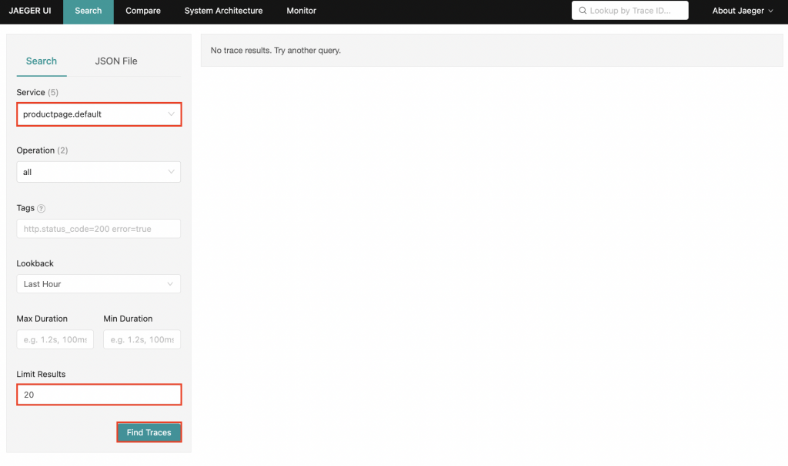

# Istio 服務網格 Lab 環境


請跟隨本教程安裝、配置並深入評估 Istio 網格系統的生態系統元件。

## 步驟01 - 安裝

### Kubernetes

執行下列命令來創建實驗 Kubernetes 集群:

```bash
k3d cluster create --servers 1 --agents 1 --api-port 6443 \
--k3s-arg "--disable=traefik@server:0" \
--port 8080:80@loadbalancer --port 8443:443@loadbalancer \
--agents-memory=8G
```

- `--disable=traefik@server:0` 安裝 Istio 後禁用 Traefik 負載均衡器
- `--agents-memory=8G` 安裝 Istio 的額外增加一些內存
- `local-cluster` k3d 集群名稱

確認 Kubernetes 及 Kubectl 是否成功安裝：

```bash
kubectl cluster-info
```
(輸出結果)

```bash
Kubernetes control plane is running at https://0.0.0.0:6443
CoreDNS is running at https://0.0.0.0:6443/api/v1/namespaces/kube-system/services/kube-dns:dns/proxy
Metrics-server is running at https://0.0.0.0:6443/api/v1/namespaces/kube-system/services/https:metrics-server:/proxy
```

### Istio

本篇參考 Istio Getting Started 教學，官方提供的 Istioctl 工具，讓我們可透過簡單的指令就將 Istio 元件安裝至 Kubernetes ，接下來就來看看如何使用吧!

#### 安裝 Istioctl

1. 前往 Istio release 網站，找到需要的版本，並使用 curl 下載程式檔

    ```
    curl -L https://istio.io/downloadIstio | ISTIO_VERSION=1.15.3 TARGET_ARCH=x86_64 sh -
    ```

    本教程安裝的是 Istio 1.15.3 版本。

2. 移動到 Istio 包目錄。例如，如果包是 istio-1.15.3：

    ```bash
    cd istio-1.15.3
    ```

    安裝目錄包含：

    - 示例中的示例 `samples/`
    - `bin/` 目錄中的 `istioctl` 客戶端二進製文件。

3. 將 `istioctl` 客戶端添加到您的路徑：

    ```bash
    export PATH=$PWD/bin:$PATH
    ```

#### 安裝 Istio

1. 對於此安裝，我們使用 `demo` [配置文件](https://istio.io/latest/docs/setup/additional-setup/config-profiles/)。

    ```bash
    istioctl install --set profile=demo -y
    ```

    或是把啟動客製設定參數加上:

    ```bash
    istioctl install --set profile=demo --set meshConfig.accessLogFile="/dev/stdout" --set meshConfig.accessLogEncoding="JSON" -y 
    ```

    結果：
    
    ```bash
    ✔ Istio core installed
    ✔ Istiod installed
    ✔ Egress gateways installed
    ✔ Ingress gateways installed
    ✔ Installation complete 
    ```

2. 添加命名空間標籤以指示 Istio 在您稍後部署應用程序時自動注入 Envoy sidecar 代理：

    ```bash
    kubectl label namespace default istio-injection=enabled
    ```


確認 istio 是否成功安裝：

```bash
kubectl get pods -n istio-system
```

結果：

```bash
NAME                                    READY   STATUS    RESTARTS   AGE
istiod-76db9fbfc-m4vd9                  1/1     Running   0          7m26s
svclb-istio-ingressgateway-w6lnz        5/5     Running   0          6m46s
svclb-istio-ingressgateway-nbldc        5/5     Running   0          6m46s
istio-egressgateway-77cf54b878-ms8tw    1/1     Running   0          6m46s
istio-ingressgateway-7f5ddd54c8-gcjl4   1/1     Running   0          6m46s
```


!!! info
    會安裝至 istio-system Namespace，Istio 的 Control Plane 指的就是這些元件

### 部署範例應用程序

#### Bookinfo 應用

Bookinfo 示例部署了一個用於演示多種 Istio 特性的應用，該應用由四個單獨的微服務構成。

這個應用模仿在線書店的一個分類，顯示一本書的信息。頁面上會顯示一本書的描述，書籍的細節（ISBN、頁數等），以及關於這本書的一些評論。

Bookinfo 應用分為四個單獨的微服務：Bookinfo 應用

reviews 微服務有 3 個版本：

- v1 版本不會調用 `ratings` 服務。
- v2 版本會調用 `ratings` 服務，並使用 1 到 5 個黑色星形圖標來顯示評分信息。
- v3 版本會調用 `ratings` 服務，並使用 1 到 5 個紅色星形圖標來顯示評分信息。

下圖展示了這個應用的端到端架構。

<figure markdown>
  
  <figcaption>沒有使用 Istio 的 Bookinfo</figcaption>
</figure>

Bookinfo 應用中的幾個微服務是由不同的語言編寫的。這些服務對 Istio 並無依賴，但是構成了一個有代表性的服務網格的例子：

- 它由多個服務
- 多個語言構成
- 並且 reviews 服務具有多個版本

#### 部署 Bookinfo 應用

要在 Istio 中運行這一應用，無需對應用自身做出任何改變。您只要簡單的在 Istio 環境中對服務進行配置和運行，具體一點說就是把 Envoy sidecar 注入到每個服務之中。最終的部署結果將如下圖所示：

<figure markdown>
  
  <figcaption>使用了 Istio 的 Bookinfo</figcaption>
</figure>

所有的微服務都和 Envoy sidecar 集成在一起，被集成服務所有的出入流量都被 sidecar 所劫持，這樣就為外部控制準備了所需的 Hook，然後就可以利用 Istio 控制平面為應用提供服務路由、遙測數據收集以及策略實施等功能。

1. 部署 Bookinfo 示例應用程序:

    ```bash
    kubectl apply -f samples/bookinfo/platform/kube/bookinfo.yaml
    ```

    結果:

    ```bash
    service/details created
    serviceaccount/bookinfo-details created
    deployment.apps/details-v1 created
    service/ratings created
    serviceaccount/bookinfo-ratings created
    deployment.apps/ratings-v1 created
    service/reviews created
    serviceaccount/bookinfo-reviews created
    deployment.apps/reviews-v1 created
    deployment.apps/reviews-v2 created
    deployment.apps/reviews-v3 created
    service/productpage created
    serviceaccount/bookinfo-productpage created
    deployment.apps/productpage-v1 created
    ```

2. 應用程序將啟動。隨著每個 pod 準備就緒，Istio sidecar 將隨之部署。

    ```bash
    kubectl get services
    ```

    結果:

    ```bash
    NAME          TYPE        CLUSTER-IP      EXTERNAL-IP   PORT(S)    AGE
    kubernetes    ClusterIP   10.43.0.1       <none>        443/TCP    90m
    details       ClusterIP   10.43.130.114   <none>        9080/TCP   92s
    ratings       ClusterIP   10.43.13.141    <none>        9080/TCP   92s
    reviews       ClusterIP   10.43.110.102   <none>        9080/TCP   92s
    productpage   ClusterIP   10.43.243.227   <none>        9080/TCP   92s
    ```

    接著看一下 Pod 的佈署：

    ```bash
    kubectl get pods
    ```

    結果:

    ```bash
    NAME                              READY   STATUS    RESTARTS   AGE
    details-v1-6758dd9d8d-8dbb4       2/2     Running   0          4m21s
    ratings-v1-f849dc6d-4pmv9         2/2     Running   0          4m21s
    productpage-v1-797d845774-vnwq7   2/2     Running   0          4m21s
    reviews-v1-74fb8fdbd8-8hgcj       2/2     Running   0          4m21s
    reviews-v3-55545c459b-pw68t       2/2     Running   0          4m21s
    reviews-v2-58d564d4db-p9bfb       2/2     Running   0          4m21s
    ```

3. 驗證到目前為止的設置一切正常。運行以下命令，通過檢查響應中的頁面標題來查看應用程序是否在集群內運行並提供 HTML 頁面：

    ```bash
    kubectl exec "$(kubectl get pod -l app=ratings -o jsonpath='{.items[0].metadata.name}')" -c ratings -- curl -sS productpage:9080/productpage | grep -o "<title>.*</title>"
    ```

#### 對外部暴露應用程序

Bookinfo 應用程序已部署，但無法從 Kubernetes 外部來訪問它。為了使其可訪問， 需要創建一個 Istio Ingress Gateway，它將路徑映射到網格邊緣的路由。

1. 將此應用程序與 Istio gateway 關聯：

    執行下列命令:

    ```bash
    kubectl apply -f samples/bookinfo/networking/bookinfo-gateway.yaml
    ```
    
    ??? info

        ```yaml title="bookinfo-gateway.yaml"
        apiVersion: networking.istio.io/v1alpha3
        kind: Gateway
        metadata:
        name: bookinfo-gateway
        spec:
        selector:
            istio: ingressgateway # use istio default controller
        servers:
        - port:
            number: 80
            name: http
            protocol: HTTP
            hosts:
            - "*"
        ---
        apiVersion: networking.istio.io/v1alpha3
        kind: VirtualService
        metadata:
        name: bookinfo
        spec:
        hosts:
        - "*"
        gateways:
        - bookinfo-gateway
        http:
        - match:
            - uri:
                exact: /productpage
            - uri:
                prefix: /static
            - uri:
                exact: /login
            - uri:
                exact: /logout
            - uri:
                prefix: /api/v1/products
            route:
            - destination:
                host: productpage
                port:
                number: 9080  
        ```
2. 確保配置沒有問題：

    ```bash
    istioctl analyze
    ```

    結果:

    ```bash
    ✔ No validation issues found when analyzing namespace: default.
    ```


#### 確定 Ingress IP 和端口

按照這些說明設置用於訪問網關的 INGRESS_HOST 和 INGRESS_PORT 變量。

執行以下命令來確定您的 Kubernetes 集群是否在支持外部負載均衡器的環境中運行：

```bash
kubectl get svc istio-ingressgateway -n istio-system
```

結果：

```bash
NAME                   TYPE           CLUSTER-IP    EXTERNAL-IP             PORT(S)                                                                      AGE
istio-ingressgateway   LoadBalancer   10.43.81.49   172.22.0.2,172.22.0.3   15021:31007/TCP,80:31366/TCP,443:32297/TCP,31400:32599/TCP,15443:32439/TCP   117m
```

舉例來說在範例中的 Kubernetes 環境裡頭所暴露出來的外部 IP 是 `172.22.0.2` 與 `172.22.0.3`。

為了方便後續的驗證，使用環境變數把 `GATEWAY_URL` 暴露出來:

```bash
export GATEWAY_URL=172.22.0.2:80
```

#### 驗證外部訪問

通過使用瀏覽器查看 Bookinfo 產品頁面，確認可以從外部訪問 Bookinfo 應用程序。要在 Istio 中運行這一應用，無需對應用自身做出任何改變。您只要簡單的在 Istio 環境中對服務進行配置和運行，具體一點說就是把 Envoy sidecar 注入到每個服務之中。最終的部署結果將如下圖所示：

<figure markdown>
  
  <figcaption>使用了 Istio 的 Bookinfo</figcaption>
</figure>

所有的微服務都和 Envoy sidecar 集成在一起，被集成服務所有的出入流量都被 sidecar 所劫持，這樣就為外部控制準備了所需的 Hook，然後就可以利用 Istio 控制平面為應用提供服務路由、遙測數據收集以及策略實施等功能。

### 安裝相關的插件

Istio 集成了幾個不同的遙測應用程序。這些可以幫助您了解服務網格的結構、顯示網格的拓撲並分析網格的健康狀況。

使用以下說明部署 [Kiali](https://istio.io/latest/docs/ops/integrations/kiali/) 以及 [Prometheus](https://istio.io/latest/docs/ops/integrations/prometheus/)、[Grafana](https://istio.io/latest/docs/ops/integrations/grafana) 和 [Jaeger](https://istio.io/latest/docs/ops/integrations/jaeger/)。


1. 安裝 Kiali 和其他插件並等待它們被部署。

    執行下列命令來安裝 Kiali、Prometheus、Grafana 與 Jaeger 元件:

    ```bash
    kubectl apply -f samples/addons
    ```

    結果：

    ```bash
    serviceaccount/grafana created
    configmap/grafana created
    service/grafana created
    deployment.apps/grafana created
    configmap/istio-grafana-dashboards created
    configmap/istio-services-grafana-dashboards created
    deployment.apps/jaeger created
    service/tracing created
    service/zipkin created
    service/jaeger-collector created
    serviceaccount/kiali created
    configmap/kiali created
    clusterrole.rbac.authorization.k8s.io/kiali-viewer created
    clusterrole.rbac.authorization.k8s.io/kiali created
    clusterrolebinding.rbac.authorization.k8s.io/kiali created
    role.rbac.authorization.k8s.io/kiali-controlplane created
    rolebinding.rbac.authorization.k8s.io/kiali-controlplane created
    service/kiali created
    deployment.apps/kiali created
    serviceaccount/prometheus created
    configmap/prometheus created
    clusterrole.rbac.authorization.k8s.io/prometheus created
    clusterrolebinding.rbac.authorization.k8s.io/prometheus created
    service/prometheus created
    deployment.apps/prometheus created
    ```

    檢查服務佈署的狀態:

    ```bash
    $ kubectl get svc -n istio-system
    NAME                   TYPE           CLUSTER-IP      EXTERNAL-IP             PORT(S)                                                                      AGE
    istiod                 ClusterIP      10.43.144.98    <none>                  15010/TCP,15012/TCP,443/TCP,15014/TCP                                        172m
    istio-egressgateway    ClusterIP      10.43.143.51    <none>                  80/TCP,443/TCP                                                               171m
    istio-ingressgateway   LoadBalancer   10.43.81.49     172.22.0.2,172.22.0.3   15021:31007/TCP,80:31366/TCP,443:32297/TCP,31400:32599/TCP,15443:32439/TCP   171m
    grafana                ClusterIP      10.43.120.74    <none>                  3000/TCP                                                                     32m
    tracing                ClusterIP      10.43.112.8     <none>                  80/TCP,16685/TCP                                                             32m
    zipkin                 ClusterIP      10.43.182.146   <none>                  9411/TCP                                                                     32m
    jaeger-collector       ClusterIP      10.43.138.129   <none>                  14268/TCP,14250/TCP,9411/TCP                                                 32m
    kiali                  ClusterIP      10.43.247.206   <none>                  20001/TCP,9090/TCP                                                           32m
    prometheus             ClusterIP      10.43.54.209    <none>                  9090/TCP 
    
    $ kubectl get pods -n istio-system
    NAME                                    READY   STATUS    RESTARTS   AGE
    istiod-76db9fbfc-m4vd9                  1/1     Running   0          173m
    svclb-istio-ingressgateway-w6lnz        5/5     Running   0          172m
    svclb-istio-ingressgateway-nbldc        5/5     Running   0          172m
    istio-egressgateway-77cf54b878-ms8tw    1/1     Running   0          172m
    istio-ingressgateway-7f5ddd54c8-gcjl4   1/1     Running   0          172m
    jaeger-5858c698bf-wvbt8                 1/1     Running   0          32m
    prometheus-6956c8c6c5-qknmr             2/2     Running   0          32m
    kiali-64c4f869fb-xzjpd                  1/1     Running   0          32m
    grafana-6d69f655fb-jk6wm                1/1     Running   0          32m
    ```

2. 訪問 Prometheus

    執行下列命令來暴露 Prometheus 服務:

    ```bash
    kubectl port-forward -n istio-system svc/prometheus 9090:9090 --address=0.0.0.0
    ```
    

3. 訪問 Grafana

    執行下列命令來暴露 Grafana 服務:

    ```bash
    kubectl port-forward -n istio-system svc/grafana 3000:3000 --address=0.0.0.0
    ```
    

4. 訪問 Jaeger

    執行下列命令來暴露 Jaeger 服務:

    ```bash
    kubectl port-forward -n istio-system svc/tracing 8084:80 --address=0.0.0.0
    ```
    

5. 訪問 Kiali

    執行下列命令來暴露 Kiali 服務:

    ```bash
    kubectl port-forward -n istio-system svc/kiali 20001:20001 --address=0.0.0.0
    ```

    


6. 在左側導航菜單中，選擇 `Graph`，然後在 `Namespace` 下拉菜單中選擇 `default`。

    

    要查看跟踪數據，您必須向您的服務發送請求。請求的數量取決於 Istio 的採樣率，並且可以使用 Telemetry API 進行配置。在默認採樣率為 1% 的情況下，您需要發送至少 100 個請求才能看到第一個跟踪。要向 productpage 服務發送 100 個請求，請使用以下命令：

    ```bash
    for i in $(seq 1 100); do curl -s -o /dev/null "http://$GATEWAY_URL/productpage"; done
    ```

    

## 步驟02 - Istio 功能展示

## 2.1 流量管理

### 配置请求路由

此任務將展示如何將請求動態路由到微服務的多個版本。

Istio Bookinfo 示例包含四個獨立的微服務。其中一個微服務 `reviews` 的三個不同版本已經部署並同時運行。為了說明這導致的問題，在瀏覽器中訪問 Bookinfo 應用程序的 `/productpage` 並刷新幾次。您會注意到，有時書評的輸出包含星級評分，有時則不包含。這是因為沒有明確的默認服務版本可路由，Istio 將以循環方式將請求路由到所有可用版本。

#### 應用默認目標規則

在使用 Istio 控制 Bookinfo 版本路由之前，您需要在 destionation rules 中定義好可用的版本，命名為 `subsets`。

運行以下命令為 Bookinfo 服務創建的默認的目標規則：

```bash
kubectl apply -f samples/bookinfo/networking/destination-rule-all.yaml
```

??? example
    ```yaml title="destination-rule-all.yaml"
    apiVersion: networking.istio.io/v1alpha3
    kind: DestinationRule
    metadata:
    name: productpage
    spec:
    host: productpage
    subsets:
    - name: v1
        labels:
        version: v1
    ---
    apiVersion: networking.istio.io/v1alpha3
    kind: DestinationRule
    metadata:
    name: reviews
    spec:
    host: reviews
    subsets:
    - name: v1
        labels:
        version: v1
    - name: v2
        labels:
        version: v2
    - name: v3
        labels:
        version: v3
    ---
    apiVersion: networking.istio.io/v1alpha3
    kind: DestinationRule
    metadata:
    name: ratings
    spec:
    host: ratings
    subsets:
    - name: v1
        labels:
        version: v1
    - name: v2
        labels:
        version: v2
    - name: v2-mysql
        labels:
        version: v2-mysql
    - name: v2-mysql-vm
        labels:
        version: v2-mysql-vm
    ---
    apiVersion: networking.istio.io/v1alpha3
    kind: DestinationRule
    metadata:
    name: details
    spec:
    host: details
    subsets:
    - name: v1
        labels:
        version: v1
    - name: v2
        labels:
        version: v2
    ---
    ```

您可以使用以下命令查看目標規則：

```bash
kubectl get destinationrules -o yaml
```

#### 應用 Virtual Service

要僅路由到其中特定的一個版本，請應用為微服務設置默認版本的 Virtual Service。在這種情況下，Virtual Service 將所有流量路由到每個微服務的 v1 版本。

運行以下命令以應用 Virtual Service：

```bash
kubectl apply -f samples/bookinfo/networking/virtual-service-all-v1.yaml
```

??? example
    ```yaml title="virtual-service-all-v1.yaml"
    apiVersion: networking.istio.io/v1alpha3
    kind: VirtualService
    metadata:
    name: productpage
    spec:
    hosts:
    - productpage
    http:
    - route:
        - destination:
            host: productpage
            subset: v1
    ---
    apiVersion: networking.istio.io/v1alpha3
    kind: VirtualService
    metadata:
    name: reviews
    spec:
    hosts:
    - reviews
    http:
    - route:
        - destination:
            host: reviews
            subset: v1
    ---
    apiVersion: networking.istio.io/v1alpha3
    kind: VirtualService
    metadata:
    name: ratings
    spec:
    hosts:
    - ratings
    http:
    - route:
        - destination:
            host: ratings
            subset: v1
    ---
    apiVersion: networking.istio.io/v1alpha3
    kind: VirtualService
    metadata:
    name: details
    spec:
    hosts:
    - details
    http:
    - route:
        - destination:
            host: details
            subset: v1
    ---
    ```

您已將 Istio 配置為路由到 Bookinfo 微服務的 v1 版本，最重要的是 reviews 服務的版本 1。


#### 測試新的路由配置

您可以通過再次刷新 Bookinfo 應用程序的 `/productpage` 來測試新配置。

1. 在瀏覽器中打開 Bookinfo 站點。網址為 `http://$GATEWAY_URL/productpage`，其中 $GATEWAY_URL 是外部的入口 IP 地址。

    

    !!! info
        請注意，無論您刷新多少次，頁面的評論部分都不會顯示評級星標。這是因為您將 Istio 配置為將評論服務的所有流量路由到版本 reviews:v1，而此版本的服務不訪問星級評分服務。

您已成功完成此任務的第一部分：將流量路由到服務的某一個版本。


### 基於用戶身份的路由

接下來，您將更改路由配置，以便將來自特定用戶的所有流量路由到特定服務版本。在這種情況下，來自名為 Jason 的用戶的所有流量將被路由到服務 `reviews:v2`。

請注意，Istio 對用戶身份沒有任何特殊的內置機制。事實上，productpage 服務在所有到 reviews 服務的 HTTP 請求中都增加了一個自定義的 end-user 請求頭，從而達到了本例子的效果。

請記住，reviews:v2 是包含星級評分功能的版本。

1. 運行以下命令以啟用基於用戶的路由：

    ```bash
    kubectl apply -f samples/bookinfo/networking/virtual-service-reviews-test-v2.yaml
    ```

    ??? example
        ```yaml title="virtual-service-reviews-test-v2.yaml"
        apiVersion: networking.istio.io/v1alpha3
        kind: VirtualService
        metadata:
        name: reviews
        spec:
        hosts:
            - reviews
        http:
        - match:
            - headers:
                end-user:
                exact: jason
            route:
            - destination:
                host: reviews
                subset: v2
        - route:
            - destination:
                host: reviews
                subset: v1
        ```

2. 在 Bookinfo 應用程序的 `/productpage` 上，以用戶 `jason` 身份登錄。

    刷新瀏覽器。您看到了什麼？星級評分顯示在每個評論旁邊。

    

    

3. 以其他用戶身份登錄（選擇您想要的任何名稱）。

    刷新瀏覽器。現在星星消失了。這是因為除了 Jason 之外，所有用戶的流量都被路由到 reviews:v1。

    


您已成功配置 Istio 以根據用戶身份路由流量。

### 流量轉移

本任務將向您展示如何將流量從微服務的一個版本逐步遷移到另一個版本。例如，您可以將流量從舊版本遷移到新版本。

一個常見的用例是將流量從微服務的一個版本的逐漸遷移到另一個版本。在 Istio 中，您可以通過配置一系列規則來實現此目標。這些規則將一定比例的流量路由到一個或另一個服務。在本任務中，您將會把 50％ 的流量發送到 reviews:v1，另外，50％ 的流量發送到 reviews:v3。接著，再把 100％ 的流量發送到 reviews:v3 來完成遷移。

#### 基於權重的路由

1. 首先，運行此命令將所有流量路由到各個微服務的 v1 版本。

    ```bash
    kubectl apply -f samples/bookinfo/networking/virtual-service-all-v1.yaml
    ```

    ??? example
        ```yaml title="virtual-service-all-v1.yaml"
        apiVersion: networking.istio.io/v1alpha3
        kind: VirtualService
        metadata:
        name: productpage
        spec:
        hosts:
        - productpage
        http:
        - route:
            - destination:
                host: productpage
                subset: v1
        ---
        apiVersion: networking.istio.io/v1alpha3
        kind: VirtualService
        metadata:
        name: reviews
        spec:
        hosts:
        - reviews
        http:
        - route:
            - destination:
                host: reviews
                subset: v1
        ---
        apiVersion: networking.istio.io/v1alpha3
        kind: VirtualService
        metadata:
        name: ratings
        spec:
        hosts:
        - ratings
        http:
        - route:
            - destination:
                host: ratings
                subset: v1
        ---
        apiVersion: networking.istio.io/v1alpha3
        kind: VirtualService
        metadata:
        name: details
        spec:
        hosts:
        - details
        http:
        - route:
            - destination:
                host: details
                subset: v1
        ---
        ```

2. 在瀏覽器中打開 Bookinfo 站點。網址為 `http://$GATEWAY_URL/productpage`，其中 $GATEWAY_URL 是 Ingress 的外部 IP 地址。

    

    請注意，不管刷新多少次，頁面的評論部分都不會顯示評價星級的內容。這是因為 Istio 被配置為將星級評價的服務的所有流量都路由到了 reviews:v1 版本，而該版本的服務不訪問帶評價星級的服務。

3. 使用下面的命令把 50% 的流量從 reviews:v1 轉移到 reviews:v3：

    ```bash本文介绍如何配置 istio 的 accesslog。
        ```yaml title="virtual-service-reviews-50-v3.yaml"
        apiVersion: networking.istio.io/v1alpha3
        kind: VirtualService
        metadata:
        name: reviews
        spec:
        hosts:
            - reviews
        http:
        - route:
            - destination:
                host: reviews
                subset: v1
              weight: 50
            - destination:
                host: reviews
                subset: v3
              weight: 50
        ```

4. 刷新瀏覽器中的 `/productpage` 頁面，大約有 50% 的機率會看到頁面中帶 紅色 星級的評價內容。這是因為 reviews 的 v3 版本可以訪問帶星級評價，但 v1 版本不能。

5. 如果您認為 reviews:v3 微服務已經穩定，您可以通過應用 Virtual Service 規則將 100% 的流量路由 reviews:v3：

    ```bash
    kubectl apply -f samples/bookinfo/networking/virtual-service-reviews-v3.yaml
    ```

    現在，當您刷新 `/productpage` 時，您將始終看到帶有 **紅色** 星級評分的書評。

    


## 2.2 可觀測性

在分散式且複雜的應用程式中，要如何讓團隊更好的監控應用程式，就需要提高系統的 Observability (可觀測性)，Observability 讓我們更好了解系統發生什麼樣的行為，當問題出現可以迅速的定位，當系統有異常時也能提前示警。提升 Observability 的方式有很多，這裡舉幾種常見的方式:

- 蒐集系統資訊並放入資料庫，當發生問題時可以查找
- 建立 Alert 機制，偵測到異常資訊時可以做示警
- 製作 Dashboard 將系統資料可視化

而現今主要的作法，是蒐集系統中的 Metrics、Logging與Tracing三大訊息，並搭配開源軟體如 Prometheus、Fluentd、Jaeger 來實現對系統的資料蒐集、示警、可視化等功能


### Metrics (指標)

Metrics 代表系統中的數值資料，例如 CPU、Memory 的使用量，或是呼叫 HTTP 請求的次數，將這些資訊根據時間記錄下來，就能了解各個時間時系統的狀況為何。

Istio 為網格內所有的服務通信生成詳細的遙測數據。這種遙測技術提供了服務行為的可觀測性，使運維人員能夠排查故障、維護和優化應用程序，而不會給服務的開發人員帶來任何額外的負擔。通過 Istio，運維人員可以全面了解到受監控的服務如何與其他服務以及 Istio 組件進行交互。

Istio 生成以下類型的遙測數據，以提供對整個服務網格的可觀測性：

- `Metrics`: Istio 基於 4 個監控的黃金標識（延遲、流量、錯誤、飽和度）生成了一系列服務指標。 Istio 還為網格控制平面提供了更詳細的指標。除此以外還提供了一組默認的基於這些指標的網格監控儀表板。
- `Distributed Traces`: Istio 為每個服務生成分佈式追踪 span，運維人員可以理解網格內服務的依賴和調用流程。
- `Access Logs`: 當流量流入網格中的服務時，Istio 可以生成每個請求的完整記錄，包括源和目標的元數據。此信息使運維人員能夠將服務行為的審查控製到單個工作負載實例的級別。


讓我們來看一下 Istio 如何使用 sidecar (Envovy) 來暴露監控的黃金標識（延遲、流量、錯誤、飽和度）。

#### Prometheus

1. 查看 Bookinfo 佈署後的 Pods 狀態

    ```bash
    kubectl get pod -n default
    ```

    結果:

    ```
    NAME                              READY   STATUS    RESTARTS   AGE
    productpage-v1-797d845774-76f95   2/2     Running   0          8h
    details-v1-6758dd9d8d-n522b       2/2     Running   0          8h
    ratings-v1-f849dc6d-j7jpk         2/2     Running   0          8h
    reviews-v3-55545c459b-b72zw       2/2     Running   0          8h
    reviews-v1-74fb8fdbd8-bdsf8       2/2     Running   0          8h
    reviews-v2-58d564d4db-s6bls       2/2     Running   0          8h
    ```

    可發現每一個 Pod 都包含著兩個 containers。

    

2. 查看 `productpage` 的 Pod spec

    ```bash
    kubectl get pod/productpage-v1-797d845774-76f95 -o yaml 
    ```

    結果:

    ```yaml hl_lines="7 8 9"
    apiVersion: v1
    kind: Pod
    metadata:
    annotations:
        kubectl.kubernetes.io/default-container: productpage
        kubectl.kubernetes.io/default-logs-container: productpage
        prometheus.io/path: /stats/prometheus
        prometheus.io/port: "15020"
        prometheus.io/scrape: "true"
        sidecar.istio.io/status: '{"initContainers":["istio-init"],"containers":["istio-proxy"],"volumes":["workload-socket","credential-socket","workload-certs","istio-envoy","istio-data","istio-podinfo","istio-token","istiod-ca-cert"],"imagePullSecrets":null,"revision":"default"}' 
    labels:
        app: productpage
        pod-template-hash: 797d845774
        security.istio.io/tlsMode: istio
        service.istio.io/canonical-name: productpage
        service.istio.io/canonical-revision: v1
        version: v1
    name: productpage-v1-797d845774-76f95
    namespace: default
    spec:
    containers:
    - image: docker.io/istio/examples-bookinfo-productpage-v1:1.17.0
    ...
    ...
    ```

    從 Pod spec　的 annotations 可發現 istio 自動注入的一個　sidecar 並且宣告這個 Pod 會在:

    - port: `prometheus.io/port: "15020"` 
    - path: `prometheus.io/path: /stats/prometheus`

    暴露可讓 Prometheus 括取的指標。

3. 執行下列命令來暴露 `productpage` 服務:

    ```bash
    kubectl port-forward -n default pod/productpage-v1-797d845774-76f95 15020:15020 --address=0.0.0.0
    ```

    !!! info
        注意要查找的 pod　的　id 會隨每個環境的佈署而有所不同

    

4. 到 Prometheus GUI 介面 -> 在搜尋欄輸入下列字串後點擊 Execute

    ```bash
    istio_requests_total
    ```

    
    
    !!! info
        `istio_requests_total` 為 Istio 預設的 Metrics，代表代理的請求數，可以在下方列表看到搜尋結果。

#### Grafana

Istio 會在 Grafana 預建立幾個 Dashboard:

- Control Plane Dashboard: 監控 Istio Control Plane 的 Health 及 Performance 資訊
- Mesh Dashboard: 提供所有 Services 的基本資料
- Performance Dashboard: 監控 Service Mesh 的資源使用量
- Service Dashboard: 提供 Services 詳細的 Metrics 資料
- Workload Dashboard: 提供詳細的 Workload 資訊

1. 使用瀏覽器連結到 Grafana，點擊左方 Dashboards，接著點選 Istio Mesh Dashboard。
    

2. 在 Istio Mesh Dashboard 可看到所有 Services 的資料，如 Latency 及連線成功比率。

    

還有其他預設的 Istio Dashboard，可以自己嘗試看看。

### Logging (日誌)

Logging 就是應用程式發出的 Logs ，這些資料龐雜且觸發時間不固定，但對於解決問題是非常有用的資訊，需要做的是如何蒐集不同應用程式的 Logs ， 讓使用者可以輕鬆方便的查找。


訪問日誌提供了一種從單個工作負載實例的角度監控和理解行為的方法。

Istio 能夠以多種操作方式和配置的格式為流量生成 **訪問日誌**，使能控制記錄日誌、內容、時間地點。有關完整信息，請參見獲取 Envoy 的訪問日誌。

1. 查看 `productpage` 的 Pod 裡頭包含了那些容器

    ```bash
    kubectl get pod/productpage-v1-797d845774-76f95 -o jsonpath='{range .spec.containers[*]}{.name}{"\n"}{end}'
    ```

    結果:

    ```bash
    productpage
    istio-proxy
    ```

2. 查看 `productpage` 容器打印在 stdout 的日誌

    ```bash
    kubectl logs pod/productpage-v1-797d845774-76f95 productpage --tail=10
    ```

    結果：

    ```bash
    send: b'GET /details/0 HTTP/1.1\r\nHost: details:9080\r\nuser-agent: curl/7.81.0\r\nAccept-Encoding: gzip, deflate\r\nAccept: */*\r\nConnection: keep-alive\r\nX-B3-TraceId: eac07268c287265599e50348053de42c\r\nX-B3-SpanId: 290f1e2da89d85e7\r\nX-B3-ParentSpanId: 99e50348053de42c\r\nX-B3-Sampled: 1\r\nx-request-id: 93ef3bcc-c560-94ff-a014-b8ce3088af65\r\n\r\n'
    reply: 'HTTP/1.1 200 OK\r\n'
    header: content-type: application/json
    header: server: envoy
    header: date: Thu, 10 Nov 2022 02:05:11 GMT
    header: content-length: 178
    header: x-envoy-upstream-service-time: 1
    DEBUG:urllib3.connectionpool:http://details:9080 "GET /details/0 HTTP/1.1" 200 178
    DEBUG:urllib3.connectionpool:Starting new HTTP connection (1): reviews:9080
    send: b'GET /reviews/0 HTTP/1.1\r\nHost: reviews:9080\r\nuser-agent: curl/7.81.0\r\nAccept-Encoding: gzip, deflate\r\nAccept: */*\r\nConnection: keep-alive\r\nX-B3-TraceId: eac07268c287265599e50348053de42c\r\nX-B3-SpanId: 290f1e2da89d85e7\r\nX-B3-ParentSpanId: 99e50348053de42c\r\nX-B3-Sampled: 1\r\nx-request-id: 93ef3bcc-c560-94ff-a014-b8ce3088af65\r\n\r\n'
    reply: 'HTTP/1.1 200 OK\r\n'
    header: x-powered-by: Servlet/3.1
    header: content-type: application/json
    header: date: Thu, 10 Nov 2022 02:05:10 GMT
    header: content-language: en-US
    header: content-length: 358
    header: x-envoy-upstream-service-time: 0
    header: server: envoy
    DEBUG:urllib3.connectionpool:http://reviews:9080 "GET /reviews/0 HTTP/1.1" 200 358
    INFO:werkzeug:::ffff:127.0.0.6 - - [10/Nov/2022 02:05:11] "GET /productpage HTTP/1.1" 200 -
    ```

3. 查看由 Istio 自動注入到 `productpage` Ｐod 裡頭的 Sidecar `istio-proxy` 容器打印在 stdout 的日誌

    ```bash
    kubectl logs pod/productpage-v1-797d845774-76f95 istio-proxy --tail=10
    ```

    結果：

    ```bash
    [2022-11-10T02:05:10.871Z] "GET /productpage HTTP/1.1" 200 - via_upstream - "-" 0 5290 77 77 "10.42.1.1" "curl/7.81.0" "7fe15347-ffca-9445-a5f1-4654112f27d0" "172.23.0.2" "10.42.1.6:9080" inbound|9080|| 127.0.0.6:50741 10.42.1.6:9080 10.42.1.1:0 outbound_.9080_._.productpage.default.svc.cluster.local default
    [2022-11-10T02:05:10.977Z] "GET /details/0 HTTP/1.1" 200 - via_upstream - "-" 0 178 2 2 "-" "curl/7.81.0" "3d3ce89b-9fcc-9111-a070-a7699aab0de5" "details:9080" "10.42.0.6:9080" outbound|9080|v1|details.default.svc.cluster.local 10.42.1.6:42506 10.43.46.128:9080 10.42.1.6:51958 - -
    [2022-11-10T02:05:10.985Z] "GET /reviews/0 HTTP/1.1" 200 - via_upstream - "-" 0 438 4 4 "-" "curl/7.81.0" "3d3ce89b-9fcc-9111-a070-a7699aab0de5" "reviews:9080" "10.42.0.9:9080" outbound|9080|v3|reviews.default.svc.cluster.local 10.42.1.6:49304 10.43.162.66:9080 10.42.1.6:52060 - -
    [2022-11-10T02:05:10.970Z] "GET /productpage HTTP/1.1" 200 - via_upstream - "-" 0 5290 23 22 "10.42.1.1" "curl/7.81.0" "3d3ce89b-9fcc-9111-a070-a7699aab0de5" "172.23.0.2" "10.42.1.6:9080" inbound|9080|| 127.0.0.6:46933 10.42.1.6:9080 10.42.1.1:0 outbound_.9080_._.productpage.default.svc.cluster.local default
    [2022-11-10T02:05:11.004Z] "GET /details/0 HTTP/1.1" 200 - via_upstream - "-" 0 178 2 1 "-" "curl/7.81.0" "0cbaaff0-7d9a-92d7-b4f7-fa76e91b7cad" "details:9080" "10.42.0.6:9080" outbound|9080|v1|details.default.svc.cluster.local 10.42.1.6:42522 10.43.46.128:9080 10.42.1.6:51970 - -
    [2022-11-10T02:05:11.011Z] "GET /reviews/0 HTTP/1.1" 200 - via_upstream - "-" 0 358 2 1 "-" "curl/7.81.0" "0cbaaff0-7d9a-92d7-b4f7-fa76e91b7cad" "reviews:9080" "10.42.0.8:9080" outbound|9080|v1|reviews.default.svc.cluster.local 10.42.1.6:42820 10.43.162.66:9080 10.42.1.6:52076 - -
    [2022-11-10T02:05:11.000Z] "GET /productpage HTTP/1.1" 200 - via_upstream - "-" 0 4294 15 15 "10.42.1.1" "curl/7.81.0" "0cbaaff0-7d9a-92d7-b4f7-fa76e91b7cad" "172.23.0.2" "10.42.1.6:9080" inbound|9080|| 127.0.0.6:55579 10.42.1.6:9080 10.42.1.1:0 outbound_.9080_._.productpage.default.svc.cluster.local default
    [2022-11-10T02:05:11.032Z] "GET /details/0 HTTP/1.1" 200 - via_upstream - "-" 0 178 44 1 "-" "curl/7.81.0" "93ef3bcc-c560-94ff-a014-b8ce3088af65" "details:9080" "10.42.0.6:9080" outbound|9080|v1|details.default.svc.cluster.local 10.42.1.6:42522 10.43.46.128:9080 10.42.1.6:51972 - -
    [2022-11-10T02:05:11.079Z] "GET /reviews/0 HTTP/1.1" 200 - via_upstream - "-" 0 358 1 0 "-" "curl/7.81.0" "93ef3bcc-c560-94ff-a014-b8ce3088af65" "reviews:9080" "10.42.0.8:9080" outbound|9080|v1|reviews.default.svc.cluster.local 10.42.1.6:58054 10.43.162.66:9080 10.42.1.6:52092 - -
    [2022-11-10T02:05:11.027Z] "GET /productpage HTTP/1.1" 200 - via_upstream - "-" 0 4294 55 54 "10.42.1.1" "curl/7.81.0" "93ef3bcc-c560-94ff-a014-b8ce3088af65" "172.23.0.2" "10.42.1.6:9080" inbound|9080|| 127.0.0.6:46603 10.42.1.6:9080 10.42.1.1:0 outbound_.9080_._.productpage.default.svc.cluster.local default
    ```

每一個不同的開發的團隊都可能使用不同的手法與格式來寫日誌，這會導致運維除錯查找根因的複雜度。Istio 的 Sidecar 可定義一致的日誌格式來減輕日誌解析的問題。另外也可使用設定來讓 Istio 使用 json 的日誌格式便於　Central Logging System　的整合(比如　Grafana Loki)。

### Tracing (追蹤)

Distrubuted Tracing 能夠追蹤單次請求在系統內部的行為，主要用在 Distributed System 或是 Microservices，透過可視化的方式將延遲時間、觸發行為等資訊顯示在 Dashboard 上，幫助使用者追蹤故障位置或是效能瓶頸等原因。

使用 Metrics 及 Logging 資訊能清楚呈現單一 Service 資訊，但若是放到 Microservices 架構，因為系統是由多種元件所組成，單一請求會跟多個元件進行互動，若只對 Service 個別監控，在遇到複雜的問題時沒有統整資料，對系統 Troubleshooting 時會較為困難。

而 Distributed Tracing 能夠將單次請求在系統內部是如何處理的方式，包括經過哪些元件、元件之間的溝通時間、呼叫的路徑為何給記錄下來，讓我們完整的了解請求是如何被 Microservices 處理的，以此提升系統的 Observability。


而 Tracing 到底紀錄了什麼資訊？一個 Trace 其實是由一到多個 Span 所組成，每個 Span 會紀錄事件名稱、開始與結束時間等資料，透過將單一請求所產生出的 Span 統整起來即成為 Trace。


在 Istio 是如何實現 Distributed Tracing？其實是靠 Sidecar 的 Envoy’s distributed tracing 功能來完成的，Istio 會在每個元件旁都注入 Sidecar， Service 之間的流量都會藉由 Sidecar 來代理，當 Request 進來時，Proxy 就能紀錄每個 Service 產生的 Span ，並在 HTTP Headers 紀錄此次 Request 的獨立 Id，以此就能將分散的 Span 資料形成完整的 Trace。


!!! info
    Istio 透過 Sidecar 擷取 Service 間的流量，紀錄 Span 資料，並藉由 HTTP Headers 上的 Request Id 將 Span 統整成 Tracing 資訊。

#### Jaeger


Jaeger 為 CNCF 開源專案，是一個 Tracing 平台，用來監控 microservices 相關的分散式系統，協助使用者排除故障，功能包含

- 分散式資料傳播 (Distributed context propagation)
- 分散式事務監控 (Distributed transaction monitoring)
- 根本原因分析 (Root cause analysis)
- 服務依賴性分析 (Service dependency analysis)
- 效能/延遲優化 (Performance / latency optimization)

1. 在瀏覽器輸入網址連接至 Jaeger 服務

    ```bash
    http://localhost:8084
    ```

    

2. 在 Jaeger 輸入以下資訊，並點擊 `Find Traces Query` 資料

    - Service：`productage.default`
    - Limit Requests：`20`

    

3. 點擊 7 或　8 Spans 的 Traces 紀錄

    

    從　span 的追蹤記錄所蒐集到的資訊，可以看到經過哪些 Microservices 元件，也能看出每個元件處理請求所花費的時間。

    搭配 Bookinfo 架構圖，就可以了解元件的溝通順序為何。

    

## 2.3 安全

將應用程式從 Monolithic 改成 Microservices 架構雖然能帶來許多好處，但服務之間的流量增加也讓駭客有機會趁虛而入，所以在使用 Microservices 時會有額外的安全需求，包含需對流量進行加密以抵禦 man-in-the-middle attacks(中間人攻擊)，以及在服務設置訪問策略以防未授權的流量進入系統等等，藉此保障服務的安全性。

在 Istio Scurity 提供了許多功能來幫助你解決應用程式的安全問題，包括提供強大的身份認證、TLS 加密等等機制，幫助我們保護服務及數據，達到安全目標如下：

- `Security by dafult` (默認安全性): 無需修改程式碼及基礎設施即可保護應用程式。
- `Defense in depth` (深度防禦): 在現有的安全機制下提供更多層的防禦。
- `Zero-trust network` (零信任網路): 在不安全的網路也能建立安全的解決方案。

而 Istio 在　Security 的實作方法，是在 Control Plane 管理 Certificate、認證策略等安全功能，並讓 Data Plane 中的 Sidecar 保護點對點之間的流量，以達成保護整個 Service Mesh 網路。


### Kubernetes 為何需要 mTLS？

看到這裡可能會有一個疑問？用 mTLS 保護外部的流量很重要，但為何 Microservices 內部的流量也需要加密呢？若以抽象化角度看 Kubernetes，流量都在 Cluster 內部，資料的傳輸看似沒什麼安全問題。

<figure markdown>
  
  <figcaption>以抽象化的角度看 Kubernetes ，Pod 之間的流量都在系統內部。</figcaption>
</figure>

但實際上 Kubernetes Cluster 是由好幾個 Node 作爲運算單元所組成，這些 Node 可能放在同個機房也可能放在不同地區，而同一個 Microservices 元件不一定會部署到同個 Node 上，所以元件之間的流量可能會經過 Internet ，若是沒對封包內容進行加密，裡面又有使用者的敏感資訊時，駭客就能擷取封包獲取這些敏感資料。

<figure markdown>
  
  <figcaption>實際上 Kubernetes 由好幾個 Node 形成，Node 之間的流量經過 Internet 時若沒加密就會產生資安問題。</figcaption>
</figure>

### 安全總結

在 Istio 如何實現 Security 功能，其實在安裝時系統就會預設將 mTLS 功能打開，不需要修改程式碼或做額外設定下，也能在不安全的網路中提升應用程式的安全性。

## 步驟03 - Lab環境清理

結束對 Bookinfo 示例應用的體驗之後，就可以使用下面的命令來完成應用的刪除和清理了：

1. 刪除路由規則，並銷毀應用的 Pod

    ```bash
    samples/bookinfo/platform/kube/cleanup.sh
    ```

    結果:

    ```bash
    namespace ? [default] 
    using NAMESPACE=default
    destinationrule.networking.istio.io "productpage" deleted
    destinationrule.networking.istio.io "reviews" deleted
    destinationrule.networking.istio.io "ratings" deleted
    destinationrule.networking.istio.io "details" deleted
    virtualservice.networking.istio.io "bookinfo" deleted
    virtualservice.networking.istio.io "productpage" deleted
    virtualservice.networking.istio.io "ratings" deleted
    virtualservice.networking.istio.io "details" deleted
    virtualservice.networking.istio.io "reviews" deleted
    gateway.networking.istio.io "bookinfo-gateway" deleted
    Application cleanup may take up to one minute
    service "details" deleted
    serviceaccount "bookinfo-details" deleted
    deployment.apps "details-v1" deleted
    service "ratings" deleted
    serviceaccount "bookinfo-ratings" deleted
    deployment.apps "ratings-v1" deleted
    service "reviews" deleted
    serviceaccount "bookinfo-reviews" deleted
    deployment.apps "reviews-v1" deleted
    deployment.apps "reviews-v2" deleted
    deployment.apps "reviews-v3" deleted
    service "productpage" deleted
    serviceaccount "bookinfo-productpage" deleted
    deployment.apps "productpage-v1" deleted
    Application cleanup successful
    ```


2. 確認應用已經關停

    ```bash
    $ kubectl get virtualservices   #-- there should be no virtual services
    $ kubectl get destinationrules  #-- there should be no destination rules
    $ kubectl get gateway           #-- there should be no gateway
    $ kubectl get pods              #-- the Bookinfo pods should be deleted
    ```
