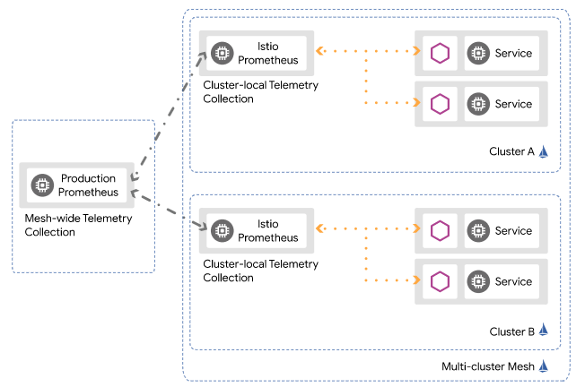
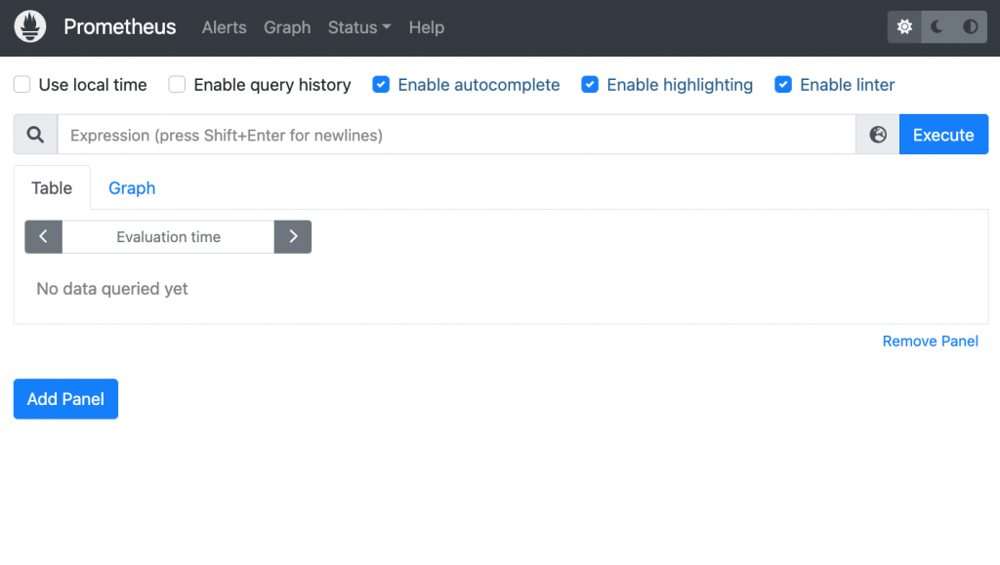
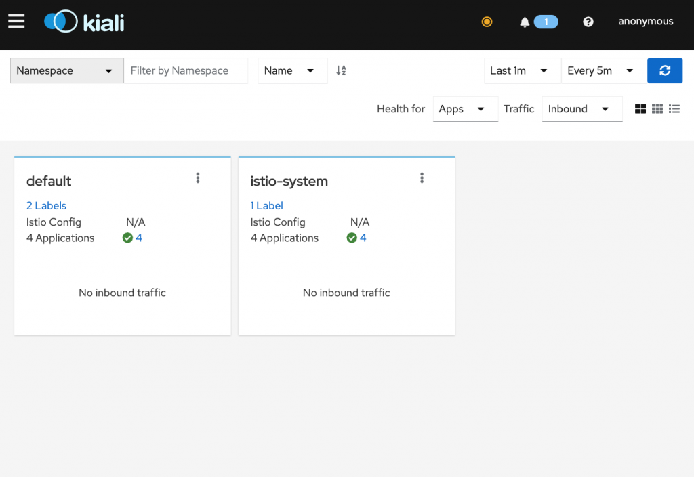
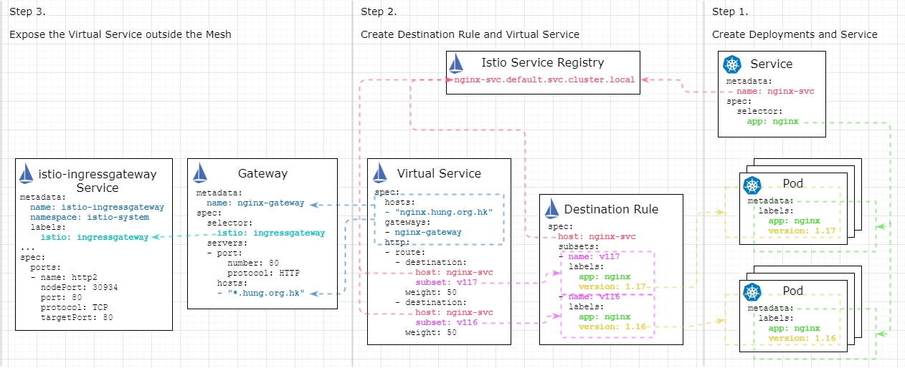

# 開箱 Istio 服務網格

原文: [Quick Start: Unboxing Istio Service Mesh](https://kwonghung-yip.medium.com/quick-start-unboxing-istio-service-mesh-64b61eb319d7)

## 簡介

Istio Service Mesh 通過允許細粒度控制和監控流量來改善 Kubernetes 集群中的服務到服務通信。雖然 Kubernetes Service 在 Pod 之上提供了基本的負載平衡功能，但 Istio 更進一步，通過將 Envoy 代理 Sidecar 注入 Pod 中，使來自 Pod 的傳入和傳出流量可管理和可配置。

Sidecar 模式的優點是對應用程序透明，換句話說，這意味著您的代碼中不需要委託客戶端；您對網格中其他服務的調用只是一個普通的 REST 調用；服務發現、負載平衡、斷路或重試策略可以與您的應用程序分離。獨立於應用程序使您可以自由選擇程序語言或工具，您仍然可以享受服務網格的好處。

## 創建 Kubernetes

執行下列命令來創建實驗 Kubernetes 集群:

```bash
k3d cluster create --servers 1 --agents 1 --api-port 6443 \
--k3s-arg "--disable=traefik@server:0" \
--port 8080:80@loadbalancer --port 8443:443@loadbalancer \
--agents-memory=8G
```

* `--disable=traefik@server:0` 安裝 Istio 後禁用 Traefik 負載均衡器
* `--agents-memory=8G` 安裝 Istio 的額外增加一些內存
* `local-cluster` k3d 集群名稱

## 安裝 Istio

首先配置 Helm 存儲庫：

```bash
$ helm repo add istio https://istio-release.storage.googleapis.com/charts
$ helm repo update
```

根據下列的步驟來安裝 Istio:

1. 為 Istio 組件，創建命名空間 `istio-system`:

    ```bash
    $ kubectl create namespace istio-system
    ```

2. 安裝 `Istio base chart`，它包含了 Istio 控制平面用到的集群範圍的資源:

    ```bash
    $ helm install istio-base istio/base -n istio-system
    ```

3. 安裝 Istio discovery chart，它用於部署 istiod 服務:

    ```bash
    $ helm install istiod istio/istiod -n istio-system --wait
    ```

4. (可選項) 安裝 Istio 的入站網關:

    ```bash
    $ kubectl create namespace istio-ingress
    $ kubectl label namespace istio-ingress istio-injection=enabled
    $ helm install istio-ingress istio/gateway -n istio-ingress --wait
    ```

    !!! info
        部署網關的命名空間不能有 `istio-injection=disabled` 標籤。有關詳細信息，請參閱[控制注入策略](https://istio.io/latest/docs/setup/additional-setup/sidecar-injection/#controlling-the-injection-policy)。

## 安裝 Prometheus

Istio 會在每個 Pod 都建立一個 Sidecar，應用開發者不需額外撰寫 Metrics 相關邏輯，Sidecar 就能主動蒐集應用程式的 Metrics ，並將資料送至 Prometheus。



接下來執行下列命令來安裝 Prometheus:

```bash
kubectl apply -f https://raw.githubusercontent.com/istio/istio/master/samples/addons/prometheus.yaml
```

!!! info
    此安裝檔作為示範， Performance 與 Security 功能並不完善，只適合在實驗環境使用

Prometheus 會安裝到 `istio-system` Namespace 上，可以檢查是否安裝成功。

```bash
# 使用 kubectl get pods -n <namespace> 查看 Pods 運行狀況
kubectl get pods -n istio-system
```

輸出結果:

```bash
NAME                          READY   STATUS    RESTARTS   AGE
istiod-5dcbbcf9b4-zjtpz       1/1     Running   0          10m
prometheus-6956c8c6c5-75c82   2/2     Running   0          67s
```

除了 istiod 等 Istio 元件之外還多了 prometheus 的 Pod。

部署完成後就可以嘗試連接到 Prometheus GUI。

使用 `kubectl port-forward` 將流量轉到 Prometheus GUI:

```bash
kubectl port-forward -n istio-system svc/prometheus 9090:9090 --address="0.0.0.0"
```

在瀏覽器輸入網址連接至 Prometheus UI 服務 `http://localhost:9090`，在瀏覽器即可看到 Prometheus GUI 介面。



## 安裝 Kiali

要提升系統的 Observability，除了要盡可能蒐集應用程式的資訊，能夠綜觀全局的 GUI 工具必不可少，Kiali 就是個擁有強大功能的軟體。

### Kiali 是什麼？


Kiali 是 Istio Service Mesh 的管理平台，可以快速的到 Istio 環境，幫助我們設置、可視化、驗證及消除其 Service Mesh ，藉以升級系統可觀察性功能，包括:

- `Topology`: 可視化 Microservices 溝通情形
- `Health`: 檢查應用程式的健康狀態
- `Details`: 查看應用程式的 Logs、Metrics 詳細資料
- `Tracing`: 結合 Jaeger 獲取 Tracing 資訊
- `Validations`: 檢查錯誤的 Configuration
- `Wizards`: 可在 GUI 設置 Istio Routing 規則
- `Configuration`: 可在 GUI 查看及修改 Istio Configuration

### 安裝

接下來執行下列命令來安裝 Kiali:

```bash
kubectl apply -f https://raw.githubusercontent.com/istio/istio/master/samples/addons/kiali.yaml
```

Kiali 會安裝到 `istio-system` Namespace 上，可以檢查是否安裝成功。

使用 `kubectl get pods -n <namespace>` 查看 Pods 運行狀況:

```bash
kubectl get pods -n istio-system
```

結果:

```bash hl_lines="6"
$ kubectl get pods -n istio-system

NAME                          READY   STATUS    RESTARTS   AGE
istiod-5dcbbcf9b4-zjtpz       1/1     Running   0          3h11m
prometheus-6956c8c6c5-75c82   2/2     Running   0          3h2m
kiali-64c4f869fb-6ng56        1/1     Running   0          73s
```

使用 kubectl port-forward 將流量轉到 Kiali GUI:

```bash
kubectl port-forward -n istio-system svc/kiali 20001:20001 --address="0.0.0.0"
```

在瀏覽器輸入網址連接至服務: `http://localhost:20001`




## 範例驗證

將 `istio-injection` 標籤附加到 `default` 命名空間中，之後 Istio 就會對於在該命名空間中創建的每個 Pod，將向 Pod 裡自動注入一個 Envoy 代理。

```bash
kubectl label namespace default istio-injection=enabled
```

此次的範例主要在 Kubernetes 集群公開一個簡單的 Nginx 服務，並假設該服務正在推出一個新版本。此時，進來的請求有一半已經路由到新版本，另一半仍然由舊版本處理。下圖展示了不同資源之間的部署概覽和關係，所有的 yaml 文件都可以在 [GitHub repo](https://github.com/kwonghung-YIP/istio-series/tree/master/unboxing-istio-service-mesh) 中找到。



### Step 1: Create Kubernetes Service and Deployment

從基本設置開始，首先創建了 2 個運行在不同版本（v1.16 和 v1.17）的 Nginx 部署，yaml 文件可以在 GitHub 中找到。

```bash
kubectl apply -f https://raw.githubusercontent.com/kwonghung-YIP/istio-series/master/unboxing-istio-service-mesh/nginx-deployment.yml
```

- 每個 Deployment 有 3 個副本，並創建了 6 個 Nginx Pod。
- 每個 Pod 都被分配了應用程序和版本標籤以供以後使用，它還安裝了一個 test.txt 用於使用 curl 進行測試。

在 Pod 之後創建了一個 Nginx 服務，它的選擇器僅與應用標籤匹配，因此它選擇了所有 6 個 Nginx Pod 作為其 Endpoints。

```bash
kubectl apply -f -
apiVersion: v1
kind: Service
metadata:
  name: nginx-svc
  labels:
    service: nginx
spec:
  selector:
    app: nginx
  ports:
  - name: http
    protocol: TCP
    port: 80
  - name: https
    protocol: TCP
    port: 443
