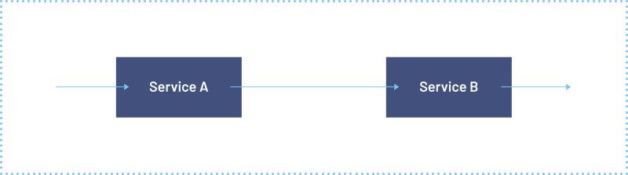
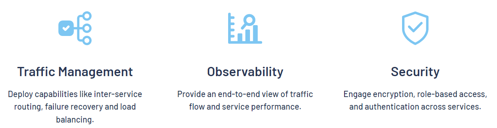

# Istio 服務網格

原文: [The Istio service mesh](https://istio.io/)

Istio 擴展了 Kubernetes 以使用強大的 Envoy 服務代理建立一個可編程的、應用感知的網絡。 Istio 與 Kubernetes 和傳統工作負載一起使用，為複雜的部署帶來了標準的通用流量管理、遙測和安全性。

!!! tips
    通過在每個應用程序中添加代理“sidecar”，Istio 將應用程序感知流量管理、令人難以置信的可觀察性和強大的安全功能編程到您的網絡中。

Istio 通過分佈式或微服務架構解決了開發人員和運營商面臨的挑戰。無論是從頭開始構建還是將現有應用程序遷移到雲原生，Istio 都可以提供幫助。

## 什麼是服務網格？

現代應用程序通常被構建為微服務的分佈式集合，每個微服務集合執行一些離散的業務功能。服務網格是一個專用的基礎設施層，您可以將其添加到您的應用程序中。它允許您透明地添加可觀察性、流量管理和安全性等功能，而無需將它們添加到您自己的代碼中。術語“服務網格”描述了您用於實現此模式的軟件類型，以及您使用該軟件時創建的安全或網絡域。

隨著分佈式服務的部署（例如在基於 Kubernetes 的系統中）的規模和復雜性的增長，它可能變得更難理解和管理。它的要求可以包括發現、負載平衡、故障恢復、度量和監控。服務網格還經常解決更複雜的操作要求，例如 A/B 測試、金絲雀部署、速率限制、訪問控制、加密和端到端身份驗證。

服務到服務的通信使分佈式應用程序成為可能。隨著服務數量的增長，在應用程序集群內和跨應用程序集群中路由這種通信變得越來越複雜。 Istio 有助於降低這種複雜性，同時減輕開發團隊的壓力。

## 什麼是 Istio？

Istio 是一個開源服務網格，它透明地分層到現有的分佈式應用程序上。 Istio 的強大功能提供了一種統一且更有效的方式來保護、連接和監控服務。 Istio 是負載均衡、服務到服務身份驗證和監控的途徑——幾乎不需要更改服務代碼。其強大的控制平面帶來了重要的功能，包括：

- 使用 TLS 加密、強大的基於身份的身份驗證和授權來保護集群中的服務到服務通信
- HTTP、gRPC、WebSocket 和 TCP 流量的自動負載平衡
- 通過豐富的路由規則、重試、故障轉移和故障注入對流量行為進行細粒度控制
- 支持訪問控制、速率限制和配額的可插拔策略層和配置 API
- 集群內所有流量的自動指標、日誌和跟踪，包括集群入口和出口

Istio 專為可擴展性而設計，可以處理各種部署需求。 Istio 的控制平面在 Kubernetes 上運行，您可以將部署在該集群中的應用程序添加到您的網格中，將網格擴展到其他集群，甚至連接在 Kubernetes 之外運行的虛擬機或其他端點。

由貢獻者、合作夥伴、集成和分銷商組成的大型生態系統擴展和利用 Istio 來應對各種場景。您可以自己安裝 Istio，或者許多供應商提供集成 Istio 並為您管理它的產品。

## Istio 是怎麼運作？

Istio 有兩個組件：**數據平面** 和 **控制平面**。

數據平面是服務之間的通信。如果沒有服務網格，網絡就無法理解發送過來的流量，也無法根據流量類型或來自誰或去向誰做出任何決定。

服務網格使用代理來攔截您的所有網絡流量，允許基於您設置的配置的廣泛的應用程序感知功能。

Envoy 代理與您在集群中啟動的每個服務一起部署，或者與在 VM 上運行的服務一起運行。

控制平面採用您想要的配置及其服務視圖，並動態地對代理服務器進行編程，並隨著規則或環境的變化對其進行更新。

<figure markdown>
  
  <figcaption>在使用 Istio 之前</figcaption>
</figure>

<figure markdown>
  
  <figcaption>使用 Istio 後</figcaption>
</figure>

## 概念

### Traffic management

在單個集群內和跨集群的路由流量都會影響性能並實現更好的部署策略。 Istio 的流量路由規則讓您可以輕鬆控制服務之間的流量和 API 調用。 Istio 簡化了斷路器、超時和重試等服務級別屬性的配置，並可以輕鬆設置重要任務，例如 A/B 測試、金絲雀部署和基於百分比的流量拆分的分階段部署。

### Observability

隨著服務的複雜性增加，理解行為和性能變得具有挑戰性。 Istio 為服務網格中的所有通信生成詳細的遙測數據。這種遙測提供服務行為的可觀察性，使運營商能夠排除故障、維護和優化他們的應用程序。更好的是，您無需更改應用程序即可獲得幾乎所有這些工具。通過 Istio，運維人員可以全面了解受監控服務的交互方式。

Istio 的遙測包括詳細的指標、分佈式跟踪和完整的訪問日誌。使用 Istio，您可以獲得全面而全面的服務網格可觀察性。

### Security capabilities

微服務有特殊的安全需求，包括防止中間人攻擊、靈活的訪問控制、審計工具和雙向 TLS。 Istio 包含一個全面的安全解決方案，使運營商能夠解決所有這些問題。它提供強大的身份、強大的策略、透明的 TLS 加密以及身份驗證、授權和審計 (AAA) 工具來保護您的服務和數據。

Istio 的安全模型基於默認安全，旨在提供深度防禦，讓您即使在不受信任的網絡中也能部署注重安全的應用程序。
