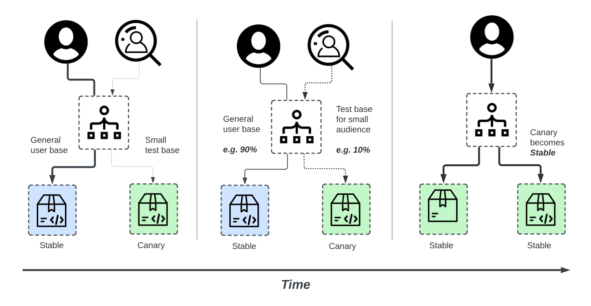

# 應用程序部署的六種策略

原文:[Six Strategies for Application Deployment](https://thenewstack.io/deployment-strategies/)

有多種技術可以將新應用程序部署到生產環境中，因此選擇正確的策略是一個重要的決策，需要根據變更對系統和最終用戶的影響來權衡這些選項。

在這篇文章中，我們將討論以下策略：

- Recreate：版本 A 終止，然後推出版本 B。
- Ramped (也稱為rolling-update或incremental): 版本 B 正在緩慢推出並替換版本 A。
- Blue/Green: 版本 B 與版本 A 一起發布，然後流量切換到版本 B。
- Canary: 版本 B 發布給一部分用戶，然後繼續全面推出。
- A/B testing: 版本 B 在特定條件下發布給一部分用戶。
- Shadow: 版本 B 與版本 A 一起接收真實世界的流量，並且不影響響應。

## 部署策略

讓我們看一下每種策略，看看哪種策略最適合特定用例。為簡單起見，我們使用 Kubernetes 並針對 Minikube 測試了該示例。可以在[這個 git 存儲庫](https://github.com/ContainerSolutions/k8s-deployment-strategies)中找到每個策略的配置示例和 step-by-step 方法。

### Recreate

重新創建策略是一個虛擬部署，包括關閉版本 A，然後在版本 A 關閉後部署版本 B。這種技術意味著服務的停機時間取決於應用程序的關閉和啟動持續時間。

優點:

- 易於設置。
- 應用程序狀態完全更新。

缺點:

- 對用戶的影響很大，預計停機時間取決於應用程序的關閉和啟動持續時間。

### Ramped

漸進式部署策略包括通過一個接一個地替換實例直到所有實例都被推出來緩慢推出應用程序的一個版本。它通常遵循以下過程：在負載均衡器後面有一個版本 A 的池，部署一個版本 B 的實例。當服務準備好接受流量時，實例將添加到池中。然後，版本 A 的一個實例從池中移除並關閉。

根據處理漸變部署的系統，您可以調整以下參數以增加部署時間：

- `Parallelism, max batch size`: 要推出的並發實例數。
- `Max surge`: 除了當前數量之外還要添加多少個實例。
- `Max unavailable`: 滾動更新過程中不可用的實例數。

優點:

- 易於設置。
- 跨實例緩慢發布版本。
- 方便可以處理數據重新平衡的有狀態應用程序。

缺點:

- 推出/回滾可能需要一些時間。
- 支持多個 API 很難。
- 無法控制流量。

### Blue/Green

藍/綠部署策略與漸進式部署不同，版本 B（綠色）與版本 A（藍色）一起部署，實例數量完全相同。在測試新版本滿足所有要求後，流量在負載均衡器級別從版本 A 切換到版本 B。

優點:

- 即時推出/回滾。
- 避免版本控制問題，整個應用程序狀態一次更改。

缺點:

- 昂貴，因為它需要雙倍的資源。
- 在發佈到生產環境之前，應該對整個平台進行適當的測試。
- 處理有狀態的應用程序可能很困難。

### Canary

金絲雀部署包括將生產流量從版本 A 逐漸轉移到版本 B。通常流量根據權重進行拆分。例如，90% 的請求轉到版本 A，10% 轉到版本 B。

當測試缺乏或不可靠或對平台上新版本的穩定性缺乏信心時，通常會使用此技術。

優點:

- 為部分用戶發布的版本。
- 便於錯誤率和性能監控。
- 快速回滾。

缺點:

- 緩慢推出。

### A/B testing

A/B 測試部署包括在特定條件下將用戶子集路由到新功能。它通常是一種基於統計數據做出業務決策的技術，而不是一種部署策略。但是，它是相關的，可以通過向金絲雀部署添加額外的功能來實現，因此我們將在這裡簡要討論它。

此技術廣泛用於測試給定功能的轉換，並且僅推出轉換最多的版本。

以下是可用於在版本之間分配流量的條件列表：

- 通過瀏覽器 cookie
- 查詢參數
- 地理定位
- 技術支持：瀏覽器版本、屏幕尺寸、操作系統等
- 語言

優點:

- 多個版本並行運行。
- 完全控制流量分佈。

缺點:

- 需要智能負載均衡器。
- 很難對給定會話的錯誤進行故障排除，分佈式跟踪成為強制性的。

### Shadow

影子部署包括與版本 A 一起發布版本 B，分叉版本 A 的傳入請求並將它們也發送到版本 B，而不會影響生產流量。這對於測試新功能的生產負載特別有用。當穩定性和性能滿足要求時，將觸發應用程序的推出。

這種技術設置起來相當複雜，並且需要特殊要求，尤其是對於出口流量。例如，給定一個購物車平台，如果您想對支付服務進行影子測試，您最終可能會讓客戶為他們的訂單支付兩次費用。在這種情況下，您可以通過創建一個複制來自提供者的響應的模擬服務來解決它。

優點:

- 使用生產流量對應用程序進行性能測試。
- 對用戶沒有影響。
- 在應用程序的穩定性和性能滿足要求之前，不會推出。

缺點:

- 昂貴，因為它需要雙倍的資源。
- 不是真正的用戶測試，可能會產生誤導。
- 設置複雜。
- 在某些情況下需要模擬服務。

## 總結

有多種方法可以部署新版本的應用程序，這實際上取決於需求和預算。當發佈到開發/登台環境時，重新創建或升級部署通常是一個不錯的選擇。在生產方面，漸變或藍/綠部署通常很合適，但需要對新平台進行適當的測試。

藍/綠和影子策略對預算的影響更大，因為它需要雙倍的資源容量。如果應用程序缺乏測試，或者對軟件的影響/穩定性缺乏信心，那麼可以使用金絲雀、a/b 測試或影子發布。如果您的企業需要在特定用戶群中測試新功能，可以根據地理位置、語言、操作系統或瀏覽器功能等參數進行過濾，那麼您可能需要使用 a/b 測試技術。

最後但同樣重要的是，影子發布很複雜，需要額外的工作來模擬出口流量，這在使用可變操作（電子郵件、銀行等）調用外部依賴項時是強制性的。但是，當遷移到新的數據庫技術並使用影子流量來監控負載下的系統性能時，這種技術會很有用。

下圖可幫助您選擇正確的策略：

