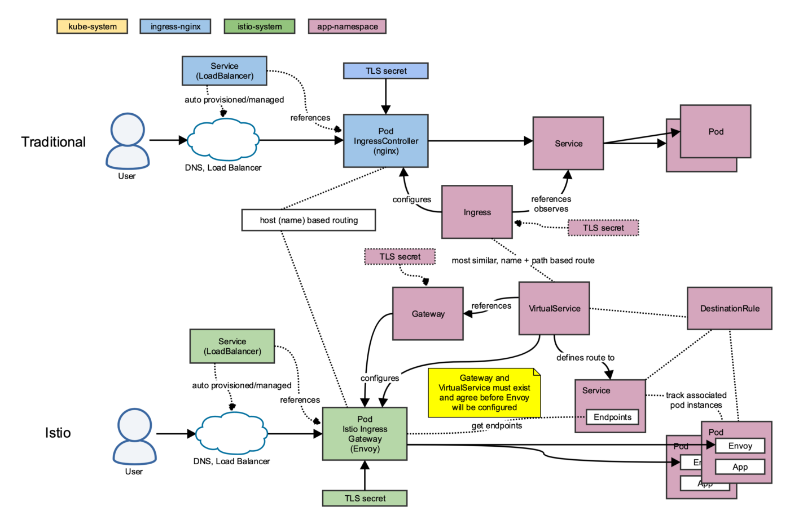
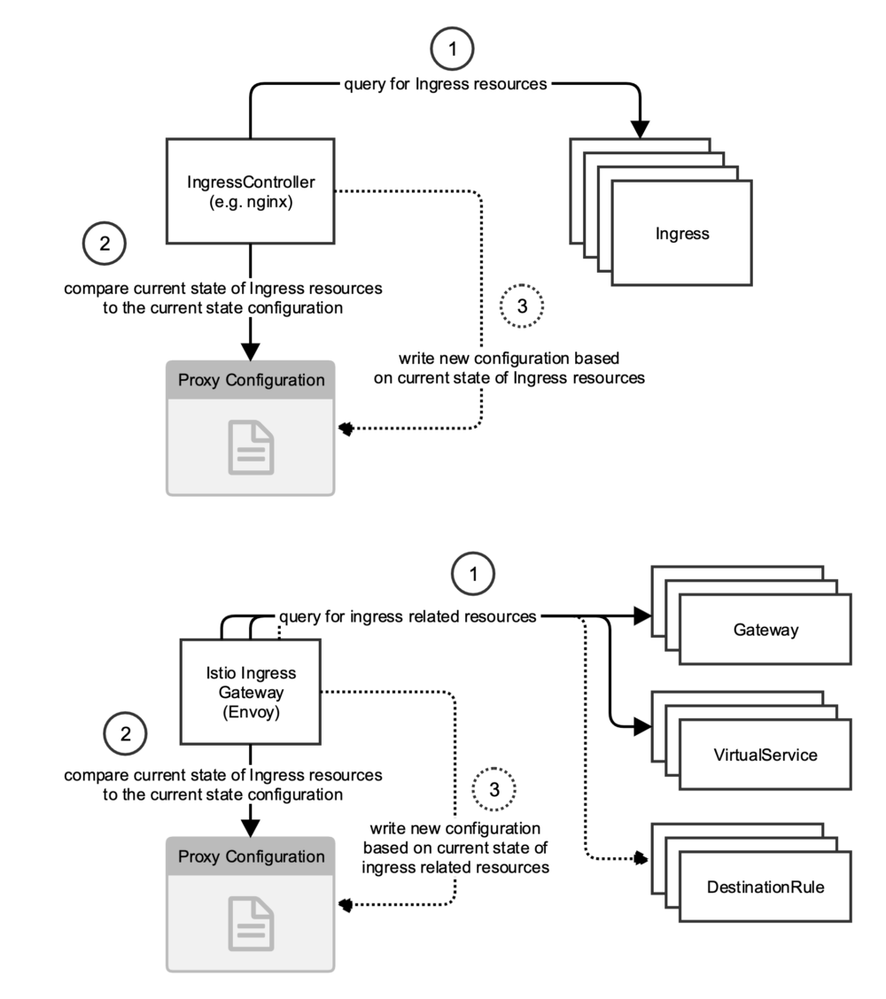
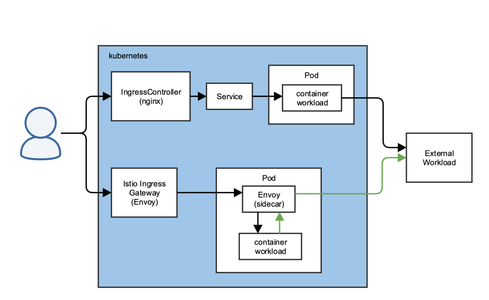

# Istio Ingress 與 Kubernetes Ingress

原文:[Istio Ingress vs. Kubernetes Ingress](https://software.danielwatrous.com/istio-ingress-vs-kubernetes-ingress/)

Kubernetes 以簡潔明了的方式將 Ingress 引入容器工作負載。基於 Ingress 資源的當前狀態動態重新配置自身的 IngressController 的想法非常清晰且易於理解。

另一方面，對開始學習與使用 Istio 的技術人來說如何使用 Istio Gateway 來曝露佈署在 Kubernetes 裡的服務給外部使用則相對複雜，所以本文將會對比 kubernetes ingress 與 Istio ingress 兩者的異同並且強化對 Istio Gateway 的認識。

## 動態的 Ingress Control

### 邊緣負載均衡器

這兩種方法在處理邊緣流量方面非常相似。在一般實踐中，邊緣流量將先到達負載均衡器，它將在 IngressController（傳統）或 Istio Ingress Gateway 的多個實例之間分配流量。 kubernetes 服務定義負載均衡器並將其與 IngressController/Istio Ingress Gateway 相關聯。負載均衡器將始終根據對 IngressController/Istio Ingress Gateway Pod 的更改進行動態重新配置。

### DNS 和決策制定

根據我的經驗，通常會通過設定 wildcard 的 DNS 條目的來配置進入集群的工作負載解析。 LoadBalancer 服務將負載均衡器配置為將端口 80 和 443 上的所有流量傳遞到 IngressController/Istio Ingress Gateway。 LoadBalancer 將關於如何處理請求的所有決定都留給了 IngressController/Istio Ingress Gateway。

### 代理技術

傳統 kubernetes 路由的 IngressController 有許多實現，例如 [nginx](https://github.com/nginxinc/kubernetes-ingress)、[haproxy](https://github.com/haproxytech/kubernetes-ingress) 和 [traefik](https://github.com/containous/traefik)。它們具有各種功能（例如 Let's Encrypt 集成），但它們都滿足要求它們了解所有 Ingress 資源並相應地路由流量的規範。

Istio Ingress Gateway 則使用了 [Envoy](https://www.envoyproxy.io/)。Envoy 是一個可靠、非常快速的代理，已經過世界上一些最大網站的實戰測試。

### 自動（重新）配置

這兩種方法都實現了一種服務器端服務發現模式。代理監控 kubernetes 資源並配置和重新配置自身。下圖說明了這是如何工作的。

儘管 Istio ingress 機制更加複雜，但基本的方法幾乎相同。入口代理中的機制會觀察 Gateway、VirtualService 和 DestinationRule 資源的變化。當觀察到相對於當前配置的更改時，將更新配置。上面的每個編號步驟都是連續的。

### TLS

兩種解決方案都適用於兩個級別的 TLS 證書。第一層是 IngressController（至少對於 nginx 是這樣）和 Istio Ingress Gateway。第二層是 IngressController 或 Gateway。兩種解決方案都使用 kubernetes Secret 來存儲 TLS 證書和密鑰。但是，它們在實踐中的工作方式不同，因此我將在下面提供每個解決方案的說明。

#### IngressController (nginx)

nginx IngressController 為所有未定義自己的 Ingress 資源定義基本/默認 TLS 證書。如果未提供 TLS 證書，則會使用偽造的證書。一些 IngressController 實現還與 Let's Encrypt 集成。

Ingress 資源可以通過引用不同的 kubernetes Secret 來覆蓋默認的 TLS 證書。發生這種情況時，Ingress 特定的 Secret 將安裝到 IngressController 中並添加到該路由的配置中。

#### Istio Ingress Gateway

Istio Ingress Gateway 還可以通過兩種不同的方式使用 Secret。這兩種方法都要求帶有 TLS 證書的 Secret 必須存在於託管 Istio Ingress Gateway 的同一命名空間中。與 IngressController 不同，無法定義要使用的默認 TLS 證書。{==證書必須在每個網關資源中定義==}。

**文件掛載 TLS 證書:**

Istio Ingress Gateway 支持的第一種 TLS 方法基於命名和路徑約定。有關[文件掛載 TLS 方法](https://istio.io/docs/tasks/traffic-management/ingress/secure-ingress-mount/)的完整詳細信息解釋了名為 `istio-ingressgateway-certs` 的 Secret 將掛載到路徑 `/etc/istio/ingressgateway-certs/tls.crt` 和 `/etc/istio/ingressgateway-certs/tls.key`。Gateway 資源可以直接引用這些路徑。

**秘密發現服務:**

第二種方法是安裝 [Secret Discovery Service (SDS)](https://istio.io/docs/tasks/traffic-management/ingress/secure-ingress-sds/)。然後可以將 Secret 添加到託管 Istio Ingress Gateway 的同一命名空間，並且可以在 Gateway 定義中將 Secret 作為 `credentialName` 參數直接引用。

## Kubernetes Service 僅用於取得 endpoints

使用 IngressController 時，流量會被路由到服務，該服務會在可用 Pod 之間對流量進行負載均衡。對於 Istio Ingress Gateway，kubernetes 服務僅用於獲取端點（Pod）列表。然後請求繞過服務直接發送到 Pod 中的 Envoy 代理。

Istio 和傳統 Kubernetes 之間的另一個重要區別在於流量如何從 Kubernetes 工作負載路由到外部工作負載，例如數據庫或 API。 Istio 通過同一個 sidecar Envoy 代理路由這個出口流量。下圖說明了這一點。

如上所示，綠色箭頭表示通過代理的外部流量，而不是直接流向外部工作負載。默認是[允許所有出口](https://istio.io/docs/tasks/traffic-management/egress/egress-control/)，但 Istio 可以配置為需要一個顯式的 `ServiceEntry` 來訪問外部工作負載。