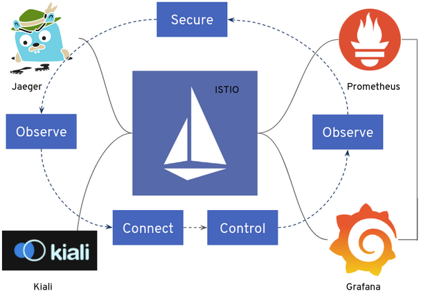

# 使用 Helm 安裝



請跟隨本指南一起，使用 Helm 安裝、配置、並深入評估 Istio 網格系統。本指南用到的 Helm chart、以及使用 Istioctl、Operator 安裝 Istio 時用到的 chart，它們都是相同的底層 chart。

## 先決條件

- 安裝 Helm 客戶端，版本 3.6 或更高版本。
- 配置 Helm 存儲庫：

```bash
$ helm repo add istio https://istio-release.storage.googleapis.com/charts
$ helm repo update
```

## 創建 K8S 集群

執行下列命令來創建實驗 Kubernetes 集群:

```bash
k3d cluster create local-cluster --servers 1 --agents 1 --api-port 6443 \
--k3s-arg "--disable=traefik@server:0" \
--port 8080:80@loadbalancer --port 8443:443@loadbalancer \
--agents-memory=8G
```

* `--disable=traefik@server:0` 安裝 Istio 後禁用 Traefik 負載均衡器
* `--agents-memory=8G` 安裝 Istio 的額外增加一些內存
* `local-cluster` k3d 集群名稱


## 安裝 Istio 

### 安裝步驟

1. 為 Istio 組件，創建命名空間 `istio-system`:

    ```bash
    $ kubectl create namespace istio-system
    ```

2. 安裝 `Istio base chart`，它包含了 Istio 控制平面用到的集群範圍的資源:

    ```bash
    $ helm install istio-base istio/base -n istio-system
    ```

3. 安裝 Istio discovery chart，它用於部署 istiod 服務:

    ```bash
    $ helm install istiod istio/istiod -n istio-system --wait
    ```

4. (可選項) 安裝 Istio 的入站網關:

    ```bash
    $ kubectl create namespace istio-ingress
    $ kubectl label namespace istio-ingress istio-injection=enabled
    $ helm install istio-ingress istio/gateway -n istio-ingress --wait
    ```

    !!! info
        部署網關的命名空間不能有 `istio-injection=disabled` 標籤。有關詳細信息，請參閱[控制注入策略](https://istio.io/latest/docs/setup/additional-setup/sidecar-injection/#controlling-the-injection-policy)。

### 驗證安裝

安裝狀態可以通過Helm進行驗證:

```bash
$ helm status istiod -n istio-system
```

### 更新 Istio 配置

你可以用自己的安裝參數，覆蓋掉前面用到的 Istio Helm chart 的默認行為，然後按照 Helm 升級流程來定制安裝你的 Istio 網格系統。至於可用的配置項，你可以通過使用 `helm show values istio/<chart>` 來找到配置。例如： `helm show values istio/gateway`。

### 卸載

卸載前面安裝的 chart，以便卸載 Istio 和它的各個組件。

1. 列出在命名空間 istio-system 中安裝的所有 Istio chart：

    ```bash
    $ helm ls -n istio-system
    NAME       NAMESPACE    REVISION UPDATED         STATUS   CHART        APP VERSION
    istio-base istio-system 1        ... ... ... ... deployed base-1.15.3   1.15.3
    istiod     istio-system 1        ... ... ... ... deployed istiod-1.15.3 1.15.3
    ```

2. (可選項) 刪除 Istio 的入/出站網關 chart:

    ```bash
    $ helm delete istio-ingress -n istio-ingress
    $ kubectl delete namespace istio-ingress
    ```

3. 刪除 Istio discovery chart:

    ```bash
    $ helm delete istiod -n istio-system
    ```

4. 刪除 Istio base chart:

    ```bash
    $ helm delete istio-base -n istio-system
    ```

5. 刪除命名空間 istio-system：

    ```bash
    $ kubectl delete namespace istio-system
    ```

## 安裝 Prometheus 與 Grafana

添加 Prometheus 圖表存儲庫並更新本地緩存：

```bash
$ helm repo add prometheus-community https://prometheus-community.github.io/helm-charts
$ helm repo update 
```

創建要配置的 vlaues 檔案:

```yaml title="kube-stack-prometheus-values.yaml"
grafana:
  sidecar:
    dashboards:
      logLevel: "DEBUG"
      # Enables the cluster wide search for dashboards and adds/updates/deletes them in grafana
      enabled: true
      searchNamespace: "ALL"


prometheus:
  prometheusSpec:
    serviceMonitorSelectorNilUsesHelmValues: false
    podMonitorSelectorNilUsesHelmValues: false
    ruleSelectorNilUsesHelmValues: false
    probeSelectorNilUsesHelmValues: false
```

使用 Helm 在命名空間監控中部署 kube-stack-prometheus chart：

```bash
helm upgrade --install --wait --create-namespace --namespace monitoring  \
kube-stack-prometheus prometheus-community/kube-prometheus-stack \
--values kube-stack-prometheus-values.yaml
```

該 Helm chart 安裝了 Prometheus 組件和 Operator、Grafana 以及以下 exporters：

- [prometheus-node-exporter](https://github.com/prometheus/node_exporter) 暴露底層硬件和操作系統的相關指標
- [kube-state-metrics](https://github.com/kubernetes/kube-state-metrics) 監聽 Kubernetes API 服務器並生成有關對象狀態的指標

**配置 istio 與 prometheus-operator:**

```bash
kubectl apply -f https://raw.githubusercontent.com/istio/istio/release-1.16/samples/addons/extras/prometheus-operator.yaml
```

我們的 Prometheus 和 Grafana 監控堆棧已經準備就緒！

### 連接到 Prometheus Web 界面

Prometheus Web UI 可通過以下命令通過端口轉發訪問：

```bash
$ kubectl port-forward --namespace monitoring svc/kube-stack-prometheus-kube-prometheus 9090:9090 --address="0.0.0.0"
```

在 http://localhost:9090 上打開瀏覽器選項卡會顯示 Prometheus Web UI。我們可以檢索從不同指標 Exporters 所收集回來的指標：


### 連接到 AlertManager

AlertManager Web UI 可通過以下命令通過端口轉發訪問：

```bash
kubectl port-forward svc/kube-stack-prometheus-kube-alertmanager 9093:9093 --address="0.0.0.0"
```

### 連接到 Grafana

連接到 Grafana Web 界面的帳密存儲在 Kubernetes Secret 中並以 base64 編碼。我們使用以下兩個命令檢索用戶名/密碼：

```bash
$ kubectl get secret --namespace monitoring kube-stack-prometheus-grafana -o jsonpath='{.data.admin-user}' | base64 -d
$ kubectl get secret --namespace monitoring kube-stack-prometheus-grafana -o jsonpath='{.data.admin-password}' | base64 -d
```

我們使用以下命令創建到 Grafana 的端口轉發：

```bash
$ kubectl port-forward --namespace monitoring svc/kube-stack-prometheus-grafana 3000:80 --address="0.0.0.0"
```

打開瀏覽器並轉到 http://localhost:3000 並填寫前一個命令所取得的用戶名/密碼。預設的帳號是:

- `username`: admin
- `password`: prom-operator


## 安裝 Kiali

使用以下命令添加 Kiali Helm Charts 存儲庫：

```bash
$ helm repo add kiali https://kiali.org/helm-charts
$ helm repo update
```

## 使用 Kiali operator 安裝 Kiali

添加 Kiali Helm Charts 存儲庫後，您可以通過運行以下命令安裝最新的 Kiali Operator 以及最新的 Kiali 服務器：

```bash
$ helm install \
    --set cr.create=true \
    --set cr.namespace=istio-system \
    --namespace kiali-operator \
    --create-namespace \
    kiali-operator \
    kiali/kiali-operator
```

`--namespace kiali-operator` 和 `--create-namespace` 標誌指示創建 `kiali-operator` 命名空間（如果需要），並在其上部署 Kiali operator。 
`-set cr.create=true` 和 `--set cr.namespace=istio-system` 標誌指示在 `istio-system` 命名空間中創建 Kiali CR。由於 Kiali CR 是提前創建的，所以 Kiali operator 一啟動，就會對其進行處理以部署 Kiali。

### 創建和更新 Kiali CR

Kiali Operator 監視 Kiali 自定義資源 (Kiali CR)，這是一個包含部署配置的 YAML 文件。創建、更新或刪除 Kiali CR 將觸發 Kiali Operator 安裝、更新或刪除 Kiali。

Operator 為 Kiali CR 的所有屬性提供全面的默認值。因此，最小的 Kiali CR 沒有規範：

```yaml title="kiali-cr.yaml"
apiVersion: kiali.io/v1alpha1
kind: Kiali
metadata:
  name: kiali
spec:
  istio_namespace: "istio-system"
  external_services:
    prometheus:
      # Prometheus service name is "metrics" and is in the "telemetry" namespace
      url: "http://kube-stack-prometheus-kube-prometheus.monitoring:9090/"
  auth:
    strategy: anonymous
  deployment:
    view_only_mode: true
```

假設您將之前的 YAML 保存到名為 `my-kiali-cr.yaml` 的文件中，並且您將 Kiali 安裝在與 Istio 相同的默認命名空間中，請使用以下命令創建資源：

```bash
$ kubectl apply -f kiali-cr.yaml -n istio-system
```

### 連接到 Kiali

Kiali Web UI 可通過以下命令通過端口轉發訪問：

```bash
$ kubectl port-forward svc/kiali 20001:20001 -n istio-system --address="0.0.0.0"
```