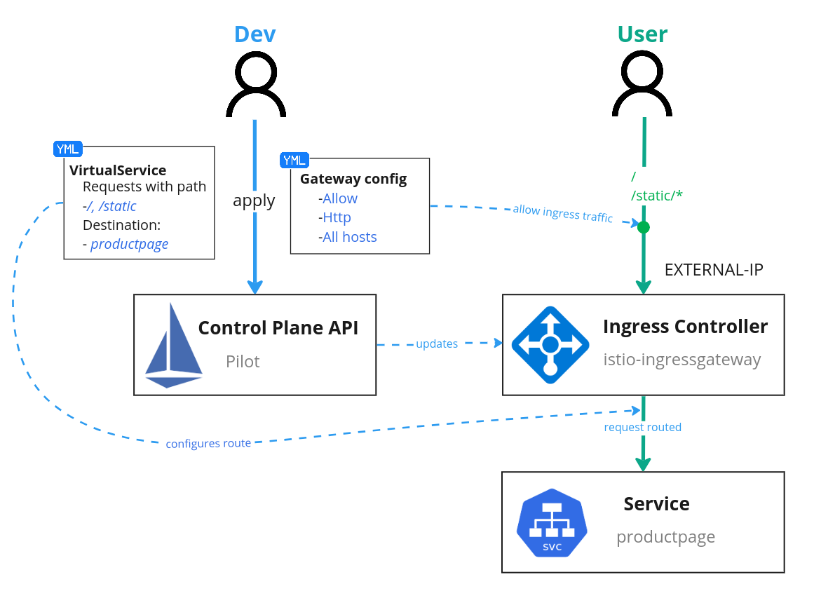

# 使用 Helm 安裝


請跟隨本指南一起，使用 Helm 安裝、配置、並深入評估 Istio 網格系統。本指南用到的 Helm chart、以及使用 Istioctl、Operator 安裝 Istio 時用到的 chart，它們都是相同的底層 chart。

## 步驟 01 - 安裝

### 先決條件

- 安裝 Helm 客戶端，版本 3.6 或更高版本。
- 配置 Helm 存儲庫：

```bash title="執行下列命令  >_"
helm repo add istio https://istio-release.storage.googleapis.com/charts

helm repo update
```

### 創建 K8S 集群

執行下列命令來創建實驗 Kubernetes 集群:

```bash title="執行下列命令  >_"
k3d cluster create  --servers 1 --agents 1 --api-port 6443 \
--k3s-arg "--disable=traefik@server:0" \
--port 8080:80@loadbalancer --port 8443:443@loadbalancer \
--agents-memory=8G
```

* `--disable=traefik@server:0` 安裝 Istio 後禁用 Traefik 負載均衡器
* `--agents-memory=8G` 安裝 Istio 的額外增加一些內存
* `local-cluster` k3d 集群名稱


### 安裝 Istio 

#### 安裝步驟

1. 安裝 `Istio base chart`，它包含了 Istio 控制平面用到的集群範圍的資源:

    ```bash title="執行下列命令  >_"
    helm upgrade --install --create-namespace --namespace istio-system \
    istio-base istio/base
    ```

3. 安裝 Istio discovery chart，它用於部署 istiod 服務:

    ```bash title="執行下列命令  >_"
    helm upgrade --install --create-namespace --namespace istio-system \
    istiod istio/istiod
    ```

4. (可選項) 安裝 Istio 的入站網關:

    ```bash title="執行下列命令  >_"
    $ kubectl create namespace istio-ingress
    $ kubectl label namespace istio-ingress istio-injection=enabled
    $ helm install istio-ingressgateway istio/gateway -n istio-ingress
    ```

    ```bash title="執行下列命令  >_"
    helm upgrade --install --create-namespace --namespace istio-ingress \
    istio-ingressgateway istio/gateway
    ```

    !!! info
        部署網關的命名空間不能有 `istio-injection=disabled` 標籤。有關詳細信息，請參閱[控制注入策略](https://istio.io/latest/docs/setup/additional-setup/sidecar-injection/#controlling-the-injection-policy)。

#### 驗證安裝

安裝狀態可以通過 Helm 進行驗證:

```bash title="執行下列命令  >_"
helm status istiod -n istio-system
```

#### 更新 Istio 配置

你可以用自己的安裝參數，覆蓋掉前面用到的 Istio Helm chart 的默認行為，然後按照 Helm 升級流程來定制安裝你的 Istio 網格系統。至於可用的配置項，你可以通過使用 `helm show values istio/<chart>` 來找到配置。例如： `helm show values istio/gateway`。

**卸載:**

當不再需要使用到 istio 時可依據下列的步驟來卸載前面安裝的 helm chart (卸載 Istio 和它的各個組件)。

1. 列出在命名空間 istio-system 中安裝的所有 Istio chart：

    ```bash title="執行下列命令  >_"
    $ helm ls -n istio-system
    NAME       NAMESPACE    REVISION UPDATED         STATUS   CHART        APP VERSION
    istio-base istio-system 1        ... ... ... ... deployed base-1.15.3   1.15.3
    istiod     istio-system 1        ... ... ... ... deployed istiod-1.15.3 1.15.3
    ```

2. (可選項) 刪除 Istio 的入/出站網關 chart:

    ```bash title="執行下列命令  >_"
    $ helm delete istio-ingress -n istio-ingress
    $ kubectl delete namespace istio-ingress
    ```

3. 刪除 Istio discovery chart:

    ```bash title="執行下列命令  >_"
    $ helm delete istiod -n istio-system
    ```

4. 刪除 Istio base chart:

    ```bash title="執行下列命令  >_"
    $ helm delete istio-base -n istio-system
    ```

5. 刪除命名空間 istio-system：

    ```bash title="執行下列命令  >_"
    $ kubectl delete namespace istio-system
    ```

### 安裝 Prometheus 與 Grafana

添加 Prometheus 圖表存儲庫並更新本地緩存：

```bash title="執行下列命令  >_"
$ helm repo add prometheus-community https://prometheus-community.github.io/helm-charts
$ helm repo update 
```

創建要配置的 vlaues 檔案:

```yaml title="kube-stack-prometheus-values.yaml"
grafana:
  sidecar:
    dashboards:
      logLevel: "DEBUG"
      # Enables the cluster wide search for dashboards and adds/updates/deletes them in grafana
      enabled: true
      searchNamespace: "ALL"


prometheus:
  prometheusSpec:
    serviceMonitorSelectorNilUsesHelmValues: false
    podMonitorSelectorNilUsesHelmValues: false
    ruleSelectorNilUsesHelmValues: false
    probeSelectorNilUsesHelmValues: false
```

使用 Helm 在命名空間監控中部署 kube-stack-prometheus chart：

```bash title="執行下列命令  >_"
helm upgrade --install --create-namespace --namespace monitoring  \
kube-stack-prometheus prometheus-community/kube-prometheus-stack \
--values kube-stack-prometheus-values.yaml
```

該 Helm chart 安裝了 Prometheus 組件和 Operator、Grafana 以及以下 exporters：

- [prometheus-node-exporter](https://github.com/prometheus/node_exporter) 暴露底層硬件和操作系統的相關指標
- [kube-state-metrics](https://github.com/kubernetes/kube-state-metrics) 監聽 Kubernetes API 服務器並生成有關對象狀態的指標

#### 整合 Istio 與 Prometheus

要讓 prometheus 能夠監控到每一個經由 istio 注入到 pod 裡的 sidecar(envoy), 我們需要使用 `PodMonitor` 來讓 Prometheus Operator 來作動:

```yaml
apiVersion: monitoring.coreos.com/v1
kind: PodMonitor
metadata:
  name: envoy-stats-monitor
  namespace: istio-system
  labels:
    monitoring: istio-proxies
    release: istio
spec:
  selector:
    matchExpressions:
    - {key: istio-prometheus-ignore, operator: DoesNotExist}
  namespaceSelector:
    any: true
  jobLabel: envoy-stats
  podMetricsEndpoints:
  - path: /stats/prometheus
    interval: 15s
    relabelings:
    - action: keep
      sourceLabels: [__meta_kubernetes_pod_container_name]
      regex: "istio-proxy"
    - action: keep
      sourceLabels: [__meta_kubernetes_pod_annotationpresent_prometheus_io_scrape]
    - sourceLabels: [__address__, __meta_kubernetes_pod_annotation_prometheus_io_port]
      action: replace
      regex: ([^:]+)(?::\d+)?;(\d+)
      replacement: $1:$2
      targetLabel: __address__
    - action: labeldrop
      regex: "__meta_kubernetes_pod_label_(.+)"
    - sourceLabels: [__meta_kubernetes_namespace]
      action: replace
      targetLabel: namespace
    - sourceLabels: [__meta_kubernetes_pod_name]
      action: replace
      targetLabel: pod_name
```

另外我們也需要監控 istio 的核心組件:

```yaml
apiVersion: monitoring.coreos.com/v1
kind: ServiceMonitor
metadata:
  name: istio-component-monitor
  namespace: istio-system
  labels:
    monitoring: istio-components
    release: istio
spec:
  jobLabel: istio
  targetLabels: [app]
  selector:
    matchExpressions:
    - {key: istio, operator: In, values: [pilot]}
  namespaceSelector:
    any: true
  endpoints:
  - port: http-monitoring
    interval: 15s
```

執行下列命令來啟動 Prometheus 的監控設定:

```bash title="執行下列命令  >_"
kubectl apply -f https://raw.githubusercontent.com/istio/istio/release-1.16/samples/addons/extras/prometheus-operator.yaml
```

至於要設定什麼樣的告警規則來對 Istio 組件, 讓我們參考:

- [Awesome Prometheus alerts](https://awesome-prometheus-alerts.grep.to/rules#istio)


#### 整合 Istio 與 Grafana

接著讓我們來在 Grafana 中創建 Istio 相關的 dashboard。

下載 Istio dashboard:

- [istio-grafana-dashboards.yaml](./assets/istio-grafana-dashboards.yaml)

執行下列命令來啟動 Prometheus 的監控設定:

```bash title="執行下列命令  >_"
kubectl apply -f istio-grafana-dashboards.yaml
```

結果:

```bash
configmap/istio-grafana-dashboards created
configmap/istio-services-grafana-dashboards created
```

到這個階段我們的 Prometheus 和 Grafana 監控堆棧與 Istio 的整合已經準備就緒！

#### 連接到 Prometheus Web 界面

Prometheus Web UI 可通過以下命令通過端口轉發訪問：

```bash title="執行下列命令  >_"
kubectl port-forward --namespace monitoring svc/kube-stack-prometheus-kube-prometheus 9090:9090 --address="0.0.0.0"
```

在 http://localhost:9090 上打開瀏覽器選項卡會顯示 Prometheus Web UI。我們可以檢索從不同指標 Exporters 所收集回來的指標：


**驗證 Istio 與 Prometheus 整合:**

在 Prometheus UI 上點選 "Status >> Targest", 檢查 Prometheus 是否有發現要刮取指標相關 Istio 標的:


在 Prometheus UI 上點選 "Graph", 並在檢索指標的輸入欄輸入 `istio_build` 來檢查 Prometheus 是否有順利刮取 Istio 指標:


#### 連接到 AlertManager

AlertManager Web UI 可通過以下命令通過端口轉發訪問：

```bash title="執行下列命令  >_"
kubectl port-forward svc/kube-stack-prometheus-kube-alertmanager 9093:9093 --address="0.0.0.0"
```

#### 連接到 Grafana

連接到 Grafana Web 界面的帳密存儲在 Kubernetes Secret 中並以 base64 編碼。我們使用以下兩個命令檢索用戶名/密碼：

```bash title="執行下列命令  >_"
kubectl get secret --namespace monitoring kube-stack-prometheus-grafana -o jsonpath='{.data.admin-user}' | base64 -d

kubectl get secret --namespace monitoring kube-stack-prometheus-grafana -o jsonpath='{.data.admin-password}' | base64 -d
```

我們使用以下命令創建到 Grafana 的端口轉發：

```bash title="執行下列命令  >_"
kubectl port-forward --namespace monitoring svc/kube-stack-prometheus-grafana 3000:80 --address="0.0.0.0"
```

打開瀏覽器並轉到 http://localhost:3000 並填寫前一個命令所取得的用戶名/密碼。預設的帳號是:

- `username`: admin
- `password`: prom-operator


**驗證 Istio 與 Grafana 整合:**

在 Grafana UI 左側的導航欄點選 "Dashboards >> Browse" 並在 "Browse" 頁籤中的搜尋欄中鍵入 "istio":


應該會看到有下列五個 Dashbaords:

- Istio Control Plane Dashboard
- Istio Mesh Dashboard
- Istio Performance Dashbaord
- Istio Service Dashbaord
- Istio Wasm Extension Dashboard

### 安裝 Kiali

使用以下命令添加 Kiali Helm Charts 存儲庫：

```bash title="執行下列命令  >_"
helm repo add kiali https://kiali.org/helm-charts

helm repo update
```

### 使用 Kiali operator 安裝 Kiali

添加 Kiali Helm Charts 存儲庫後，您可以通過運行以下命令安裝最新的 Kiali Operator 以及最新的 Kiali 服務器：

```bash title="執行下列命令  >_"
helm upgrade --install \
  --create-namespace \
  --namespace kiali-operator \
  --set cr.create=true \
  --set cr.namespace=istio-system \
  kiali-operator \
  kiali/kiali-operator
```

- `--namespace kiali-operator` 和 `--create-namespace` 標誌指示創建 `kiali-operator` 命名空間（如果需要），並在其上部署 Kiali operator。 
- `-set cr.create=true` 和 `--set cr.namespace=istio-system` 標誌指示在 `istio-system` 命名空間中創建 Kiali CR。由於 Kiali CR 是提前創建的，所以 Kiali operator 一啟動，就會對其進行處理以部署 Kiali。

#### 創建和更新 Kiali CR

Kiali Operator 監視 Kiali 自定義資源 (Kiali CR)，這是一個包含部署配置的 YAML 文件。創建、更新或刪除 Kiali CR 將觸發 Kiali Operator 安裝、更新或刪除 Kiali。

構建一個 Kiali CR 來創建一個 Kiala 的實例:

```yaml title="kiali-cr.yaml"
apiVersion: kiali.io/v1alpha1
kind: Kiali
metadata:
  name: kiali
spec:
  istio_namespace: "istio-system"
  auth:
    strategy: anonymous
  deployment:
    view_only_mode: true
  external_services:
    custom_dashboards:
      enabled: false
    prometheus:
      # Prometheus service name is "metrics" and is in the "telemetry" namespace
      url: "http://kube-stack-prometheus-kube-prometheus.monitoring:9090/"
    grfana:
      enabled: false
    istio:
      component_status:
        components:
        - app_label: "istiod"
          is_core: true
          is_proxy: false
          namespace: istio-system
        enabled: true
    tracing:
      enabled: false  
```

!!! tip
    建議以 {==唯讀模式==} 使用 kiali。儘管 kialia 允許修改 Istio 的一些資源狀態，但最好使用具有修訂歷史記錄的託管 CI/CD 管道來執行此操作(GitOps)，以便能夠在需要時比較或恢復更改。

假設您將之前的 YAML 保存到名為 `my-kiali-cr.yaml` 的文件中，並且您將 Kiali 安裝在與 Istio 相同的默認命名空間中，請使用以下命令創建資源：

```bash title="執行下列命令  >_"
kubectl apply -f kiali-cr.yaml -n istio-system
```

#### 連接到 Kiali

Kiali Web UI 可通過以下命令通過端口轉發訪問：

```bash title="執行下列命令  >_"
kubectl port-forward svc/kiali 20001:20001 -n istio-system --address="0.0.0.0"
```

## 步驟 02 - Istio 功能驗證

### 部署範例應用程序

{==添加命名空間標籤以指示 Istio 在您稍後部署應用程序時自動注入 Envoy sidecar 代理:==}

```bash title="執行下列命令  >_"
kubectl label namespace default istio-injection=enabled
```

**Bookinfo 應用:**

Bookinfo 示例部署了一個用於演示多種 Istio 特性的應用，該應用由四個單獨的微服務構成。

這個應用模仿在線書店的一個分類，顯示一本書的信息。頁面上會顯示一本書的描述，書籍的細節（ISBN、頁數等），以及關於這本書的一些評論。

Bookinfo 應用分為四個單獨的微服務：Bookinfo 應用

reviews 微服務有 3 個版本：

- v1 版本不會調用 `ratings` 服務。
- v2 版本會調用 `ratings` 服務，並使用 1 到 5 個黑色星形圖標來顯示評分信息。
- v3 版本會調用 `ratings` 服務，並使用 1 到 5 個紅色星形圖標來顯示評分信息。

下圖展示了這個應用的端到端架構。

<figure markdown>
  
  <figcaption>沒有使用 Istio 的 Bookinfo</figcaption>
</figure>

Bookinfo 應用中的幾個微服務是由不同的語言編寫的。這些服務對 Istio 並無依賴，但是構成了一個有代表性的服務網格的例子：

- 它由多個服務
- 多個語言構成
- 並且 reviews 服務具有多個版本

### 部署 Bookinfo 應用

要在 Istio 中運行這一應用，無需對應用自身做出任何改變。您只要簡單的在 Istio 環境中對服務進行配置和運行，具體一點說就是把 Envoy sidecar 注入到每個服務之中。最終的部署結果將如下圖所示：

<figure markdown>
  
  <figcaption>使用了 Istio 的 Bookinfo</figcaption>
</figure>

所有的微服務都和 Envoy sidecar 集成在一起，被集成服務所有的出入流量都被 sidecar 所劫持，這樣就為外部控制準備了所需的 Hook，然後就可以利用 Istio 控制平面為應用提供服務路由、遙測數據收集以及策略實施等功能。

下載 istio repo:

```bash title="執行下列命令  >_"
git clone https://github.com/istio/istio.git
```

接著切換至 `istio` 的目錄:

```bash title="執行下列命令  >_"
cd istio
```

1. 部署 Bookinfo 示例應用程序:

    ```bash title="執行下列命令  >_"
    kubectl apply -f samples/bookinfo/platform/kube/bookinfo.yaml
    ```

    結果:

    ```bash
    service/details created
    serviceaccount/bookinfo-details created
    deployment.apps/details-v1 created
    service/ratings created
    serviceaccount/bookinfo-ratings created
    deployment.apps/ratings-v1 created
    service/reviews created
    serviceaccount/bookinfo-reviews created
    deployment.apps/reviews-v1 created
    deployment.apps/reviews-v2 created
    deployment.apps/reviews-v3 created
    service/productpage created
    serviceaccount/bookinfo-productpage created
    deployment.apps/productpage-v1 created
    ```

2. 應用程序將啟動。隨著每個 pod 準備就緒，Istio sidecar 將隨之部署。

    ```bash title="執行下列命令  >_"
    kubectl get services
    ```

    結果:

    ```bash title="執行下列命令  >_"
    NAME          TYPE        CLUSTER-IP      EXTERNAL-IP   PORT(S)    AGE
    kubernetes    ClusterIP   10.43.0.1       <none>        443/TCP    90m
    details       ClusterIP   10.43.130.114   <none>        9080/TCP   92s
    ratings       ClusterIP   10.43.13.141    <none>        9080/TCP   92s
    reviews       ClusterIP   10.43.110.102   <none>        9080/TCP   92s
    productpage   ClusterIP   10.43.243.227   <none>        9080/TCP   92s
    ```

    接著看一下 Pod 的佈署：

    ```bash title="執行下列命令  >_"
    kubectl get pods
    ```

    結果:

    ```bash
    NAME                              READY   STATUS    RESTARTS   AGE
    details-v1-6758dd9d8d-8dbb4       2/2     Running   0          4m21s
    ratings-v1-f849dc6d-4pmv9         2/2     Running   0          4m21s
    productpage-v1-797d845774-vnwq7   2/2     Running   0          4m21s
    reviews-v1-74fb8fdbd8-8hgcj       2/2     Running   0          4m21s
    reviews-v3-55545c459b-pw68t       2/2     Running   0          4m21s
    reviews-v2-58d564d4db-p9bfb       2/2     Running   0          4m21s
    ```

3. 驗證到目前為止的設置一切正常。運行以下命令，通過檢查響應中的頁面標題來查看應用程序是否在集群內運行並提供 HTML 頁面：

    ```bash title="執行下列命令  >_"
    kubectl exec "$(kubectl get pod -l app=ratings -o jsonpath='{.items[0].metadata.name}')" \
    -c ratings -- curl -sS productpage:9080/productpage | grep -o "<title>.*</title>"
    ```

### 對外部暴露應用程序

Bookinfo 應用程序已部署，但無法從 Kubernetes 外部來訪問它。為了使其可訪問， 需要創建一個 Istio Ingress Gateway，它將路徑映射到網格邊緣的路由。



將此範例應用程序的服務與 Istio gateway 進行關聯：

```bash title="執行下列命令  >_"
kubectl apply -f samples/bookinfo/networking/bookinfo-gateway.yaml
```

讓我們來看一下這個設定檔的內容:

```yaml title="bookinfo-gateway.yaml"
apiVersion: networking.istio.io/v1alpha3
kind: Gateway
metadata:
  name: bookinfo-gateway
spec:
  selector:
    istio: ingressgateway # use istio default controller
  servers:
  - port:
      number: 80
      name: http
      protocol: HTTP
    hosts:
    - "*"
---
apiVersion: networking.istio.io/v1alpha3
kind: VirtualService
metadata:
  name: bookinfo
spec:
  hosts:
  - "*"
  gateways:
  - bookinfo-gateway
  http:
  - match:
    - uri:
        exact: /productpage
    - uri:
        prefix: /static
    - uri:
        exact: /login
    - uri:
        exact: /logout
    - uri:
        prefix: /api/v1/products
    route:
    - destination:
        host: productpage
        port:
          number: 9080
```

#### 確定 Ingress IP 和端口

按照這些說明設置用於訪問網關的 INGRESS_HOST 和 INGRESS_PORT 變量。

執行以下命令來確定您的 Kubernetes 集群是否在支持外部負載均衡器的環境中運行：

```bash
kubectl get svc istio-ingressgateway -n istio-ingress
```

結果：

```bash
NAME                   TYPE           CLUSTER-IP     EXTERNAL-IP                 PORT(S)                                      AGE
istio-ingressgateway   LoadBalancer   10.43.253.85   192.168.16.2,192.168.16.3   15021:30923/TCP,80:31629/TCP,443:30123/TCP   11m
```

舉例來說在範例中的 Kubernetes 環境裡頭所暴露出來的外部 IP 是 `192.168.16.2` 與 `192.168.16.3`。

為了方便後續的驗證，使用環境變數把 `GATEWAY_URL` 暴露出來:

```bash
export GATEWAY_URL=192.168.16.2:80
```

使用瀏覽器來鍵入下列的 Url:

- 通過 K3D 的 Gateway (本機: 8080 << K3D cluster gateway: 80)
    - http://localhost:8080/productpage

- 直接通過本機的 LoadBalancer 的 IP
    - http://192.168.16.2/productpage


#### 流量模擬

要了解 istio 的功能是否正常的簡單方式就是去模擬一些對服務的流量。下列的指命會向 productpage 服務持續發送 10000 個請求：

=== "通過 K3D 的 Gateway (本機: 8080 << K3D cluster gateway: 80)"

    ```bash
    for i in $(seq 1 10000); do curl -s -o /dev/null "http://localhost:8080/productpage"; done
    ```


=== "直接通過本機的 LoadBalancer 的 IP"

    ```bash
    for i in $(seq 1 10000); do curl -s -o /dev/null "http://$GATEWAY_URL/productpage"; done
    ```

!!! info
    上述的命令稿是使用 linux 的 Bash script 來模擬服務的流量。