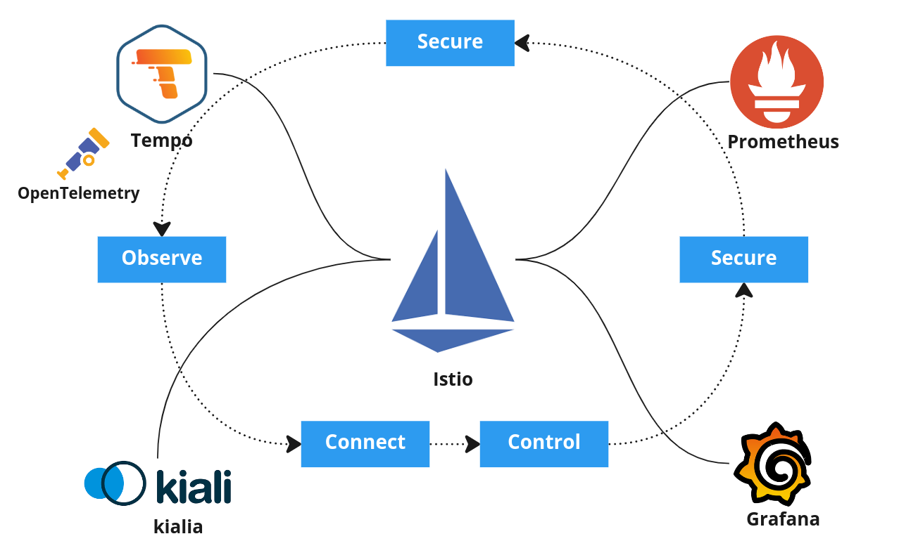
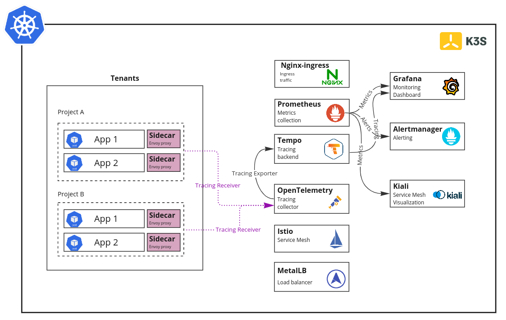
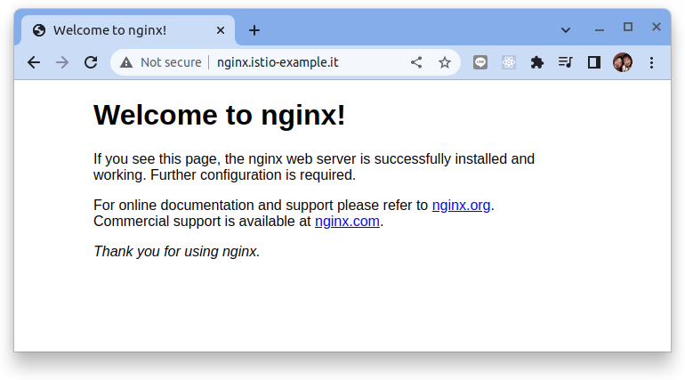
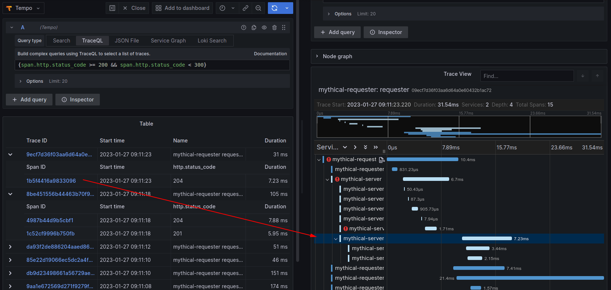
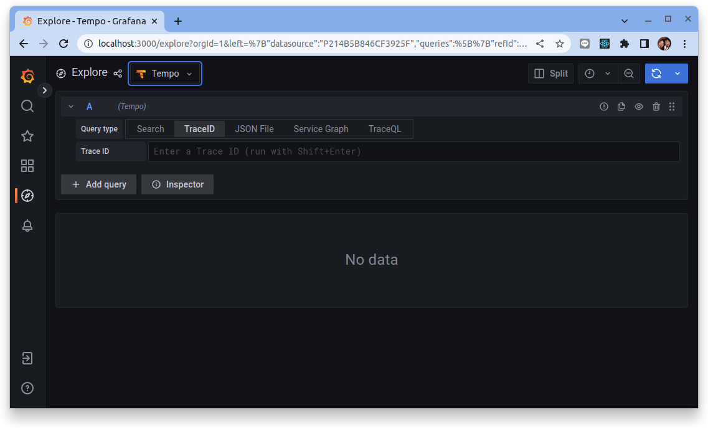
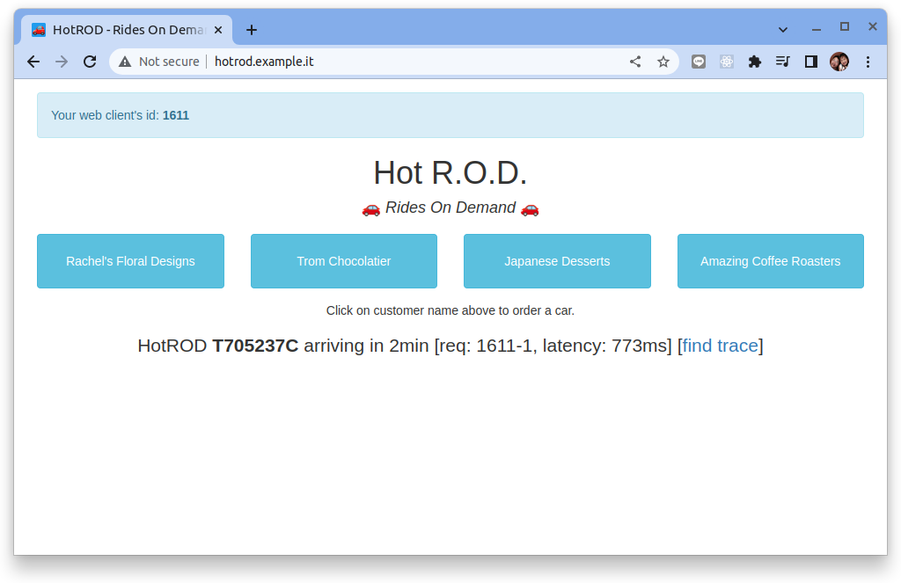
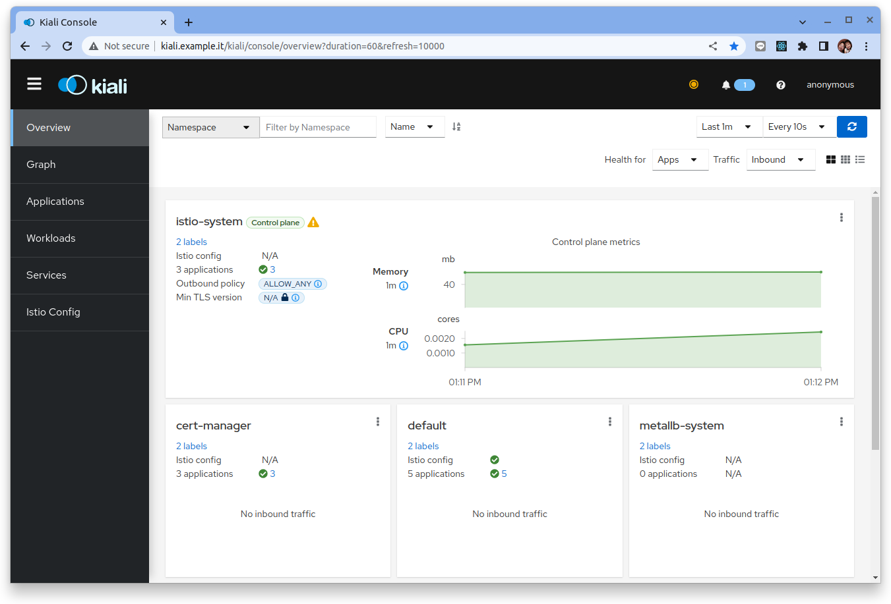
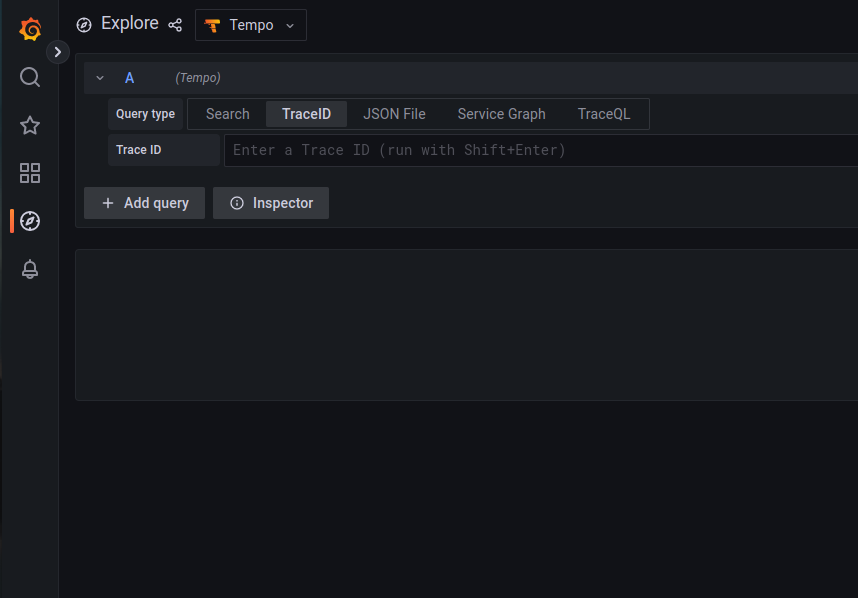
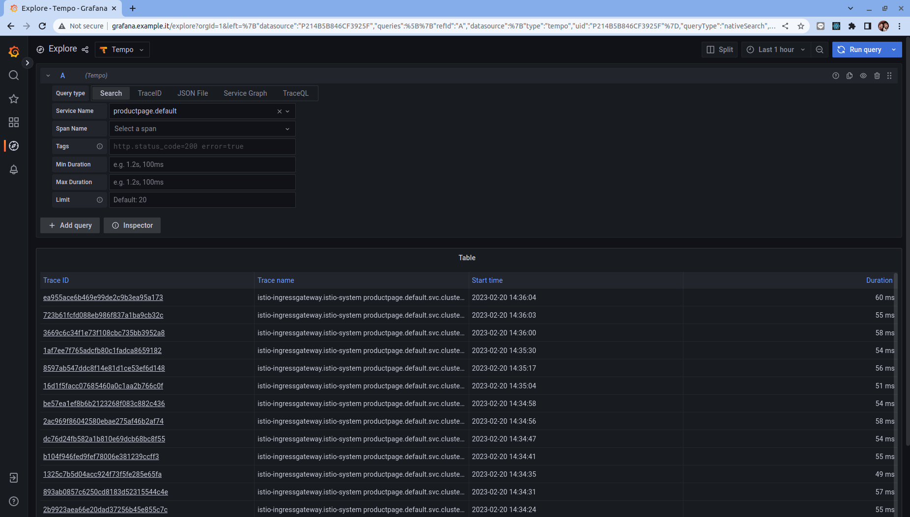
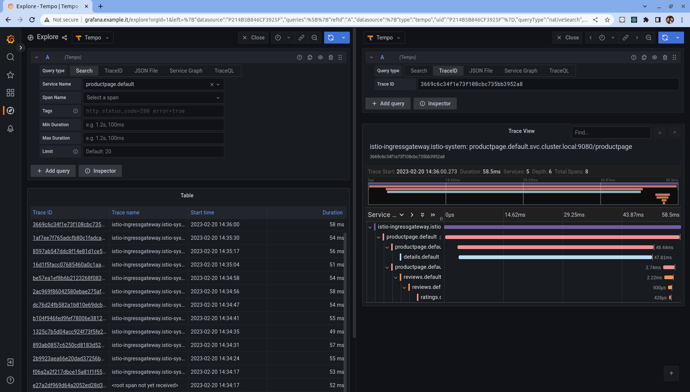

# Istio+OTel+Tempo 大全配 (RKE2/CCoE)



請跟隨本教程一起，使用 Helm 安裝、配置、並深入評估 Istio 網格系統。本教程會安裝下列的元件:

- Ubuntu 20.04 (O.S)
- Docker
- Kubernetes (K3D)
- Metallb
- Nginx Ingress Controller
- Istio
- Kiali
- OpenTelemetry
- Prometheus
- Grafana
- Tempo

同時也會利用不同類型的範例應用來驗證不同元件的功能與彼此的整合，其中會特別值得關注的是:

1. 啟動 Istio tracing 的功能與設定拋轉 envoy 的 tracing 資訊到 Tempo
2. 啟動 OpenTelemetryCollector 並設定基本的 tracing receiver 與 exporter
3. 啟動 Grafana Tempo (v2) 來接收由 OTel Collector 傳送進來的 tracing 資料
4. 設定 Grafana TracingQL 的 UI plugin, 並用來查找 tracing 相關數據

## 步驟 01 - 環境安裝



### 申請兩個在同網段的IP

由於在 Kuberntes 中我們需要兩個 IP 來分別處理 Ingress 與 Istio Gateway 的南北向需求:

1. 10.34.124.114 (Ingress Controller)
2. 10.34.124.115 (Istio Ingress Gateway)

### 安裝 kubernetes

創建 RKE2 設定文件 `/etc/rancher/rke2/config.yaml`:

```bash
sudo mkdir /etc/rancher/rke2 -p

cat <<EOF | sudo tee /etc/rancher/rke2/config.yaml
write-kubeconfig-mode: "0644"
write-kubeconfig: "/root/.kube/config"
cni: "calico"
tls-san:
  - dxlab-dt-01
  - 10.34.124.114
EOF
```

下載並運行 RKE2 的安裝腳本:

```bash
sudo apt install curl -y

curl -sfL https://get.rke2.io --output install.sh

chmod +x install.sh

sudo ./install.sh
```

啟用 `rke2-server` 服務:

```bash
# Enable and activate RKE2 server
sudo systemctl enable rke2-server.service
sudo systemctl start rke2-server.service
```

檢查 `rke2-server` 運行時的狀態。

```bash
sudo systemctl status rke2-server
```

結果:

```
 rke2-server.service - Rancher Kubernetes Engine v2 (server)
     Loaded: loaded (/usr/local/lib/systemd/system/rke2-server.service; enabled; vendor preset: enabled)
     Active: active (running) since Mon 2023-02-20 22:08:46 EST; 56s ago
       Docs: https://github.com/rancher/rke2#readme
    Process: 2730 ExecStartPre=/bin/sh -xc ! /usr/bin/systemctl is-enabled --quiet nm-cloud-setup.service (code=exited, status=0/SUCC>
    Process: 2732 ExecStartPre=/sbin/modprobe br_netfilter (code=exited, status=0/SUCCESS)
    Process: 2736 ExecStartPre=/sbin/modprobe overlay (code=exited, status=0/SUCCESS)
   Main PID: 2737 (rke2)
      Tasks: 133
     Memory: 2.9G
    ...
    ...
```

將包含 Kubernetes 二進製文件的目錄添加到路徑中，然後運行 `kubectl` 命令來檢查服務器的狀態。

```bash
# copy RKE2 kubeconfig file to the default location
mkdir ~/.kube
sudo cp /etc/rancher/rke2/rke2.yaml ~/.kube/config
sudo chown $(id -u):$(id -g) $HOME/.kube/config
chmod 600 ~/.kube/config

# add RKE2 binaries to path
export PATH=$PATH:/var/lib/rancher/rke2/bin
echo "export PATH=$PATH:/var/lib/rancher/rke2/bin" >> ~/.bashrc

export KUBECONFIG=$HOME/.kube/config
echo "export KUBECONFIG=$HOME/.kube/config" | tee -a ~/.bashrc
```

請運行以下命令並檢查節點的狀態是否 Ready：

```bash
kubectl get nodes
```

結果:

```bash
NAME          STATUS   ROLES                       AGE     VERSION
dxlab-dt-01   Ready    control-plane,etcd,master   3m13s   v1.24.10+rke2r1
```

#### 安裝/設定 calicoctl CLI (Option)

從 Calico 的 [github release](https://github.com/projectcalico/calico/releases) 來下載 `calicoctl`。

```bash
wget https://github.com/projectcalico/calico/releases/download/v3.24.5/calicoctl-linux-amd64

mv calicoctl-linux-amd64 calicoctl

chmode +x calicoctl
```

#### 安裝 kubens (option)

從 Kubectx 的 [github release](https://github.com/ahmetb/kubectx/releases) 來下載 `kubens`。

```bash
wget https://github.com/ahmetb/kubectx/releases/download/v0.9.4/kubens_v0.9.4_linux_x86_64.tar.gz

tar -xzvf kubens_v0.9.4_linux_x86_64.tar.gz

sudo mv kubens /usr/local/bin
```

### 安裝/設定 MetalLB

在本次的結構裡, 有兩個負責南北向 traffic 的亓件, 主要原因是 Nginx Ingress Controller 是很多團隊己經使用的 ingress 的元件, 雖說 Istio Ingress Gateway 也可負責對外開放在 Kubernetes 裡頭的服務, 但是對大多數的團隊來說這樣的轉換需要熟悉與過渡。因此在本次的 lab 架構會同時並存這兩個元件並且使用 metallb 來配置固定的 IP。


#### Helm 安裝

首先安裝 Helm 3 的二進製文件。

```bash
sudo apt install git -y

curl -fsSL -o get_helm.sh https://raw.githubusercontent.com/helm/helm/master/scripts/get-helm-3

chmod 700 get_helm.sh

sudo ./get_helm.sh
```

添加 CCoE Helm 存儲庫。

```bash hl_lines="2"
#　setup helm repo
helm repo add ccoe https://harbor.wistron.com/chartrepo/k8sprdwhqcog

helm repo update
```

檢查 CCoE Helm 有什麼 charts:

```bash
helm search repo -l
```

結果:

```
NAME                         	CHART VERSION   	APP VERSION	DESCRIPTION                                       
ccoe/base                    	1.17.1          	1.17.1     	Helm chart for deploying Istio cluster resource...
ccoe/cert-manager            	v1.11.0         	v1.11.0    	A Helm chart for cert-manager                     
ccoe/gateway                 	1.17.1          	1.17.1     	Helm chart for deploying Istio gateways           
ccoe/grafana                 	6.48.0          	9.3.1      	The leading tool for querying and visualizing t...
ccoe/istiod                  	1.17.1          	1.17.1     	Helm chart for istio control plane                
ccoe/kiali-operator          	1.64.0          	v1.64.0    	Kiali is an open source project for service mes...
ccoe/kubernetes-dashboard    	6.0.0           	2.7.0      	General-purpose web UI for Kubernetes clusters    
ccoe/loki                    	2.13.3          	v2.6.1     	Loki: like Prometheus, but for logs.              
ccoe/loki-distributed        	0.67.0          	2.6.1      	Helm chart for Grafana Loki in microservices mode 
ccoe/longhorn                	100.2.0+up1.3.0 	v1.3.0     	Longhorn is a distributed block storage system ...
ccoe/longhorn-crd            	100.2.0+up1.3.0 	           	Installs the CRDs for longhorn.                   
ccoe/metallb                 	0.13.9          	v0.13.9    	A network load-balancer implementation for Kube...
ccoe/metallb                 	0.13.7          	v0.13.7    	A network load-balancer implementation for Kube...
ccoe/opentelemetry-operator  	0.24.0          	0.70.0     	OpenTelemetry Operator Helm chart for Kubernetes  
ccoe/rancher                 	2.6.8           	v2.6.8     	Install Rancher Server to manage Kubernetes clu...
ccoe/rancher-logging         	100.1.2+up3.17.4	3.17.4     	Collects and filter logs using highly configura...
ccoe/rancher-logging-crd     	100.1.2+up3.17.4	           	Installs the CRDs for rancher-logging.            
ccoe/rancher-monitoring      	100.1.3+up19.0.3	0.50.0     	Collects several related Helm charts, Grafana d...
ccoe/rancher-monitoring      	100.1.2+up19.0.3	0.50.0     	Collects several related Helm charts, Grafana d...
ccoe/rancher-monitoring-crd  	100.1.3+up19.0.3	           	Installs the CRDs for rancher-monitoring.         
ccoe/rancher-monitoring-crd  	100.1.2+up19.0.3	           	Installs the CRDs for rancher-monitoring.         
ccoe/secrets-store-csi-driver	1.2.4           	1.2.4      	A Helm chart to install the SecretsStore CSI Dr...
ccoe/tempo                   	1.0.0           	2.0.0      	Grafana Tempo Single Binary Mode                  
ccoe/vault                   	0.22.1          	1.12.0     	Official HashiCorp Vault Chart 
```

!!! info
    為了降低各個 site 拉取外部 helm chart 可能遇到外網的網路存取問題, 在進行 CCoE 的標準安裝之前都會先把相關的 helm chart 上傳至內部的 harbor 之中便於使用。

    Url: https://harbor.wistron.com/harbor/projects/222/helm-charts

使用 Helm 的手法來進行 Ｍetallb 安裝:

```bash
# install metallb to specific namespace
helm upgrade --install --create-namespace --namespace metallb-system \
  metallb ccoe/metallb
```

!!! tips
    Ｍetallb 在[Version 0.13.2](https://metallb.universe.tf/release-notes/#version-0-13-2) 版本有一個很重大的修改:

    - 新功能:　支持CRD！期待已久的功能 MetalLB 現在可通過 CR 進行配置。
    - 行為變化:　最大的變化是引入了 CRD 並刪除了對通過 ConfigMap 進行配置的支持。

#### 設定 IP Adress Pool

我們將使用 MetalLB 的 Layer 2 模式是最簡單的配置：在大多數的情況下，你不需要任何特定於協議的配置，只需要 IP 地址範圍。

Layer 2 模式模式不需要將 IP 綁定到工作程序節點的網絡接口。它通過直接響應本地網絡上的 ARP 請求來工作，將機器的 MAC 地址提供給客戶端。

在本次的環境中申請了兩個IP, 其中 `10.34.124.114` 己經被用在 RKE2 的節點上的 Ingress Controller，因此只需要讓 Metallb 來負責 `10.34.124.115` 的 IP 管理。

1. 10.34.124.114 (Ingress Controller)
2. 10.34.124.115 (Istio Ingress Gateway)

讓我們使用 CRD 來設定 Metallb:

```bash hl_lines="9"
cat <<EOF | kubectl apply -n metallb-system -f -
apiVersion: metallb.io/v1beta1
kind: IPAddressPool
metadata:
  name: ip-pool
  namespace: metallb-system
spec:
  addresses:
  - 10.34.124.115/32
---
apiVersion: metallb.io/v1beta1
kind: L2Advertisement
metadata:
  name: l2advertise
  namespace: metallb-system
spec:
  ipAddressPools:
  - ip-pool
EOF
```

結果:

```bash
ipaddresspool.metallb.io/ip-pool created
l2advertisement.metallb.io/l2advertise created
```

!!! tip
    如果只有一個 IP 要讓 Metallb 來給予，那麼 CIDR 的設定可設成 10.34.124.115/32 (也就是只有一個 IP: `10.34.124.115` 可被指派使用)

### 安裝/設定 Nginx Ingress Controller

由於 RKE2 預設會使用 Nginx Ingress Controller, 因此不需要特別再去安裝。

檢查:

```bash
kubectl get svc -n kube-system
```

結果:

```
NAME                                      TYPE        CLUSTER-IP     EXTERNAL-IP   PORT(S)         AGE
rke2-ingress-nginx-controller-admission   ClusterIP   10.43.122.47   <none>        443/TCP         12m
```

檢查:

```bash
kubectl get pod -n kube-system | grep ingress
```

結果:

```
rke2-ingress-nginx-controller-v4z7h                     1/1     Running     0          14m
```

檢查 RKE2 的 Ingress Controller 佈署:

```bash
kubectl describe daemonset/rke2-ingress-nginx-controller -n kube-system
```

結果:

```yaml hl_lines="81 85"
apiVersion: apps/v1
kind: DaemonSet
metadata:
  annotations:
    deprecated.daemonset.template.generation: "1"
    meta.helm.sh/release-name: rke2-ingress-nginx
    meta.helm.sh/release-namespace: kube-system
  creationTimestamp: "2023-02-21T03:10:06Z"
  generation: 1
  labels:
    app.kubernetes.io/component: controller
    app.kubernetes.io/instance: rke2-ingress-nginx
    app.kubernetes.io/managed-by: Helm
    app.kubernetes.io/name: rke2-ingress-nginx
    app.kubernetes.io/part-of: rke2-ingress-nginx
    app.kubernetes.io/version: 1.2.0
    helm.sh/chart: rke2-ingress-nginx-4.1.008
  name: rke2-ingress-nginx-controller
  namespace: kube-system
  resourceVersion: "1194"
  uid: db7e7b99-be72-4001-9948-94e1c866a2eb
spec:
  revisionHistoryLimit: 10
  selector:
    matchLabels:
      app.kubernetes.io/component: controller
      app.kubernetes.io/instance: rke2-ingress-nginx
      app.kubernetes.io/name: rke2-ingress-nginx
  template:
    metadata:
      creationTimestamp: null
      labels:
        app.kubernetes.io/component: controller
        app.kubernetes.io/instance: rke2-ingress-nginx
        app.kubernetes.io/name: rke2-ingress-nginx
    spec:
      containers:
      - args:
        - /nginx-ingress-controller
        - --election-id=ingress-controller-leader
        - --controller-class=k8s.io/ingress-nginx
        - --ingress-class=nginx
        - --configmap=$(POD_NAMESPACE)/rke2-ingress-nginx-controller
        - --validating-webhook=:8443
        - --validating-webhook-certificate=/usr/local/certificates/cert
        - --validating-webhook-key=/usr/local/certificates/key
        - --watch-ingress-without-class=true
        env:
        - name: POD_NAME
          valueFrom:
            fieldRef:
              apiVersion: v1
              fieldPath: metadata.name
        - name: POD_NAMESPACE
          valueFrom:
            fieldRef:
              apiVersion: v1
              fieldPath: metadata.namespace
        - name: LD_PRELOAD
          value: /usr/local/lib/libmimalloc.so
        image: rancher/nginx-ingress-controller:nginx-1.4.1-hardened2
        imagePullPolicy: IfNotPresent
        lifecycle:
          preStop:
            exec:
              command:
              - /wait-shutdown
        livenessProbe:
          failureThreshold: 5
          httpGet:
            path: /healthz
            port: 10254
            scheme: HTTP
          initialDelaySeconds: 10
          periodSeconds: 10
          successThreshold: 1
          timeoutSeconds: 1
        name: rke2-ingress-nginx-controller
        ports:
        - containerPort: 80
          hostPort: 80
          name: http
          protocol: TCP
        - containerPort: 443
          hostPort: 443
          name: https
          protocol: TCP
        - containerPort: 8443
          name: webhook
          protocol: TCP
        readinessProbe:
          failureThreshold: 3
          httpGet:
            path: /healthz
            port: 10254
            scheme: HTTP
          initialDelaySeconds: 10
          periodSeconds: 10
          successThreshold: 1
          timeoutSeconds: 1
        resources:
          requests:
            cpu: 100m
            memory: 90Mi
        securityContext:
          allowPrivilegeEscalation: true
          capabilities:
            add:
            - NET_BIND_SERVICE
            drop:
            - ALL
          runAsUser: 101
        terminationMessagePath: /dev/termination-log
        terminationMessagePolicy: File
        volumeMounts:
        - mountPath: /usr/local/certificates/
          name: webhook-cert
          readOnly: true
      dnsPolicy: ClusterFirstWithHostNet
      nodeSelector:
        kubernetes.io/os: linux
      restartPolicy: Always
      schedulerName: default-scheduler
      securityContext: {}
      serviceAccount: rke2-ingress-nginx
      serviceAccountName: rke2-ingress-nginx
      terminationGracePeriodSeconds: 300
      volumes:
      - name: webhook-cert
        secret:
          defaultMode: 420
          secretName: rke2-ingress-nginx-admission
  updateStrategy:
    rollingUpdate:
      maxSurge: 0
      maxUnavailable: 1
    type: RollingUpdate

```


!!! tip
    從 Deamonset 的 yaml 中可了解 RKE2 使用了 `hostPort=80` 與 `hostPort=443` 來給予 IngressController 作南北向的 IP。

#### 驗證 Ingress 設定

創建一個 Nginx 的 Deployment 與 Service:

```bash
kubectl create deployment nginx --image=nginx

kubectl create service clusterip nginx --tcp=80:80
```

創建 Ingress 來曝露這個測試的 Nginx 網站:

```bash
kubectl apply -f -<<EOF
apiVersion: networking.k8s.io/v1
kind: Ingress
metadata:
  name: ingress-nginx-svc
spec:
  rules:
  - host: "nginx.dxlab.wistron.com"
    http:
      paths:
      - pathType: Prefix
        path: "/"
        backend:
          service:
            name: nginx
            port:
              number: 80
EOF
```

檢查看這個 ingress 是否有取得 IP ADDRESS:

```bash
kubectl get ing/ingress-nginx-svc
```

結果:

```
NAME                CLASS    HOSTS                     ADDRESS         PORTS   AGE
ingress-nginx-svc   <none>   nginx.dxlab.wistron.com   10.34.124.114   80      33s
```

修改 `/etc/hosts` 來增加一筆 entry 來模擬 DNS 解析:

``` title="/etc/hosts"
...
10.34.124.114  nginx.dxlab.wistron.com
...
```

使用瀏覽器瀏覽 `http://nginx.dxlab.wistron.com`:


### 安裝/設定 Istio 

#### Helm 安裝

1. 安裝 `Istio base chart`，它包含了 Istio 控制平面用到的集群範圍的資源:

    ```bash title="執行下列命令  >_"
    helm upgrade --install --create-namespace --namespace istio-system \
      istio-base ccoe/base
    ```

3. 安裝 Istio discovery chart，它用於部署 istiod 服務:

    設定 `istiod` 要啟動 tracing:

    ```yaml title="istiod-values.yaml"
    meshConfig:
      enableTracing: true
      defaultConfig:
        tracing:
          zipkin:
            address: otel-collector.otel-system.svc.cluster.local:9411
            # address=<jaeger-collector-address>:9411 
    ```


    ```bash title="執行下列命令  >_"
    helm upgrade --install --create-namespace --namespace istio-system \
      istiod ccoe/istiod \
      --values istiod-values.yaml
    ```


4. 安裝 Istio 的入站網關:

    設定 `istio-ingressgateway` 要從 metallb 取得特定的預設 IP:

    ```yaml title="istio-ingressgateway-values.yaml"
    # add annotations to get specific ip from metallb
    service:
      annotations:
        metallb.universe.tf/address-pool: ip-pool
      loadBalancerIP: "10.34.124.115"
    ```

    ```bash title="執行下列命令  >_"
    helm upgrade --install --create-namespace --namespace istio-system \
      istio-ingressgateway ccoe/gateway \
      --values istio-ingressgateway-values.yaml      
    ```

檢查:

```bash
kubectl get svc -n istio-system
```

結果:

```
NAME                   TYPE           CLUSTER-IP    EXTERNAL-IP     PORT(S)                                      AGE
istio-ingressgateway   LoadBalancer   10.43.3.211   10.34.124.115   15021:31845/TCP,80:31816/TCP,443:31308/TCP   39s
istiod                 ClusterIP      10.43.73.33   <none>          15010/TCP,15012/TCP,443/TCP,15014/TCP        109s
```

檢查 Istio 的 tracing 設定:

```bash
kubectl get cm istio -n istio-system -o yaml
```

結果:

```hl_lines="6-8 10"
apiVersion: v1
data:
  mesh: |-
    defaultConfig:
      discoveryAddress: istiod.istio-system.svc:15012
      tracing:
        zipkin:
          address: otel-collector.otel-system.svc.cluster.local:9411
    enablePrometheusMerge: true
    enableTracing: true
    rootNamespace: null
    trustDomain: cluster.local
  meshNetworks: 'networks: {}'
kind: ConfigMap
metadata:
  annotations:
    meta.helm.sh/release-name: istiod
    meta.helm.sh/release-namespace: istio-system
  creationTimestamp: "2023-02-11T02:18:12Z"
  labels:
    app.kubernetes.io/managed-by: Helm
    install.operator.istio.io/owning-resource: unknown
    istio.io/rev: default
    operator.istio.io/component: Pilot
    release: istiod
  name: istio
  namespace: istio-system
  resourceVersion: "30512"
  uid: af45df78-4bda-4a64-bed4-9a5f63f377dc
```

!!! tip
    特別注意 `istio-ingressgateway` 的 EXTERNAL-IP 是否從 metallb 取得 `10.34.124.115`

#### 驗證 Istio IngressGateway

在前面的步驟我們創建一個 Nginx 的 Deployment 與 Service 來驗證 Nginx Ingress Controller，接著我們使用 Istio IngressGateway 來進行服務的曝露。

??? info

    ```bash
    kubectl create deployment nginx --image=nginx

    kubectl create service clusterip nginx --tcp=80:80
    ```

創建 Istio 的 `Gateway` 與 `VirtualService` 來曝露這個測試的 Nginx 網站:

```yaml
kubectl apply -f -<<EOF
apiVersion: networking.istio.io/v1alpha3
kind: Gateway
metadata:
  name: gateway-nginx-svc
spec:
  selector:
    istio: ingressgateway # use the default IngressGateway
  servers:
  - port:
      number: 80
      name: http
      protocol: HTTP
    hosts:
    - "nginx.istio-dxlab.wistron.com"
---
apiVersion: networking.istio.io/v1alpha3
kind: VirtualService
metadata:
  name: virtualservice-nginx-svc
spec:
  hosts:
  - "nginx.istio-dxlab.wistron.com"
  gateways:
  - gateway-nginx-svc
  http:
  - route:
    - destination:
        host: nginx.default.svc.cluster.local # {service_name}.{namespace}.svc.cluster.local
        port:
          number: 80
EOF
```

檢查看這個 gateway

```bash
kubectl get gateway
```

結果:

```
NAME                AGE
gateway-nginx-svc   2m23s
```

檢查看這個 virtualservice:

```bash
kubectl get virtualservice
```

結果:

```
NAME                       GATEWAYS                HOSTS                               AGE
virtualservice-nginx-svc   ["gateway-nginx-svc"]   ["nginx.istio-dxlab.wistron.com"]   9s
```

修改 `/etc/hosts` 來增加一筆 entry 來模擬 DNS 解析:

``` title="/etc/hosts"
...
10.34.124.115  nginx.istio-dxlab.wistron.com
...
```

使用瀏覽器瀏覽 `http://nginx.istio-dxlab.wistron.com`:




### 安裝/設定 Grafana Tempo

將 Tempo (v2) 安裝到 `cattle-monitoring-system` 命名空間中：

```bash
helm upgrade --install \
     --create-namespace --namespace cattle-monitoring-system \
     tempo ccoe/tempo
```

??? info "Tempo v2 Helm 設定參考"

    設定值說明請見:[Grafana Temp Github](https://github.com/grafana/helm-charts/tree/main/charts/tempo#values)

    ```yaml
    # -- Overrides the chart's name
    nameOverride: ""

    # -- Overrides the chart's computed fullname
    fullnameOverride: ""

    # -- Define the amount of instances
    replicas: 1

    # -- Annotations for the StatefulSet
    annotations: {}

    tempo:
      repository: grafana/tempo
      tag: 2.0.0
      pullPolicy: IfNotPresent
      ## Optionally specify an array of imagePullSecrets.
      ## Secrets must be manually created in the namespace.
      ## ref: https://kubernetes.io/docs/tasks/configure-pod-container/pull-image-private-registry/
      ##
      # pullSecrets:
      #   - myRegistryKeySecretName

      updateStrategy: RollingUpdate
      resources: {}
      #  requests:
      #    cpu: 1000m
      #    memory: 4Gi
      #  limits:
      #    cpu: 2000m
      #    memory: 6Gi

      memBallastSizeMbs: 1024
      multitenancyEnabled: false
      # -- If true, Tempo will report anonymous usage data about the shape of a deployment to Grafana Labs
      reportingEnabled: true
      metricsGenerator:
        # -- If true, enables Tempo's metrics generator (https://grafana.com/docs/tempo/next/metrics-generator/)
        enabled: false
        remoteWriteUrl: "http://prometheus.monitoring:9090/api/v1/write"
      # -- Configuration options for the ingester
      ingester: {}
      # -- Configuration options for the querier
      querier: {}
      # -- Configuration options for the query-fronted
      queryFrontend: {}
      retention: 24h
      # Global overrides
      global_overrides:
        per_tenant_override_config: /conf/overrides.yaml
      overrides: {}

      # Tempo server configuration
      # Refers to https://grafana.com/docs/tempo/latest/configuration/#server
      server:
        # -- HTTP server listen port
        http_listen_port: 3100
      storage:
        trace:
          # tempo storage backend
          # refer https://github.com/grafana/tempo/tree/master/docs/tempo/website/configuration
          ## Use s3 for example
          # backend: s3
          # store traces in s3
          # s3:
          #   bucket: tempo                                   # store traces in this bucket
          #   endpoint: s3.dualstack.us-east-2.amazonaws.com  # api endpoint
          #   access_key: ...                                 # optional. access key when using static credentials.
          #   secret_key: ...                                 # optional. secret key when using static credentials.
          #   insecure: false                                 # optional. enable if endpoint is http
          backend: local
          local:
            path: /var/tempo/traces
          wal:
            path: /var/tempo/wal
      # this configuration will listen on all ports and protocols that tempo is capable of.
      # the receives all come from the OpenTelemetry collector.  more configuration information can
      # be found there: https://github.com/open-telemetry/opentelemetry-collector/tree/master/receiver
      receivers:
        jaeger:
          protocols:
            grpc:
              endpoint: 0.0.0.0:14250
            thrift_binary:
              endpoint: 0.0.0.0:6832
            thrift_compact:
              endpoint: 0.0.0.0:6831
            thrift_http:
              endpoint: 0.0.0.0:14268
        opencensus:
        otlp:
          protocols:
            grpc:
              endpoint: "0.0.0.0:4317"
            http:
              endpoint: "0.0.0.0:4318"
      securityContext: {}
        # allowPrivilegeEscalation: false
        #  capabilities:
        #    drop:
        #    - ALL
        # readOnlyRootFilesystem: true
      ## Additional container arguments
      extraArgs: {}
      # -- Environment variables to add
      extraEnv: []
      # -- Environment variables from secrets or configmaps to add to the ingester pods
      extraEnvFrom: []
      # -- Volume mounts to add
      extraVolumeMounts: []
      # - name: extra-volume
      #   mountPath: /mnt/volume
      #   readOnly: true
      #   existingClaim: volume-claim

    # -- Tempo configuration file contents
    # @default -- Dynamically generated tempo configmap
    config: |
        multitenancy_enabled: {{ .Values.tempo.multitenancyEnabled }}
        usage_report:
          reporting_enabled: {{ .Values.tempo.reportingEnabled }}
        compactor:
          compaction:
            block_retention: {{ .Values.tempo.retention }}
        distributor:
          receivers:
            {{- toYaml .Values.tempo.receivers | nindent 8 }}
        ingester:
          {{- toYaml .Values.tempo.ingester | nindent 6 }}
        server:
          {{- toYaml .Values.tempo.server | nindent 6 }}
        storage:
          {{- toYaml .Values.tempo.storage | nindent 6 }}
        querier:
          {{- toYaml .Values.tempo.querier | nindent 6 }}
        query_frontend:
          {{- toYaml .Values.tempo.queryFrontend | nindent 6 }}
        overrides:
          {{- toYaml .Values.tempo.global_overrides | nindent 6 }}
          {{- if .Values.tempo.metricsGenerator.enabled }}
              metrics_generator_processors:
              - 'service-graphs'
              - 'span-metrics'
        metrics_generator:
              storage:
                path: "/tmp/tempo"
                remote_write:
                  - url: {{ .Values.tempo.metricsGenerator.remoteWriteUrl }}
          {{- end }}
    tempoQuery:
      repository: grafana/tempo-query
      tag: 2.0.0
      pullPolicy: IfNotPresent
      ## Optionally specify an array of imagePullSecrets.
      ## Secrets must be manually created in the namespace.
      ## ref: https://kubernetes.io/docs/tasks/configure-pod-container/pull-image-private-registry/
      ##
      # pullSecrets:
      #   - myRegistryKeySecretName

      # -- if False the tempo-query container is not deployed
      enabled: true

      resources: {}
      #  requests:
      #    cpu: 1000m
      #    memory: 4Gi
      #  limits:
      #    cpu: 2000m
      #    memory: 6Gi

      ## Additional container arguments
      extraArgs: {}
      # -- Environment variables to add
      extraEnv: []
      # -- Volume mounts to add
      extraVolumeMounts: []
      # - name: extra-volume
      #   mountPath: /mnt/volume
      #   readOnly: true
      #   existingClaim: volume-claim
      securityContext: {}
        # allowPrivilegeEscalation: false
        #  capabilities:
        #    drop:
        #    - ALL
        # readOnlyRootFilesystem: false # fails if true, do not enable

    # -- securityContext for container
    securityContext: {}
      # runAsUser: 65532
      # runAsGroup: 65532
      # fsGroup: 65532
      # runAsNonRoot: true

    serviceAccount:
      # -- Specifies whether a ServiceAccount should be created
      create: true
      # -- The name of the ServiceAccount to use.
      # If not set and create is true, a name is generated using the fullname template
      name: null
      # -- Image pull secrets for the service account
      imagePullSecrets: []
      # -- Annotations for the service account
      annotations: {}
      # -- Labels for the service account
      labels: {}
      automountServiceAccountToken: true

    service:
      type: ClusterIP
      annotations: {}80      3m53s
      enabled: false
      interval: ""
      additionalLabels: {}
      annotations: {}
      # scrapeTimeout: 10s

    persistence:
      enabled: false
      # storageClassName: local-path
      accessModes:
        - ReadWriteOnce
      size: 10Gi

    # -- Pod Annotations
    podAnnotations: {}

    # -- Pod (extra) Labels
    podLabels: {}

    # -- Volumes to add
    extraVolumes: []

    # -- Node labels for pod assignment. See: https://kubernetes.io/docs/user-guide/node-selection/
    nodeSelector: {}

    # -- Tolerations for pod assignment. See: https://kubernetes.io/docs/concepts/configuration/taint-and-toleration/
    tolerations: []

    # -- Affinity for pod assignment. See: https://kubernetes.io/docs/concepts/configuration/assign-pod-node/#affinity-and-anti-affinity
    affinity: {}

    # -- The name of the PriorityClass
    priorityClassName: null
    ```

安裝之後檢查:

```bash
kubectl get all -n cattle-monitoring-system
```

結果:

```
NAME          READY   STATUS    RESTARTS   AGE
pod/tempo-0   2/2     Running   0          2m36s

NAME            TYPE        CLUSTER-IP    EXTERNAL-IP   PORT(S)                                                                                                                       AGE
service/tempo   ClusterIP   10.43.52.38   <none>        3100/TCP,16687/TCP,16686/TCP,6831/UDP,6832/UDP,14268/TCP,14250/TCP,9411/TCP,55680/TCP,55681/TCP,4317/TCP,4318/TCP,55678/TCP   2m36s

NAME                     READY   AGE
statefulset.apps/tempo   1/1     2m36s
```

Grafana Tempo 支持許多不同 protocol 來接收 tracing 的資料:

|Port|Description|
|----|-----------|
|4317/TCP|Default endpoint for OpenTelemetry gRPC receiver.<br/>OpenTelemetry gRPC 接收協議的默認端點。|
|4318/TCP|Default endpoint for OpenTelemetry HTTP receiver.<br/>OpenTelemetry HTTP 接收器的默認端點。|
|6831/UDP|Default endpoint for Jaeger (thrift compact) receiver.<br/>Jaeger (thrift compact) 接收器的默認端點。|
|6832/UDP|Default endpoint for Jaeger (thrift binary) receiver.<br/>Jaeger（thrift 二進制）接收器的默認端點。|
|9411/TCP|Default endpoint for Zipkin receiver.<br/>Zipkin 接收器的默認端點。|
|14250/TCP|Default endpoint for Jaeger gRPC receiver.<br/>Jaeger gRPC 接收器的默認端點。|
|14268/TCP|Default endpoint for Jaeger (thrift) HTTP receiver.<br/>Jaeger (thrift) HTTP 接收器的默認端點。|
|16686/TCP|Default endpoint for Jaeger UUI query.<br/>Jaeger UUI 查詢的默認端點。|
|55678/TCP|Default endpoint for Opencensus receiver.<br/>Opencensus 接收器的默認端點。|
|55680/TCP|efault endpoint for legacy OpenTelemetry gRPC receiver.<br/>舊版 OpenTelemetry gRPC 接收器的默認端點。|
|55681/TCP|efault endpoint for legacy OpenTelemetry HTTP receiver.<br/>舊版 OpenTelemetry HTTP 接收器。的默認端點|

### kube-prometheus-stack

本教程使用 `kube-prometheus-stack` 來構建可觀測性的相關元件, 詳細說明請參additionalDataSources

- [Prometheus 簡介](../../../../prometheus/prometheus/overview.md)
- [Prometheus Operator 簡介](../../../../prometheus/prometheus/overview.md)

添加 Prometheus-Community helm 存儲庫並更新本地緩存：

```bash
helm repo add prometheus-community https://prometheus-community.github.io/helm-charts

helm repo update 
```

**Grafana TraceQL query editor:**

借助 Tempo 2.0，您可以使用 Tempo 數據源中的 `TraceQL` viewer 和查詢編輯器來構建查詢並向下鑽取結果集。該編輯器在 Grafana 的 Explore 界面中可取得使用。



!!! tip
    要使用 TraceQL 查詢編輯器，您需要啟用 `traceqlEditor` 功能旗標。此功能從 Grafana **9.3.2** 開始支持。預計從 Grafana 9.4.0 之後 `traceqlEditor` 就不需要特別設定開啟。

創建要配置的 prometheus stack 的設定檔案(使用任何文字編輯器來創建):

```yaml title="kube-stack-prometheus-values.yaml" hl_lines="8 12-16 26-27"
grafana:
  ingress:
    enabled: true
    hosts:
      - grafana.dxlab.wistron.com
  # specify tag to ensure grafana version
  image:
    repository: grafana/grafana
    tag: "9.3.6"
  # change timezone setting base on browser
  defaultDashboardsTimezone: browser
  # create tempo datasource for tracing data store
  additionalDataSources:
    - name: Tempo
      type: tempo
      url: http://tempo.cattle-monitoring-system:3100
      access: proxy
  grafana.ini:
    users:
      viewers_can_edit: true
    auth:
      disable_login_form: false
      disable_signout_menu: false
    auth.anonymous:
      enabled: true
      org_role: Viewer
    feature_toggles:
      enable: traceqlEditor
  sidecar:
    datasources:
      logLevel: "DEBUG"
      enabled: true
      searchNamespace: "ALL"
    dashboards:
      logLevel: "DEBUG"
      # enable the cluster wide search for dashbaords and adds/updates/deletes them in grafana
      enabled: true
      searchNamespace: "ALL"
      label: grafana_dashboard
      labelValue: "1"

prometheus:
  ingress:
    enabled: true
    hosts:
      - prometheus.dxlab.wistron.com

  prometheusSpec:
    # enable the cluster wide search for ServiceMonitor CRD
    serviceMonitorSelectorNilUsesHelmValues: false
    # enable the cluster wide search for PodMonitor CRD
    podMonitorSelectorNilUsesHelmValues: false
    # enable the cluster wide search for PrometheusRule CRD
    ruleSelectorNilUsesHelmValues: false
    probeSelectorNilUsesHelmValues: false
```

- `feature_toggles.enable: traceqlEditor` 在 Grafana 啟用 TraceQL 查詢編輯器

!!! info
    在設定 `kube-stack-prometheus` 的設定中定義了 Tempo 在 grafana 中的 Data Source 的設定:
    
    ```yaml
    grafana:
      # change timezone setting base on browser
      defaultDashboardsTimezone: browser
      additionalDataSources:
        - name: Tempo
          type: tempo
          url: http://tempo.cattle-monitoring-system:3100
          access: proxy    
    ...
    ...
    ```

使用 Helm 在命名空間監控中部署 `kube-stack-prometheus` chart:

先安裝相關的 CRD:

```bash
helm upgrade --install \
  --create-namespace --namespace cattle-monitoring-system \
  rancher-monitoring-crd ccoe/rancher-monitoring-crd
```

再安排元件:

```bash
helm upgrade --install \
  --create-namespace --namespace cattle-monitoring-system \
  rancher-monitoring ccoe/rancher-monitoring \
  --values kube-stack-prometheus-values.yaml
```

檢查看這個所創建的 ingress 是否有取得 IP ADDRESS:

```bash
kubectl get ing -n cattle-monitoring-system
```

結果:

```
NAME                                    CLASS    HOSTS                          ADDRESS         PORTS   AGE
kube-stack-prometheus-grafana           <none>   grafana.dxlab.wistron.com      10.34.124.114   80      75s
kube-stack-prometheus-kube-prometheus   <none>   prometheus.dxlab.wistron.com   10.34.124.114   80      75s
```

由於對 Grafana 與 Prometheus 啟動了 ingress, 修改 `/etc/hosts` 來增加兩筆 entry 來模擬 DNS 解析:

``` title="/etc/hosts"
...
10.34.124.114  grafana.dxlab.wistron.com
10.34.124.114 prometheus.dxlab.wistron.com
...
```

#### 整合 Istio 與 Prometheus

要讓 prometheus 能夠監控到每一個經由 istio 注入到 pod 裡的 sidecar(envoy), 我們需要使用 `PodMonitor` 來讓 Prometheus Operator 來作動:

```yaml
apiVersion: monitoring.coreos.com/v1
kind: PodMonitor
metadata:
  name: envoy-stats-monitor
  namespace: istio-system
  labels:
    monitoring: istio-proxies
    release: istio
spec:
  selector:
    matchExpressions:
    - {key: istio-prometheus-ignore, operator: DoesNotExist}
  namespaceSelector:
    any: true
  jobLabel: envoy-stats
  podMetricsEndpoints:
  - path: /stats/prometheus
    interval: 15s
    relabelings:
    - action: keep
      sourceLabels: [__meta_kubernetes_pod_container_name]
      regex: "istio-proxy"
    - action: keep
      sourceLabels: [__meta_kubernetes_pod_annotationpresent_prometheus_io_scrape]
    - sourceLabels: [__address__, __meta_kubernetes_pod_annotation_prometheus_io_port]
      action: replace
      regex: ([^:]+)(?::\d+)?;(\d+)
      replacement: $1:$2
      targetLabel: __address__
    - action: labeldrop
      regex: "__meta_kubernetes_pod_label_(.+)"
    - sourceLabels: [__meta_kubernetes_namespace]
      action: replace
      targetLabel: namespace
    - sourceLabels: [__meta_kubernetes_pod_name]
      action: replace
      targetLabel: pod_name
```

另外我們也需要監控 istio 的核心組件:

```yaml
apiVersion: monitoring.coreos.com/v1
kind: ServiceMonitor
metadata:
  name: istio-component-monitor
  namespace: istio-system
  labels:
    monitoring: istio-components
    release: istio
spec:
  jobLabel: istio
  targetLabels: [app]
  selector:
    matchExpressions:
    - {key: istio, operator: In, values: [pilot]}
  namespaceSelector:
    any: true
  endpoints:
  - port: http-monitoring
    interval: 15s
```

執行下列命令來啟動 Prometheus 的監控設定:

```bash title="執行下列命令  >_"
kubectl apply -f https://raw.githubusercontent.com/istio/istio/release-1.16/samples/addons/extras/prometheus-operator.yaml
```

#### 整合 Istio 與 Grafana

接著讓我們來在 Grafana 中創建 Istio 相關的 dashboard。

下載 Istio dashboard:

- [istio-grafana-dashboards.yaml](./assets/istio-grafana-dashboards.yaml)

執行下列命令來啟動 Prometheus 的監控設定:

```bash title="執行下列命令  >_"
kubectl apply -f istio-grafana-dashboards.yaml
```

結果:

```bash
configmap/istio-grafana-dashboards created
configmap/istio-services-grafana-dashboards created
```

到這個階段我們的 Prometheus 和 Grafana 監控堆棧與 Istio 的整合已經準備就緒！


#### 連接到 Prometheus Web 界面

在 Prometheus 的設定裡啟動了 ingress 的設定, 而且也在本機的 `/etc/hosts` 檔案裡增加了 `prometheus.dxlab.wistron.com` 對 Ingress Controller 掌控的 IP: `10.34.124.114` 的映射。因此可直接使用瀏覽器到下列的網址:

- `http://prometheus.dxlab.wistron.com`

或是使用端口轉發來訪問：

```bash title="執行下列命令  >_"
kubectl port-forward --namespace monitoring svc/kube-stack-prometheus-kube-prometheus 9090:9090 --address="0.0.0.0"
```

#### 連接到 Grafana

在 Grafana 的設定裡啟動了 ingress 的設定, 而且也在本機的 `/etc/hosts` 檔案裡增加了 `grafana.dxlab.wistron.com` 對 Ingress Controller 掌控的 IP: `10.34.124.114` 的映射。因此可直接使用瀏覽器到下列的網址:

- `http://grafana.dxlab.wistron.com`

或是使用端口轉發來訪問:

```bash
kubectl port-forward --namespace monitoring \
  svc/kube-stack-prometheus-grafana 3000:80 \
  --address="0.0.0.0"
```

打開瀏覽器並轉到並填寫前一個命令所取得的用戶名/密碼。預設的帳號是:

- `username`: admin
- `password`: prom-operator


點選左側的導引欄上的 Explore 圖示後，在資料源下拉選單中點選 `Tempo`:



如果在 Grafana 的 Explorer 介面上有看到 `TraceQL` 的頁籤的話代表設定正確。

### Opentelemetry Collector

安裝 Cert-Manager:

```bash
helm upgrade --install --create-namespace --namespace cert-manager \
  cert-manager ccoe/cert-manager \
  --set installCRDs=true
```

將 Opentelemetry operator 安裝起來：

```bash
helm upgrade --install --create-namespace --namespace otel-system  \
  opentelemetry-operator ccoe/opentelemetry-operator
```

宣告創建一個 Otel Collector:

將 Opentelemetry operator 安裝起來：

```bash hl_lines="14-19"
kubectl apply -n otel-system -f -<<EOF
apiVersion: opentelemetry.io/v1alpha1
kind: OpenTelemetryCollector
metadata:
  name: otel
spec:
  mode: deployment # This configuration is omittable.
  config: |
    receivers:
      otlp:
        protocols:
          grpc: # endpoint = 0.0.0.0:4317 (default)
          http: # endpoint = 0.0.0.0:4318 (default)
      jaeger:
        protocols:
          grpc:
          thrift_binary:
          thrift_compact:
          thrift_http:
      zipkin:
      opencensus:
        endpoint: 0.0.0.0:55678

    processors:
      batch:

    exporters:
      otlp:
        # otlp grpc protocol
        endpoint: "tempo.cattle-monitoring-system:4317"
        tls:
          insecure: true
      logging:
        loglevel: debug

    service:
      pipelines:
        traces:
          receivers: [otlp, jaeger, zipkin]
          processors: []
          exporters: [otlp]
EOF
```

#### 驗證

`HotROD` 是一個演示用的應用程序，由多個微服務組成，並說明了 OpenTracing API 的使用。它可以獨立運行，但需要 Jaeger protocol compliant 的後端才能查看鏈路追踪的結果。

執行下列命令來佈署 `Hot R.O.D` 應用:

創建 Deployment manifest:

```bash title="Deployment" hl_lines="24-26"
kubectl apply -f -<<EOF
apiVersion: apps/v1
kind: Deployment
metadata:
  labels:
    app: example-hotrod
  name: example-hotrod
spec:
  replicas: 1
  selector:
    matchLabels:
      app: example-hotrod
  strategy: {}
  template:
    metadata:
      labels:
        app: example-hotrod
    spec:
      containers:
      - image: jaegertracing/example-hotrod:latest
        name: example-hotrod
        args: ["all"]
        env:
          - name: OTEL_EXPORTER_JAEGER_ENDPOINT
            # endpoint for tracing data collector
            value: http://otel-collector.otel-system.svc:14268/api/traces
        ports:
          - containerPort: 8080
            name: frontend
          - containerPort: 8081
            name: customer
          - containerPort: 8083
            name: route
        resources:
          limits:
            cpu: 100m
            memory: 100M
          requests:
            cpu: 100m
            memory: 100M
EOF
```

創建 Service manifest:

```bash title="Service"
kubectl apply -f -<<EOF
apiVersion: v1
kind: Service
metadata:
  name: example-hotrod
spec:
  selector:
    app: example-hotrod
  ports:
    - name: frontend
      protocol: TCP
      port: 8080
      targetPort: frontend
EOF
```

創建 Ingress 來曝露這個測試的 HotROD:

```bash
kubectl apply -f -<<EOF
apiVersion: networking.k8s.io/v1
kind: Ingress
metadata:
  name: ingress-example-hotrod
spec:
  rules:
  - host: "hotrod.dxlab.wistron.com"
    http:
      paths:
      - pathType: Prefix
        path: "/"
        backend:
          service:
            name: example-hotrod
            port:
              number: 8080
EOF
```

檢查看這個 ingress 是否有取得 IP ADDRESS:

```bash
kubectl get ing/ingress-example-hotrod
```

結果:

```
NAME                     CLASS   HOSTS                      ADDRESS        PORTS   AGE
ingress-example-hotrod   nginx   hotrod.dxlab.wistron.com   10.34.124.114  80      22s
```

修改 `/etc/hosts` 來增加一筆 entry 來模擬 DNS 解析:

```bash
sudo nano /etc/hosts
```

修改內容:

``` title="/etc/hosts"
...
10.34.124.114 hotrod.dxlab.wistron.com
...
```

使用瀏覽器瀏覽 `http://hotrod.dxlab.wistron.com`:



### 安裝 Kiali

通過運行以下命令安裝最新的 Kiali Operator：

```bash title="執行下列命令  >_"
helm upgrade --install \
  --create-namespace \
  --namespace cattle-monitoring-system \
  kiali-operator ccoe/kiali-operator
```

#### 創建和更新 Kiali CR

Kiali Operator 監視 Kiali 自定義資源 (Kiali CR)，這是一個包含部署配置的 YAML 文件。創建、更新或刪除 Kiali CR 將觸發 Kiali Operator 安裝、更新或刪除 Kiali。

構建一個 Kiali CR 來創建一個 Kiala 的實例:

```yaml title="kiali-cr.yaml"
apiVersion: kiali.io/v1alpha1
kind: Kiali
metadata:
  name: kiali
spec:
  istio_namespace: "istio-system"
  auth:
    strategy: anonymous
  deployment:
    view_only_mode: true
    ingress:
      class_name: "nginx"
      # default: enabled is undefined
      enabled: true
      # default: override_yaml is undefined
      override_yaml:
        spec:
          rules:
          - host: "kiali.dxlab.wistron.com"
            http:
              paths:
              - path: "/kiali"
                pathType: Prefix
                backend:
                  service:
                    name: "kiali"
                    port:
                      number: 20001
  external_services:
    custom_dashboards:
      enabled: false
    prometheus:
      # Prometheus service name is "metrics" and is in the "telemetry" namespace
      url: "http://rancher-monitoring-prometheus.cattle-monitoring-system:9090/"
    grfana:
      enabled: false
    istio:
      component_status:
        components:
        - app_label: "istiod"
          is_core: true
          is_proxy: false
          namespace: istio-system
        enabled: true
    tracing:
      enabled: false
```

!!! tip
    建議以 {==唯讀模式==} 使用 kiali。儘管 kialia 允許修改 Istio 的一些資源狀態，但最好使用具有修訂歷史記錄的託管 CI/CD 管道來執行此操作(GitOps)，以便能夠在需要時比較或恢復更改。

假設您將之前的 YAML 保存到名為 `my-kiali-cr.yaml` 的文件中，並且您將 Kiali 安裝在與 Istio 相同的默認命名空間中，請使用以下命令創建資源：

```bash title="執行下列命令  >_"
kubectl apply -f kiali-cr.yaml -n istio-system
```

#### 連接到 Kiali

修改 `/etc/hosts` 來增加一筆 entry 來模擬 DNS 解析:

```bash
sudo nano /etc/hosts
```

修改內容:

``` title="/etc/hosts"
...
10.34.124.114 kiali.dxlab.wistron.com
...
```

在 `kiali-cr.yaml` 的設定裡啟動了 ingress 的設定, 而且也在本機的 `/etc/hosts` 檔案裡增加了 `kiali.dxlab.wistron.com` 對 Ingress Controller 掌控的 IP: `10.34.124.114` 的映射。因此可直接使用瀏覽器到下列的網址:

- `http://kiali.dxlab.wistron.com/kiali`

或是使用端口轉發來訪問：

Kiali Web UI 可通過以下命令通過端口轉發訪問：

```bash title="執行下列命令  >_"
kubectl port-forward svc/kiali 20001:20001 -n istio-system --address="0.0.0.0"
```



## 步驟 02 - Istio 功能驗證

### 部署範例應用程序

{==添加命名空間標籤以指示 Istio 在您稍後部署應用程序時自動注入 Envoy sidecar 代理:==}

```bash title="執行下列命令  >_"
kubectl label namespace default istio-injection=enabled
```

**Bookinfo 應用:**

Bookinfo 示例部署了一個用於演示多種 Istio 特性的應用，該應用由四個單獨的微服務構成。

這個應用模仿在線書店的一個分類，顯示一本書的信息。頁面上會顯示一本書的描述，書籍的細節（ISBN、頁數等），以及關於這本書的一些評論。

Bookinfo 應用分為四個單獨的微服務：Bookinfo 應用

reviews 微服務有 3 個版本：

- v1 版本不會調用 `ratings` 服務。
- v2 版本會調用 `ratings` 服務，並使用 1 到 5 個黑色星形圖標來顯示評分信息。
- v3 版本會調用 `ratings` 服務，並使用 1 到 5 個紅色星形圖標來顯示評分信息。

下圖展示了這個應用的端到端架構。

<figure markdown>
  
  <figcaption>沒有使用 Istio 的 Bookinfo</figcaption>
</figure>

Bookinfo 應用中的幾個微服務是由不同的語言編寫的。這些服務對 Istio 並無依賴，但是構成了一個有代表性的服務網格的例子：

- 它由多個服務
- 多個語言構成
- 並且 reviews 服務具有多個版本

### 部署 Bookinfo 應用

要在 Istio 中運行這一應用，無需對應用自身做出任何改變。您只要簡單的在 Istio 環境中對服務進行配置和運行，具體一點說就是把 Envoy sidecar 注入到每個服務之中。最終的部署結果將如下圖所示：

<figure markdown>
  
  <figcaption>使用了 Istio 的 Bookinfo</figcaption>
</figure>

所有的微服務都和 Envoy sidecar 集成在一起，被集成服務所有的出入流量都被 sidecar 所劫持，這樣就為外部控制準備了所需的 Hook，然後就可以利用 Istio 控制平面為應用提供服務路由、遙測數據收集以及策略實施等功能。

下載 istio 範例:

```bash title="執行下列命令  >_"
curl -L https://istio.io/downloadIstio | sh -
```

!!! info
    在執行下載 istio 範例之後要去檢查正載下來的 istio 版本, 它會在本地目錄上產生一個目錄: `istio-1.XX.XX`

接著切換至 `istio-1.17.1` 的目錄:

```bash title="執行下列命令  >_"
cd istio-1.17.1
```

1. 部署 Bookinfo 示例應用程序:

    ```bash title="執行下列命令  >_"
    kubectl apply -f samples/bookinfo/platform/kube/bookinfo.yaml
    ```

    結果:

    ```bash
    service/details created
    serviceaccount/bookinfo-details created
    deployment.apps/details-v1 created
    service/ratings created
    serviceaccount/bookinfo-ratings created
    deployment.apps/ratings-v1 created
    service/reviews created
    serviceaccount/bookinfo-reviews created
    deployment.apps/reviews-v1 created
    deployment.apps/reviews-v2 created
    deployment.apps/reviews-v3 created
    service/productpage created
    serviceaccount/bookinfo-productpage created
    deployment.apps/productpage-v1 created
    ```

2. 應用程序將啟動。隨著每個 pod 準備就緒，Istio sidecar 將隨之部署。

    ```bash title="執行下列命令  >_"
    kubectl get services
    ```

    結果:

    ```bash title="執行下列命令  >_"
    NAME          TYPE        CLUSTER-IP      EXTERNAL-IP   PORT(S)    AGE
    kubernetes    ClusterIP   10.43.0.1       <none>        443/TCP    90m
    details       ClusterIP   10.43.130.114   <none>        9080/TCP   92s
    ratings       ClusterIP   10.43.13.141    <none>        9080/TCP   92s
    reviews       ClusterIP   10.43.110.102   <none>        9080/TCP   92s
    productpage   ClusterIP   10.43.243.227   <none>        9080/TCP   92s
    ```

    接著看一下 Pod 的佈署：

    ```bash title="執行下列命令  >_"
    kubectl get pods
    ```

    結果:

    ```bash
    NAME                              READY   STATUS    RESTARTS   AGE
    details-v1-6758dd9d8d-8dbb4       2/2     Running   0          4m21s
    ratings-v1-f849dc6d-4pmv9         2/2     Running   0          4m21s
    productpage-v1-797d845774-vnwq7   2/2     Running   0          4m21s
    reviews-v1-74fb8fdbd8-8hgcj       2/2     Running   0          4m21s
    reviews-v3-55545c459b-pw68t       2/2     Running   0          4m21s
    reviews-v2-58d564d4db-p9bfb       2/2     Running   0          4m21s
    ```

3. 驗證到目前為止的設置一切正常。運行以下命令，通過檢查響應中的頁面標題來查看應用程序是否在集群內運行並提供 HTML 頁面：

    ```bash title="執行下列命令  >_"
    kubectl exec "$(kubectl get pod -l app=ratings -o jsonpath='{.items[0].metadata.name}')" \
    -c ratings -- curl -sS productpage:9080/productpage | grep -o "<title>.*</title>"
    ```

### 對外部暴露應用程序

Bookinfo 應用程序已部署，但無法從 Kubernetes 外部來訪問它。為了使其可訪問，需要創建一個 Istio Ingress Gateway，它將路徑映射到網格邊緣的路由。


將此範例應用程序的服務與 Istio gateway 進行關聯：

```bash title="執行下列命令  >_"
kubectl apply -f bookinfo-gateway.yaml
```

讓我們來看一下這個設定檔的內容:


```yaml title="bookinfo-gateway.yaml"
apiVersion: networking.istio.io/v1alpha3
kind: Gateway
metadata:
  name: bookinfo-gateway
spec:
  selector:
    istio: ingressgateway # use istio default controller
  servers:
  - port:
      number: 80
      name: http
      protocol: HTTP
    hosts:
    - "bookinfo.istio-dxlab.wistron.com"
---
apiVersion: networking.istio.io/v1alpha3
kind: VirtualService
metadata:
  name: bookinfo
spec:
  hosts:
  - "bookinfo.istio-dxlab.wistron.com"
  gateways:
  - bookinfo-gateway
  http:
  - match:
    - uri:
        exact: /productpage
    - uri:
        prefix: /static
    - uri:
        exact: /login
    - uri:
        exact: /logout
    - uri:
        prefix: /api/v1/products
    route:
    - destination:
        host: productpage
        port:
          number: 9080
```

創建相關 gateway 與 virtualservice 物件:

```bash title="執行下列命令  >_"
kubectl apply -f bookinfo-gateway.yaml
```

使用瀏覽器瀏覽 `http://bookinfo.istio-dxlab.wistron.com/productpage`:


#### 流量模擬

要了解 istio 的功能是否正常的簡單方式就是去模擬一些對服務的流量。下列的指命會向 productpage 服務持續發送 10000 個請求：

```bash
for i in $(seq 1 10000); do curl -s -o /dev/null "http://bookinfo.istio-dxlab.wistron.com/productpage"; done
```

!!! info
    上述的命令稿是使用 linux 的 Bash script 來模擬服務的流量。

#### 服務網格可視化

在 Kiali UI 左側導航菜單中，選擇 `Graph`，然後在 `Namespace` 下拉菜單中選擇 `default`。


Kiali 經由 Prometheus 所收集的 envoy 指標就能夠視覺化地展現出流量與服務的拓撲圖。


#### 查找 tracing 數據

在 Grafana UI 左側導航菜單中，選擇 `Explore`，然後在 `資料來源` 的下拉菜單中選擇 `Ｔempo`。



點選 "Search" 頁籤然後在 "Service Name" 的下拉選單中選擇 "productpage.default" 後點擊右上角的 "Run query"。



在搜索結果中點擊選擇任意的 "Trace ID", Grafana 會在右側打開展示 tracing 的相關細項內容。



## 結論

籍由本次的練習可了解要在 Kubernetes 中建構一個能夠支援微服務應用的架構平台需要對相關的元件有一定的熟悉。

OpenTelemetry 具備了整合不同開發語言與不同元件中對於 tracing 需求的抽象與實現，值得開發團隊花一些時間去理解與應用。

Istio 的技能知識點太多且太廣，整合上需要多注意與其它生態圈元件的整合手法。
