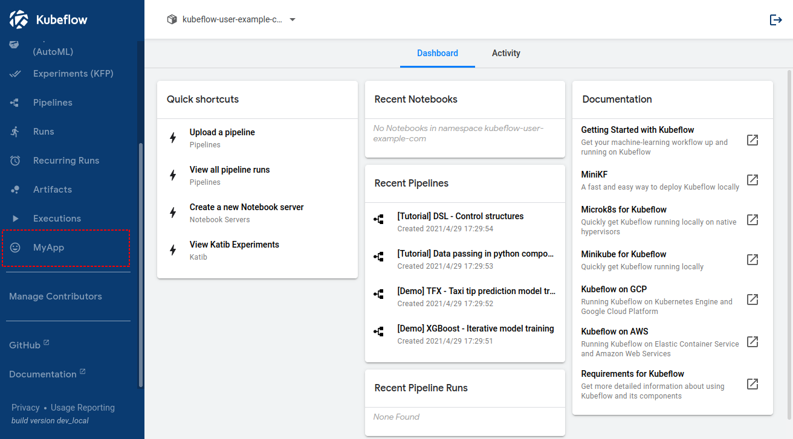

# 自定義 menu 項

集群管理員可以將第三方應用程序與 kubeflow 集成。在下面的示例中，“My App”被添加到側面菜單欄中。



## 添加共享項目

本節介紹如何添加所有用戶共享的項目。

1. 首先，集群管理員應該將應用程序部署為 Kubernetes 中的微服務。
2. 應用程序的流量應設置為 Istio 的 `VirtualService`。
3. 使用特定前綴(prefix)進行部署並通過它來控制流量是一種快捷的方式。在這種情況下，可以從以下 URL 訪問新應用程序。

    ```bash
    http(s)://gateway/_/myapp/
    ```


4. 修改菜單欄的配置。

    ```bash
    kubectl edit cm centraldashboard-config -n kubeflow
    ```

    您會看到當前設置。請根據需要添加新項目。

    ```yaml
    apiVersion: v1
    data:
    links: |-
        {
        "menuLinks": [
            {
            "type": "item",
            "link": "/jupyter/",
            "text": "Notebooks",
            "icon": "book"
            },
    .
    .
    .
            {
            "type": "item",
            "link": "/pipeline/#/executions",
            "text": "Executions",
            "icon": "av:play-arrow"
            },
            {
            "type": "item",
            "link": "/myapp/",
            "text": "MyApp",
            "icon": "social:mood"
            }
        ],
    ```

    !!! tip
            “icon” 可以從 iron-icons 中選擇。你可以在這個[圖標演示](https://kevingleason.me/Polymer-Todo/bower_components/iron-icons/demo/index.html)中看到圖標列表。

    配置的更改將很快反映出來。如果沒有，請重新啟動 centraldashboard 並重新加載瀏覽器。

    ```bash
    kubectl rollout restart deployment centraldashboard -n kubeflow
    ```

您會在菜單欄上看到一個新項目（在本例中為 `MyApp`）。通過點擊該按鈕，您可以跳轉到 `http(s)://gateway/_/myapp/` 並通過 kubeflow 儀表板訪問第三方應用程序。

## 添加命名空間項

本節介紹了拆分應用程序資源的方法。

儘管 Kubeflow 具有多租戶的功能，但某些第三方應用程序無法與 kubeflow 配置文件交互或不支持多租戶。

處理此問題的通用方法是為每個命名空間部署應用程序。集群管理員為每個命名空間和 URL 部署應用程序如下所示。

```
http(s)://gateway/_/myapp/profile1/
http(s)://gateway/_/myapp/profile2/
```

在這種情況下，您可以按如下方式配置中央儀表板。 `{ns}` 應在用戶打開儀表板時替換為命名空間。

```yaml
apiVersion: v1
data:
  links: |-
    {
      "menuLinks": [
        {
          "type": "item",
          "link": "/jupyter/",
          "text": "Notebooks",
          "icon": "book"
        },
.
.
.
        {
          "type": "item",
          "link": "/pipeline/#/executions",
          "text": "Executions",
          "icon": "av:play-arrow"
        },
        {
          "type": "item",
          "link": "/myapp/{ns}",
          "text": "MyApp",
          "icon": "social:mood"
        }
      ],
      ...
      ...
```

用戶可以在菜單欄上看到一個新項目（在本例中，它也是 `MyApp`）。他們可以根據命名空間選擇跳轉到 `http(s)://gateway/_/myapp/profile1/` 或 `http(s)://gateway/_/myapp/profile2/`。 網頁 iframe 的實際內部內容由命名空間切換。

如果啟用了 `sidecar` 注入，則應用程序的授權由 istio 完成。 不屬於 `profile2` 的用戶就無法訪問 `http(s)://gateway/_/myapp/profile2/`。
