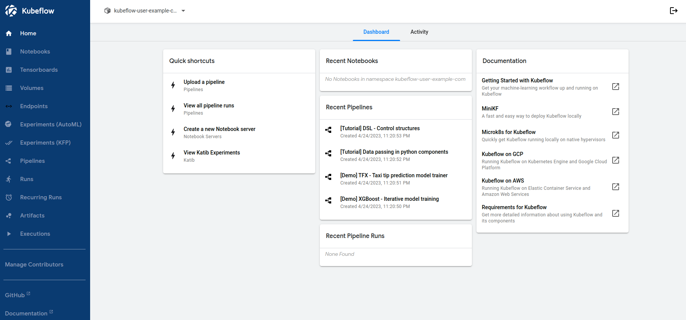

# Central Dashboard 簡介

您的 Kubeflow 部署包括一個中央儀表板，可讓您快速訪問集群中部署的 Kubeflow 組件。儀表板包括以下功能：

- 特定操作的快捷方式、最近異動的 pipeline 和 notebook 列表以及指標，讓您在一個視圖中概覽您的作業和集群。
- 集群中運行的組件的 UI 的掛載，包括 Pipelines、Katib、Notebooks 等。
- 一個註冊流程，提示新用戶在必要時設置他們的命名空間。

## Kubeflow UI 概述

Kubeflow UI 包括以下內容：

- `Home`：主頁，是訪問最新資源、活動實驗和有用文檔的中心樞紐。
- `Notebook Servers`：管理筆記本服務器。
- `TensorBoards`：管理 TensorBoard 服務器。
- `Volumes`：管理集群的捲。
- `Endpoints`: 管理已部署的 KFServing 模型推論服務端點管理。
- `Experiments (AutoML)`：管理 Katib 實驗。
- `Experiments (KFP)`：管理 Kubeflow 管道 (KFP) 實驗。
- `Pipelines`：管理 KFP 管道。
- `Runs`：管理 KFP 運行。
- `Recurring Runs`：管理 KFP 重複運行。
- `Artifacts`：跟踪 ML 元數據 (MLMD) 工件。
- `Executions`：跟踪 MLMD 中的各種組件執行。
- `Manage Contributors`：在 Kubeflow 部署中配置跨命名空間的用戶訪問共享。

中央儀表板如下所示：



## 訪問中央儀表板

要訪問中央儀表板，您需要連接到提供對 Kubeflow 服務網格的訪問的 Istio gateway。

訪問 Istio gateway 的方式因配置方式而異。

### 使用 kubectl 和端口轉發

如果您沒有將 Kubeflow 配置為與 IdP 集成，那麼您可以直接將端口轉發到 Istio gateway。

如果滿足以下任一條件，端口轉發通常不起作用：

- 您已經使用 CLI 部署的默認設置在 GCP 上部署了 Kubeflow。

- 您已將 Istio ingress 配置為僅接受特定 domain 或 IP 地址上的 HTTPS 流量。

- 您已將 Istio ingress 配置為執行授權檢查（例如，使用 Cloud IAP 或 Dex）。

您可以通過 `kubectl` 和端口轉發訪問 Kubeflow，如下所示：

```bash
export NAMESPACE=istio-system
kubectl port-forward -n ${NAMESPACE} svc/istio-ingressgateway 8080:80
```

在以下位置訪問中央導航儀表板：

```
http://localhost:8080/
```

根據您配置 Kubeflow 的方式，並非所有 UI 都在可在端口轉發到反向代理的手法來正常工作。

對於某些 Web 應用程序，您需要配置應用程序提供服務的基本 URL。

例如，如果您部署了 Kubeflow，並在 `https://example.mydomain.com` 提供入口服務，並將應用程序配置為在 URL `https://example.mydomain.com/myapp` 提供服務，那麼該應用程序可能無法運行在 https://localhost:8080/myapp 來瀏覽，因為路徑不匹配。
