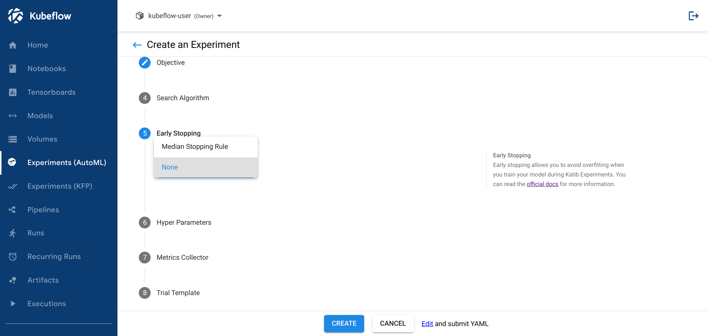
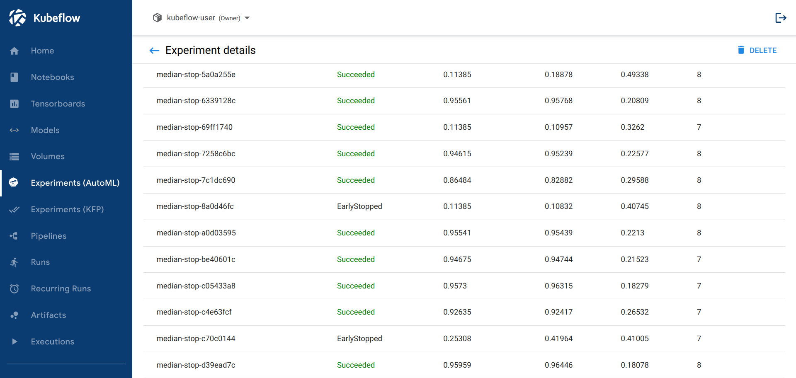
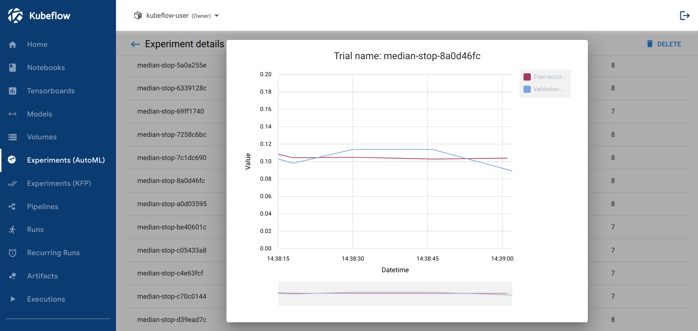

# 使用 Early Stopping

**如何在 Katib 實驗中使用 early stopping**

本指南介紹如何使用 [early stopping](https://en.wikipedia.org/wiki/Early_stopping) 來改進 Katib 實驗。在 Katib 實驗期間訓練模型時，提前停止可以避免過度擬合。它還有助於節省計算資源並通過在訓練過程完成之前目標指標不再改善時停止實驗試驗來減少實驗執行時間。

在 Katib 中使用 early stopping 的主要優點是你不需要修改你的訓練容器包。您所要做的就是對實驗的 YAML 文件進行必要的更改。

Early stopping 的工作方式與 Katib 的 [`metrics collector`](https://www.kubeflow.org/docs/components/katib/experiment/#metrics-collector) 的實現有緊密的關係。它分析來自 `stdout` 或任意輸出文件的所需指標，如果需要停止試驗，則提前停止算法會做出決定。目前，提前停止僅適用於 `StdOut` 或 `File` 指標收集器。

!!! tip
    注意：您的訓練容器必須打印帶有時間戳的訓練日誌，因為提前停止算法需要知道報告指標的順序。查看 [`MXNet` 範例](https://github.com/kubeflow/katib/blob/master/examples/v1beta1/trial-images/mxnet-mnist/mnist.py#L36)以了解如何將日期格式添加到日誌中。

    ```python hl_lines="16-20"
    """
    Train mnist, see more explanation at https://mxnet.io/tutorials/python/mnist.html
    """
    import os
    import argparse
    import logging
    import mxnet as mx
    import numpy as np
    import gzip
    import struct
    from common import fit
    from common import utils
    # This example only for mlp network
    from symbols import mlp

    # Use this format (%Y-%m-%dT%H:%M:%SZ) to record timestamp of the metrics
    logging.basicConfig(
        format="%(asctime)s %(levelname)-8s %(message)s",
        datefmt="%Y-%m-%dT%H:%M:%SZ",
        level=logging.DEBUG)


    def get_mnist_iter(args, kv):
        """
        Create data iterator with NDArrayIter
        """
        mnist = mx.test_utils.get_mnist()

        # Get MNIST data.
        train_data = mx.io.NDArrayIter(
            mnist['train_data'], mnist['train_label'], args.batch_size, shuffle=True)
        val_data = mx.io.NDArrayIter(
            mnist['test_data'], mnist['test_label'], args.batch_size)

        return (train_data, val_data)


    if __name__ == '__main__':
        # parse args
        parser = argparse.ArgumentParser(description="train mnist",
                                        formatter_class=argparse.ArgumentDefaultsHelpFormatter)
        parser.add_argument('--num-classes', type=int, default=10,
                            help='the number of classes')
        parser.add_argument('--num-examples', type=int, default=60000,
                            help='the number of training examples')

        parser.add_argument('--add_stn',  action="store_true", default=False,
                            help='Add Spatial Transformer Network Layer (lenet only)')
        parser.add_argument('--image_shape', default='1, 28, 28', help='shape of training images')

        fit.add_fit_args(parser)
        parser.set_defaults(
            # network
            network='mlp',
            # train
            gpus=None,
            batch_size=64,
            disp_batches=100,
            num_epochs=10,
            lr=.05,
            lr_step_epochs='10'
        )
        args = parser.parse_args()

        # load mlp network
        sym = mlp.get_symbol(**vars(args))

        # train
        fit.fit(args, sym, get_mnist_iter)
    ```

## 配置 early stopping 的實驗

作為參考，您可以使用 [early stopping example](https://github.com/kubeflow/katib/blob/master/examples/v1beta1/early-stopping/median-stop.yaml) 的 YAML 文件。

1. 按照[指南](https://www.kubeflow.org/docs/components/katib/experiment/#configuring-the-experiment)配置您的 Katib 實驗。
2. 接下來，要為您的實驗應用 early stopping，請指定 `.spec.earlyStopping` 參數，類似於 `.spec.algorithm`。有關詳細信息，請[參閱 `EarlyStoppingSpec` 類型](https://github.com/kubeflow/katib/blob/master/pkg/apis/controller/common/v1beta1/common_types.go#L41-L58)。

- `.earlyStopping.algorithmName`- 提前停止算法的名稱。
- `.earlyStopping.algorithmSettings`- 提前停止算法的設定。

接下來會發生的事情是你的實驗 suggestion 產生了新的 trail。之後，提前停止算法為創建的試驗生成提前停止規則。一旦試驗達到所有規則，它就會停止並且試驗狀態更改為  `EarlyStopped`。然後，Katib 再次建議要求進行新的試驗。

按照 [Katib 配置指南](https://www.kubeflow.org/docs/components/katib/katib-config/#early-stopping-settings)為提前停止算法指定您自己的鏡像。

## Early stopping 演算法

以下是 Katib 中可用的早期停止算法的列表：

- [Median Stopping Rule](https://www.kubeflow.org/docs/components/katib/early-stopping/#median-stopping-rule)

更多算法正在開發中。

您可以自己向 Katib 添加提前停止算法。

### Median Stopping Rule

Katib 中的早停算法名稱是 `meidanstop`。

如果試驗在步驟 `S` 中的最佳目標值低於在步驟 `S` 之前報告的所有已完成試驗目標的運行平均值的中值，則中值停止規則會在步驟 `S` 停止與當且的試驗 `X`。

要了解更多信息，請查看 [Google Vizier：黑盒優化服務](https://static.googleusercontent.com/media/research.google.com/en//pubs/archive/46180.pdf)。

Katib 支持以下提前停止設定：

|Setting Name	|Description	|Default Value|
|-------------|-------------|-------------|
|min_trials_required	|Minimal number of successful trials to compute median value	|3|
|start_step	|Number of reported intermediate results before stopping the trial	|4|

### 從 UI 提交 early stopping 實驗

您可以使用 Katib UI 提交 early stopping 實驗。按照[以下步驟](https://www.kubeflow.org/docs/components/katib/experiment/#running-the-experiment-from-the-katib-ui)從 UI 創建實驗。

在 Early Stopping 選擇適當的值：



## 查看 early stopping 實驗結果

首先，確保你已經安裝了 [jq](https://stedolan.github.io/jq/download/)。

檢查實驗中 early stopped trials：

```bash
kubectl get experiment <experiment-name>  -n <experiment-namespace> -o json | jq -r ".status"
```

上述命令輸出的最後一部分類似於：

```json
 . . .
  "earlyStoppedTrialList": [
    "median-stop-2ml8h96d",
    "median-stop-cgjkq8zn",
    "median-stop-pvn5p54p",
    "median-stop-sjc9tcgc"
  ],
  "startTime": "2020-11-05T03:03:43Z",
  "succeededTrialList": [
    "median-stop-2kmh57qf",
    "median-stop-7ccstz4z",
    "median-stop-7sqt7556",
    "median-stop-lgvhfch2",
    "median-stop-mkfjtwbj",
    "median-stop-nfmgqd7w",
    "median-stop-nsbxw5m9",
    "median-stop-nsmhg4p2",
    "median-stop-rp88xflk",
    "median-stop-xl7dlf5n",
    "median-stop-ztc58kwq"
  ],
  "trials": 15,
  "trialsEarlyStopped": 4,
  "trialsSucceeded": 11
}
```

通過運行以下命令檢查 early stopped trials 的狀態：

```bash
kubectl get trial median-stop-2ml8h96d -n <experiment-namespace>
```

並且您應該能夠查看 trial 的 EarlyStopped 狀態：

```bash
NAME                   TYPE           STATUS   AGE
median-stop-2ml8h96d   EarlyStopped   True     15m
```

此外，您可以在 Katib 用戶界面上查看您的結果。實驗監視器頁面上的試用狀態應如下所示：



您可以點擊 early stopped 的 trial 名稱以獲取在此試驗提前停止之前報告的指標：



