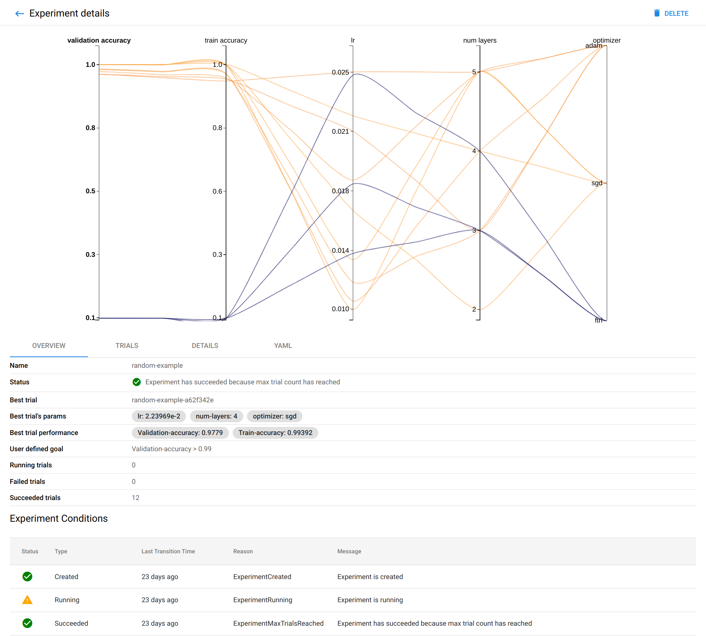
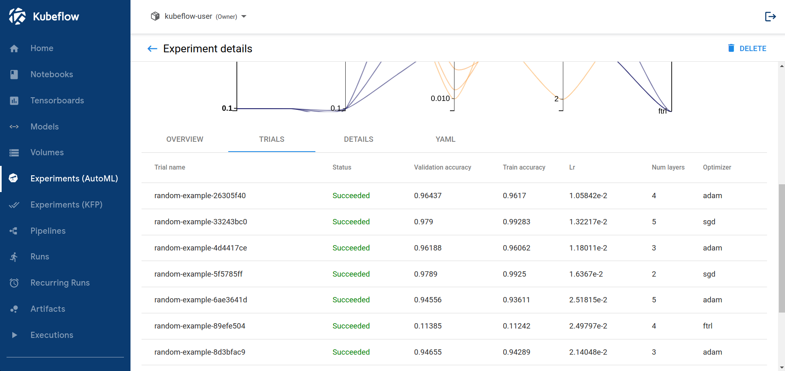

# 運行實驗

**如何在 Katib 中配置和運行超參數調整或神經架構搜索實驗**

本指南描述瞭如何配置和運行 Katib 實驗。該實驗可以執行超參數調整或神經架構搜索 (NAS)，具體取決於配置設定。

## 將訓練程式碼打包到容器鏡像中

Katib 和 Kubeflow 是基於 Kubernetes 的系統。要使用 Katib，您必須將模型訓練程式碼打包到 Docker 容器鏡像中，並在 container registry 中提供該鏡像。查看 [Docker 文檔](https://docs.docker.com/develop/develop-images/baseimages/)和 [Kubernetes 文檔](https://kubernetes.io/docs/concepts/containers/images/)。

## 配置實驗

要在 Katib 中創建超參數調整或 NAS 實驗，您可以在 YAML 配置文件中定義實驗。 YAML 文件定義了您要優化的參數的潛在值範圍（搜索空間）、確定最佳值時要使用的客觀指標、優化期間要使用的搜索算法以及其他配置。

作為參考，您可以使用[隨機搜索算法](https://github.com/kubeflow/katib/blob/master/examples/v1beta1/hp-tuning/random.yaml)範例的 YAML 文件。

??? info "random.yaml"

    ```yaml
    ---
    apiVersion: kubeflow.org/v1beta1
    kind: Experiment
    metadata:
      namespace: kubeflow
      name: random
    spec:
      objective:
        type: maximize
        goal: 0.99
        objectiveMetricName: Validation-accuracy
        additionalMetricNames:
          - Train-accuracy
      algorithm:
        algorithmName: random
      parallelTrialCount: 3
      maxTrialCount: 12
      maxFailedTrialCount: 3
      parameters:
        - name: lr
          parameterType: double
          feasibleSpace:
            min: "0.01"
            max: "0.03"
        - name: num-layers
          parameterType: int
          feasibleSpace:
            min: "2"
            max: "5"
        - name: optimizer
          parameterType: categorical
          feasibleSpace:
            list:
              - sgd
              - adam
              - ftrl
      trialTemplate:
        primaryContainerName: training-container
        trialParameters:
          - name: learningRate
            description: Learning rate for the training model
            reference: lr
          - name: numberLayers
            description: Number of training model layers
            reference: num-layers
          - name: optimizer
            description: Training model optimizer (sdg, adam or ftrl)
            reference: optimizer
        trialSpec:
          apiVersion: batch/v1
          kind: Job
          spec:
            template:
              spec:
                containers:
                  - name: training-container
                    image: docker.io/kubeflowkatib/mxnet-mnist:latest
                    command:
                      - "python3"
                      - "/opt/mxnet-mnist/mnist.py"
                      - "--batch-size=64"
                      - "--lr=${trialParameters.learningRate}"
                      - "--num-layers=${trialParameters.numberLayers}"
                      - "--optimizer=${trialParameters.optimizer}"
                    resources:
                      limits:
                        memory: "1Gi"
                        cpu: "0.5"
                restartPolicy: Never
    ```

下面的列表描述了用於實驗的 YAML 文件中的相關欄位。 Katib UI 提供相應的欄位。您可以選擇從 UI 或命令行配置和運行試驗。

### 配置規範

這些是實驗配置規範中的欄位：

- **objective**: 您要優化的指標。`objective metric` 也稱為 `target variable`。一個常見的指標是模型在訓練作業的驗證通過中的準確性（validation-accuracy）。您還可以指定是希望 Katib 最大化還是最小化這個指標。

    Katib 使用 `objectiveMetricName` 和 `additionalMetricNames` 來監控超參數如何與模型一起工作。 Katib 在實驗的 `.status.currentOptimalTrial.parameterAssignments` 中記錄最佳 `objectiveMetricName` 指標的值（根據類型最大化或最小化）和相應的超參數集。如果一組超參數的 `objectiveMetricName` 指標達到 `goal`，Katib 將停止嘗試更多超參數組合。

    計算實驗目標的默認方法是：

    - 當目標類型為 `maximize` 時，Katib 會比較所有最大度量值。
    - 當目標類型為 `minimize` 最小化時，Katib 會比較所有最小度量值。

    要更改默認設置，請使用各種規則（最小值、最大值或最新值）定義 `metricStrategies`，以從實驗的 `objectiveMetricName` 和 `additionalMetricNames` 中提取每個指標的值。實驗的目標值是根據所選策略計算的。

    例如，您可以按如下方式設置實驗中的參數：

    ```yaml
    ...
    objectiveMetricName: accuracy
    type: maximize
    metricStrategies:
      - name: accuracy
        value: latest
    ...
    ```

    Katib 控制器正在從每個試驗的所有最新報告的 `accuracy` 指標中搜索最佳最大值。檢查[metrics strategies example](https://github.com/kubeflow/katib/blob/master/examples/v1beta1/metrics-collector/metrics-collection-strategy.yaml)。每個指標的默認策略類型等於目標類型。

    請參考 [`ObjectiveSpec` 類型](https://github.com/kubeflow/katib/blob/master/pkg/apis/controller/common/v1beta1/common_types.go#L93)。


- **parameters**: 您要為機器學習 (ML) 模型調整的超參數或其他參數的範圍。這些參數定義了搜索空間，也稱為可行集或解空間。在規範的這一部分，您定義需要搜索的每個超參數的名稱和分佈（離散或連續）。例如，您可以為每個超參數提供最小值和最大值或允許值列表。 Katib 根據您指定的超參數調整算法生成範圍內的超參數組合。

    請參閱 [ParameterSpec](https://github.com/kubeflow/katib/blob/318f66890ebee00eba9893f7145d366795caa1d0/pkg/apis/controller/experiments/v1beta1/experiment_types.go#L193-L214) 類型。

    ```golang
    type ParameterSpec struct {
      Name          string        `json:"name,omitempty"`
      ParameterType ParameterType `json:"parameterType,omitempty"`
      FeasibleSpace FeasibleSpace `json:"feasibleSpace,omitempty"`
    }

    type ParameterType string

    const (
      ParameterTypeUnknown     ParameterType = "unknown"
      ParameterTypeDouble      ParameterType = "double"
      ParameterTypeInt         ParameterType = "int"
      ParameterTypeDiscrete    ParameterType = "discrete"
      ParameterTypeCategorical ParameterType = "categorical"
    )

    type FeasibleSpace struct {
      Max  string   `json:"max,omitempty"`
      Min  string   `json:"min,omitempty"`
      List []string `json:"list,omitempty"`
      Step string   `json:"step,omitempty"`
    }
    ```

    範例:

    ```yaml
    ...
    parameters:
      - name: lr
        parameterType: double
        feasibleSpace:
          min: "0.01"
          max: "0.03"
      - name: num-layers
        parameterType: int
        feasibleSpace:
          min: "2"
          max: "5"
      - name: optimizer
        parameterType: categorical
        feasibleSpace:
          list:
            - sgd
            - adam
            - ftrl
    ...
    ```

- **parallelTrialCount**: Katib 應該並行訓練的最大超參數集數。默認值為 3。

- **maxTrialCount**: 要運行的最大試驗次數。這相當於 Katib 應該生成的用於測試模型的超參數集的數量。如果省略 `maxTrialCount` 值，您的實驗將一直運行，直到達到 objective goal 或實驗達到失敗試驗的最大次數。

- **maxFailedTrialCount**: 允許失敗的最大試驗次數。這相當於 Katib 應該測試的失敗超參數集的數量。 Katib 將狀態為 `Failed` 或 `MetricsUnavailable` 的試驗識別為失敗試驗，如果失敗試驗的數量達到 `maxFailedTrialCount`，Katib 將停止試驗，狀態為失敗。

- **algorithm**: 您希望 Katib 用於查找最佳超參數或神經架構配置的搜索算法。範例包括隨機搜索、網格搜索、貝葉斯優化等。檢查下面的[搜索算法](https://www.kubeflow.org/docs/components/katib/experiment/#search-algorithms)詳細信息。

- **trialTemplate**: 定義試驗的模板。如上所述，您必須將 ML 訓練程式碼打包到 Docker 鏡像中。 `trialTemplate.trialSpec` 是帶有模型參數的非結構化模板，由 `trialTemplate.trialParameters` 替代。例如，您的訓練容器可以接收超參數作為 {==命令行參數==} 或 {==環境變量==}。您必須在 `trialTemplate.primaryContainerName` 中設置訓練容器的名稱。

    Katib 動態支持任何類型的 Kubernetes CRD。在 Katib 示例中，您可以找到以下工作類型來訓練您的模型：

    - Kubernetes [`Job`](https://kubernetes.io/docs/concepts/workloads/controllers/job/)
    - Kubeflow [`TFJob`](https://www.kubeflow.org/docs/components/training/tftraining/)
    - Kubeflow [`PyTorchJob`](https://www.kubeflow.org/docs/components/training/pytorch/)
    - Kubeflow [`MXJob`](https://www.kubeflow.org/docs/components/training/mxnet)
    - Kubeflow [`XGBoostJob`](https://www.kubeflow.org/docs/components/training/xgboost)
    - Kubeflow [`MPIJob`](https://www.kubeflow.org/docs/components/training/mpi)
    - Tekton [`Pipelines`](https://github.com/kubeflow/katib/tree/master/examples/v1beta1/tekton)
    - Argo [`Workflows`](https://github.com/kubeflow/katib/tree/master/examples/v1beta1/argo)

    請參考 [TrialTemplate 類型。](https://github.com/kubeflow/katib/blob/318f66890ebee00eba9893f7145d366795caa1d0/pkg/apis/controller/experiments/v1beta1/experiment_types.go#L216-L278)按照試用模板指南了解如何指定 `trialTemplate` 參數、在 `ConfigMaps` 中保存模板以及在 Katib 中支持自定義 Kubernetes 資源。

    ```yaml
    ...
    trialTemplate:
      primaryContainerName: training-container
      trialParameters:
        - name: learningRate
          description: Learning rate for the training model
          reference: lr
        - name: numberLayers
          description: Number of training model layers
          reference: num-layers
        - name: optimizer
          description: Training model optimizer (sdg, adam or ftrl)
          reference: optimizer
      trialSpec:
        apiVersion: batch/v1
        kind: Job
        spec:
          template:
            spec:
              containers:
                - name: training-container
                  image: docker.io/kubeflowkatib/mxnet-mnist:latest
                  command:
                    - "python3"
                    - "/opt/mxnet-mnist/mnist.py"
                    - "--batch-size=64"
                    - "--lr=${trialParameters.learningRate}"
                    - "--num-layers=${trialParameters.numberLayers}"
                    - "--optimizer=${trialParameters.optimizer}"
                  resources:
                    limits:
                      memory: "1Gi"
                      cpu: "0.5"
              restartPolicy: Never
    ...
    ```

- **metricsCollectorSpec**: 關於如何從每個試驗中收集指標的規範，例如 `accuracy` 和 `loss` 指標。在下面了解 [metrics collector](https://www.kubeflow.org/docs/components/katib/experiment/#metrics-collector) 的詳細信息。預設的指標收集器是 `StdOut`。

- **nasConfig**: 神經架構搜索 (NAS) 的配置。注意：NAS 目前處於 alpha 階段，支持有限。您可以指定要優化的神經網絡設計的配置，包括網絡中的層數、操作類型等。請參考 [`NasConfig` 類型](https://github.com/kubeflow/katib/blob/318f66890ebee00eba9893f7145d366795caa1d0/pkg/apis/controller/experiments/v1beta1/experiment_types.go#L303-L320)。

    - **graphConfig**: 為神經網絡的有向無環圖定義結構的 graph 配置。您可以指定層數，輸入層的 `input_sizes` 和輸出層的 `output_sizes`。請參考 [`GraphConfig` 類型](https://github.com/kubeflow/katib/blob/318f66890ebee00eba9893f7145d366795caa1d0/pkg/apis/controller/experiments/v1beta1/experiment_types.go#L309-L314)。

    - **operations**: 您要為 ML 模型調整的操作範圍。對於每個神經網絡層，NAS 算法選擇一個操作來構建神經網絡。每個操作都包含上面描述的參數集。請參閱 [`Operation` 類型](https://github.com/kubeflow/katib/blob/318f66890ebee00eba9893f7145d366795caa1d0/pkg/apis/controller/experiments/v1beta1/experiment_types.go#L316-L320)。

        您可以在[此處](https://github.com/kubeflow/katib/tree/master/examples/v1beta1/nas)找到所有 NAS 示例。

- **resumePolicy**: 實驗恢復政策。可以是 `LongRunning`、`Never` 或 `FromVolume` 之一。默認值為 `Never`。請參考 [`ResumePolicy` 類型](https://github.com/kubeflow/katib/blob/318f66890ebee00eba9893f7145d366795caa1d0/pkg/apis/controller/experiments/v1beta1/experiment_types.go#L60)。要了解如何修改正在運行的實驗並使用各種重啟策略，請遵循 [resume an experiment guide](https://www.kubeflow.org/docs/components/katib/resume-experiment/)。

## Search algorithms 詳細資訊

Katib 目前支持多種搜索算法。請參閱 [`AlgorithmSpec` 類型](https://github.com/kubeflow/katib/blob/master/pkg/apis/controller/common/v1beta1/common_types.go#L22-L39)。

以下是 Katib 中可用的搜索算法列表：

- Grid search
- Random search
- Bayesian optimization
- Hyperband
- Tree of Parzen Estimators (TPE)
- Multivariate TPE
- Covariance Matrix Adaptation Evolution Strategy (CMA-ES)
- Sobol’s Quasirandom Sequence
- Neural Architecture Search based on ENAS
- Differentiable Architecture Search (DARTS)
- Population Based Training (PBT)

### Grid search

Katib 中的算法名稱是 `grid`。

當所有變量都是離散的（而不是連續的）並且可能性的數量很少時，`grid search` 抽樣很有用。`Grid search` 對所有可能性執行詳盡的組合搜索，即使對於中等規模的問題，搜索過程也非常長。

Katib 使用 [Optuna](https://github.com/optuna/optuna) 優化框架進行 grid search。

|Setting name	|Description	|Example|
|-------------|-------------|-------|
|`random_state`	|[int]：將 `random_state` 設置為除 None 之外的其他內容以獲得可重現的結果。	|10|

### Random search

Katib 中的算法名稱是 `random`。

隨機抽樣是網格搜索的替代方法，當要優化的離散變量的數量很大並且每次評估所需的時間很長時使用。當所有參數都是離散的時，隨機搜索進行無放回採樣。因此，當無法進行組合探索時，隨機搜索是最好的算法。如果連續變量的數量很多，則應改用 quasi random sampling。

Katib 使用 [Hyperopt](https://hyperopt.github.io/hyperopt/)、[Goptuna](https://github.com/c-bata/goptuna) 或 [Optuna](https://github.com/optuna/optuna) 優化框架進行隨機搜索。

Katib 支持以下算法設置：

|Setting name	|Description	|Example|
|-------------|-------------|-------|
|`random_state`	|[int]：將 `random_state` 設置為除 None 之外的其他內容以獲得可重現的結果。|10|

### Bayesian optimization

Katib 中的算法名稱是 `bayesianoptimization`。

[Bayesian optimization](https://arxiv.org/pdf/1012.2599.pdf) 方法使用高斯過程回歸來對搜索空間建模。該技術計算損失函數的估計值以及搜索空間中每個點的估計值的不確定性。該方法適用於搜索空間維數較少的情況。由於該方法同時對預期損失和不確定性進行建模，搜索算法只需幾步即可收斂，因此當完成參數配置評估的時間較長時，它是一個不錯的選擇。

Katib 使用 [Scikit-Optimize](https://github.com/scikit-optimize/scikit-optimize) 優化框架進行 bayesian 搜索。 Scikit-Optimize 也稱為 `skopt`。

Katib 支持以下算法設置：

|Setting name	|Description	|Example|
|-------------|-------------|-------|
|`base_estimator`	|["GP", "RF", "ET", "GBRT" or sklearn regressor, default="GP"]: 應該繼承自 `sklearn.base.RegressorMixin`。`predict` 方法應該有一個可選的 `return_std` 參數，它返回 `std(Y | x)` 和 `E[Y | X]`。如果 `base_estimator` 是[“GP”、“RF”、“ET”、“GBRT”]之一，系統使用相應類型的默認代理模型。在 [skopt 文檔](https://scikit-optimize.github.io/stable/modules/generated/skopt.Optimizer.html#skopt.Optimizer)中了解更多信息。	|GP|
|`n_initial_points`	|[int, default=10]：在使用 `base_estimator` 對其進行近似之前，具有初始化點的 `func` 的評估次數。作為 `x0` 提供的點算作初始化點。如果 `len(x0) < n_initial_points`，系統會隨機抽取額外的點。在 [skopt 文檔](https://scikit-optimize.github.io/stable/modules/generated/skopt.Optimizer.html#skopt.Optimizer)中了解更多信息。	|10|
|`acq_func`	|[string, default="gp_hedge"]：最小化 posterior distribution 函數。	|gp_hedge|
|`acq_optimizer`	|[string, “sampling” or “lbfgs”, default=“auto”]: 最小化採集函數的方法。系統使用通過使用 `acq_optimizer` 優化 `acq_func` 獲得的最優值更新擬合模型。	|auto|
|`random_state`	|[int]：將 `random_state` 設置為除 None 之外的其他內容以獲得可重現的結果。	|10|

### Hyperband

Katib 中的算法名稱是 `hyperband`。

Katib 支持 [Hyperband](https://arxiv.org/pdf/1603.06560.pdf) 優化框架。 Hyperband 沒有使用貝葉斯優化來選擇配置，而是專注於將 early stopping 作為優化資源分配的策略，從而最大限度地增加它可以評估的配置數量。 Hyperband 還注重搜索速度。

### Tree of Parzen Estimators (TPE)

Katib 中的算法名稱是 `tpe`。

Katib 使用 [Hyperopt](https://hyperopt.github.io/hyperopt/)、[Goptuna](https://github.com/c-bata/goptuna) 或 [Optuna](https://github.com/optuna/optuna) 優化框架進行 TPE 搜索。

該方法提供了基於[正向和反向梯度](https://arxiv.org/pdf/1703.01785.pdf)的搜索。

Katib 支持以下算法設置：

|Setting name	|Description	|Example|
|-------------|-------------|-------|
|`n_EI_candidates`	|[int]：用於計算預期改進的候選樣本數。|25|
|`random_state`	|[int]：將 `random_state` 設置為 None 以外的其他值以獲得可重現的結果。|10|
|`gamma`	|[float]：在 `l(x)` 和 `g(x)` 之間拆分的閾值，檢查本文中的等式 2。值必須在 (0, 1) 範圍內。|0.25|
|`prior_weight`	|[float]：計數的平滑因子，以避免出現 0 概率。值必須 > 0。|1.1|

### Multivariate TPE

Katib 中的算法名稱是 `multivariate-tpe`。

Katib 使用 [Optuna](https://hyperopt.github.io/hyperopt/) 優化框架進行多變量 TPE 搜索。

[Multivariate TPE](https://tech.preferred.jp/en/blog/multivariate-tpe-makes-optuna-even-more-powerful/) 是獨立（預設）TPE 的改進版本。此方法在搜索空間中查找超參數之間的依賴關係。

Katib 支持以下算法設置：

|Setting name	|Description	|Example|
|-------------|-------------|-------|
|`n_ei_candidates`	|[int]：用於計算預期改進的試驗次數。|25|
|`random_state`	|[int]：將 random_state 設置為 None 以外的其他值以獲得可重現的結果。|10|
|`n_startup_trials`	|[int]：隨機搜索算法生成超參數的初始試驗次數。|5|

### Covariance Matrix Adaptation Evolution Strategy (CMA-ES)

Katib 中的算法名稱是 `cmaes`。

Katib 使用 [Goptuna](https://github.com/c-bata/goptuna) 或 [Optuna](https://github.com/optuna/optuna) 優化框架進行 CMA-ES 搜索。

[Covariance Matrix Adaptation Evolution] 策略是一種隨機導數自由數值優化算法，用於連續搜索空間中的優化問題。您還可以使用 [IPOP-CMA-ES](https://sci2s.ugr.es/sites/default/files/files/TematicWebSites/EAMHCO/contributionsCEC05/auger05ARCMA.pdf) 和 [BIPOP-CMA-ES](https://hal.inria.fr/inria-00382093/document)，當收斂到局部最小值時重新啟動優化的變體算法。

Katib 支持以下算法設置：

|Setting name	|Description	|Example|
|-------------|-------------|-------|
|`random_state`	|[int]：將 `random_state` 設置為 None 以外的其他值以獲得可重現的結果。|10|
|`sigma`	|[float]：CMA-ES 的初始標準偏差。|0.001|
|`restart_strategy`	|[string, "none", "ipop", or "bipop", default="none"]：收斂到局部最小值時重新啟動 CMA-ES 優化的策略。|"ipop"|

### Sobol’s Quasirandom Sequence

Katib 中的算法名稱是 `sobol`。

Katib 將 [Goptuna](https://github.com/c-bata/goptuna) 優化框架用於其 Sobol 的準隨機搜索。

[Sobol’s quasirandom sequence](https://dl.acm.org/doi/10.1145/641876.641879) 是一個低差異序列。並且眾所周知，Sobol 的準隨機序列可以提供更好的均勻性。

### Neural Architecture Search based on ENAS

Katib 中的算法名稱是 `enas`。

!!! warn
    神經架構搜索目前處於 alpha 階段。

這個 NAS 算法是基於 ENAS 的。目前，它不支持參數共享。

Katib 支持以下算法設置：

|Setting Name	|Type	|Default value	|Description|
|-------------|-----|---------------|-----------|
|`controller_hidden_size`	|int	|64	|RL 控制器 lstm 隱藏大小。值必須 >= 1。|
|`controller_temperature`	|float	|5.0	|採樣邏輯的 RL 控制器溫度。值必須 > 0。將值設置為“無”以在控制器中禁用它。|
|`controller_tanh_const`	|float	|2.25	|RL 控制器 tanh 常數以防止過早收斂。值必須 > 0。將值設置為“無”以在控制器中禁用它。|
|`controller_entropy_weight`	|float	|1e-5	|用於獎勵的熵的 RL 控制器權重。值必須 > 0。將值設置為“無”以在控制器中禁用它。|
|`controller_baseline_decay`	|float	|0.999	|RL 控制器基線係數。值必須 > 0 且 <= 1。|
|`controller_learning_rate`	|float	|5e-5	|Adam 優化器的 RL 控制器學習率。值必須 > 0 且 <= 1。|
|`controller_skip_target`	|float	|0.4	|RL 控制器概率，表示形成跳過連接的先驗信念。值必須 > 0 且 <= 1。|
|`controller_skip_weight`	|float	|0.8	|跳過懲罰損失的 RL 控制器權重。值必須 > 0。將值設置為“無”以在控制器中禁用它。|
|`controller_train_steps`	|int	|50	|每個候選人運行後的 RL 控制器訓練步驟數。值必須 >= 1。|
|`controller_log_every_steps`	|int	|10	|記錄之前的 RL 控制器訓練步驟數。值必須 >= 1。|

有關更多信息，請檢查：

- Katib 存儲庫中有關 [Efficient Neural Architecture Search (ENAS)](https://github.com/kubeflow/katib/tree/master/pkg/suggestion/v1beta1/nas/enas)的文檔。

- ENAS 示例 — [`enas-gpu.yaml`](https://github.com/kubeflow/katib/blob/master/examples/v1beta1/nas/enas-gpu.yaml) 試圖顯示所有可能的操作。由於搜索空間很大，該示例不太可能生成好的結果。

### Differentiable Architecture Search (DARTS)

Katib 中的算法名稱是 `darts`。

!!! warn
    神經架構搜索目前處於 alpha 階段。

目前，您無法在 Katib UI 中查看該算法的結果，並且只能在單個 GPU 上運行實驗。

Katib 支持以下算法設置：

|Setting Name	|Type	|Default value	|Description|
|-------------|-----|---------------|-----------|
|`num_epochs`	|int	|50	|訓練模型的時期數|
|`w_lr`	|float	|0.025	|訓練模型權重的初始學習率。這個學習率按照餘弦時間表退火到 w_lr_min 而無需重新啟動。|
|`w_lr_min`	|float	|0.001	|訓練模型權重的最小學習率。|
|`w_momentum`	|float	|0.9	|訓練模型權重的動量。|
|`w_weight_decay`	|float	|3e-4	|訓練模型權重衰減。|
|`w_grad_clip`	|float	|5.0	|訓練模型權重的裁剪梯度範數的最大範數。|
|`alpha_lr`	|float	|3e-4	|alpha 權重的初始學習率。|
|`alpha_weight_decay`	|float	|1e-3	|Alpha 權重衰減。|
|`batch_size`	|int	|128	|數據集的批量大小。|
|`num_workers`	|int	|4	|下載數據集的子進程數。|
|`init_channels`	|int	|16	|初始通道數。|
|`print_step`	|int	|50	|記錄之前的訓練或驗證步驟數。|
|`num_nodes`	|int	|4	|DARTS 節點數。|
|`stem_multiplier`	|int	|3	|初始通道的乘數。它用於第一個 stem cell。|

有關更多信息，請檢查：

- Katib repo 中有關 [Differentiable Architecture Search](https://github.com/kubeflow/katib/tree/master/pkg/suggestion/v1beta1/nas/darts) 的文檔。

- DARTS 示例 — [`darts-gpu.yaml`](https://github.com/kubeflow/katib/blob/master/examples/v1beta1/nas/darts-gpu.yaml)。

### Population Based Training (PBT)

Katib 中的算法名稱是 `pbt`。

有關該算法的更多詳細信息，請查看基於 population based training [論文](https://arxiv.org/abs/1711.09846)。

PBT 服務需要使用 [RWX 訪問模式](https://kubernetes.io/docs/concepts/storage/persistent-volumes/#access-modes) 的 Persistent Volume Claim 以在建議和試驗之間共享資源。目前，Katib Experiments 應該有 `resumePolicy: FromVolume` 來運行 PBT 算法。

Katib 支持以下算法設置：

|Setting name	|Description	|Example|
|-------------|-------------|-------|
|`suggestion_trial_dir`	|保存檢查點的試用容器內的位置	|/var/log/katib/checkpoints/|
|`n_population`	|每代試驗種子數	|40|
|`resample_probability`	|null（默認）：將超參數擾動 0.8 或 1.2。 0-1：按指定概率對原始分佈重新採樣|0.3|
|`truncation_threshold`	|利用修剪低性能種子的閾值	|0.4|

## 指標收集器

在 YAML 配置文件的 `metricsCollectorSpec` 部分，您可以定義 Katib 應如何從每次試驗中收集指標，例如 accuracy 和 loss 指標。參考 [MetricsCollectorSpec 類型](https://github.com/kubeflow/katib/blob/master/pkg/apis/controller/common/v1beta1/common_types.go#L155-L225)

??? info

    ```golang
    // +k8s:deepcopy-gen=true
    type MetricsCollectorSpec struct {
      Source    *SourceSpec    `json:"source,omitempty"`
      Collector *CollectorSpec `json:"collector,omitempty"`
    }

    // +k8s:deepcopy-gen=true
    type SourceSpec struct {
      // Model-train source code can expose metrics by http, such as HTTP endpoint in
      // prometheus metric format
      HttpGet *v1.HTTPGetAction `json:"httpGet,omitempty"`
      // During training model, metrics may be persisted into local file in source
      // code, such as tfEvent use case
      FileSystemPath *FileSystemPath `json:"fileSystemPath,omitempty"`
      // Default metric output format is {"metric": "<metric_name>",
      // "value": <int_or_float>, "epoch": <int>, "step": <int>}, but if the output doesn't
      // follow default format, please extend it here
      Filter *FilterSpec `json:"filter,omitempty"`
    }

    // +k8s:deepcopy-gen=true
    type FilterSpec struct {
      // When the metrics output follows format as this field specified, metricsCollector
      // collects it and reports to metrics server, it can be "<metric_name>: <float>" or else
      MetricsFormat []string `json:"metricsFormat,omitempty"`
    }

    type FileSystemKind string

    const (
      DirectoryKind FileSystemKind = "Directory"
      FileKind      FileSystemKind = "File"
      InvalidKind   FileSystemKind = "Invalid"
    )

    type FileFormat string

    const (
      TextFormat FileFormat = "TEXT"
      JsonFormat FileFormat = "JSON"
    )

    // +k8s:deepcopy-gen=true
    type FileSystemPath struct {
      Path   string         `json:"path,omitempty"`
      Kind   FileSystemKind `json:"kind,omitempty"`
      Format FileFormat     `json:"format,omitempty"`
    }

    type CollectorKind string

    const (
      StdOutCollector CollectorKind = "StdOut"

      FileCollector   CollectorKind = "File"
      DefaultFilePath string        = "/var/log/katib/metrics.log"

      TfEventCollector              CollectorKind = "TensorFlowEvent"
      DefaultTensorflowEventDirPath string        = "/var/log/katib/tfevent/"

      PrometheusMetricCollector CollectorKind = "PrometheusMetric"
      DefaultPrometheusPath     string        = "/metrics"
      DefaultPrometheusPort     int           = 8080

      CustomCollector CollectorKind = "Custom"

      // When model training source code persists metrics into persistent layer
      // directly, metricsCollector isn't in need, and its kind is "noneCollector"
      NoneCollector CollectorKind = "None"

      MetricsVolume = "metrics-volume"
    )

    // +k8s:deepcopy-gen=true
    type CollectorSpec struct {
      Kind CollectorKind `json:"kind,omitempty"`
      // When kind is "customCollector", this field will be used
      CustomCollector *v1.Container `json:"customCollector,omitempty"`
    }
    ```

Katib 是一個基於 Kubernetes 的超參數調優 (HPT) 和神經架構搜索 (NAS) 系統。在自動訓練過程中，{==指標收集是必不可少的一步==}。在當前的設計中，指標收集器是 `pulled-based` 的。 Katib 為每個 Trial 運行一個指標收集器 cron 作業。 cron 作業定期拉取目標 pod 日誌，然後將日誌持久化到 MySQL 中。但是，基於拉動的設計存在一些問題，例如我們應該以什麼頻率抓取指標等。

為了增強可擴展性和支持 EarlyStopping，我們提出了一種新的指標收集器設計。在新設計中，Katib 使用 mutating webhook 將指標收集器容器作為 sidecar 注入到 Job/Tfjob/PytorchJob pod 中。 sidecar 收集 master 的指標，然後將它們存儲在持久層（例如 katib-db-manager 和元數據服務器）。


您的訓練程式碼可以將指標記錄到 `stdout` 或任意輸出文件中。 Katib 使用 sidecar 容器收集指標。 sidecar 是一個實用容器，它支持 Kubernetes Pod 中的主容器。

為您的實驗定義指標收集器：

1. 在 `.collector.kind` 欄位中指定收集器類型。 Katib 的指標收集器支持以下收集器類型：

    - `StdOut`：Katib 從操作系統的默認輸出位置（標準輸出）收集指標。這是默認的指標收集器。
    - `File`：Katib 從您在 `.source.fileSystemPath.path` 欄位中指定的文件中收集指標。訓練容器應以 `TEXT` 或 `JSON` 格式將指標記錄到此文件。如果選擇JSON格式，metrics 必須按 epoch 或 step 分行，如下所示，timestamp 的 key 必須是 timestamp：

        ```bash
        {"epoch": 0, "foo": “bar", “fizz": “buzz", "timestamp": 1638422847.28721…}
        {"epoch": 1, "foo": “bar", “fizz": “buzz", "timestamp": 1638422847.287801…}
        {"epoch": 2, "foo": “bar", “fizz": “buzz", "timestamp": "2021-12-02T14:27:50.000035161+09:00"…}
        {"epoch": 3, "foo": “bar", “fizz": “buzz", "timestamp": "2021-12-02T14:27:50.000037459+09:00"…}
        …
        ```

        檢查文件指標收集器範例以了解 `TEXT` 和 `JSON` 格式。此外，默認文件路徑為 `/var/log/katib/metrics.log`，默認文件格式為 `TEXT`。

    - `TensorFlowEvent`：Katib 從包含 tf.Event 的目錄路徑中收集指標。您應該在 `.source.fileSystemPath.path` 欄位中指定路徑。查看 [TFJob 示例](https://github.com/kubeflow/katib/blob/master/examples/v1beta1/kubeflow-training-operator/tfjob-mnist-with-summaries.yaml#L16-L22)。默認目錄路徑為 `/var/log/katib/tfevent/`。

    - `Custom`：如果您需要使用自定義方式收集指標，請指定此值。您必須在 `.collector.customCollector` 字段中定義自定義指標收集器容器。查看 [custom metrics collector example](https://github.com/kubeflow/katib/blob/master/examples/v1beta1/metrics-collector/custom-metrics-collector.yaml#L13-L35)。

    - `None`: 如果您不需要使用 Katib 的指標收集器，請指定此值。例如，您的訓練程式碼可能會處理其自身指標的持久存儲。

2. 在訓練容器中編寫程式碼，以 `.source.filter.metricsFormat` 字段中指定的格式打印或保存到文件指標。默認格式為 `([\w|-]+)\s*=\s*([+-]?\d*(\.\d+)?([Ee][+-]?\d+)?)` .每個元素都是一個帶有兩個子表達式的正則表達式。第一個匹配的表達式作為 metric name。第二個匹配的表達式作為 metric value。

    例如，使用默認指標格式和 `StdOut` 指標收集器，如果目標指標的名稱是 `loss`，而附加指標是 `recall` 和 `precision`，則訓練程式碼應打印以下輸出：

    ```bash
    epoch 1:
    loss=3.0e-02
    recall=0.5
    precision=.4

    epoch 2:
    loss=1.3e-02
    recall=0.55
    precision=.5
    ```

## 運行實驗

您可以從命令行或 Katib UI 運行 Katib 實驗。

### 從命令行運行實驗

您可以使用 kubectl 從命令行啟動實驗：

```bash
kubectl apply -f <your-path/your-experiment-config.yaml>
```

注意：

- 如果您將 Katib 部署為 Kubeflow 的一部分（您的 Kubeflow 部署應包括 Katib），則需要將 Kubeflow 命名空間更改為您的配置文件命名空間。
- （可選）Katib 的實驗不適用於 Istio sidecar 注入。如果您使用 Istio 運行 Kubeflow，則必須禁用 sidecar 注入。為此，請在實驗的試用模板中指定此註釋：`sidecar.istio.io/inject: "false"`。有關如何為 Job、TFJob (TensorFlow) 或 PyTorchJob (PyTorch) 執行此操作的示例，請參閱入門指南。

運行以下命令以使用隨機搜索算法示例啟動實驗：

```bash
kubectl apply -f https://raw.githubusercontent.com/kubeflow/katib/master/examples/v1beta1/hp-tuning/random.yaml
```

查看實驗狀態：

```bash
kubectl -n kubeflow describe experiment <your-experiment-name>
```

例如，要檢查隨機搜索算法實驗運行的狀態：

```bash
kubectl -n kubeflow describe experiment random
```

### 從 Katib UI 運行實驗

您可以從 Katib UI 提交實驗，而不是使用命令行。以下步驟假設您要運行超參數調整實驗。如果您想運行神經架構搜索，請訪問 UI 的 NAS 部分（而不是 HP 部分），然後按照類似的步驟順序進行操作。

要從 Katib UI 運行超參數調整實驗：

1. 按照入門指南訪問 Katib UI。

2. 點擊 Katib 主頁上的 `NEW EXPERIMENT`。

3. 您應該能夠查看為您提供以下選項的選項卡：

    - **YAML file**: 選擇此選項可提供包含實驗配置的完整 YAML 文件。

        

    - **Parameters**: 選擇此選項可將配置值輸入到表單中。

        

在 Katib UI中查看實驗結果：

1. 您應該能夠查看實驗列表：

    

2. 點擊實驗的名稱。例如，random-example。

3. 應該有一張圖表顯示超參數值（學習率、層數和優化器）的各種組合的驗證級別和訓練精度：

    

4. 圖表下方是在實驗中運行的試驗列表：

    

5. 您可以點擊試驗名稱以獲取特定試驗的指標：

    