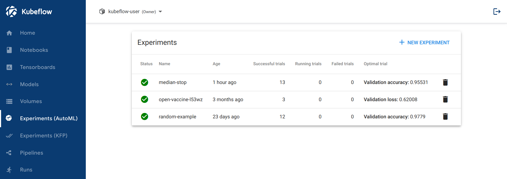
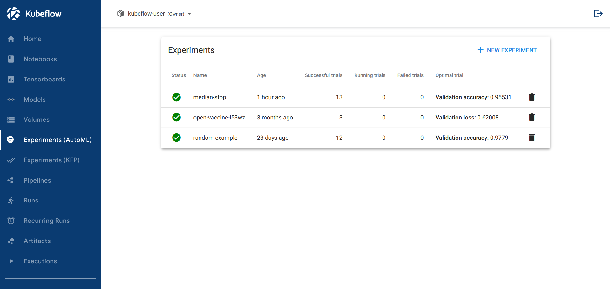
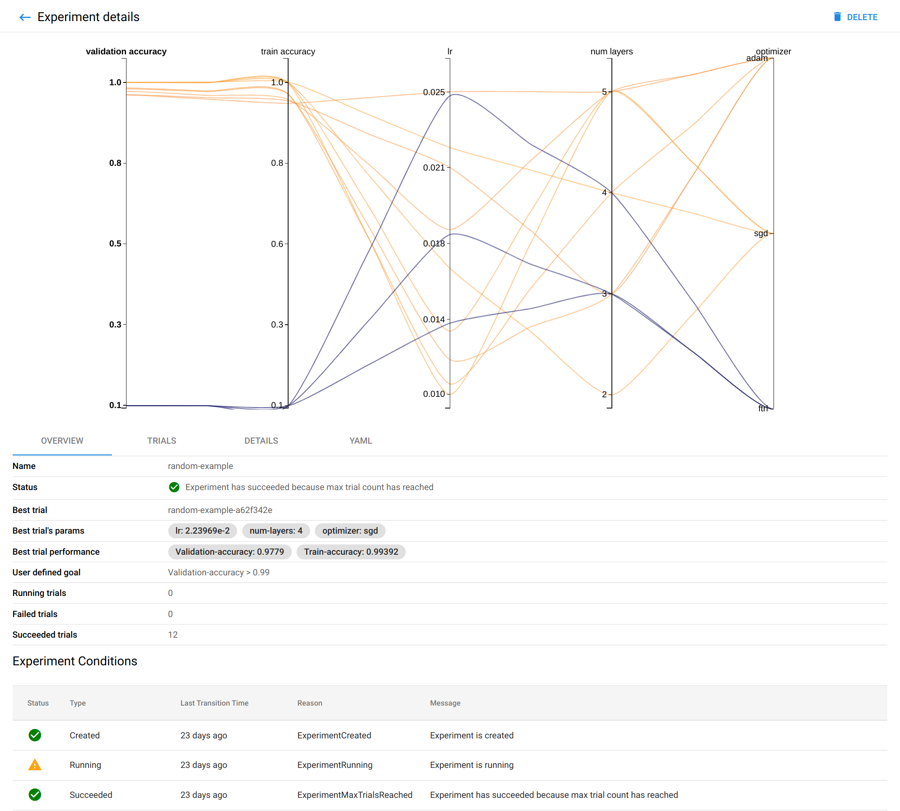
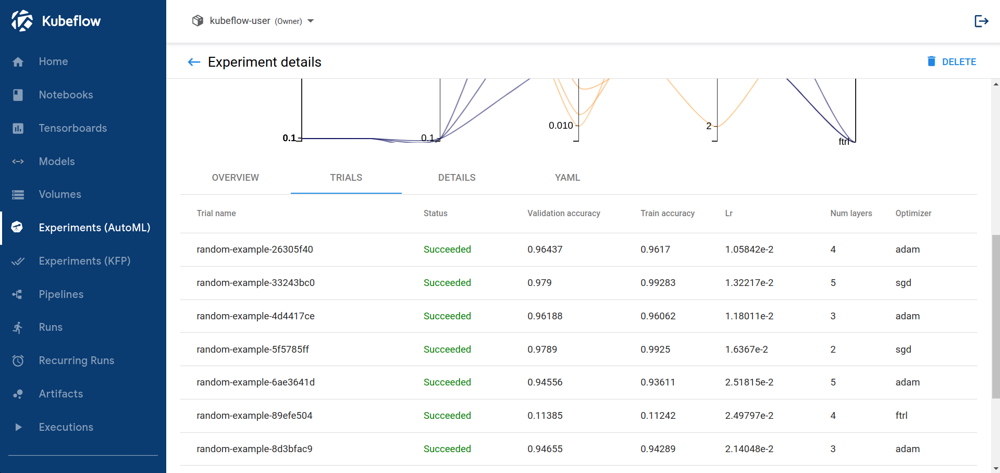
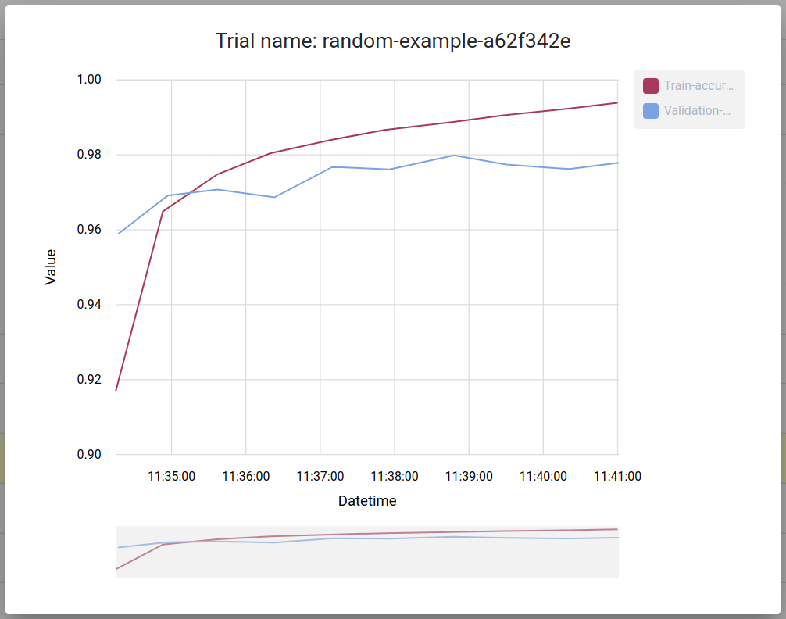

# 開始使用 Katib

**如何設置 Katib 並執行超參數調整**

本指南介紹如何開始使用 Katib 並使用命令行和 Katib 用戶界面 (UI) 運行一些範例來執行超參數調整。

有關 Katib 和超參數調整的概念概述，請查看 [Katib 簡介](./overview.md)。

## Katib setup

### Katib components

運行以下命令以驗證 Katib 組件是否正在運行：

```bash
$ kubectl get pods -n kubeflow

NAME                                READY   STATUS      RESTARTS   AGE
katib-cert-generator-79g7d          0/1     Completed   0          79s
katib-controller-566595bdd8-8w7sx   1/1     Running     0          82s
katib-db-manager-57cd769cdb-vt7zs   1/1     Running     0          82s
katib-mysql-7894994f88-djp7m        1/1     Running     0          81s
katib-ui-5767cfccdc-v9fcs           1/1     Running     0          80s
```

- katib-controller - 管理 Katib Kubernetes CRD 的控制器 (Experiment, Suggestion, Trial)
- katib-ui - Katib 用戶界面。
- katib-db-manager - GRPC API 服務器來控制 Katib 數據庫接口。
- katib-mysql - 用於存儲 Katib 實驗指標的 mysql 數據庫後端。
- (Optional) katib-cert-generator - Katib 獨立安裝的證書生成器。在開發人員指南中了解有關證書生成器的更多信息

## 訪問 Katib 用戶界面

您可以使用 Katib 用戶界面 (UI) 提交實驗並監控您的結果。 Kubeflow 中的 Katib 主頁如下所示：



如果您將 Katib 安裝為 Kubeflow 的一部分，則可以從 Kubeflow UI 訪問 Katib UI：

- 打開 Kubeflow 用戶界面, 查看訪問中央儀表板的指南
- 點擊左側菜單中的 Katib

## 範例

本節介紹一些範例，您可以運行這些範例來試用 Katib。

### 使用隨機搜索算法的範例

您可以通過在 YAML 配置文件中定義實驗來為 Katib 創建實驗。 YAML 文件定義了實驗的配置，包括超參數可行空間、優化參數、優化目標、建議算法等。

此範例使用 YAML 文件作為[隨機搜索](https://github.com/kubeflow/katib/blob/master/examples/v1beta1/hp-tuning/random.yaml)範例。

??? info

    ```yaml
    ---
    apiVersion: kubeflow.org/v1beta1
    kind: Experiment
    metadata:
      namespace: kubeflow
      name: random
    spec:
      objective:
        type: maximize
        goal: 0.99
        objectiveMetricName: Validation-accuracy
        additionalMetricNames:
          - Train-accuracy
      algorithm:
        algorithmName: random
      parallelTrialCount: 3
      maxTrialCount: 12
      maxFailedTrialCount: 3
      parameters:
        - name: lr
          parameterType: double
          feasibleSpace:
            min: "0.01"
            max: "0.03"
        - name: num-layers
          parameterType: int
          feasibleSpace:
            min: "2"
            max: "5"
        - name: optimizer
          parameterType: categorical
          feasibleSpace:
            list:
              - sgd
              - adam
              - ftrl
      trialTemplate:
        primaryContainerName: training-container
        trialParameters:
          - name: learningRate
            description: Learning rate for the training model
            reference: lr
          - name: numberLayers
            description: Number of training model layers
            reference: num-layers
          - name: optimizer
            description: Training model optimizer (sdg, adam or ftrl)
            reference: optimizer
        trialSpec:
          apiVersion: batch/v1
          kind: Job
          spec:
            template:
              spec:
                containers:
                  - name: training-container
                    image: docker.io/kubeflowkatib/mxnet-mnist:latest
                    command:
                      - "python3"
                      - "/opt/mxnet-mnist/mnist.py"
                      - "--batch-size=64"
                      - "--lr=${trialParameters.learningRate}"
                      - "--num-layers=${trialParameters.numberLayers}"
                      - "--optimizer=${trialParameters.optimizer}"
                    resources:
                      limits:
                        memory: "1Gi"
                        cpu: "0.5"
                restartPolicy: Never
    ```

隨機搜索算法範例使用 MXNet 神經網絡來訓練使用 MNIST 數據集的圖像分類模型。您可以在[此處](https://github.com/kubeflow/katib/tree/master/examples/v1beta1/trial-images/mxnet-mnist)查看訓練容器源代碼。該實驗使用各種超參數運行十二個訓練作業並保存結果。

如果您將 Katib 安裝為 Kubeflow 的一部分，則無法在 Kubeflow 命名空間中運行試驗。運行以下命令以更改命名空間並使用隨機搜索範例啟動實驗：

1. 下載範例：

    ```bash
    curl https://raw.githubusercontent.com/kubeflow/katib/master/examples/v1beta1/hp-tuning/random.yaml --output random.yaml
    ```

2. 編輯 `random.yaml` 並更改以下行以使用您的 Kubeflow 用戶配置文件命名空間（例如 `kubeflow-user-example-com`）：

    ```yaml
    namespace: kubeflow-user-example-com
    ```

3. （可選）注意：Katib 的實驗不適用於 Istio sidecar 注入。如果您將 Kubeflow 與 Istio 結合使用，則必須禁用 sidecar 注入。為此，請在實驗的試用模板中指定此註釋：`sidecar.istio.io/inject: "false"`。

    對於提供的帶有 Kubernetes Job 試用模板的隨機搜索範例，註釋應位於 `.trialSpec.spec.template.metadata.annotations` 下。對於 Kubeflow `TFJob` 或其他 training operator，請在[此處](https://www.kubeflow.org/docs/components/training/tftraining/#what-is-tfjob)檢查如何設置註釋。

4. 部署範例：

    ```bash
    kubectl apply -f random.yaml
    ```

此範例將超參數作為參數嵌入。您可以使用 YAML 文件的 `trialTemplate.trialSpec` 部分中定義的模板以其他方式（例如，使用環境變量）嵌入超參數。該模板使用非結構化格式並替換 `trialTemplate.trialParameters` 中的參數。按照[trial template guide](https://www.kubeflow.org/docs/components/katib/trial-template/)了解更多信息。

此範例隨機生成以下超參數：

- `--lr`：學習率。Type: double
- `--num-layers`：神經網絡的層數。Type: integer
- `--optimizer`：改變神經網絡屬性的優化方法。Type: categorical

查看實驗狀態：

```bash
kubectl -n kubeflow-user-example-com get experiment random -o yaml
```

上述命令的輸出應與此類似：

```yaml
apiVersion: kubeflow.org/v1beta1
kind: Experiment
metadata:
  ...
  name: random
  namespace: kubeflow-user-example-com
  ...
spec:
  algorithm:
    algorithmName: random
  maxFailedTrialCount: 3
  maxTrialCount: 12
  metricsCollectorSpec:
    collector:
      kind: StdOut
  objective:
    additionalMetricNames:
    - Train-accuracy
    goal: 0.99
    metricStrategies:
    - name: Validation-accuracy
      value: max
    - name: Train-accuracy
      value: max
    objectiveMetricName: Validation-accuracy
    type: maximize
  parallelTrialCount: 3
  parameters:
  - feasibleSpace:
      max: "0.03"
      min: "0.01"
    name: lr
    parameterType: double
  - feasibleSpace:
      max: "5"
      min: "2"
    name: num-layers
    parameterType: int
  - feasibleSpace:
      list:
      - sgd
      - adam
      - ftrl
    name: optimizer
    parameterType: categorical
  resumePolicy: Never
  trialTemplate:
    failureCondition: status.conditions.#(type=="Failed")#|#(status=="True")#
    primaryContainerName: training-container
    successCondition: status.conditions.#(type=="Complete")#|#(status=="True")#
    trialParameters:
    - description: Learning rate for the training model
      name: learningRate
      reference: lr
    - description: Number of training model layers
      name: numberLayers
      reference: num-layers
    - description: Training model optimizer (sdg, adam or ftrl)
      name: optimizer
      reference: optimizer
    trialSpec:
      apiVersion: batch/v1
      kind: Job
      spec:
        template:
          metadata:
            annotations:
              sidecar.istio.io/inject: "false"
          spec:
            containers:
            - command:
              - python3
              - /opt/mxnet-mnist/mnist.py
              - --batch-size=64
              - --lr=${trialParameters.learningRate}
              - --num-layers=${trialParameters.numberLayers}
              - --optimizer=${trialParameters.optimizer}
              image: docker.io/kubeflowkatib/mxnet-mnist:latest
              name: training-container
              resources:
                limits:
                  cpu: "0.5"
                  memory: 1Gi
            restartPolicy: Never
status:
  conditions:
  - lastTransitionTime: "2023-05-23T14:05:08Z"
    lastUpdateTime: "2023-05-23T14:05:08Z"
    message: Experiment is created
    reason: ExperimentCreated
    status: "True"
    type: Created
  - lastTransitionTime: "2023-05-23T14:07:22Z"
    lastUpdateTime: "2023-05-23T14:07:22Z"
    message: Experiment is running
    reason: ExperimentRunning
    status: "True"
    type: Running
  currentOptimalTrial:
    observation: {}
  runningTrialList:
  - random-fhzhwdhb
  - random-d9jpgknl
  - random-mjptp64x
  startTime: "2023-05-23T14:05:08Z"
  trials: 3
  trialsRunning: 3

```

當 `status.conditions.type` 中的最後一個值為 `Succeeded` 時，實驗完成。您可以在 `status.currentOptimalTrial` 中查看有關最佳試用的信息。

- `.currentOptimalTrial.bestTrialName` 是 trial 名稱。

- `.currentOptimalTrial.observation.metrics` 是 max、min 和 latest 的目標值。

- `.currentOptimalTrial.parameterAssignments` 是對應的超參數集。

除了可用 `status` 來了解實驗性的試驗及其當前狀態。

在Katib UI中查看實驗結果：

1. 打開 Katib UI。

2. 查看實驗列表：

    

3. 點擊 experiment 的名稱 `random-example`。

4. 應該有一張圖表來顯示超參數值（學習率、層數和優化器）的各種組合的驗證級別和訓練精度：

    

5. 圖表下方是在實驗中運行的試驗列表：

    


6. 您可以點擊 trial name 以獲取特定試驗的指標：

    

### TensorFlow 範例

如果您將 Katib 安裝為 Kubeflow 的一部分，則無法在 Kubeflow 命名空間中運行試驗。運行以下命令以使用 Kubeflow 的 [TensorFlow training job operator](https://www.kubeflow.org/docs/components/training/tftraining), `TFJob` 啟動實驗：

1. 下載 `tfjob-mnist-with-summaries.yaml`：

    ```bash
    curl https://raw.githubusercontent.com/kubeflow/katib/master/examples/v1beta1/kubeflow-training-operator/tfjob-mnist-with-summaries.yaml --output tfjob-mnist-with-summaries.yaml
    ```

    ??? info

        ```yaml title="tfjob-mnist-with-summaries.yaml"
        ---
        apiVersion: kubeflow.org/v1beta1
        kind: Experiment
        metadata:
          namespace: kubeflow
          name: tfjob-mnist-with-summaries
        spec:
          parallelTrialCount: 3
          maxTrialCount: 12
          maxFailedTrialCount: 3
          objective:
            type: maximize
            goal: 0.99
            objectiveMetricName: accuracy
          algorithm:
            algorithmName: random
          metricsCollectorSpec:
            source:
              fileSystemPath:
                path: /mnist-with-summaries-logs/test
                kind: Directory
            collector:
              kind: TensorFlowEvent
          parameters:
            - name: learning_rate
              parameterType: double
              feasibleSpace:
                min: "0.01"
                max: "0.05"
            - name: batch_size
              parameterType: int
              feasibleSpace:
                min: "32"
                max: "64"
          trialTemplate:
            primaryContainerName: tensorflow
            # In this example we can collect metrics only from the Worker pods.
            primaryPodLabels:
              training.kubeflow.org/replica-type: worker
            trialParameters:
              - name: learningRate
                description: Learning rate for the training model
                reference: learning_rate
              - name: batchSize
                description: Batch Size
                reference: batch_size
            trialSpec:
              apiVersion: kubeflow.org/v1
              kind: TFJob
              spec:
                tfReplicaSpecs:
                  Worker:
                    replicas: 2
                    restartPolicy: OnFailure
                    template:
                      spec:
                        containers:
                          - name: tensorflow
                            image: docker.io/kubeflowkatib/tf-mnist-with-summaries:latest
                            command:
                              - "python"
                              - "/opt/tf-mnist-with-summaries/mnist.py"
                              - "--epochs=1"
                              - "--learning-rate=${trialParameters.learningRate}"
                              - "--batch-size=${trialParameters.batchSize}"
                              - "--log-path=/mnist-with-summaries-logs"
        ```

2. 編輯 `tfjob-mnist-with-summaries.yaml` 並更改以下行以使用您的 Kubeflow 用戶配置文件命名空間（例如 `kubeflow-user-example-com`）:

    ```bash
    ...
    namespace: kubeflow
    ...
    ```

3. （可選）注意：Katib 的實驗不適用於 Istio sidecar 注入。如果您將 Kubeflow 與 Istio 結合使用，則必須禁用 sidecar 注入。為此，請在實驗的試用模板中指定此註釋：`sidecar.istio.io/inject: "false"`。對於提供的 TFJob 範例，請在[此處](https://www.kubeflow.org/docs/components/training/tftraining/#what-is-tfjob)檢查如何設置註釋。

    ??? info

        ```yaml title="tfjob-mnist-with-summaries.yaml" hl_lines="56-58"
        ---
        apiVersion: kubeflow.org/v1beta1
        kind: Experiment
        metadata:
          namespace: kubeflow-user-example-com
          name: tfjob-mnist-with-summaries
        spec:
          parallelTrialCount: 3
          maxTrialCount: 12
          maxFailedTrialCount: 3
          objective:
            type: maximize
            goal: 0.99
            objectiveMetricName: accuracy
          algorithm:
            algorithmName: random
          metricsCollectorSpec:
            source:
              fileSystemPath:
                path: /mnist-with-summaries-logs/test
                kind: Directory
            collector:
              kind: TensorFlowEvent
          parameters:
            - name: learning_rate
              parameterType: double
              feasibleSpace:
                min: "0.01"
                max: "0.05"
            - name: batch_size
              parameterType: int
              feasibleSpace:
                min: "32"
                max: "64"
          trialTemplate:
            primaryContainerName: tensorflow
            # In this example we can collect metrics only from the Worker pods.
            primaryPodLabels:
              training.kubeflow.org/replica-type: worker
            trialParameters:
              - name: learningRate
                description: Learning rate for the training model
                reference: learning_rate
              - name: batchSize
                description: Batch Size
                reference: batch_size
            trialSpec:
              apiVersion: kubeflow.org/v1
              kind: TFJob
              spec:
                tfReplicaSpecs:
                  Worker:
                    replicas: 2
                    restartPolicy: OnFailure
                    template:
                      metadata:
                        annotations:
                          sidecar.istio.io/inject: "false"
                      spec:
                        containers:
                          - name: tensorflow
                            image: docker.io/kubeflowkatib/tf-mnist-with-summaries:latest
                            command:
                              - "python"
                              - "/opt/tf-mnist-with-summaries/mnist.py"
                              - "--epochs=1"
                              - "--learning-rate=${trialParameters.learningRate}"
                              - "--batch-size=${trialParameters.batchSize}"
                              - "--log-path=/mnist-with-summaries-logs"
        ```

4. 部署範例：

    ```bash
    kubectl apply -f tfjob-mnist-with-summaries.yaml
    ```

5. 您可以檢查實驗的狀態：

    ```bash
    kubectl -n kubeflow-user-example-com get experiment tfjob-mnist-with-summaries -o yaml
    ```

按照上述隨機搜索算法範例所述的步驟在 Katib UI 中獲取實驗結果。

###　PyTorch 範例

如果您將 Katib 安裝為 Kubeflow 的一部分，則無法在 Kubeflow 命名空間中運行試驗。運行以下命令以使用 Kubeflow 的 [PyTorch training job operator](https://www.kubeflow.org/docs/components/training/pytorch), `PyTorchJob` 啟動實驗：

1. 下載 `pytorchjob-mnist.yaml`:

    ```bash
    curl https://raw.githubusercontent.com/kubeflow/katib/master/examples/v1beta1/kubeflow-training-operator/pytorchjob-mnist.yaml --output pytorchjob-mnist.yaml
    ```

    ??? info

        ```yaml title="pytorchjob-mnist.yaml"
        ---
        apiVersion: kubeflow.org/v1beta1
        kind: Experiment
        metadata:
          namespace: kubeflow
          name: pytorchjob-mnist
        spec:
          parallelTrialCount: 3
          maxTrialCount: 12
          maxFailedTrialCount: 3
          objective:
            type: minimize
            goal: 0.001
            objectiveMetricName: loss
          algorithm:
            algorithmName: random
          parameters:
            - name: lr
              parameterType: double
              feasibleSpace:
                min: "0.01"
                max: "0.05"
            - name: momentum
              parameterType: double
              feasibleSpace:
                min: "0.5"
                max: "0.9"
          trialTemplate:
            primaryContainerName: pytorch
            trialParameters:
              - name: learningRate
                description: Learning rate for the training model
                reference: lr
              - name: momentum
                description: Momentum for the training model
                reference: momentum
            trialSpec:
              apiVersion: kubeflow.org/v1
              kind: PyTorchJob
              spec:
                pytorchReplicaSpecs:
                  Master:
                    replicas: 1
                    restartPolicy: OnFailure
                    template:
                      spec:
                        containers:
                          - name: pytorch
                            image: docker.io/kubeflowkatib/pytorch-mnist-cpu:latest
                            command:
                              - "python3"
                              - "/opt/pytorch-mnist/mnist.py"
                              - "--epochs=1"
                              - "--batch-size=16"
                              - "--lr=${trialParameters.learningRate}"
                              - "--momentum=${trialParameters.momentum}"
                  Worker:
                    replicas: 1
                    restartPolicy: OnFailure
                    template:
                      spec:
                        containers:
                          - name: pytorch
                            image: docker.io/kubeflowkatib/pytorch-mnist-cpu:latest
                            command:
                              - "python3"
                              - "/opt/pytorch-mnist/mnist.py"
                              - "--epochs=1"
                              - "--batch-size=16"
                              - "--lr=${trialParameters.learningRate}"
                              - "--momentum=${trialParameters.momentum}"
        ```

2. 編輯 `pytorchjob-mnist.yaml` 並更改以下行以使用您的 Kubeflow 用戶配置文件命名空間（例如 `kubeflow-user-example-com`）:

    ```bash
    ...
    namespace: kubeflow
    ...
    ```

3. （可選）注意：Katib 的實驗不適用於 Istio sidecar 注入。如果您將 Kubeflow 與 Istio 結合使用，則必須禁用 sidecar 注入。為此，請在實驗的試用模板中指定此註釋：`sidecar.istio.io/inject: "false"`。對於提供的 `PyTorchJob` 範例，請在[此處](https://www.kubeflow.org/docs/components/training/tftraining/#what-is-tfjob)檢查如何設置註釋。

    ??? info

        ```yaml title="pytorchjob-mnist.yaml" hl_lines="56-58"
        ---
        apiVersion: kubeflow.org/v1beta1
        kind: Experiment
        metadata:
          namespace: kubeflow-user-example-com
          name: pytorchjob-mnist
        spec:
          parallelTrialCount: 3
          maxTrialCount: 12
          maxFailedTrialCount: 3
          objective:
            type: minimize
            goal: 0.001
            objectiveMetricName: loss
          algorithm:
            algorithmName: random
          parameters:
            - name: lr
              parameterType: double
              feasibleSpace:
                min: "0.01"
                max: "0.05"
            - name: momentum
              parameterType: double
              feasibleSpace:
                min: "0.5"
                max: "0.9"
          trialTemplate:
            primaryContainerName: pytorch
            trialParameters:
              - name: learningRate
                description: Learning rate for the training model
                reference: lr
              - name: momentum
                description: Momentum for the training model
                reference: momentum
            trialSpec:
              apiVersion: kubeflow.org/v1
              kind: PyTorchJob
              spec:
                pytorchReplicaSpecs:
                  Master:
                    replicas: 1
                    restartPolicy: OnFailure
                    template:
                      spec:
                        metadata:
                          annotations:
                            sidecar.istio.io/inject: "false"
                        containers:
                          - name: pytorch
                            image: docker.io/kubeflowkatib/pytorch-mnist-cpu:latest
                            command:
                              - "python3"
                              - "/opt/pytorch-mnist/mnist.py"
                              - "--epochs=1"
                              - "--batch-size=16"
                              - "--lr=${trialParameters.learningRate}"
                              - "--momentum=${trialParameters.momentum}"
                  Worker:
                    replicas: 1
                    restartPolicy: OnFailure
                    template:
                      spec:
                        metadata:
                          annotations:
                            sidecar.istio.io/inject: "false"
                        containers:
                          - name: pytorch
                            image: docker.io/kubeflowkatib/pytorch-mnist-cpu:latest
                            command:
                              - "python3"
                              - "/opt/pytorch-mnist/mnist.py"
                              - "--epochs=1"
                              - "--batch-size=16"
                              - "--lr=${trialParameters.learningRate}"
                              - "--momentum=${trialParameters.momentum}"
        ```

4. 部署範例：

    ```bash
    kubectl apply -f pytorchjob-mnist.yaml
    ```

5. 您可以檢查實驗的狀態：

    ```bash
    kubectl -n kubeflow-user-example-com get experiment pytorchjob-mnist -o yaml
    ```

按照上述隨機搜索算法範例所述的步驟在 Katib UI 中獲取實驗結果。
