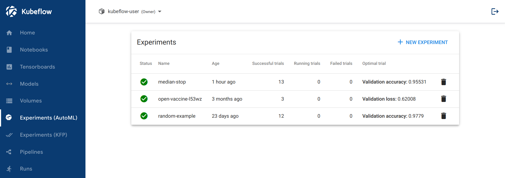

# Katib 簡介

本指南介紹了超參數調整、神經架構搜索和作為 Kubeflow 組件的 Katib 系統的概念。

Katib 是一個用於自動化機器學習 (AutoML) 的 Kubernetes 雲原生項目。 Katib 支持超參數調整、提前停止和神經架構搜索 (NAS)。在 [fast.ai](https://www.fast.ai/2018/07/16/auto-ml2/)、[Google Cloud](https://cloud.google.com/automl)、[Microsoft Azure](https://docs.microsoft.com/en-us/azure/machine-learning/concept-automated-ml#automl-in-azure-machine-learning) 或 [Amazon SageMaker](https://aws.amazon.com/blogs/aws/amazon-sagemaker-autopilot-fully-managed-automatic-machine-learning/) 上了解有關 AutoML 的更多信息。

Katib 是一個與機器學習 (ML) 框架無關的項目。它可以調整以用戶選擇的任何語言編寫的應用程序的超參數，並原生支持許多 ML 框架，例如 TensorFlow、MXNet、PyTorch、XGBoost 等。

Katib 支持多種 AutoML 算法，例如[貝葉斯優化](https://arxiv.org/pdf/1012.2599.pdf)、[Parzen 估計器樹](https://papers.nips.cc/paper/2011/file/86e8f7ab32cfd12577bc2619bc635690-Paper.pdf)、[隨機搜索](https://en.wikipedia.org/wiki/Hyperparameter_optimization#Random_search)、[協方差矩陣自適應進化策略](https://en.wikipedia.org/wiki/CMA-ES)、[Hyperband](https://arxiv.org/pdf/1603.06560.pdf)、[高效神經架構搜索](https://arxiv.org/abs/1802.03268)、[可微分架構搜索](https://arxiv.org/abs/1806.09055)等等。其他新進的算法支持也會隨著不同版本的推進而推出。

[Katib 項目](https://github.com/kubeflow/katib)是開源的。對於想要為項目做出貢獻的開發人員，[開發人員指南](https://github.com/kubeflow/katib/blob/master/docs/developer-guide.md)是一個很好的起點。

## 超參數和超參數調整

超參數是控制模型訓練過程的變量。他們包括：

- 學習率。
- 神經網絡中的層數。
- 每層的節點數。

超參數值在模型訓練的過程是不會被學習的。換句話說，{==相對於節點權重和其他訓練參數，模型訓練過程不會調整超參數值==}。

超參數調整是優化超參數值以最大化模型預測準確性的過程。如果您不使用 Katib 或類似系統進行超參數調整，則需要自己運行許多訓練作業，手動調整超參數以找到最佳值。

自動超參數調整通過優化您在超參數調整作業的配置中指定的目標變量（也稱為目標指標）來工作。一個常見的指標是模型在訓練作業的驗證通過中的準確性（驗證準確性）。您還可以指定是希望超參數調整作業最大化還是最小化指標。

例如，來自 Katib 的下圖顯示了各種超參數值組合（學習率、層數和優化器）的驗證準確度水平：

!!! tip
    要運行生成上述的圖表的範例，請遵循 [getting-started guide](https://www.kubeflow.org/docs/components/katib/hyperparameter/) 的指示。

Katib 在每個超參數調整作業（experiment）中運行多個訓練作業（稱為 trial）。每個試驗測試一組不同的超參數配置。在實驗結束時，Katib 輸出超參數的優化值。

您可以使用 [early stopping](https://en.wikipedia.org/wiki/Early_stopping)技術改進超參數調整實驗。請按照[early stopping guide](https://www.kubeflow.org/docs/components/katib/early-stopping/)了解詳細信息。

## 神經架構搜索

!!! info
    NAS (Neural architecture search) 目前處於 alpha 階段，支持有限。 Kubeflow 團隊對您可能收到的任何反饋都很感興趣，尤其是有關該功能可用性的反饋。您可以在 Katib 問題跟踪器中記錄問題和評論。

除了超參數調整外，Katib 還提供神經架構搜索功能。您可以使用 NAS 來設計您的人工神經網絡，目標是最大限度地提高模型的預測準確性和性能。

NAS 與超參數調整密切相關。兩者都是 AutoML 的子集。超參數調整優化模型的超參數，而 NAS 系統優化模型的結構、節點權重和超參數。

NAS 技術通常使用各種技術來找到最佳的神經網絡設計。

您可以從命令行或 UI 提交 Katib 作業。 （稍後將在本頁了解有關 Katib 界面的更多信息。）以下屏幕截圖顯示了用於從 Katib UI 提交 NAS 作業的表單的一部分：

## Katib 人機介面

您可以使用以下接口與 Katib 交互：

- 可用於提交實驗和監控結果的 Web UI。查看[入門指南](https://www.kubeflow.org/docs/components/katib/hyperparameter/#katib-ui)以獲取有關如何訪問 UI 的信息。 Kubeflow 中的 Katib 主頁如下所示：

    

- 一個 gRPC API。查看 [GitHub 上的 API 參考](https://github.com/kubeflow/katib/blob/master/pkg/apis/manager/v1beta1/gen-doc/api.md)。

- 命令行界面 (CLI)：
    - Kubernetes CLI `kubectl` 可用於針對 Kubeflow 集群運行命令。在 Kubernetes 文檔中了解 kubectl。

- Katib 的 Python SDK。查看 GitHub 上的 [Katib Python SDK 文檔](https://github.com/kubeflow/katib/tree/master/sdk/python/v1beta1)。

## Katib 概念

本節介紹 Katib 中使用的術語。

### Experiment

Experiment 是單次調整運行，也稱為優化運行。

您可指定配置來定義 experiment。以下是主要配置：

- **Objective**: 您要優化的標的。這是 objective metric，也稱為目標變量(target variable)。一個常見的指標是模型在訓練作業的驗證通過中的準確性（驗證準確性）。您還可以指定是希望超參數調整作業最大化還是最小化指標。

- **Search space**: 超參數調整作業應考慮優化的所有可能超參數值的集合，以及每個超參數的約束。搜索空間的其他名稱包括可行集和解空間。例如，您可以提供要優化的超參數的名稱。對於每個超參數，您可以提供最小值和最大值或允許值列表。

- **Search algorithm**: 搜索最佳超參數值時使用的算法。

Katib experiment 被定義為 [Kubernetes CRD (Custom Resource Definition)](https://kubernetes.io/docs/concepts/extend-kubernetes/api-extension/custom-resources/)。

有關如何定義 experiment 的詳細信息，請按照[運行 experiment 的指南](https://www.kubeflow.org/docs/components/katib/experiment/)進行操作。

### Suggestion

Suggestion 是超參數調整過程提出的一組超參數值。 Katib 創建了一個試驗來評估建議的值集。

Katib 的 suggestion 也被定義為 Kubernetes CRD。

### Trial

Trial 是超參數調整過程的一次迭代。一次 trial 對應於一個帶有參數分配列表的工作作業實例。參數分配列表對應於一個 suggestion。

每個實驗 (experiment) 運行幾次試驗 (trial)。實驗運行試驗，直到達到目標或配置的最大試驗次數。

Katib 的 trial 也被定義為 Kubernetes CRD。

### Worker job

Worker job 是運行以評估試驗並且計算其 objective value 的過程。

Worker job 可以是任何類型的 Kubernetes 資源或 Kubernetes CRD。按照 [trial template guide](https://www.kubeflow.org/docs/components/katib/trial-template/#custom-resource)檢查如何在 Katib 中支持您自己的 Kubernetes 資源。

Katib 的 upstream 有這些相關的 CRD:

- [Kubernetes `Job`](https://kubernetes.io/docs/concepts/workloads/controllers/job/)

- [Kubeflow `TFJob`](https://www.kubeflow.org/docs/components/training/tftraining/)

- [Kubeflow `PyTorchJob`](https://www.kubeflow.org/docs/components/training/pytorch/)

- [Kubeflow `MXJob`](https://www.kubeflow.org/docs/components/training/mxnet)

- [Kubeflow `XGBoostJob`](https://www.kubeflow.org/docs/components/training/xgboost)

- [Kubeflow `MPIJob`](https://www.kubeflow.org/docs/components/training/mpi)

- [Tekton `Pipelines`](https://github.com/kubeflow/katib/tree/master/examples/v1beta1/tekton)

- [Argo `Workflows`](https://github.com/kubeflow/katib/tree/master/examples/v1beta1/argo)

通過提供上述 worker 作業類型，Katib 支持多種 ML 框架。