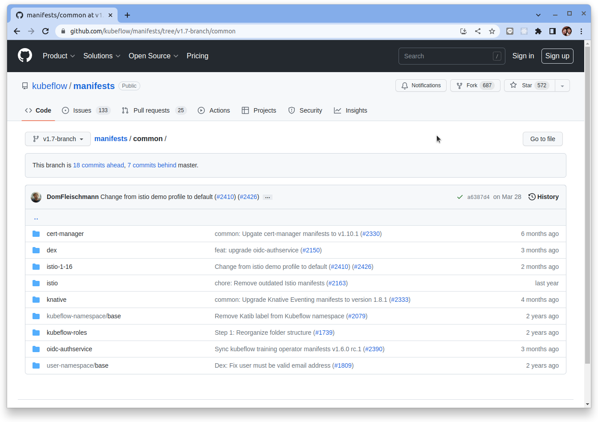

# 使用 Keycloak 作為外部 OIDC 提供者

原文: [Using keycloak as external OIDC provider on kubeflow (instead of dex)](https://velog.io/@hklog/keycloak-kubeflow-dex)

## 了解 kubeflow 的結構

參考 - [Kubeflow OIDC-AuthService](https://github.com/kubeflow/manifests/tree/v1.7-branch/common/oidc-authservice/base)

kubeflow 的 [manifest repo](https://github.com/kubeflow/manifests) 中主要有3個目錄（`apps`/`common`/`contrib`）。

`apps` 目錄中有基礎部署配置（不包括身份驗證）, 如果你想在 dex 中使用 keycloak，你應該更改 `contrib` 的代碼。

本教程是想使用 keycloak 作為 OIDC 提供者而不使用 DEX。

然後我們應該更改 `common` 目錄裡的配置。我們不必更改 "apps" 或 "contrib"。甚至是 "dex"。



common 目錄下有 dex 目錄。但是 kubeflow 不會在身份驗證時直接使用 dex。
Kubeflow 通過 `oidc-authservice` 使用 dex 作為 oidc 提供者。所以必須更改 `oidc-authservice` 目錄的配置代碼。

```
manifests/common/oidc-authservice/base/
├── envoy-filter.yaml
├── kustomization.yaml
├── params.env
├── params.yaml
├── pvc.yaml
├── rbac.yaml
├── secret_params.env
├── service.yaml
└── statefulset.yaml
```

=== "envoy-filter.yaml"

    ```yaml hl_lines="27 40"
    apiVersion: networking.istio.io/v1alpha3
    kind: EnvoyFilter
    metadata:
      name: authn-filter
    spec:
      workloadSelector:
        labels:
          istio: ingressgateway
      configPatches:
        - applyTo: HTTP_FILTER
          match:
            context: GATEWAY
            listener:
              filterChain:
                filter:
                  name: "envoy.http_connection_manager"
          patch:
            # For some reason, INSERT_FIRST doesn't work
            operation: INSERT_BEFORE
            value:
              # See: https://www.envoyproxy.io/docs/envoy/v1.17.0/configuration/http/http_filters/ext_authz_filter#config-http-filters-ext-authz
              name: "envoy.filters.http.ext_authz"
              typed_config:
                '@type': type.googleapis.com/envoy.extensions.filters.http.ext_authz.v3.ExtAuthz
                http_service:
                  server_uri:
                    uri: http://$(AUTHSERVICE_SERVICE).$(AUTHSERVICE_NAMESPACE).svc.cluster.local
                    cluster: outbound|8080||$(AUTHSERVICE_SERVICE).$(AUTHSERVICE_NAMESPACE).svc.cluster.local
                    timeout: 10s
                  authorization_request:
                    allowed_headers:
                      patterns:
                        # XXX: MUST be lowercase!
                        - exact: "authorization"
                        - exact: "cookie"
                        - exact: "x-auth-token"
                  authorization_response:
                    allowed_upstream_headers:
                      patterns:
                        - exact: "kubeflow-userid"
    ```

=== "kustomization.yaml"

    ```yaml
    apiVersion: kustomize.config.k8s.io/v1beta1
    kind: Kustomization

    resources:
    - rbac.yaml
    - service.yaml
    - statefulset.yaml
    - envoy-filter.yaml
    - pvc.yaml

    namespace: istio-system

    configMapGenerator:
    - name: oidc-authservice-parameters
      envs:
      - params.env

    secretGenerator:
    - name: oidc-authservice-client
      type: Opaque
      envs:
      - secret_params.env

    generatorOptions:
      disableNameSuffixHash: true

    vars:
    - name: AUTHSERVICE_NAMESPACE
      objref:
        kind: Service
        name: authservice
        apiVersion: v1
      fieldref:
        fieldpath: metadata.namespace
    - name: AUTHSERVICE_SERVICE
      objref:
        kind: Service
        name: authservice
        apiVersion: v1
      fieldref:
        fieldpath: metadata.name
    configurations:
    - params.yaml
    images:
    - name: gcr.io/arrikto/kubeflow/oidc-authservice
      newName: gcr.io/arrikto/kubeflow/oidc-authservice
      newTag: e236439
    ```

=== "params.env"

    ```
    OIDC_PROVIDER=http://dex.auth.svc.cluster.local:5556/dex
    OIDC_AUTH_URL=/dex/auth
    OIDC_SCOPES=profile email groups
    AUTHSERVICE_URL_PREFIX=/authservice/
    SKIP_AUTH_URLS=/dex
    USERID_HEADER=kubeflow-userid
    USERID_PREFIX=
    USERID_CLAIM=email
    PORT="8080"
    STORE_PATH=/var/lib/authservice/data.db
    ```

=== "params.yaml"

    ```yaml
    varReference:
    - path: spec/configPatches/patch/value/typed_config/http_service/server_uri/uri
      kind: EnvoyFilter
    - path: spec/configPatches/patch/value/typed_config/http_service/server_uri/cluster
      kind: EnvoyFilter
    ```

=== "pvc.yaml"

    ```yaml
    apiVersion: v1
    kind: PersistentVolumeClaim
    metadata:
      name: authservice-pvc
    spec:
      accessModes:
        - ReadWriteOnce
      resources:
        requests:
          storage: 10Gi
    ```

=== "rbac.yaml"

    ```yaml
    apiVersion: v1
    kind: ServiceAccount
    metadata:
      name: authservice

    ---
    apiVersion: rbac.authorization.k8s.io/v1
    kind: ClusterRole
    metadata:
      name: authn-delegator
    rules:
      - apiGroups:
          - authentication.k8s.io
        resources:
          - tokenreviews
        verbs:
          - create

    ---
    apiVersion: rbac.authorization.k8s.io/v1
    kind: ClusterRoleBinding
    metadata:
      name: authn-delegators
    roleRef:
      apiGroup: rbac.authorization.k8s.io
      kind: ClusterRole
      name: authn-delegator
    subjects:
      - kind: ServiceAccount
        name: authservice
    ```

=== "secret_params.env"

    ```
    CLIENT_ID=kubeflow-oidc-authservice
    CLIENT_SECRET=pUBnBOY80SnXgjibTYM9ZWNzY2xreNGQo
    ```

=== "service.yaml"

    ```yaml
    apiVersion: v1
    kind: Service
    metadata:
      name: authservice
    spec:
      type: ClusterIP
      selector:
        app: authservice
      ports:
      - port: 8080
        name: http-authservice
        targetPort: http-api
      publishNotReadyAddresses: true
    ```

=== "statefulset.yaml"

    ```yaml hl_lines="21"
    apiVersion: apps/v1
    kind: StatefulSet
    metadata:
      name: authservice
    spec:
      replicas: 1
      selector:
        matchLabels:
          app: authservice
      serviceName: authservice
      template:
        metadata:
          annotations:
            sidecar.istio.io/inject: "false"
          labels:
            app: authservice
        spec:
          serviceAccountName: authservice
          containers:
          - name: authservice
            image: gcr.io/arrikto/kubeflow/oidc-authservice:e236439
            imagePullPolicy: Always
            ports:
            - name: http-api
              containerPort: 8080
            envFrom:
              - secretRef:
                  name: oidc-authservice-client
              - configMapRef:
                  name: oidc-authservice-parameters
            volumeMounts:
              - name: data
                mountPath: /var/lib/authservice
            readinessProbe:
                httpGet:
                  path: /
                  port: 8081
          securityContext:
            fsGroup: 111
          volumes:
            - name: data
              persistentVolumeClaim:
                  claimName: authservice-pvc
    ```

## 修改佈署配置

1. 修改 `params.env`

  ```bash
  cd manifests/common/oidc-authservice/base/
  nano param.env
  ```

  下面是使用 dex 作身份認證的配置（這是 kubeflow 上的默認授權）:

  ```
  OIDC_PROVIDER=http://dex.auth.svc.cluster.local:5556/dex //dex IdP issuer url
  OIDC_AUTH_URL=/dex/auth // dex auth url
  OIDC_SCOPES=profile email groups
  AUTHSERVICE_URL_PREFIX=/authservice/
  SKIP_AUTH_URLS=/dex
  USERID_HEADER=kubeflow-userid
  USERID_PREFIX=
  USERID_CLAIM=email
  PORT="8080"
  STORE_PATH=/var/lib/authservice/data.db
  ```

  更改配置以使用 keycloak 作為 OIDC provider:

  ```console hl_lines="1-5"
  OIDC_PROVIDER=http://{keycloak_server}:{keycloak-port}/realms/{my_realm} //keycloak issuer URL
  OIDC_AUTH_URL=http://{keycloak_server}:{keycloak-port}/realms/{my_realm}/protocol/openid-connect/auth // keycloak authorization_endpoint
  OIDC_SCOPES=profile email groups // Gotta match to keycloak setting
  AUTHSERVICE_URL_PREFIX=/authservice/
  REDIRECT_URL=http://{kubeflow_server}:{kubeflow-port}/login/oidc
  SKIP_AUTH_URI=/keycloak
  USERID_HEADER=kubeflow-userid
  USERID_PREFIX=
  USERID_CLAIM=email
  PORT="8080"
  STORE_PATH=/var/lib/authservice/data.db
  ```

2. 修改 `secret-params.env`

  ```bash
  cd manifests/common/oidc-authservice/base/
  nano secret_param.env
  ```

  ```yaml
  CLIENT_ID=kubeflow (your client id from keycloak)
  CLIENT_SECRET={your client secret}
  ```

3. 將新的配置在 Kubeflow 上生效

  ```bash
  ~/manifests/common/oidc-authservice/base# kustomize build | kubectl delete -f -
  ~/manifests/common/oidc-authservice/base# kustomize build | kubectl apply -f -
  ```

4. 在 keycloak 上配置 client scope

  將client scope添加到 kubeflow(client) 上, 有時候會添加 "groups" (不要忘記添加 predefined mappers)。


5. 在 keycloak 上配置 client

  我們需要將 “Valid Redirect URI” 設置為 `http://{kubeflow_server}:{kubeflow_port}/login/oidc/*`

  這應該與 kubeflow 的 `params.env` 中的 `redirect_url` 部分相匹配。

