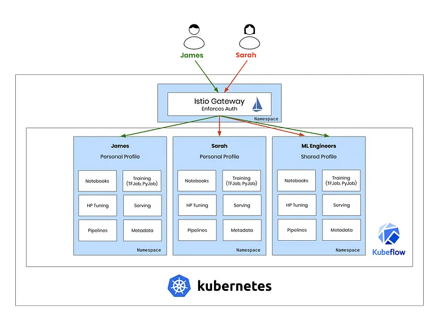
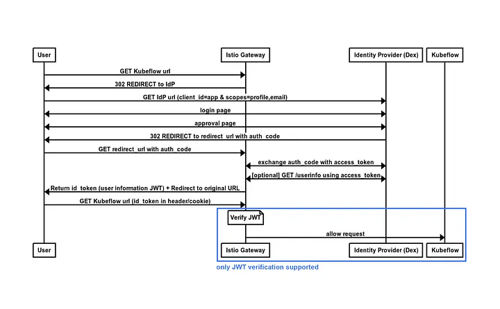
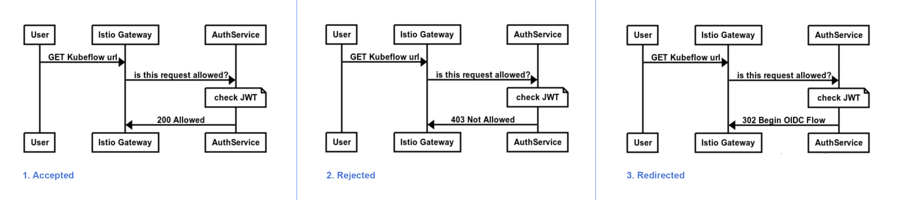
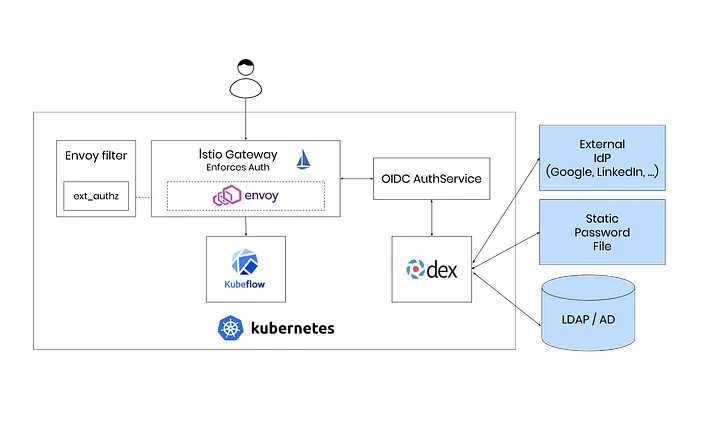
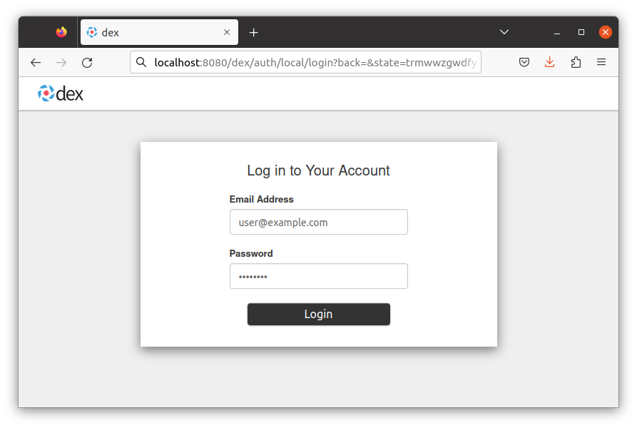

# 使用 Istio + Dex 進行身份驗證

原文: [Kubeflow: Authentication with Istio + Dex](https://journal.arrikto.com/kubeflow-authentication-with-istio-dex-5eafdfac4782)

多租戶是 Kubeflow 0.6 的核心功能，提供靈活的身份驗證方案對於企業用例非常重要。

在本文中，我們將探討如何利用 Istio 和開源組件的強大功能來創建靈活、健壯和乾淨的身份驗證解決方案。

該解決方案特別強大，因為：

- 它利用了 Istio 的特性並且不添加額外的組件。
- 它可以在任何 Kubernetes 集群上工作，並且不依賴於訪問 API-Server。
- 它是一個通用的解決方案，可以應用於 Kubeflow 以外的其他項目。

讓我們深入研究解決方案。

## 最終目標

我們將專注於使用 Istio 執行最終用戶身份驗證，這意味著我們的應用程序將不包含任何身份驗證邏輯！

用戶訪問應用程序的身份驗證將在 Istio 網關完成：所有流量進入集群的一個點。

身份驗證是開發人員可能選擇留給 Istio 的一個主要領域。這個想法很簡單：

- 傳入流量包括用於身份驗證的 JSON Web 令牌 (JWT)。
- JWT 由 Istio 網關驗證。
- 集群內的應用程序信任 JWT，因為它已通過網關驗證。



這樣，我們的應用程序根本不需要包含身份驗證邏輯！不幸的是，事情並沒有那麼簡單。

## Istio 中的身份驗證

乍一看，Istio 似乎支持最終用戶身份驗證。

但是，請注意 Istio 如何只能執行最後一部分，{==令牌驗證==}（即驗證 JWT 並允許請求）。

問題是：我們首先要如何獲得該令牌？

讓我們先進入到 OpenID Connect (OIDC)：一種使用標準化 OAuth2 流程對用戶進行身份驗證的方法。

## OIDC 流程

一圖勝千言，我們來看看OIDC的流程是長什麼樣子的。



請注意 Istio 如何只能執行最後一部分，令牌驗證。因此，我們需要一個新實體來充當 OIDC 客戶端並執行流程。


## Envoy - Istio 背後的力量

正如你們中的許多人已經知道的那樣，Istio 主要位於控制路徑中。在背後，數據由 [Envoy](https://www.envoyproxy.io/) 處理，這是一個非常高效和多功能的代理。

為什麼這是相關的？

Istio 允許您使用 EnvoyFilter 對象配置其底層 Envoy 代理。[EnvoyFilter 對象](https://istio.io/docs/reference/config/networking/v1alpha3/envoy-filter/)使我們能夠在某些代理的數據路徑中插入 [Envoy 過濾器](https://www.envoyproxy.io/docs/envoy/latest/configuration/http_filters/http_filters)。

在我們的例子中，我們想要配置 Istio 網關的 Envoy 代理。但是我們應該使用什麼過濾器呢？

### ext_authz HTTP 過濾器


`ext_authz` HTTP 過濾器是 Envoy 極其強大和通用的功能。

```yaml title="Example EnvoyFilter using ext_authz HTTP Filter"
apiVersion: networking.istio.io/v1alpha3
kind: EnvoyFilter
metadata:
  name: authn-filter
spec:
  workloadLabels:
    istio: ingressgateway
  filters:
  - filterConfig:
      httpService:
        serverUri:
          uri: http://authservice.istio-system.svc.cluster.local
          cluster: outbound|8080||authservice.istio-system.svc.cluster.local
        authorizationRequest: 
          allowedHeaders:
            patterns:
            - exact: "cookie"
    filterName: envoy.ext_authz
    filterType: HTTP
    listenerMatch:
      portNumber: 443
      listenerType: GATEWAY
```

它的功能很簡單：

- 每個請求都被轉發到授權服務 (AuthService)。根據答案，該響應可以是：

    - Accepted
    - Rejected
    - Redirected



### OIDC AuthService

我們需要實現處理上列操作的組件。幸運的是，有一個開源工具我們可以重用它來達到這個目的，即 [arrikto/oidc-authservice](https://github.com/arrikto/oidc-authservice) 項目。


## 整合

我們的 Istio 網關現在可以充當 OIDC 客戶端並執行整個流程以對用戶進行身份驗證。

讓我們使用流行的 OIDC 提供商 Dex 對其進行測試。

Dex 支持多種身份驗證後端，包括靜態用戶、LDAP 和外部身份提供程序，因此您可以擁有選擇的權力。

最終架構如下：



## 展示 Demo

所有上述功能都適用於 [Kubeflow v1.7](https://v1-7-branch.kubeflow.org/)。

要安裝這個參考架構的方式, 請參考:[手動安裝 Kubeflow](../../../env/kubeflow-install.md)。

只需按照上述文檔中的說明進行操作，您就應該擁有一個帶有 Kubeflow、Istio 和用於身份驗證的 Dex 的 Kubernetes 集群。



## 最後的想法

在本文中，我們解鎖了 Envoy Proxy 的強大功能，並使用 Istio 與 Dex 和 OIDC AuthService 一起構成了一個完整的 Authentication 架構。這使應用程序能夠將所有身份驗證邏輯卸載到 Istio 並專注於業務邏輯，這非常適合 Kubeflow 的面向微服務的架構。

Envoy 的 `ext_authz` 功能在 Istio 用戶群中並不是很出名，但它是一個非常強大的功能，使我們能夠與幾乎任何身份驗證方案集成。