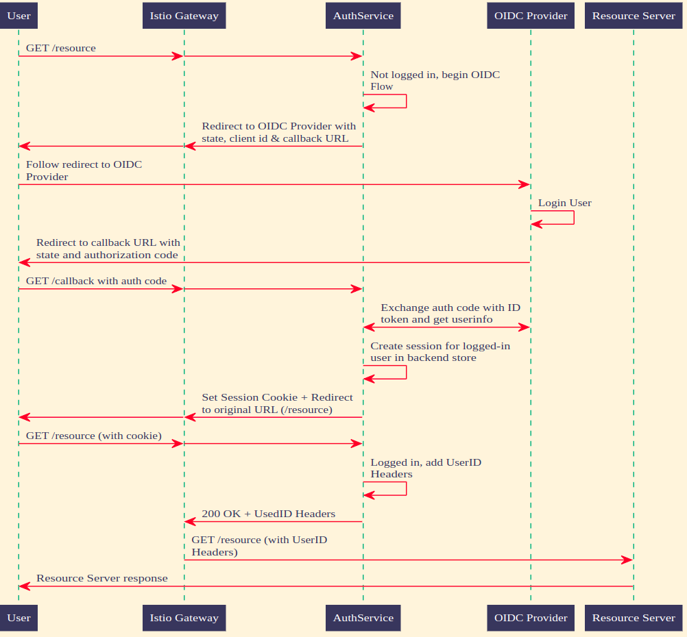

# Kubeflow OIDC 身份感知代理 (OIDC AuthService)

參考: [arrikto/oidc-authservice](https://github.com/arrikto/oidc-authservice)

**AuthService** 是 API 網關（例如 Ambassador、Envoy）詢問傳入請求是否獲得授權的 HTTP 服務器。

有關詳細信息，請參閱[Kubeflow: Authentication with Istio + Dex](https://journal.arrikto.com/kubeflow-authentication-with-istio-dex-5eafdfac4782)。

## OpenID Connect

[OpenID Connect (OIDC)](http://openid.net/connect/) 是 OAuth 2.0 協議之上的身份驗證層。由於 OpenID Connect 完全支持 OAuth 2.0，因此現有的 OAuth 2.0 實現可以開箱即用。

目前 OIDC AuthService 只支持 OIDC 的 [Authorization Code Flow](http://openid.net/specs/openid-connect-basic-1_0.html#CodeFlow)，類似於 OAuth 2.0 Authorization Code Grant。

### 身份驗證流程的序列圖

## 架構

AuthService 包含兩個服務器進程。

- Judge Server，用於與代理通信，詢問是否允許請求。代理（Envoy，Ambassador，...）將在 Judge Server 上發出請求，使用與它要詢問的請求相同的方法和標頭。如果請求通過身份驗證，則 Judge Server 回復 200，並將原始請求轉發到上游。如果請求被禁止，authservice 將回復重定向以啟動 OIDC 登錄。

- Web 服務器，用於託管用戶需要訪問的必要端點。這些端點包括 OIDC 客戶端重定向 URL、註銷端點和幫助程序 HTML 頁面。

### 選項

AuthService 使用以下環境變量。

**Compulsory**:

| Setting | Description |
| - | - |
| `OIDC_PROVIDER` |  URL to your OIDC provider. AuthService expects to find information about your OIDC provider at `OIDC_PROVIDER/.well-known/openid-configuration`, and will use this information to contact your OIDC provider and initiate an OIDC flow later on.|
| `AUTHSERVICE_URL_PREFIX` | AuthService expects end users will be able to access its Web-based UI from the outside world at `AUTHSERVICE_URL_PREFIX`. Usually, it's in the form of `<APP_URL>/authservice/` It expects that your API Gateway will route any URL that starts with `AUTHSERVICE_URL_PREFIX` to it, so it can expose its default Web-based UI and API endpoints. AuthService will use this value to auto-generate sane defaults for a number of settings, including `HOMEPAGE_URL`, `LOGOUT_URL`, and `AFTER_LOGOUT_URL`. The default value, `/authservice/` will work out of the box with an Istio `VirtualService` specifying `/authservice/` as its `prefix`. |
| `CLIENT_ID` | AuthService will use this Client ID when it needs to contact your OIDC provider and initiate an OIDC flow. |
| `CLIENT_SECRET` | AuthService will use this Client Secret to authenticate itself against your OIDC provider in combination with `CLIENT_ID` when attempting to access your OIDC Provider's protected endpoints |

**Optional**:

| Setting | Default | Description |
| - | - | - |
| `REDIRECT_URL` | `AUTHSERVICE_URL_PREFIX/oidc/callback` | AuthService will pass this URL to the OIDC provider when initiating an OIDC flow, so the OIDC provider knows where it needs to send the OIDC authorization code to. It defaults to `AUTHSERVICE_URL_PREFIX/oidc/callback`. This assumes that you have configured your API Gateway to pass all requests under a hostname to Authservice for authentication. |
| `OIDC_AUTH_URL` | `<empty>` | AuthService will initiate an Authorization Code OIDC flow by hitting this URL. Normally discovered automatically through the OIDC Provider's well-known endpoint. |
| `CLIENT_NAME` | `AuthService` |A user-visible description for AuthService as an OIDC Client. It is recommended that you set it to a user-visible name for the application/domain that AuthService protects, e.g., `MyApp`. AuthService will *not* use this as part of contacting your OIDC Provider, but it will use it to auto-generate user-visible message in the frontend. , e.g., "You are now logged out of MyApp. Click here to log in again." |
| `OIDC_SCOPES` | `openid,email` | Comma-separated list of [scopes](https://openid.net/specs/openid-connect-core-1_0.html#ScopeClaims) to request access to. The `openid` scope is always added. |
| `AUDIENCES` | `istio-ingressgateway.istio-system.svc.cluster.local` | Audiences that the authservice identifies as. Used for authenticators that support audience-scoped tokens. Currently, that is only the Kubernetes authenticator. The default value assumes that the authservice is used at the Istio Gateway in namespace `istio-system`.|
| `SERVER_HOSTNAME` | `<empty>` | Hostname to listen for judge requests. This is the server that proxies contacts to ask if a request is allowed. The default empty value means all IPv4/6 interfaces (0.0.0.0, ::). |
| `SERVER_PORT` | `8080` | Port to listen to for judge requests. This is the server that proxies contacts to ask if a request is allowed. |
| `SKIP_AUTH_URLS` | `<empty>` | Comma-separated list of URL path-prefixes for which to bypass authentication. For example, if `SKIP_AUTH_URL` contains `/my_app/` then requests to `<url>/my_app/*` are allowed without checking any credentials. Contains nothing by default. |
| `CA_BUNDLE` | `<empty>` | Path to file containing custom CA certificates to trust when connecting to an OIDC provider that uses self-signed certificates. |
| `AFTER_LOGIN_URL` | `<originally visited url>` | URL to redirect the user to after they login. Defaults to the URL that the user originally visited before they were redirected for login. For example, if a user visited `<app_url>/example` and were redirected for login, they will be redirected to `/example` after login is complete. |
| `HOMEPAGE_URL` | `AUTHSERVICE_URL_PREFIX/site/homepage` | Homepage of the application that can be accessed by anonymous users. |
| `AFTER_LOGOUT_URL` | `AUTHSERVICE_URL_PREFIX/site/homepage` | URL to redirect the user to after they logout. This option used to be called `STATIC_DESTINATION_URL`. For backwards compatibility, the old environment variable is also checked.|
| `VERIFY_AUTH_URL` | `AUTHSERVICE_URL_PREFIX/verify` | Path to the `/verify` endpoint. This endpoint examines a subrequest and returns `204` if the user is authenticated and authorized to perform such a request, otherwise it will return `401` if the user cannot be authenticated or `403` if the user is authenticated but they are not authorized to perform this request. |
| `AUTH_HEADER` | `Authorization` | When the AuthService logs in a user, it creates a session for them and saves it in its database. The session secret value is saved in a cookie in the user's browser. However, for programmatic access to endpoints, it is better to use headers to authenticate. The AuthService also accepts credentials in a header configured by the `AUTH_HEADER` setting. |
| `ID_TOKEN_HEADER` | `Authorization` | When id token is carried in this header, OIDC Authservice verifies the id token and uses the `USERID_CLAIM` inside the id token. If the `USERID_CLAIM` doesn't exist, the authentication would fail.|
| `LOG_LEVEL` | "INFO" | Set the log level to one of "FATAL", "ERROR", "WARN", "INFO", or "DEBUG" to specify the verbosity of the OIDC-Authservice logs. |

AuthService 為 Web 服務器提供了一些默認頁面，用於主頁和 after_logout 頁面。以下值與這些頁面有關。要了解有關這些頁面如何工作的更多信息，請參閱[模板指南](https://github.com/arrikto/oidc-authservice/blob/master/docs/templates.md)。

默認情況下，此 Web 服務器偵聽端口 `8082`，其端點為：

| Endpoint | Description |
| - | - |
| `/site/homepage` | Landing page |
| `/site/after_logout` | After Logout page |
| `/site/themes` | Themes |

要在帶有 Istio 的 Kubernetes 等環境中公開 Web 服務器，您需要：

- 創建指向 AuthService 的 Web 服務器端口 (8082) 的服務。
- 創建一個 Istio VirtualService 來匹配流量與 `$AUTHSERVICE_URL_PREFIX` 路徑前綴並將其定向到您創建的服務。通常，`AUTHSERVICE_URL_PREFIX` 格式為“<url>/<path>”（例如，“<url>/authservice”）。確保你的 VirtualService 使用 `<path>` 捕獲請求。

| Setting | Default | Description |
| - | - | - |
| `TEMPLATE_PATH` | `web/templates/default` | A comma-separated list of dirs to look under for templates. Templates with the same name override previously registered ones. For more information, see [the templating guide](./templates.md). It always contains the default templates. |
| `CLIENT_NAME` | `AuthService` | A human-readable name for the client. Used in the web server's pages. |
| `THEMES_URL` | `themes` | URL where the themes are served. Theme assets are found under `THEMES_URL/THEME`. To learn how you can create your own theme, see [the templating guide](./templates.md). |
| `THEME` | `kubeflow` | Path under `THEMES_URL` where the theme assets are served. |
| `TEMPLATE_CONTEXT_<key>` | `empty` | Variables that will end up in the user-defined map in the template context. For example, if you define `TEMPLATE_CONTEXT_KEY=VALUE`, then a `KEY: VALUE` entry will be added to the user-defined map in the template context. Used to pass values to site templates and allow for further customization. |

OIDC-AuthService 將會話和其他狀態存儲在本地文件中。用戶可以選擇使用默認選項 BoltDB 或會話存儲的 redis。
Session存儲相關設置：

| Setting | Default | Description |
| - | - | - |
| `SESSION_STORE_PATH` | "/var/lib/authservice/data.db" | Path to local session store. Backed by BoltDB. |
| `OIDC_STATE_STORE_PATH` | "/var/lib/authservice/oidc_state.db" | Path to the session store used to save the sessions for the OIDC state parameter. |
| `SESSION_MAX_AGE` | "86400" | Time in seconds after which sessions expire. Defaults to a day (24h). |
| `SESSION_SAME_SITE` | "Lax" | SameSite attribute of the session cookie. Check details of SameSite attribute [here](https://developer.mozilla.org/en-US/docs/Web/HTTP/Headers/Set-Cookie/SameSite). Its value can be "None", "Lax" or "Strict". |
| `SESSION_STORE_TYPE`| "boltdb" | Set `SESSION_STORE_TYPE` to either "boltdb" to use BoltDB as the session store, or "redis" to use redis as the session store. Note that only one of the two can be used, also if you select redis then depending on your redis configurations then you might need to set the password and the number of the database that OIDC-AuthService will use as a [redis-client](https://redis.uptrace.dev/guide/go-redis.html#connecting-to-redis-server).|
| `SESSION_STORE_REDIS_ADDR`| "127.0.0.1:6379" | Set the `host:port` address for the redis session store. |
| `SESSION_STORE_REDIS_PWD`| "" | Set the password to connect with the redis session store. |
| `SESSION_STORE_REDIS_DB`| 0 | Set the number of the database that AuthService should use. If not configured and if the redis session store is selected, then AuthService will use the default redis database. |

默認情況下，AuthService 保持會話以檢查用戶是否已通過身份驗證。但是，有時可能會我們想檢查用戶在提供者處的登錄狀態，有效地使提供者保持用戶的登錄狀態，以實現訪問撤銷場景和集中管理。

| Setting | Default | Description |
| - | - | - |
| `STRICT_SESSION_VALIDATION` | `false` | Be strict about session validity by quering the OIDC provider for the validity of the token at each individual request, by hitting the userinfo endpoint. This ensures the authservice can detect an OIDC token has been revoked on the OIDC provider immediately, and destroy its own session. However, it may increase the load on the OIDC provider and introduces additional latency. Disabled by default, enable with "on" OR "true". |

OIDC AuthService 可以根據檢測到的用戶 ID 添加額外的標頭。然後應用程序可以使用這些標頭來識別用戶。

| Setting | Default | Description |
| - | - | - |
| `USERID_CLAIM` | "email" |Claim whose value will be used as the userid (default `email`). |
| `GROUPS_CLAIM` | "groups" | Claim whose value will be used as the user's groups (default `groups`) |
| `USERID_HEADER` | "kubeflow-userid" | Name of the header containing the user-id that will be added to the upstream request. |
| `USERID_PREFIX` | "" | Prefix to add to the userid, which will be the value of the `USERID_HEADER`. |
| `USERID_TRANSFORMERS` | "" | List of transformations for the userid value (from `USERID_CLAIM`) in JSON format `[{"matches": "regex", "replaces": "value"}, ...]`. OIDC AuthService will evaluate the transformation rules in order and if the `matches` pattern matches the userid, the match is replaced by the `replaces` value.  **If multiple rules match, only the first one is applied** and if no rule matches the userid, the original userid will be used. For the `matches` regular expression, use the standard `golang` syntax [(more info)](https://golang.org/pkg/regexp/). Note that a regular expression is a string and the `\` **must be escaped** (using `\\`). For example using `USERID_TRANSFORMERS = '[{"matches": "user@domain\\.com$", "replaces": "internal"}, {"matches": "@domain\\.com$", "replaces": ""}]'`, AuthService will do the following transformation:  `user@domain.com` -> `internal` and `another@domain.com` -> `another`. |
| `GROUPS_HEADER` | "kubeflow-groups" | Name of the header containing the groups that will be added to the upstream request. |
| `AUTH_METHOD_HEADER` | "Auth-Method" | Name of the header that is included in the proxied requests to inform the upstream app about the authentication method used (`cookie` / `header`). |

OIDC AuthService 可以根據在請求的授權標頭中找到的不記名令牌對客戶端進行身份驗證。它緩存承載令牌和相應的用戶信息。如果傳入請求具有緩存的不記名令牌，則 AuthService 會驗證此客戶端並繼續進行基本授權檢查。下列
設置與緩存機制相關：

| Setting | Default | Description |
| - | - | - |
| `CACHE_ENABLED` | `false` | Set `CACHE_ENABLED` to `true` to enable caching. |
| `CACHE_EXPIRATION_MINUTES` | `5` (minutes) | Set the `CACHE_EXPIRATION_MINUTES` value to define how many minutes it takes for every cache entry to expire. |

默認情況下，OIDC AuthService 嘗試使用它支持的每一種可用身份驗證方法對客戶端請求進行身份驗證。在某些用例中，管理員可能希望跳過由一種或多種身份驗證方法執行的檢查。 OIDC AuthService 可以通過以下配置配置為跳過特定的身份驗證方法：

| Setting | Default | Description |
| - | - | - |
| `IDTOKEN_AUTHN_ENABLED` | `true` | Set `IDTOKEN_AUTHN_ENABLED` to `false` to disable the ID token authentication method. |
| `KUBERNETES_AUTHN_ENABLED` | `true` | Set `KUBERNETES_AUTHN_ENABLED` to `false` to disable the Kubernetes authentication method. |
| `ACCESS_TOKEN_AUTHN_ENABLED` | `true` | Set `ACCESS_TOKEN_AUTHN_ENABLED` to `false` to disable both the access token authentication methods. |
| `ACCESS_TOKEN_AUTHN` | "jwt" | Set `ACCESS_TOKEN_AUTHN` to either "jwt" to enable the JWT access token authentication method, or "opaque" to enable the opaque access token authentication method. Note that only one of the two access token authentication methods can be used. |

OIDC AuthService 還可以執行基本的授權檢查。下列設置與授權相關：

| Setting | Default | Description |
| - | - | - |
| `GROUPS_ALLOWLIST` | "*" | List of groups that are allowed to pass authorization. By default, all groups are allowed. If you change this option, you may want to include the `system:serviceaccounts` group explicitly, if you need the AuthService to accept ServiceAccountTokens. |
| `EXTERNAL_AUTHZ_URL` | "" | Use an external authorization service. This option is disabled by default, to enable set the value to the target external authorization service (e.g. `EXTERNAL_AUTHZ_URL=http://authorizer/auth`). If you have enabled this option then for a request to be authorized, **both** the group and the external authorization service will have to allow the request. |

## 用法

OIDC-Authservice 是一個 OIDC Client，它使用 OIDC Provider 對用戶進行身份驗證並為他們分配一個會話。可用於：

- Ambassador with AuthService
- 使用 ext_authz 過濾器的 Envoy
- 帶 EnvoyFilter 的 Istio，指定 ext_authz