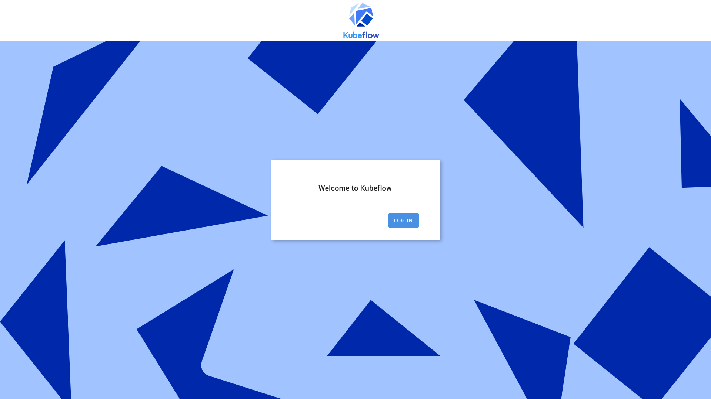

# AuthService 頁面模板

參考: [Templates](https://github.com/arrikto/oidc-authservice/blob/master/docs/templates.md)

AuthService 作為 Kubeflow OIDC 身份感知代理, 在完成 OAuth2 的 `code flow` 的流程時需要提供幾個幫助頁面（主頁、after_logout）。這些頁面是使用 HTML 模板呈現的。

## 覆蓋模板

HTML 模板的文件結構如下：

```
web
|---- templates
      |---- default
            |----homepage.html
            |----after_logout.html
```

您可以使用 `TEMPLATE_PATH` 環境變量覆蓋任何預定義的模板。 `TEMPLATE_PATH` 設置定義了一個目錄列表，用於查找模板（以 `.html` 結尾的文件）。在 `TEMPLATE_PATH` 中找到的模板將被加載，並且與現有模板同名的模板將覆蓋它們。

### Example

我們想為 GitLab 製作一個自定義 `logout` 頁面，其中包含一個指向 GitLab `logout` URL 的按鈕。

- 我們為頁面創建自己的模板並將其命名為 `after_logout.html`。
- 我們將這個模板放在一個名為 `gitlab` 的文件夾中。
- 我們將 `TEMPLATE_PATH` 設置為指向該文件夾：`TEMPLATE_PATH=/path/to/gitlab`。
- `AuthService` 啟動，我們的模板覆蓋默認的 `after_logout.html` 模板。

最終結果可能如下所示：

```
web
|---- templates
      |---- default
            |---- homepage.html
            |---- after_logout.html
      |---- gitlab
            |---- after_logout.html
```

順便一提，`AuthService` 附帶一個 GitLab 模板，可以通過設置 `TEMPLATE_PATH=/path/to/web/templates/gitlab` 來啟動。

## 編寫模板

我們談到了覆蓋模板，但我們如何編寫自己的模板呢？使用 [Go 模板庫](https://golang.org/pkg/text/template/)呈現模板。要了解有關語法的更多信息，請參閱庫文檔。

### Context

模板根據 context 呈現頁面，context 是僅在運行時可用的 values/functions。

**Values:**

當前，在每個模板的 context 中傳遞以下值：

- `ProviderURL`：OIDC 提供商的 URL。
- `ClientName`：OIDC 客戶端的人類可讀名稱。
- `ThemeURL`：提供主題資產的 URL。

此外，用戶可以通過 `TEMPLATE_CONTEXT_KEY=VALUE` 環境變量提供自己的值。這些將可以在名為 Frontend 的 map 中訪問，並且可以像這樣訪問：

```golang
{{index .Frontend "KEY"}}
```

**Functions:**

[Go模板庫](https://golang.org/pkg/text/template/#hdr-Functions)的默認函數。此外，還定義了以下函數：

| Function | Description | Example |
| - | - | - |
| `resolve_url_ref` | Resolves a reference to the given URL. |
  `{{ resolve_url_ref "https://example.com" "/some/path" }}` returns `https://example.com/some/path` | 

## 網頁 Themes

默認模板帶有一些預定義的主題。主題是頁面的視覺定制，而內容/結構保持不變。在這種情況下，主題是一組要使用的不同圖像加上不同的 CSS。

### 怎麼運行的

AuthService 帶有一個包含的 kubeflow 主題。



kubeflow 主題正在自定義頁面 CSS 和圖像。這是模板的樣子：

```html
{{ template "header.html" . }}

<body>
    <div class="wrapper">
      <header class="header">
        
      </header>
      <main class="main" style="background-image:url({{ .ThemeURL }}/bg.svg);">
        <div class="box">
          <div class="box-content">
            You have successfully logged out from {{.ClientName}}
          </div>
          <form class="button-wrapper" action="/" method="get" target="_self">
            <input class="button uppercase" type="submit" value="Log in" />
          </form>
        </div>
      </main>
    </div>
  </body>

{{ template "footer.html" . }}
```

我們看到該模板將根據所選主題加載不同的圖像：

```html
        
...
      <main class="main" style="background-image:url({{ .ThemeURL }}/bg.svg);">
```

主題位於 `web/themes` 下，它們的結構是：

```
web
|---- themes
      |---- kubeflow
            |---- bg.svg
            |---- logo.svg
            |---- styles.css
```

要讓 `AuthService` 使用我們的主題，我們必須更改 `WEB_SERVER_THEME` 和/或 `WEB_SERVER_THEMES_URL` 設置。我們可以：

- 將我們的主題複製到 `AuthService` 鏡像中（例如，使用 `ConfigMap`），在 `web/themes` 下並將 `WEB_SERVER_THEME` 設置為 `my_theme`。
- 通過將 `WEB_SERVER_THEMES_URL` 設置為提供主題的服務器 URL，將 `WEB_SERVER_THEME` 設置為主題名稱，從我們自己的服務器提供主題。

### 主題兼容模板

回到之前的 GitLab 示例，我們將編寫 GitLab `after_logout.html` 模板以與預定義的主題兼容。為此，它應該使用主題資產，例如默認的 `after_logout.html` 模板。

當前的主題 assets 有：

- 徽標圖像: `logo.svg`
- 背景圖片: `bg.svg`
- 樣式表: `styles.css`

```html
{{ template "header.html" . }}

<body>
    <div class="wrapper">
      <header class="header">
        
      </header>
      <main class="main" style="background-image:url({{ .ThemeURL }}/bg.svg);">
        <div class="box">
          <div class="box-content">
            You have successfully logged out from {{.ClientName}}
          </div>
          <form
            class="button-wrapper"
            action="{{resolve_url_ref .ProviderURL "/users/sign_out"}}"
            method="post"
            target="_self"
          >
            <input
              class="button uppercase"
              type="submit"
              value="Log out from GitLab"
            />
          </form>
        </div>
      </main>
    </div>
  </body>

{{ template "footer.html" . }}
```

事實上，我們保持代碼基本相同，只是在最後添加了我們需要的額外按鈕。


### 自定義主題

要編寫自己的主題，請參考 `web/themes/kubeflow` 下的結構。目前，主題的結構如下，但將來可以擴展：

```
kubeflow
|---- bg.svg
|---- logo.svg
|---- styles.css
```
