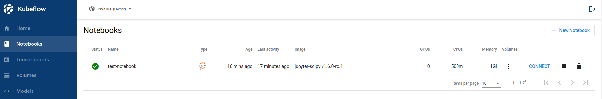

# 多用戶隔離入門

原文:[Getting Started with Multi-user Isolation](https://www.kubeflow.org/docs/components/multi-tenancy/getting-started/)

## 使用概覽

安裝和配置 Kubeflow 後，您將默認訪問您的主要配置 `profile`。一個 `profile` 物件擁有同名的 Kubernetes 命名空間以及 Kubernetes 資源的集合。用戶可以查看和修改其主要配置文件的訪問權限。您可以與系統中的其他用戶共享對您個人資料的訪問​​權限。

與其他用戶共享配置文件的訪問權限時，您可以選擇是只提供讀取訪問權限還是讀取/修改訪問權限。出於所有實際目的，在通過 Kubeflow 中央儀表板工作時，活動命名空間直接與活動配置文件相關聯。

## 使用示例

接著我們將使用 kubelfow 安裝時預建置的使用者帳號來進行後續的說明與演示。

使用下列的帳密登入 kubeflow:

- `Email Address`: user@example.com
- `Password`: 12341234


登入成功之後，您可以從 Kubeflow 中央儀表板的頂部欄中選擇您被賦與權限的 `profile` 設定。


請注意，您只能看到您具有查看或修改訪問權限的 `profile`。


本指南說明了使用 Jupyter notebooks 服務的用戶隔離功能，這是系統中第一個與多用戶隔離功能完全集成的服務。

選擇 `profile` 後，筆記本服務器 UI 僅顯示當前所選配置文件中的活動筆記本服務器。所有其他筆記本服務器對您都是隱藏的。如果您切換 `profile`，視圖會相應地切換活動筆記本列表。您可以連接到任何列出的筆記本服務器，並查看和修改服務器中可用的現有 Jupyter 筆記本。

例如，下圖顯示了用戶主要配置文件中可用的筆記本服務器列表：



當您從 `Notebook` UI 創建 Jupyter 筆記本服務器時，筆記本的 pod 會在 `profile` 所對應中的命名空間中被創建起來。

```bash
$ kubectl get pods -n ewkuo
NAME                                               READY   STATUS    RESTARTS        AGE
ml-pipeline-ui-artifact-7cd897c59f-8whxp           2/2     Running   2 (3h58m ago)   4h48m
ml-pipeline-visualizationserver-795f7db965-nwjgh   2/2     Running   2 (3h58m ago)   4h48m
test-no

如果您沒有對活動 `profile` 修改訪問權限，則只能瀏覽當前 `profile` 的筆記本服務器並訪問現有筆記本，但不能在該配置文件中創建新的筆記本服務器。您可以在您具有查看和修改訪問權限的主要配置文件中創建筆記本服務器。

tebook-0                                    2/2     Running   0               19m
```

## Onboarding 新用戶

管理員可以為 Kubeflow 集群中的任何用戶使用手動的手法來創建 `profile` 物件。這裡的管理員是在 Kubernetes 集群中具有 `cluster-admin` 角色綁定的人。此人有權在集群中創建和修改 Kubernetes 資源。例如，部署 Kubeflow 的人將在集群中擁有管理權限。

我們推薦這種方法，因為它鼓勵採用 **GitOps** 流程來處理配置文件創建。

Kubeflow v1.6.0 可配置地為首次登錄而且經過身份驗證的用戶提供自動配置 `profile` 的工作流。

### 手動配置/創建 Profile

管理員可以手動為用戶創建配置 `profile`，如下所述。

在本地計算機上創建一個包含以下內容的 `profile.yaml` 文件：

```yaml title="profile.yaml"
apiVersion: kubeflow.org/v1
kind: Profile
metadata:
  name: ewkuo   # replace with the name of profile you want, this will be user's namespace name
spec:
  owner:
    kind: User
    name: ewkuo@example.com   # replace with the email of the user

  resourceQuotaSpec:    # resource quota can be set optionally
    hard:
      requests.cpu: "2"
      requests.memory: 2Gi
      requests.nvidia.com/gpu: "1"
      persistentvolumeclaims: "1"
      requests.storage: "5Gi"
```

運行以下命令創建相應的配置文件資源：

```bash
kubectl create -f profile.yaml

kubectl apply -f profile.yaml  #if you are modifying the profile
```

上面的命令創建一個名為 `dxlab` 的配置文件。配置文件所有者是 `userid@email.com` 並且具有查看和修改該配置文件的權限。以下資源是作為配置文件創建的一部分創建的：

- 與相應配置文件同名的 Kubernetes 命名空間。
- Kubernetes RBAC（Role-based access control）角色綁定角色綁定命名空間：`Admin`。這使得配置文件所有者成為命名空間管理員，從而使他們能夠使用 kubectl（通過 Kubernetes API）訪問命名空間。
- Istio 命名空間範圍的 `AuthorizationPolicy：user-userid-email-com-clusterrole-edit`。這允許用戶訪問屬於創建 AuthorizationPolicy 的名稱空間的數據
- 命名空間範圍內的服務帳戶 `default-editor` 和 `default-viewer`，供命名空間中用戶創建 pod 的時候來使用。
- 命名空間範圍內的資源配額限制將被設定。

!!! note
    注意：由於 `profile` 與 Kubernetes 命名空間一一對應，術語 `profile` 和命名空間有時在文檔中互換使用。

**設定user/password:**

```bash
kubectl apply -f -<<EOF
apiVersion: kubeflow.org/v1
kind: Profile
metadata:
  name: ewkuo   # replace with the name of profile you want, this will be user's namespace name
spec:
  owner:
    kind: User
    name: ewkuo@example.com   # replace with the email of the user
EOF
```

結果:

```
profile.kubeflow.org/test created
```

檢查:

```bash hl_lines="5"
$ kubectl get profile
NAME                        AGE
dxlab                       5h39m
kubeflow-user-example-com   46h
test                        61s
```

```bash hl_lines="17"
$ kubectl get namespaces
NAME                        STATUS   AGE
auth                        Active   46h
cert-manager                Active   46h
default                     Active   46h
dxlab                       Active   5h40m
istio-system                Active   46h
knative-eventing            Active   46h
knative-serving             Active   46h
kube-node-lease             Active   46h
kube-public                 Active   46h
kube-system                 Active   46h
kubeflow                    Active   46h
kubeflow-user-example-com   Active   39h
kubernetes-dashboard        Active   40h
local-path-storage          Active   46h
test                        Active   112s
```

**如何增加一個 dex 的 User:**

```bash
kubectl get configmap dex -n auth -o yaml > dex.yaml
```

```yaml hl_lines="18-23"
apiVersion: v1
data:
  config.yaml: |
    issuer: http://dex.auth.svc.cluster.local:5556/dex
    storage:
      type: kubernetes
      config:
        inCluster: true
    web:
      http: 0.0.0.0:5556
    logger:
      level: "debug"
      format: text
    oauth2:
      skipApprovalScreen: true
    enablePasswordDB: true
    staticPasswords:
    - email: user@example.com
      hash: $2y$12$4K/VkmDd1q1Orb3xAt82zu8gk7Ad6ReFR4LCP9UeYE90NLiN9Df72
      # https://github.com/dexidp/dex/pull/1601/commits
      # FIXME: Use hashFromEnv instead
      username: user
      userID: "15841185641784"
    staticClients:
    # https://github.com/dexidp/dex/pull/1664
    - idEnv: OIDC_CLIENT_ID
      redirectURIs: ["/login/oidc"]
      name: 'Dex Login Application'
      secretEnv: OIDC_CLIENT_SECRET
kind: ConfigMap
metadata:
  annotations:
    kubectl.kubernetes.io/last-applied-configuration: |
      {"apiVersion":"v1","data":{"config.yaml":"issuer: http://dex.auth.svc.cluster.local:5556/dex\nstorage:\n  type: kubernetes\n  config:\n    inCluster: t>
  creationTimestamp: "2022-12-20T15:41:22Z"
  name: dex
  namespace: auth
  resourceVersion: "1119"
  uid: af06ce57-8096-4e2c-a1ae-747eee5a4ce0
```

產生一個 [BCrypt Hash Generator](https://bcrypt.online/):

```bash
pass1234 -> $2y$10$954iLS0YaItcIN9Xnc6woOSeFcuM4q3TPZZAbHwUMGRgnBRCqnrRS
```

!!! tips
    如果要自己產生 BCrypt 的 hash 時要特別注意使用到的版本的 BCrypt 算法。
    
    - `2`  BCrypt 的第一個修訂版，它有一個小的安全漏洞，一般不再使用。
    - `2a` 一些實現遭遇罕見的安全漏洞，被 2b 取代。
    - `2y` 特定於 crypt_blowfish BCrypt 實現的格式，除名稱外與“2b”完全相同。
    - `2b` 官方 BCrypt 算法的最新版本。

```bash
python3 -c 'from passlib.hash import bcrypt; import getpass; print(bcrypt.using(rounds=12, ident="2y").hash(getpass.getpass()))'
```


```bash
kubectl apply -f - <<EOF
apiVersion: v1
data:
  config.yaml: |
    issuer: http://dex.auth.svc.cluster.local:5556/dex
    storage:
      type: kubernetes
      config:
        inCluster: true
    web:
      http: 0.0.0.0:5556
    logger:
      level: "debug"
      format: text
    oauth2:
      skipApprovalScreen: true
    enablePasswordDB: true
    staticPasswords:
    - email: user@example.com
      hash: $2y$12$4K/VkmDd1q1Orb3xAt82zu8gk7Ad6ReFR4LCP9UeYE90NLiN9Df72
      username: user
      userID: "15841185641784"
    - email: test@company.com
      hash: $2y$12$4K/VkmDd1q1Orb3xAt82zu8gk7Ad6ReFR4LCP9UeYE90NLiN9Df72
      username: test
    - email: ewkuo@example.com
      hash: $2y$12$4K/VkmDd1q1Orb3xAt82zu8gk7Ad6ReFR4LCP9UeYE90NLiN9Df72
      username: ewkuo
    staticClients:
    - idEnv: OIDC_CLIENT_ID
      redirectURIs: ["/login/oidc"]
      name: 'Dex Login Application'
      secretEnv: OIDC_CLIENT_SECRET
kind: ConfigMap
metadata:
  name: dex
  namespace: auth
EOF
```

重新啟動dex:

參考:[Correct way of adding new dex static users #5918](https://github.com/kubeflow/kubeflow/issues/5918)

```bash
kubectl rollout restart deployment dex -n auth
```


### 批量創建用戶 Profile 文件

管理員可能希望為多個用戶批量創建 `profile` 配置。您可以通過在本地計算機上創建一個包含多個配置文件描述部分的 `profile.yaml` 來執行此操作，如下所示：

```yaml
apiVersion: kubeflow.org/v1
kind: Profile
metadata:
  name: profileName1   # replace with the name of profile you want
spec:
  owner:
    kind: User
    name: userid1@email.com   # replace with the email of the user
---
apiVersion: kubeflow.org/v1
kind: Profile
metadata:
  name: profileName2   # replace with the name of profile you want
spec:
  owner:
    kind: User
    name: userid2@email.com   # replace with the email of the user
```

運行以下命令將命名空間應用到 Kubernetes 集群：

```bash
kubectl create -f profile.yaml

kubectl apply -f profile.yaml  #if you are modifying the profiles
```

這將創建多個配置文件。

### 自動創建 Profile

Kubeflow v1.6.0 提供自動 `profile` 創建：

- 默認情況下不會啟動自動 `profile` 創建，需要將其作為部署的一部分明確包含在內。在部署期間啟用自動用戶配置 `profile` 創建後，將在首次登錄時為經過身份驗證的用戶創建新的用戶配置 `profile`。用戶將能夠在 Kubeflow 中央儀表板的下拉列表中看到他們的新 `profile`。

- 通過將 `CD_REGISTRATION_FLOW` 的環境變量設置為 `true`，可以啟用自動配置 `profile` 創建作為部署的一部分。修改 `<manifests-path>/apps/centraldashboard/upstream/base/params.env` 將註冊變量設置為 `true`。

```bash
CD_CLUSTER_DOMAIN=cluster.local
CD_USERID_HEADER=kubeflow-userid
CD_USERID_PREFIX=
CD_REGISTRATION_FLOW=true
```

當經過身份驗證的用戶首次登錄系統並訪問中央儀表板時，他們會自動觸發配置文件創建。

一條簡短的消息介紹簡介：


用戶可以命名他們的配置 `profile` 並單擊完成：


這會將用戶重定向到儀表板，他們可以在其中查看並在下拉列表中選擇他們的配置文件。

## 列出和描述 Profiles

管理員可以列出系統中的現有 profiles：

```bash
kubectl get profiles
```

並使用以下方法了解特定的 `profile`：

```bash
kubectl describe profile <profileName>
```

## 刪除現有 Profiles

管理員可以使用以下方式刪除現有 `profile`：

```bash
kubectl delete profile <profileName>
```

這將刪除 `profile`、相應的命名空間以及與 `profile` 關聯的任何 Kubernetes 資源。Profile 的 owner 或有權訪問該 `profile` 的其他用戶將無法再訪問該 `profile`，也不會在中央儀表板的下拉列表中看到它。

## 通過 Kubeflow UI 管理貢獻者

Kubeflow v1.6.0 允許與系統中的其他用戶共享 `profile` 的資源。個人資料的所有者可以使用儀表板提供的 “Management Contributors” 選項卡共享對其個人資料的訪問​​權限。


以下是 “Management Contributors” 選項卡視圖的示例：


請注意，在上面的視圖中，與 `profile` 關聯的帳戶是集群管理員 (Cluster Admin)，因為此帳戶用於部署 Kubeflow。該視圖列出了用戶可訪問的 profile 以及與該 profile 關聯的角色。

要添加或刪除貢獻者，請在 `Contributors to your namespace` 的欄位中添加/刪除電子郵件地址或用戶標識符。


"Manage Contributors" 選項卡顯示命名空間所有者添加的貢獻者。請注意，集群管理員可以查看系統中的所有 profile 及其貢獻者。


貢獻者可以訪問命名空間中的所有 Kubernetes 資源，可以創建筆記本服務器以及訪問現有筆記本。

## 手動管理貢獻者

管理員可以手動將貢獻者添加到現有 profile，如下所述。

在本地計算機上創建一個包含以下內容的 `rolebinding.yaml` 文件：

```yaml
apiVersion: rbac.authorization.k8s.io/v1
kind: RoleBinding
metadata:
  annotations:
    role: edit
    user: userid@email.com   # replace with the email of the user from your Active Directory case sensitive
  name: user-userid-email-com-clusterrole-edit
  # Ex: if the user email is lalith.vaka@kp.org the name should be user-lalith-vaka-kp-org-clusterrole-edit
  # Note: if the user email is Lalith.Vaka@kp.org from your Active Directory, the name should be user-lalith-vaka-kp-org-clusterrole-edit
  namespace: profileName # replace with the namespace/profile name that you are adding contributors to
roleRef:
  apiGroup: rbac.authorization.k8s.io
  kind: ClusterRole
  name: kubeflow-edit
subjects:
- apiGroup: rbac.authorization.k8s.io
  kind: User
  name: userid@email.com   # replace with the email of the user from your Active Directory case sensitive
```

在本地計算機上創建一個包含以下內容的 `authorizationpolicy.yaml` 文件：

```yaml
apiVersion: security.istio.io/v1beta1
kind: AuthorizationPolicy
metadata:
  annotations:
    role: edit
    user: userid@email.com # replace with the email of the user from your Active Directory case sensitive
  name: user-userid-email-com-clusterrole-edit
  namespace: profileName # replace with the namespace/profile name that you are adding contributors to
spec:
  action: ALLOW
  rules:
  - when:
    - key: request.headers[kubeflow-userid] # for GCP, use x-goog-authenticated-user-email instead of kubeflow-userid for authentication purpose
      values:
      - accounts.google.com:userid@email.com   # replace with the email of the user from your Active Directory case sensitive
```

運行以下命令創建相應的貢獻者資源：

```yaml
kubectl create -f rolebinding.yaml
kubectl create -f authorizationpolicy.yaml
```

上面的命令將貢獻者 `userid@email.com` 添加到名為 `profileName` 的 `profile` 中。貢獻者 `userid@email.com` 具有查看和修改該 `profile` 的權限。