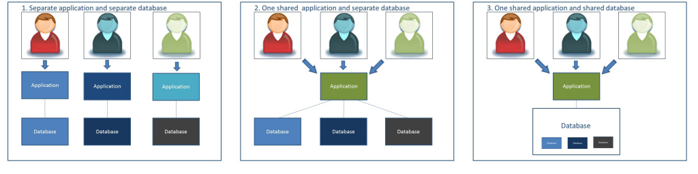
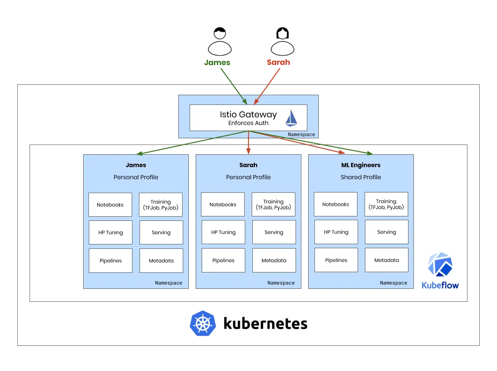
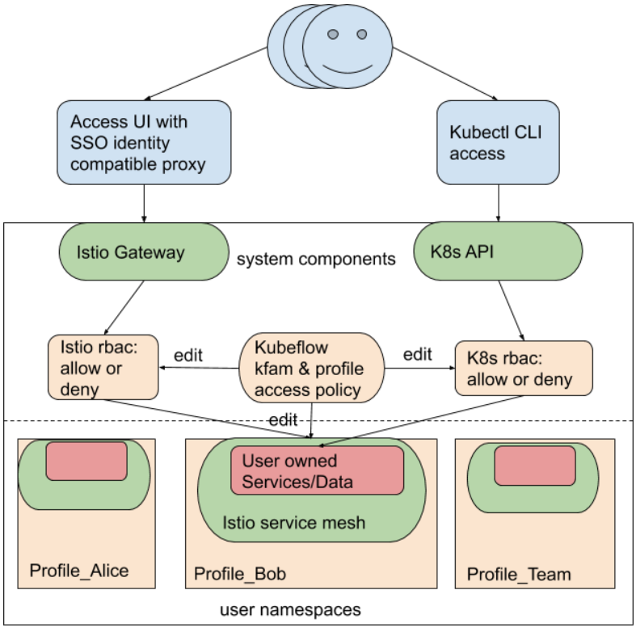

# 多用戶隔離

原文:[Introduction to Multi-user Isolation](https://www.kubeflow.org/docs/components/multi-tenancy/overview/)



## 簡介

在 Kubeflow 集群中，經常需要將用戶隔離成一個群組，一個群組包括一個或多個用戶。此外，用戶可能需要歸屬於多個群組。 Kubeflow 的多用戶隔離 (multi-user isolation) 簡化了對 **用戶** 運維管理，因為每個用戶只能查看和編輯在其配置中定義的 Kubeflow 組件和模型 artifacts。

用戶的視圖不會被不在其配置中的組件或模型 artifacts 弄亂。這種隔離還提供了高效的基礎架構和操作，{==即單個集群支持多個隔離的用戶，並且不需要管理員操作不同的集群來隔離用戶==}。

## 關鍵概念

- **Administrator**: `管理員`是創建和維護 Kubeflow 集群的人。此人為其他`用戶`配置權限（即view、edit）。

- **User**: `用戶`是有權訪問集群中某些資源集的人。`用戶`需要獲得`管理員`的訪問權限。

- **Profile**: 在 kubeflow 中 `profile` 物件是並由`管理員`定義對用戶的唯一配置，它決定了`用戶`的訪問權限。

- **Isolation**: 隔離使用了 `Kubernetes 命名空間`。`命名空間`隔離`用戶`或`一組用戶`，即 Bob 的命名空間或由 Bob 和 Sara 共享的 ML Eng 命名空間。

- **Authentication**: 身份驗證由 Istio 和 OIDC 的集成提供，並由 mTLS 保護。更多詳情可參考: [Authentication with Istio + Dex](https://journal.arrikto.com/kubeflow-authentication-with-istio-dex-5eafdfac4782)。

- **Authorization**: 通過與 Kubernetes RBAC 的集成提供授權。




Kubeflow 多用戶隔離由 Kubeflow `管理員`配置。`管理員`為每個`用戶`配置 Kubeflow 用戶配置文件。創建並應用配置後，`用戶`只能訪問`管理員`為其配置的 Kubeflow 組件。該配置限制未經授權的 UI 用戶查看或意外刪除模型。

通過多用戶隔離，用戶經過身份驗證和授權，然後提供基於時間的令牌，即 json 網絡令牌 (JWT)。訪問令牌作為用戶請求中的 Web 標頭攜帶，並授權用戶訪問其配置文件中配置的資源。配置文件配置了幾個項目，包括用戶的命名空間、RBAC RoleBinding、Istio ServiceRole 和 ServiceRoleBindings 以及資源配額和自定義插件。

有關配置文件定義和相關 CRD 的更多信息，請參見[此處](./profile-controller.md)。

```yaml title="profile (CRD) 範例"
apiVersion: kubeflow.org/v1beta1
kind: Profile
metadata:
  # 替換為您想要的配置文件名稱，這將是用戶的命名空間名稱
  name: profileName
spec:
  owner:
    kind: User
    name: userid@email.com   # 替換為用戶的電子郵件

  resourceQuotaSpec:    # 資源配額(optional)
    hard:               # hard 是每個命名資源的一組所需的硬限制。
      requests.cpu: "2"             # 在所有 pod 中，CPU 請求的總和不能超過這個值。
      requests.memory: 2Gi          # 在所有 pod 中，內存請求的總和不能超過此值。
      requests.nvidia.com/gpu: "1"  # 在所有 pod 中，nvidia GPU 請求的總和不能超過此值。
      persistentvolumeclaims: "1"   # 命名空間中可以存在的 PersistentVolumeClaims 總數。
      requests.storage: "5Gi"       # 在所有持久卷聲明中，存儲請求的總和不能超過此值。
```

## 元件整合

下列的 Kubeflow 組件可以支持多用戶隔離：

- Central Dashboard
- Notebooks
- Pipelines
- AutoML (Katib)
- KFServing

此外，筆記本創建的資源（例如，訓練作業和部署）也繼承相同的訪問權限。

對於本地部署的環境來說，Kubeflow 使用 Dex 作為聯合 OpenID 連接提供程序，並且可以與 LDAP 或 Active Directory 集成以提供身份驗證和身份服務。

## 多用戶隔離設計

Kubeflow 多租戶目前是圍繞用戶 **命名空間** 構建的。具體來說，Kubeflow 定義了用戶特定的命名空間，並使用 Kubernetes 基於角色的訪問控制 (RBAC) 策略來管理用戶訪問。

此功能使用戶能夠共享對其工作區的訪問。工作區所有者可以通過 Kubeflow UI 與其他用戶共享/撤銷工作區訪問權限。用戶被邀請後，擁有編輯工作空間和操作 Kubeflow 自定義資源的權限。

Kubeflow 多租戶可配置成是自助式的模式，如此新用戶可以通過 UI 來自行註冊創建和擁有自己的工作區。

Kubeflow 使用 Istio 來控制集群內的流量。默認情況下，除非 Istio RBAC 允許，否則對用戶工作區的請求將被拒絕。入站用戶請求使用身份提供者（例如，Google Cloud 上的身份感知代理 (IAP) 或用於本地部署的 Dex）進行識別，然後由 Istio RBAC 規則進行驗證。

在內部，Kubeflow 使用 `Profile` 自定義資源來控制所有涉及的策略、角色和綁定，並保證一致性。 Kubeflow 還提供了一個插件接口來管理 Kubernetes 外部的外部資源/策略，例如與 Amazon Web Services API 接口以進行身份管理。

下圖說明了用戶訪問 Kubeflow 多租戶集群的兩種路徑：通過 Kubeflow Dashboard 和通過 kubectl 命令行界面 (CLI)。




## 總結

- Kubeflow 使用 Istio 對集群內流量應用訪問控制。
- Kubeflow `profile controller` 需要 `cluster admin` 集群管理員權限。
- Kubeflow UI 需要在身份感知代理後面提供服務。身份感知代理和 Kubernetes 主節點應該共享相同的身份管理。
- Kubeflow 的本地安裝使用 `Dex`，這是一種靈活的 OpenID Connect (OIDC) 提供程序。