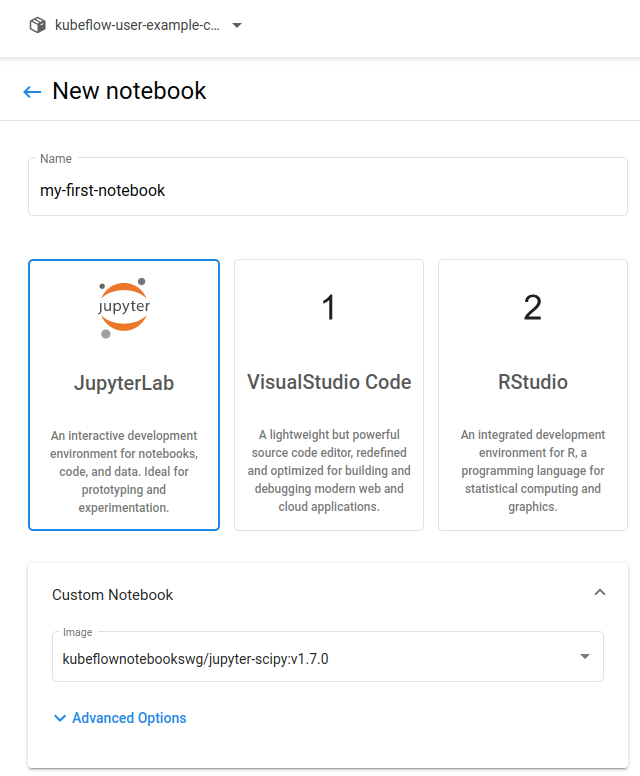

# 快速入門指南

Kubeflow 筆記本入門

## 概括:

- 按照[入門](../../env/kubeflow-install.md) - 安裝 Kubeflow 安裝 Kubeflow。
- 在瀏覽器中打開 Kubeflow Central Dashboard。
- 點擊左側面板中的 “Notebooks”。
- 點擊“New Notebook”以創建一個新的筆記本服務器。
- 指定筆記本服務器的相關配置。
- 配置完筆記本後，點擊 “CONNECT”

## 詳細步驟

1. 在瀏覽器中打開 Kubeflow Central Dashboard。

2. 選擇命名空間：

    - 點擊命名空間下拉列表以查看可用命名空間的列表。
    - 選擇與您的 Kubeflow 配置文件相對應的命名空間。(有關配置文件的更多信息，請參閱[多用戶隔離](../multi-tenancy/overview.md)。)

    

3. 點擊左側面板中的 “Notebooks”：
    


4. 在 “Notebooks” 頁面點擊 “New Notebook”：
    

5. 輸入筆記本服務器的“名稱”。

    - 名稱可以包含字母和數字，但不能包含空格。
    - 例如，"my-first-notebook"。

    

6. 為您的筆記本服務器選擇一個 Docker“鏡像”

    - **Custom image**：如果選擇自定義選項，則必須以 `registry/image:tag` 的形式指定 Docker 鏡像。 （請參閱容器鏡像指南。）
    - **Standard image**：單擊“鏡像”下拉菜單以查看可用鏡像列表。 （您可以從您的 Kubeflow 管理員配置的列表中選擇）

    !!! tip
    當根據 Kubeflow 自定義鏡像的要求構建了客制鏡像後想要把這個鏡像加入到 Notebook 配置的下拉選單中, 需要去修改下列的配置檔案:

    ```yaml title="apps/jupyter/jupyter-web-app/upstream/base/configs/spawner_ui_config.yaml" hl_lines="7-11"
    spawnerFormDefaults:
    image:
        # The container Image for the user's Jupyter Notebook
        value: kubeflownotebookswg/jupyter-scipy:v1.7.0
        # The list of available standard container Images
        options:
        - kubeflownotebookswg/jupyter-scipy:v1.7.0
        - kubeflownotebookswg/jupyter-pytorch-full:v1.7.0
        - kubeflownotebookswg/jupyter-pytorch-cuda-full:v1.7.0
        - kubeflownotebookswg/jupyter-tensorflow-full:v1.7.0
        - kubeflownotebookswg/jupyter-tensorflow-cuda-full:v1.7.0
    ...
    ...
    ```

    

7. 指定您的筆記本服務器將請求的“CPU”數量。

8. 指定您的筆記本服務器將請求的“RAM”數量。

9. 指定一個“workspace volume”作為 PVC 卷安裝在您的主文件夾上。

    

10. (Optional) 指定一個或多個“數據卷”作為 PVC 卷掛載。

11. (Optional) 指定一個或多個附加“配置”

    - 這些對應於存在於您的配置文件命名空間中的 [PodDefault](https://github.com/kubeflow/kubeflow/blob/master/components/admission-webhook/README.md) 資源。
    - Kubeflow 將“配置”字段中的標籤與 Po​​dDefault 清單中指定的屬性進行匹配。
    - 例如，在“配置”字段中選擇標籤 `add-gcp-secret` 以匹配包含以下配置的 PodDefault 清單：

        ```yaml
        apiVersion: kubeflow.org/v1alpha1
        kind: PodDefault
        metadata:
        name: add-gcp-secret
        namespace: MY_PROFILE_NAMESPACE
        spec:
        selector:
        matchLabels:
            add-gcp-secret: "true"
        desc: "add gcp credential"
        volumeMounts:
        - name: secret-volume
        mountPath: /secret/gcp
        volumes:
        - name: secret-volume
        secret:
            secretName: gcp-secret
        ```

12. (Optional) 指定您的筆記本服務器將請求的任何“GPU”。

    - Kubeflow 在 Pod 請求中使用 “limits” 將 GPU 提供給筆記本 Pod（有關調度 GPU 的詳細信息可以在 [Kubernetes 文檔](https://kubernetes.io/docs/tasks/manage-gpus/scheduling-gpus/)中找到。）

13. (Optional) 指定“enable shared memory”的設置。

    - PyTorch 等一些庫使用共享內存進行多處理。
    - 目前，Kubernetes 中沒有享內存的實現。
    - 作為一種解決方法，Kubeflow 在 `/dev/shm` 掛載了一個空目錄卷。

14. 點擊 “LAUNCH” 以使用您指定的設置創建一個新的筆記本 CRD。

    - 您應該在 “Notebooks” 頁面上看到新筆記本服務器的條目
    - “Status” 列中應該有一個旋轉指示器。
    - kubernetes 可能需要幾分鐘時間來配置筆記本服務器 pod。
    - 您可以通過將鼠標光標懸停在 “Status” 列中的圖標上來檢查您的 Pod 的狀態。

    

15. 單擊“CONNECT” 以查看筆記本服務器公開的 Web 界面。

    

