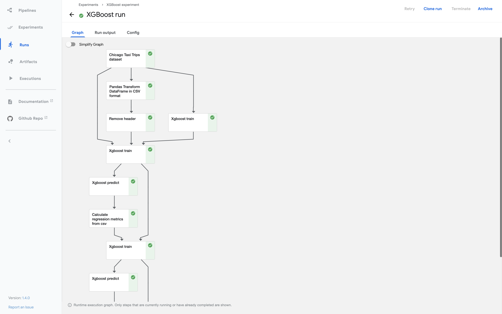
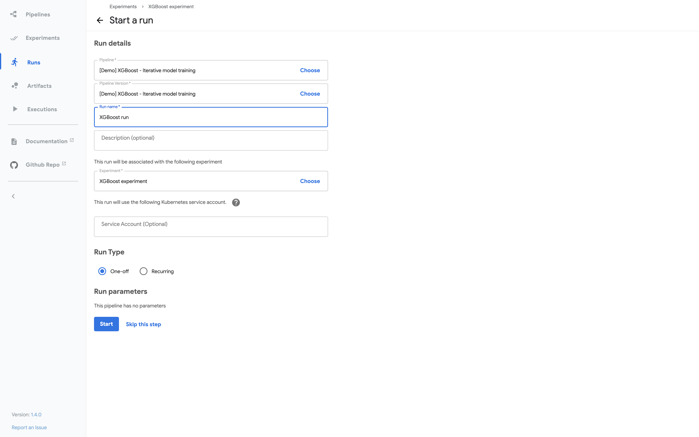
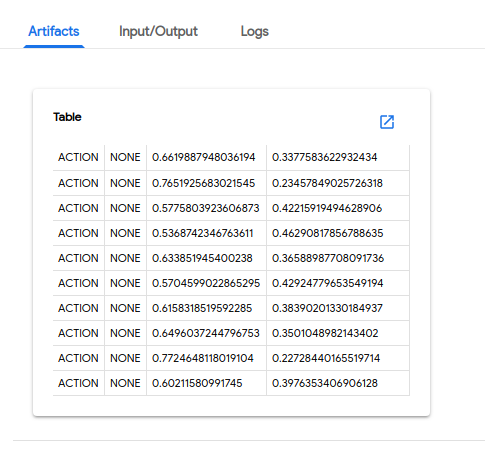
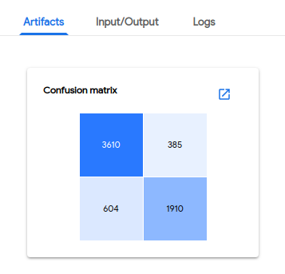
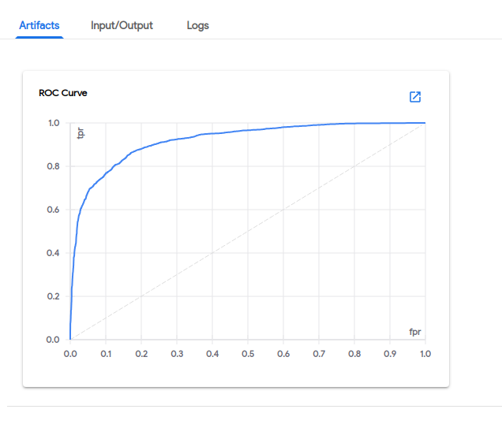
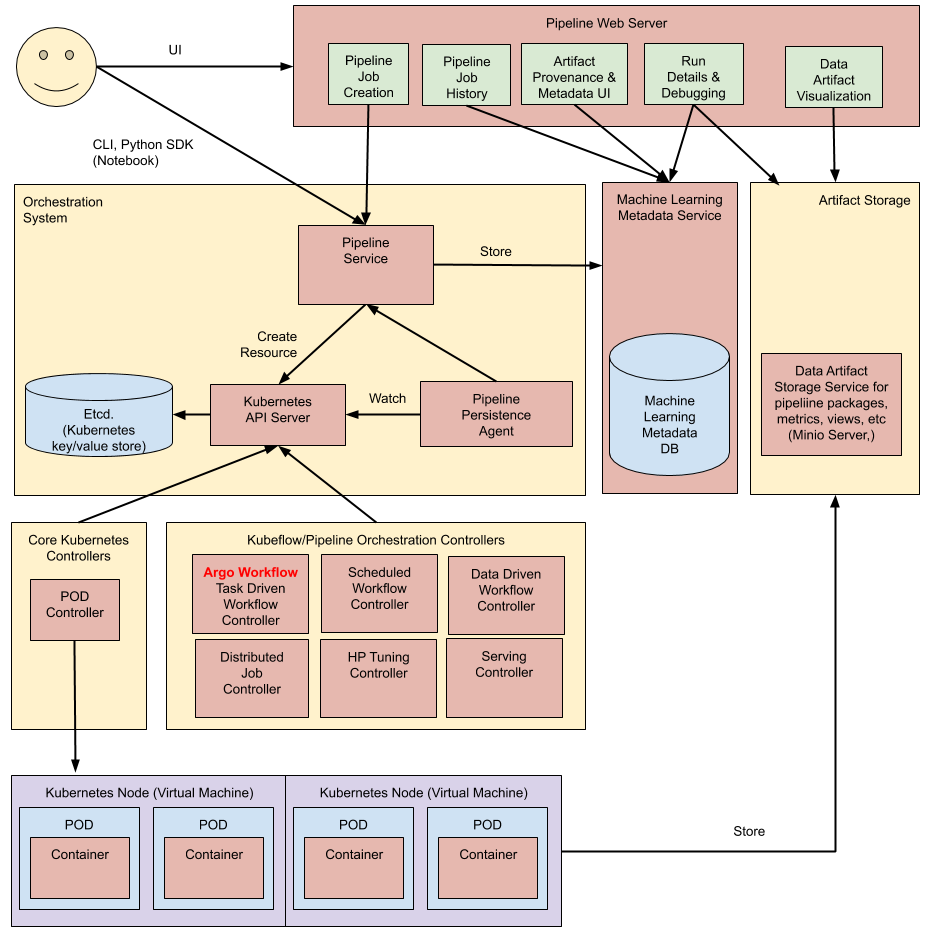

# Pipeline 介紹

Kubeflow Pipelines 是一個平台，用於構建和部署基於 Docker 容器的可移植、可擴展的機器學習 (ML) 工作流。

## 什麼是 Kubeflow 管道？

Kubeflow Pipelines 包括：

- 用於管理和追踪 experiments、jobs 和 runs 的用戶界面 (UI)。
- 用於安排多步驟 ML 工作流程的引擎。
- 用於定義和操作管道和組件的 SDK。
- 使用 SDK 與系統交互的筆記本。

以下是 Kubeflow 管道的目標：

- **端到端編排**：啟用和簡化機器學習管道的編排。
- **輕鬆實驗**：讓您輕鬆嘗試眾多想法和技術，並管理您的各種試驗/實驗。
- **易於重用**：使您能夠重用組件和管道以快速創建端到端解決方案，而無需每次都重新構建。

Kubeflow Pipelines 可作為 Kubeflow 的核心組件或作為獨立安裝使用。

## 什麼是管道？

`pipeline` 是對 ML 工作流的描述，包括工作流中的所有組件以及它們如何以圖形的形式組合。管道包括運行管道所需的輸入（參數）的定義以及每個組件的輸入和輸出。

開發管道後，您可以在 Kubeflow Pipelines UI 上上傳和共享它。

管道組件是一組獨立的用戶代碼，打包為 Docker 鏡像，在管道中執行一個步驟。例如，一個組件可以負責數據預處理、數據轉換、模型訓練等。

請參閱 [pipeline](https://www.kubeflow.org/docs/components/pipelines/concepts/pipeline/) 和 [component](https://www.kubeflow.org/docs/components/pipelines/concepts/component/) 的概念指南。

## 管道範例

下面的屏幕截圖和代碼顯示了 `xgboost-training-cm.py` 管道，它使用 CSV 格式的結構化數據創建 XGBoost 模型。您可以在 [GitHub](https://github.com/kubeflow/pipelines/tree/sdk/release-1.8/samples/core/xgboost_training_cm) 上查看有關管道的源代碼和其他信息。

### 管道的運行 execution graph

下面的屏幕截圖顯示了 Kubeflow Pipelines UI 中示例管道的運行時執行圖：



### 表示管道的 Python 代碼

以下是定義 `xgboost-training-cm.py` 管道的 Python 代碼的摘錄。你可以在 [GitHub](https://github.com/kubeflow/pipelines/tree/sdk/release-1.8/samples/core/xgboost_training_cm) 上看到完整的代碼。

```python
@dsl.pipeline(
    name='XGBoost Trainer',
    description='A trainer that does end-to-end distributed training for XGBoost models.'
)
def xgb_train_pipeline(
    output='gs://your-gcs-bucket',
    project='your-gcp-project',
    cluster_name='xgb-%s' % dsl.RUN_ID_PLACEHOLDER,
    region='us-central1',
    train_data='gs://ml-pipeline-playground/sfpd/train.csv',
    eval_data='gs://ml-pipeline-playground/sfpd/eval.csv',
    schema='gs://ml-pipeline-playground/sfpd/schema.json',
    target='resolution',
    rounds=200,
    workers=2,
    true_label='ACTION',
):
    output_template = str(output) + '/' + dsl.RUN_ID_PLACEHOLDER + '/data'

    # Current GCP pyspark/spark op do not provide outputs as return values, instead,
    # we need to use strings to pass the uri around.
    analyze_output = output_template
    transform_output_train = os.path.join(output_template, 'train', 'part-*')
    transform_output_eval = os.path.join(output_template, 'eval', 'part-*')
    train_output = os.path.join(output_template, 'train_output')
    predict_output = os.path.join(output_template, 'predict_output')

    with dsl.ExitHandler(exit_op=dataproc_delete_cluster_op(
        project_id=project,
        region=region,
        name=cluster_name
    )):
        _create_cluster_op = dataproc_create_cluster_op(
            project_id=project,
            region=region,
            name=cluster_name,
            initialization_actions=[
              os.path.join(_PYSRC_PREFIX,
                           'initialization_actions.sh'),
            ],
            image_version='1.2'
        )

        _analyze_op = dataproc_analyze_op(
            project=project,
            region=region,
            cluster_name=cluster_name,
            schema=schema,
            train_data=train_data,
            output=output_template
        ).after(_create_cluster_op).set_display_name('Analyzer')

        _transform_op = dataproc_transform_op(
            project=project,
            region=region,
            cluster_name=cluster_name,
            train_data=train_data,
            eval_data=eval_data,
            target=target,
            analysis=analyze_output,
            output=output_template
        ).after(_analyze_op).set_display_name('Transformer')

        _train_op = dataproc_train_op(
            project=project,
            region=region,
            cluster_name=cluster_name,
            train_data=transform_output_train,
            eval_data=transform_output_eval,
            target=target,
            analysis=analyze_output,
            workers=workers,
            rounds=rounds,
            output=train_output
        ).after(_transform_op).set_display_name('Trainer')

        _predict_op = dataproc_predict_op(
            project=project,
            region=region,
            cluster_name=cluster_name,
            data=transform_output_eval,
            model=train_output,
            target=target,
            analysis=analyze_output,
            output=predict_output
        ).after(_train_op).set_display_name('Predictor')

        _cm_op = confusion_matrix_op(
            predictions=os.path.join(predict_output, 'part-*.csv'),
            output_dir=output_template
        ).after(_predict_op)

        _roc_op = roc_op(
            predictions_dir=os.path.join(predict_output, 'part-*.csv'),
            true_class=true_label,
            true_score_column=true_label,
            output_dir=output_template
        ).after(_predict_op)

    dsl.get_pipeline_conf().add_op_transformer(
        gcp.use_gcp_secret('user-gcp-sa'))
```

下面的部分屏幕截圖顯示了用於啟動管道運行的 Kubeflow Pipelines UI。代碼中的管道定義決定了哪些參數出現在 UI 表單中。管道定義還可以為參數設置默認值：



### 管道的輸出

以下屏幕截圖顯示了 Kubeflow Pipelines UI 上可見的管道輸出示例。

預測結果：



混淆矩陣：



接受者操作特徵（ROC）曲線：



## 架構概覽



在高層次上，管道的執行過程如下：

- **Python SDK**：您使用 Kubeflow Pipelines domain-specific language (DSL) 來創建組件或指定管道。

- **DSL compiler**：DSL 編譯器將管道的 Python 代碼轉換為靜態配置 (YAML)。

- **Pipeline Service**：您調用管道服務以創建從靜態配置運行的管道。

- **Kubernetes resources**：管道服務調用 Kubernetes API 服務器來創建運行管道所需的 Kubernetes 資源 (CRD)。

- **Orchestration controllers**: 一組編排控制器執行完成管道所需的容器。容器在 Kubernetes Pod 中執行。一個控制器範例是 [Argo Workflow](https://github.com/argoproj/argo-workflows) 控制器，它編排任務驅動的工作流。

- **Artifact storage**: Pod 存儲兩種數據：
    - Metadata: 實驗、作業、管道運行和單一標量指標。出於排序和過濾的目的聚合指標數據。 Kubeflow Pipelines 將元數據存儲在 MySQL 數據庫中。
    - Artifacts: Pipeline 打包、視圖和大規模指標（時間序列）。使用大規模指標來調試管道運行或調查單個運行的性能。 Kubeflow Pipelines 將工件存儲在工件存儲中，例如 Minio 服務器或云存儲。

    !!! info
        MySQL 數據庫和 Minio 服務器都由 Kubernetes PersistentVolume 子系統支持。

- **Persistence agent 與 ML metadata**: Pipeline Persistence Agent 監視 Pipeline Service 創建的 Kubernetes 資源，並將這些資源的狀態保存在 ML Metadata Service 中。 Pipeline Persistence Agent 記錄執行的容器集及其輸入和輸出。輸入/輸出由容器參數或數據工件 URI 組成。

- **Pipeline web server**: Pipeline Web 服務器從各種服務收集數據以顯示相關視圖：當前運行的管道列表、管道執行的歷史記錄、數據工件列表、單個管道運行的調試信息、單個管道運行的執行狀態。

