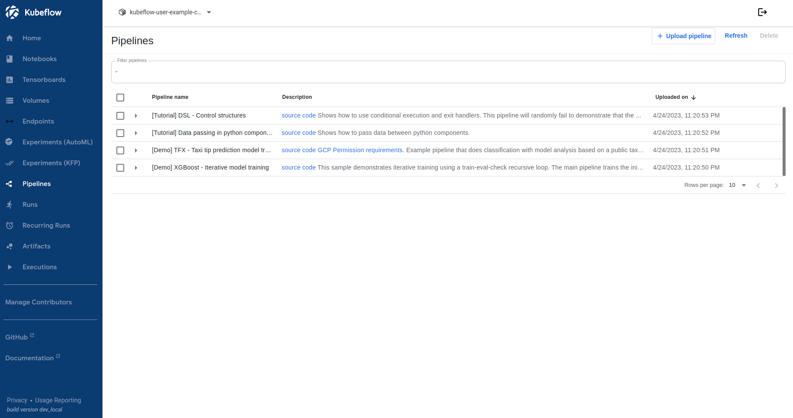

# 管道 interface

本頁面介紹了可用於通過 Kubeflow Pipelines 構建和運行機器學習 (ML) 工作流的接口。

## 用戶界面 (UI) 

您可以通過點擊 Kubeflow UI 上的 Pipeline Dashboard 來訪問 Kubeflow Pipelines UI。 Kubeflow 管道 UI 如下所示：

在 Kubeflow Pipelines UI 中，您可以執行以下任務：

- 運行一個或多個預加載示例以快速試用管道。
- 將管道作為壓縮文件上傳。管道可以是您構建的（請參閱如何[構建管道](https://www.kubeflow.org/docs/components/pipelines/sdk/build-pipeline/)）或某人與您共享的管道。
- 創建一個實驗以對您的一個或多個管道運行進行分組。請參閱[實驗](https://www.kubeflow.org/docs/components/pipelines/concepts/experiment/)的定義。
- 在實驗中創建並開始運行。運行是管道的單次執行。請參閱[運行](https://www.kubeflow.org/docs/components/pipelines/concepts/run/)的定義。
- 探索管道運行的配置、圖形和輸出。
- 比較實驗中一次或多次運行的結果。
- 通過創建重複運行來安排運行。

有關訪問 Kubeflow Pipelines UI 和運行示例的更多信息，請參閱[快速入門指南](https://www.kubeflow.org/docs/components/pipelines/overview/quickstart/)。

在構建管道組件時，您可以寫出信息以顯示在 UI 中。請參閱有關在 UI 中[導出指標](https://www.kubeflow.org/docs/components/pipelines/sdk/pipelines-metrics/)和[可視化結果](https://www.kubeflow.org/docs/components/pipelines/sdk/output-viewer/)的指南。

## Python SDK

Kubeflow Pipelines SDK 提供了一組 Python 包，您可以使用它們來指定和運行 ML 工作流。

請參閱 [Kubeflow Pipelines SDK 簡介](https://www.kubeflow.org/docs/components/pipelines/sdk/sdk-overview/)，了解使用 SDK 構建管道組件和管道的方法概覽。

## REST API

Kubeflow Pipelines API 對於持續集成/部署系統非常有用，例如，您希望將管道執行合併到 shell 腳本或其他系統中。例如，您可能希望在新數據進來時觸發管道運行。

請參閱 [Kubeflow Pipelines API 參考文檔](https://www.kubeflow.org/docs/components/pipelines/reference/api/kubeflow-pipeline-api-spec/)。