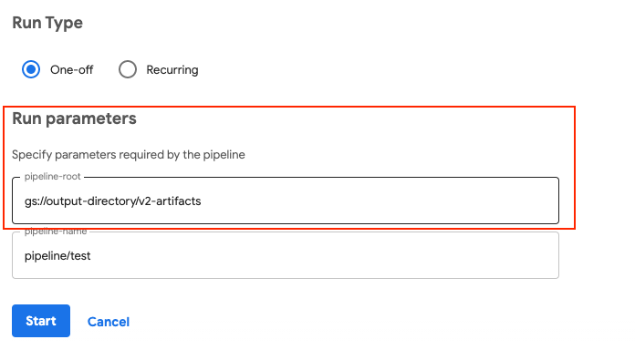

# Pipeline Root

!!! info
    此 Kubeflow 組件處於測試狀態。請參閱 Kubeflow 版本控制策略。

從 [Kubeflow Pipelines SDK v2](https://www.kubeflow.org/docs/components/pipelines/sdk-v2/) 和 Kubeflow Pipelines 1.7.0 開始，Kubeflow Pipelines 支持新的中間工件存儲庫功能。

## 什麼是 Pipeline Root？

Pipeline Root 代表一個工件存儲庫(artifact repository)，Kubeflow Pipelines 在其中存儲管道的工件。此功能支持使用 Go CDK 原生支持 MinIO、S3、GCS。將 Kubeflow Pipelines 與其他系統集成時，可以更輕鬆地在 S3 和 GCS 中訪問工件。

!!! tip
    對於 MinIO，您不能更改 MinIO 實例。 Kubeflow Pipelines 只能使用自身部署的 Minio 實例。如果需要指定 Minio 實例，請點贊這個 [GitHub Issue](https://github.com/kubeflow/pipelines/issues/6517)。

    參考: [How to Install and Configure Kubeflow with MinIO Operator](https://blog.min.io/how-to-kubeflow-minio/)

## 如何配置 Pipeline Root 身份驗證

### MinIO

您不需要通過 MinIO 的身份驗證。 Kubeflow Pipelines 配置了與自身部署的 MinIO 實例的身份驗證。

### GCS

如果要將 `pipeline root` 指定為 GCS ：

檢查[ authentication-pipelines](https://www.kubeflow.org/docs/distributions/gke/pipelines/authentication-pipelines/)

### S3

如果要將 pipeline root 指定為 S3，請選擇以下選項之一：

- 通過 AWS IRSA:
- 通過 kfp sdk: dsl.get_pipeline_conf().add_op_transformer(aws.use_aws_secret('xxx', ‘xxx’, ‘xxx’))

參考:

- [add-op-transformer](https://kubeflow-pipelines.readthedocs.io/en/stable/source/kfp.dsl.html#kfp.dsl.PipelineConf.add_op_transformer)
- [use-aws-secret](https://kubeflow-pipelines.readthedocs.io/en/stable/source/kfp.extensions.html#kfp.aws.use_aws_secret)

## 如何配置 Pipeline Root

### 通過 ConfigMaps

您可以通過更改 Kubernetes 命名空間中 ConfigMaps `kfp-launcher` 的 `defaultPipelineRoot` 條目來為 Kubeflow 管道配置默認 `pipeline root`。

```bash
kubectl edit configMap kfp-launcher -n ${namespace}
```

此 Pipeline Root 將是在 Kubernetes 命名空間中運行的所有管道的默認 Pipeline Root，除非您使用以下選項之一覆蓋它:

### 通過 Building Pipelines

在[構建管道](https://www.kubeflow.org/docs/components/pipelines/sdk-v2/build-pipeline/#build-your-pipeline)時可以通過 `kfp.dsl.pipeline` 註解配置一個 pipeline root。

### 通過 SDK 提交 Pipeline

當您使用以下之一提交管道時，您可以通過 `pipeline_root` 參數配置管道根:

- [create_run_from_pipeline_func](https://kubeflow-pipelines.readthedocs.io/en/stable/source/kfp.client.html#kfp.Client.create_run_from_pipeline_func)
- [create_run_from_pipeline_package](https://kubeflow-pipelines.readthedocs.io/en/stable/source/kfp.client.html#kfp.Client.create_run_from_pipeline_package)
- [run_pipeline](https://kubeflow-pipelines.readthedocs.io/en/stable/source/kfp.client.html#kfp.Client.run_pipeline)

### 通過 UI 提交 Pipeline 運行

當您在 UI 中提交管道運行時，您可以通過 `pipeline_root` 運行參數配置管道根:



