# 快速開始

如果您想了解 Kubeflow Piplines 用戶界面 (UI) 並且快速運行簡單的管道，請使用本指南。

本快速入門指南的目的是展示如何使用 Kubeflow Pipelines 安裝時所附帶的兩個範例，這些範例在 Kubeflow Pipelines UI 上可查看到。您可以將本指南用作 Kubeflow Pipelines UI 的介紹。

## 部署 Kubeflow 並打開 Kubeflow Pipelines UI

有多種部署 [Kubeflow Pipelines 的選項](https://www.kubeflow.org/docs/components/pipelines/installation/overview/)，請選擇最適合您需求的選項。如果您不確定並且只想嘗試 kubeflow 管道，建議從[獨立部署](https://www.kubeflow.org/docs/components/pipelines/installation/standalone-deployment/)開始。

部署 Kubeflow Pipelines 後，請確保您可以訪問 UI。訪問 UI 的步驟因您用於部署 Kubeflow 管道的方法而異。

## 運行 Basic 管道

Kubeflow Pipelines 提供了一些示例，您可以使用它們快速試用 Kubeflow Pipelines。以下步驟向您展示瞭如何運行包含一些 Python 操作但不包含機器學習 (ML) 工作負載的基本示例：

1. 在管道 UI 上點擊範例名稱，`[Tutorial] Data passing in python components`：

    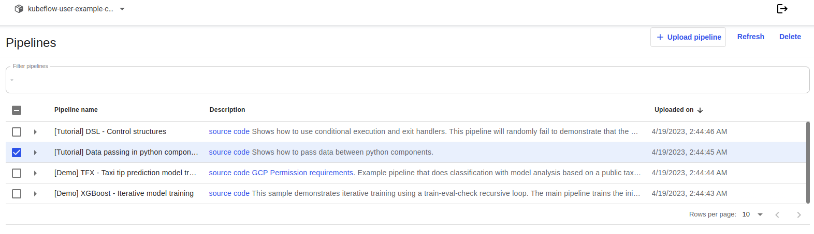

2. 點擊 "Create experiment"：

    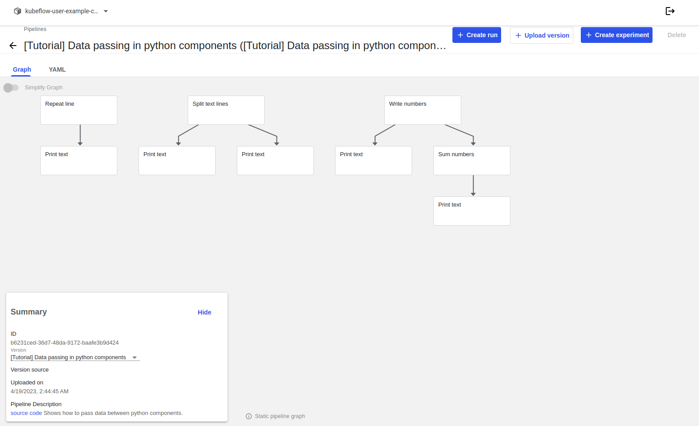

3. 按照提示創建 experiment，然後創建 run。該示例為您需要的所有參數提供默認值。以下屏幕截圖假設您已經創建了一個名為 `My first experiment` 的實驗，現在正在創建一個名為 `My first run` 的運行：

    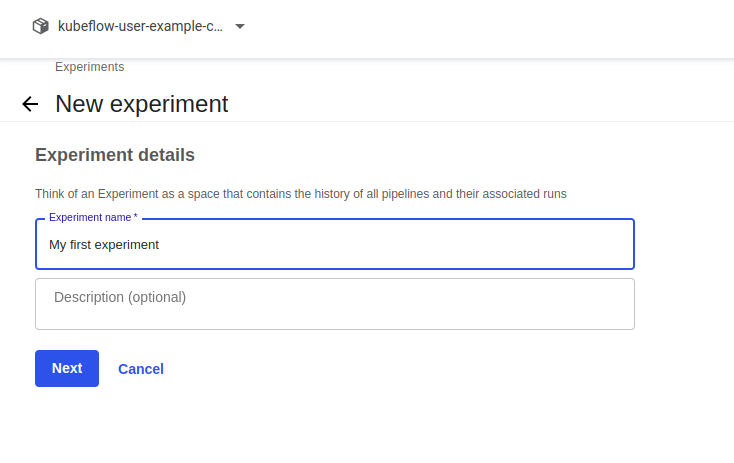

    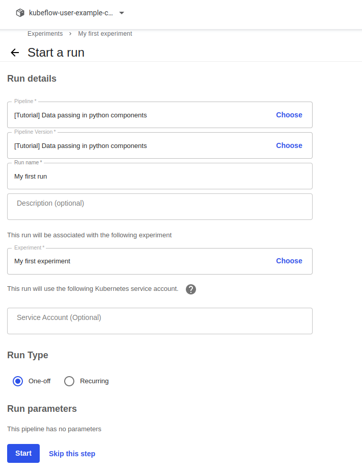

4. 點擊 **Start** 以運行管道。

5. 點擊 experiment 儀表板上的 **run** 名稱：

    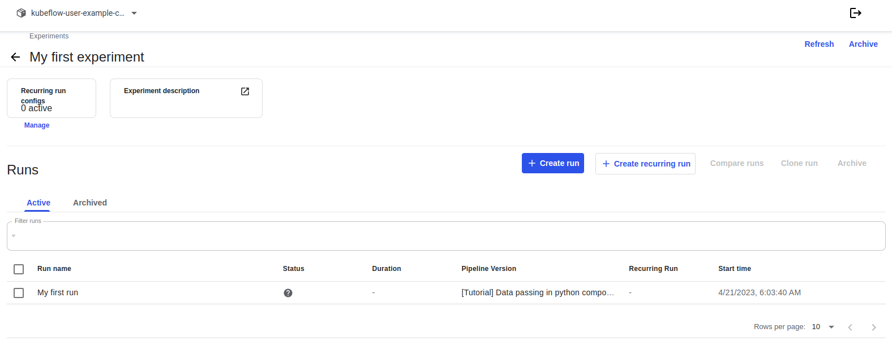

6. 通過點擊圖形的組件和其他 UI 元素來探索圖形和 run 的其他方面資訊：

    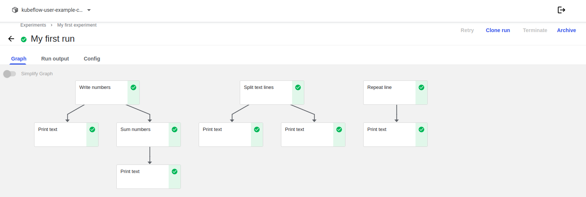

您可以在 [Kubeflow Pipelines 存儲庫](https://github.com/kubeflow/pipelines/tree/sdk/release-1.8/samples/tutorials/Data%20passing%20in%20python%20components)中找到 `Data passing in python components tutorial` 的源碼。

### 範例: Data passing in Python Components

**數據傳遞**:

數據傳遞是在設計 pipeline 時最重要思考方向。

在 Kubeflow Pipelines 中，管道開發者通過創建 component 實例（任務）並將它們連接在一起來組合管道。

component 有輸入 (input) 和輸出 (output)。他們可以消費和產生任意數據。

管道開發者通過連接組件任務的數據輸入和輸出來建立組件任務之間的連接(通過將一個任務的輸出作為參數傳遞給另一個任務的輸入)。

系統負責存儲組件生成的數據，然後按照管道的指示將該數據傳遞給其他組件以供使用。

本教程展示瞭如何創建用於生成、使用和轉換數據的 Python 組件。它展示如何通過實例化組件並將它們連接在一起來創建數據傳遞管道。

**小數據:**
 
小數據是您可以輕鬆地作為程序的命令行參數傳遞的數據。小數據大小不應超過幾千字節。
 
典型類型的小數據的一些示例是：數字、URL、小字符串（例如列名）。
 
小型列表、字典和 JSON 結構都是很好小數據類型，但要注意大小並考慮切換到更適合更大數據（超過幾千字節）或二進制數據的基於文件的數據傳遞方法。
 
所有小數據輸出將在某個時刻序列化為字符串，所有小數據輸入值將在某個時刻從字符串反序列化（作為命令行參數傳遞）。有針對幾種常見類型（例如 `str`、`int`、`float`、`bool`、`list`、`dict`）的內置序列化器和反序列化器。所有其他類型的數據都需要在返回數據之前手動序列化。確保正確指定類型註釋，否則不會系統將不會自動反序列化並且組件函數將接收字符串而不是反序列化的對象。

**大數據 (文件):**

應該從文件中讀取更大的數據並將其寫入文件。

輸入和輸出文件的路徑由系統選擇並傳遞給函數（作為字符串）。

使用 `InputPath` 參數註解告訴系統該函數要將相應的輸入數據作為文件使用。系統將下載數據，將其寫入本地文件，然後將該文件的**路徑**傳遞給函數。

使用 `OutputPath` 參數註解告訴系統該函數要產生相應的輸出數據作為文件。系統將準備並傳遞函數應寫入輸出數據的文件的**路徑**。函數退出後，系統會將數據上傳到存儲系統，以便傳遞給下游組件。

您可以通過為 “InputPath” 和 “OutputPath” 指定類型參數來指定消費/生產數據的類型。類型可以是 python 類型或任意類型名稱字符串。 `OutputPath('TFModel')` 表示該函數聲明它寫入文件的數據的類型為 “TFModel”。 `InputPath('TFModel')` 表示該函數聲明它期望從文件中讀取的數據具有 “TFModel” 類型。

當管道開發者將輸入連接到輸出時，系統會檢查類型是否匹配。

!!! note
    關於輸入/輸出名稱的注意事項：當函數轉換為組件時，輸入和輸出名稱通常跟在參數名稱之後，但是 `\_path` 和 `\_file` 後綴會從文件/路徑輸入和輸出中被剝離。例如。 `number_file_path: InputPath(int)` 參數成為 `number: int` 輸入。這使得參數傳遞看起來更自然：`number=42` 而不是 `number_file_path=42`。

```python title="Data passing in python components - Files.py"
#!/usr/bin/env python3
from typing import NamedTuple

import kfp
from kfp.components import func_to_container_op, InputPath, OutputPath

# ### Writing and reading bigger data

# Writing bigger data
@func_to_container_op
def repeat_line(line: str, output_text_path: OutputPath(str), count: int = 10):
    '''Repeat the line specified number of times'''
    with open(output_text_path, 'w') as writer:
        for i in range(count):
            writer.write(line + '\n')


# Reading bigger data
@func_to_container_op
def print_text(text_path: InputPath()): # The "text" input is untyped so that any data can be printed
    '''Print text'''
    with open(text_path, 'r') as reader:
        for line in reader:
            print(line, end = '')

def print_repeating_lines_pipeline():
    repeat_lines_task = repeat_line(line='Hello', count=5000)
    print_text(repeat_lines_task.output) # Don't forget .output !

# Submit the pipeline for execution:
#kfp.Client(host=kfp_endpoint).create_run_from_pipeline_func(print_repeating_lines_pipeline, arguments={})

# ### Processing bigger data

@func_to_container_op
def split_text_lines(source_path: InputPath(str), odd_lines_path: OutputPath(str), even_lines_path: OutputPath(str)):
    with open(source_path, 'r') as reader:
        with open(odd_lines_path, 'w') as odd_writer:
            with open(even_lines_path, 'w') as even_writer:
                while True:
                    line = reader.readline()
                    if line == "":
                        break
                    odd_writer.write(line)
                    line = reader.readline()
                    if line == "":
                        break
                    even_writer.write(line)

def text_splitting_pipeline():
    text = '\n'.join(['one', 'two', 'three', 'four', 'five', 'six', 'seven', 'eight', 'nine', 'ten'])
    split_text_task = split_text_lines(text)
    print_text(split_text_task.outputs['odd_lines'])
    print_text(split_text_task.outputs['even_lines'])

# Submit the pipeline for execution:
#kfp.Client(host=kfp_endpoint).create_run_from_pipeline_func(text_splitting_pipeline, arguments={})

# ### Example: Pipeline that generates then sums many numbers

# Writing many numbers
@func_to_container_op
def write_numbers(numbers_path: OutputPath(str), start: int = 0, count: int = 10):
    with open(numbers_path, 'w') as writer:
        for i in range(start, count):
            writer.write(str(i) + '\n')


# Reading and summing many numbers
@func_to_container_op
def sum_numbers(numbers_path: InputPath(str)) -> int:
    sum = 0
    with open(numbers_path, 'r') as reader:
        for line in reader:
            sum = sum + int(line)
    return sum


# Pipeline to sum 100000 numbers
def sum_pipeline(count: int = 100000):
    numbers_task = write_numbers(count=count)
    print_text(numbers_task.output)

    sum_task = sum_numbers(numbers_task.outputs['numbers'])
    print_text(sum_task.output)


# Submit the pipeline for execution:
#kfp.Client(host=kfp_endpoint).create_run_from_pipeline_func(sum_pipeline, arguments={})

# Combining all pipelines together in a single pipeline
def file_passing_pipelines():
    print_repeating_lines_pipeline()
    text_splitting_pipeline()
    sum_pipeline()


if __name__ == '__main__':
    # Compiling the pipeline
    kfp.compiler.Compiler().compile(file_passing_pipelines, 'sample-pipeline.yaml')
```

## 運行 ML pipeline

本部分向您展示如何運行 Pipeline UI 中可用的 XGBoost 範例。與上述基本範例不同，XGBoost 範例確實包含 ML 組件。

按照以下步驟運行範例：

1. 在管道 UI 上點擊範本名稱 `[Demo] XGBoost - Iterative model training`：

    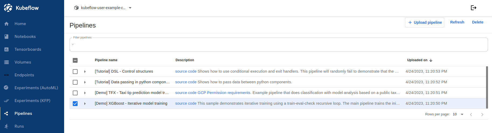

2. 點擊 "Create experiment"：

    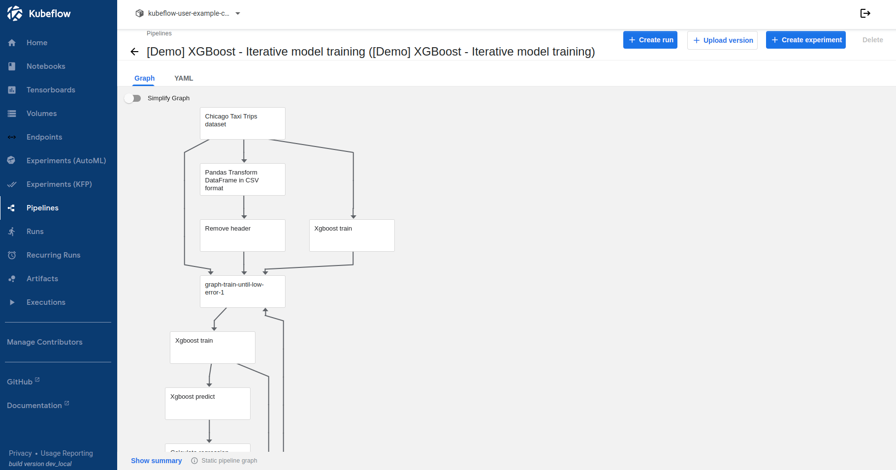

3. 按照提示創建 experiment，然後創建 run。該示例為您需要的所有參數提供默認值。以下屏幕截圖假設您已經創建了一個名為 `XGBoost experiment` 的實驗，現在正在創建一個名為 `XGBoost run` 的運行：

    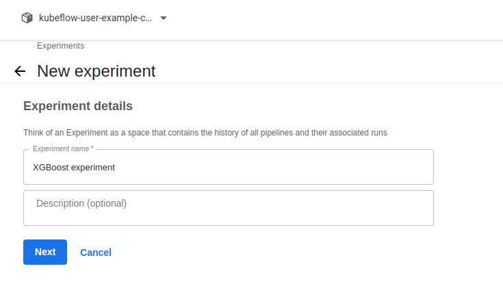

    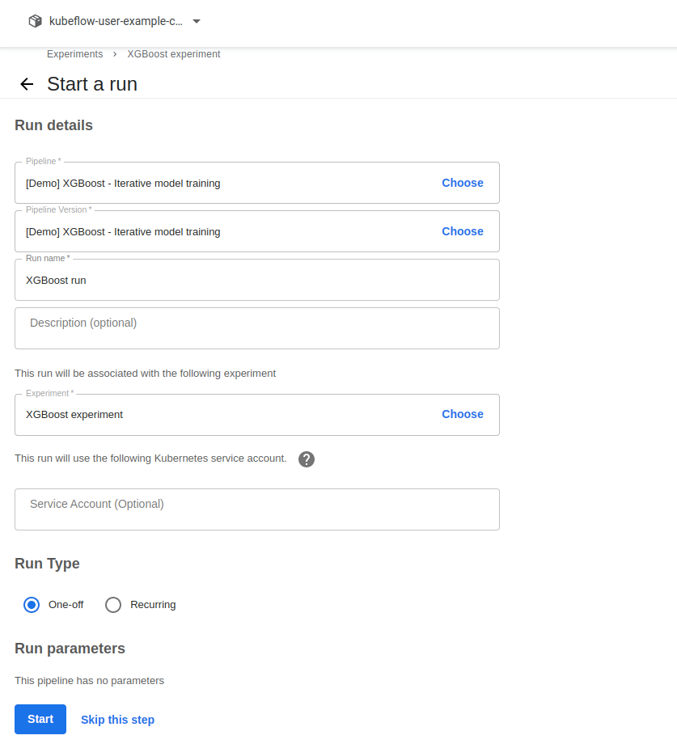

4. 點擊 **Start** 以運行管道。

5. 點擊 experiment 儀表板上的 **run** 名稱：

    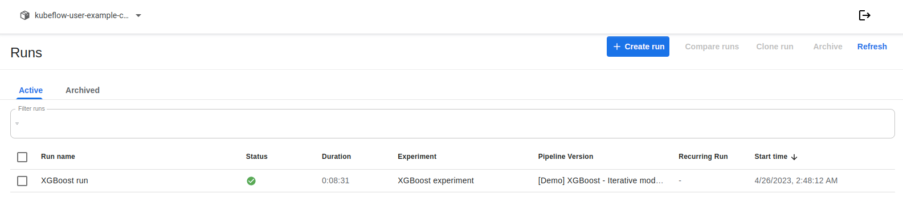

6. 通過點擊圖形的組件和其他 UI 元素來探索圖形和 run 的其他方面資訊：

    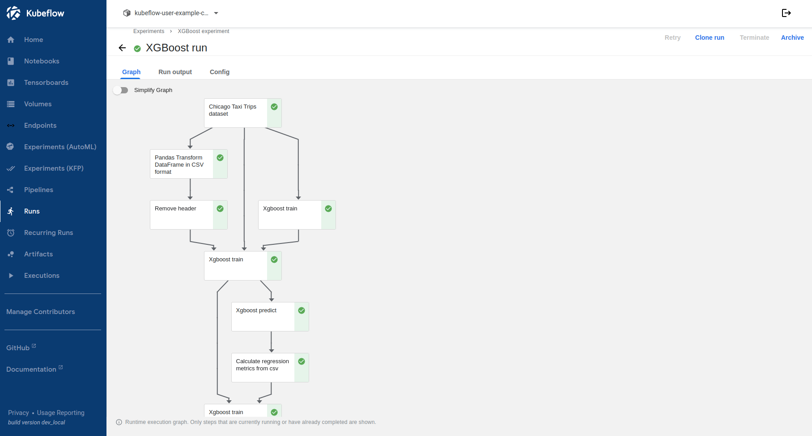

您可以在 Kubeflow Pipelines 存儲庫中找到 [XGBoost - 迭代模型訓練](https://github.com/kubeflow/pipelines/tree/sdk/release-1.8/samples/core/xgboost_training_cm)演示的源代碼。


### 範例: XGBoost-Iterative model training


```python
#!/usr/bin/env python3

import json
import kfp
from kfp import components
from kfp import dsl
import os
import subprocess

diagnose_me_op = components.load_component_from_url(
    'https://raw.githubusercontent.com/kubeflow/pipelines/566dddfdfc0a6a725b6e50ea85e73d8d5578bbb9/components/diagnostics/diagnose_me/component.yaml')

confusion_matrix_op = components.load_component_from_url('https://raw.githubusercontent.com/kubeflow/pipelines/1.7.0/components/local/confusion_matrix/component.yaml')

roc_op = components.load_component_from_url('https://raw.githubusercontent.com/kubeflow/pipelines/1.7.0/components/local/roc/component.yaml')

dataproc_create_cluster_op = components.load_component_from_url(
    'https://raw.githubusercontent.com/kubeflow/pipelines/1.7.0-rc.3/components/gcp/dataproc/create_cluster/component.yaml')

dataproc_delete_cluster_op = components.load_component_from_url(
    'https://raw.githubusercontent.com/kubeflow/pipelines/1.7.0-rc.3/components/gcp/dataproc/delete_cluster/component.yaml')

dataproc_submit_pyspark_op = components.load_component_from_url(
    'https://raw.githubusercontent.com/kubeflow/pipelines/1.7.0-rc.3/components/gcp/dataproc/submit_pyspark_job/component.yaml'
)

dataproc_submit_spark_op = components.load_component_from_url(
    'https://raw.githubusercontent.com/kubeflow/pipelines/1.7.0-rc.3/components/gcp/dataproc/submit_spark_job/component.yaml'
)

_PYSRC_PREFIX = 'gs://ml-pipeline/sample-pipeline/xgboost' # Common path to python src.

_XGBOOST_PKG = 'gs://ml-pipeline/sample-pipeline/xgboost/xgboost4j-example-0.8-SNAPSHOT-jar-with-dependencies.jar'

_TRAINER_MAIN_CLS = 'ml.dmlc.xgboost4j.scala.example.spark.XGBoostTrainer'

_PREDICTOR_MAIN_CLS = 'ml.dmlc.xgboost4j.scala.example.spark.XGBoostPredictor'


def delete_directory_from_gcs(dir_path):
  """Delete a GCS dir recursively. Ignore errors."""
  try:
    subprocess.call(['gsutil', '-m', 'rm', '-r', dir_path])
  except:
    pass


# ! Please do not forget to enable the Dataproc API in your cluster https://console.developers.google.com/apis/api/dataproc.googleapis.com/overview

# ================================================================
# The following classes should be provided by components provider.


def dataproc_analyze_op(
    project,
    region,
    cluster_name,
    schema,
    train_data,
    output):
  """Submit dataproc analyze as a pyspark job.
  :param project: GCP project ID.
  :param region: Which zone to run this analyze.
  :param cluster_name: Name of the cluster.
  :param schema: GCS path to the schema.
  :param train_data: GCS path to the training data.
  :param output: GCS path to store the output.
  """
  return dataproc_submit_pyspark_op(
      project_id=project,
      region=region,
      cluster_name=cluster_name,
      main_python_file_uri=os.path.join(_PYSRC_PREFIX, 'analyze_run.py'),
      args=['--output', str(output), '--train', str(train_data), '--schema', str(schema)]
  )


def dataproc_transform_op(
    project,
    region,
    cluster_name,
    train_data,
    eval_data,
    target,
    analysis,
    output
):
  """Submit dataproc transform as a pyspark job.
  :param project: GCP project ID.
  :param region: Which zone to run this analyze.
  :param cluster_name: Name of the cluster.
  :param train_data: GCS path to the training data.
  :param eval_data: GCS path of the eval csv file.
  :param target: Target column name.
  :param analysis: GCS path of the analysis results
  :param output: GCS path to use for output.
  """

  # Remove existing [output]/train and [output]/eval if they exist.
  delete_directory_from_gcs(os.path.join(output, 'train'))
  delete_directory_from_gcs(os.path.join(output, 'eval'))

  return dataproc_submit_pyspark_op(
      project_id=project,
      region=region,
      cluster_name=cluster_name,
      main_python_file_uri=os.path.join(_PYSRC_PREFIX,
                                        'transform_run.py'),
      args=[
        '--output',
        str(output),
        '--analysis',
        str(analysis),
        '--target',
        str(target),
        '--train',
        str(train_data),
        '--eval',
        str(eval_data)
      ])


def dataproc_train_op(
    project,
    region,
    cluster_name,
    train_data,
    eval_data,
    target,
    analysis,
    workers,
    rounds,
    output,
    is_classification=True
):

  if is_classification:
    config='gs://ml-pipeline/sample-data/xgboost-config/trainconfcla.json'
  else:
    config='gs://ml-pipeline/sample-data/xgboost-config/trainconfreg.json'

  return dataproc_submit_spark_op(
      project_id=project,
      region=region,
      cluster_name=cluster_name,
      main_class=_TRAINER_MAIN_CLS,
      spark_job=json.dumps({'jarFileUris': [_XGBOOST_PKG]}),
      args=json.dumps([
        str(config),
        str(rounds),
        str(workers),
        str(analysis),
        str(target),
        str(train_data),
        str(eval_data),
        str(output)
      ]))


def dataproc_predict_op(
    project,
    region,
    cluster_name,
    data,
    model,
    target,
    analysis,
    output
):

  return dataproc_submit_spark_op(
      project_id=project,
      region=region,
      cluster_name=cluster_name,
      main_class=_PREDICTOR_MAIN_CLS,
      spark_job=json.dumps({'jarFileUris': [_XGBOOST_PKG]}),
      args=json.dumps([
        str(model),
        str(data),
        str(analysis),
        str(target),
        str(output)
      ]))

# =======================================================================

@dsl.pipeline(
    name='xgboost-trainer',
    description='A trainer that does end-to-end distributed training for XGBoost models.'
)
def xgb_train_pipeline(
    output='gs://{{kfp-default-bucket}}',
    project='{{kfp-project-id}}',
    diagnostic_mode='HALT_ON_ERROR',
    rounds=5,
):
    output_template = str(output) + '/' + dsl.RUN_ID_PLACEHOLDER + '/data'
    region='us-central1'
    workers=2
    quota_check=[{'region':region,'metric':'CPUS','quota_needed':12.0}]
    train_data='gs://ml-pipeline/sample-data/sfpd/train.csv'
    eval_data='gs://ml-pipeline/sample-data/sfpd/eval.csv'
    schema='gs://ml-pipeline/sample-data/sfpd/schema.json'
    true_label='ACTION'
    target='resolution'
    required_apis='dataproc.googleapis.com'
    cluster_name='xgb-%s' % dsl.RUN_ID_PLACEHOLDER

    # Current GCP pyspark/spark op do not provide outputs as return values, instead,
    # we need to use strings to pass the uri around.
    analyze_output = output_template
    transform_output_train = os.path.join(output_template, 'train', 'part-*')
    transform_output_eval = os.path.join(output_template, 'eval', 'part-*')
    train_output = os.path.join(output_template, 'train_output')
    predict_output = os.path.join(output_template, 'predict_output')
    
    _diagnose_me_op = diagnose_me_op(
        bucket=output,
        execution_mode=diagnostic_mode,
        project_id=project, 
        target_apis=required_apis,
        quota_check=quota_check)
    
    with dsl.ExitHandler(exit_op=dataproc_delete_cluster_op(
        project_id=project,
        region=region,
        name=cluster_name
    )):
        _create_cluster_op = dataproc_create_cluster_op(
            project_id=project,
            region=region,
            name=cluster_name,
            initialization_actions=[
              os.path.join(_PYSRC_PREFIX,
                           'initialization_actions.sh'),
            ],
            image_version='1.5'
        ).after(_diagnose_me_op)

        _analyze_op = dataproc_analyze_op(
            project=project,
            region=region,
            cluster_name=cluster_name,
            schema=schema,
            train_data=train_data,
            output=output_template
        ).after(_create_cluster_op).set_display_name('Analyzer')

        _transform_op = dataproc_transform_op(
            project=project,
            region=region,
            cluster_name=cluster_name,
            train_data=train_data,
            eval_data=eval_data,
            target=target,
            analysis=analyze_output,
            output=output_template
        ).after(_analyze_op).set_display_name('Transformer')

        _train_op = dataproc_train_op(
            project=project,
            region=region,
            cluster_name=cluster_name,
            train_data=transform_output_train,
            eval_data=transform_output_eval,
            target=target,
            analysis=analyze_output,
            workers=workers,
            rounds=rounds,
            output=train_output
        ).after(_transform_op).set_display_name('Trainer')

        _predict_op = dataproc_predict_op(
            project=project,
            region=region,
            cluster_name=cluster_name,
            data=transform_output_eval,
            model=train_output,
            target=target,
            analysis=analyze_output,
            output=predict_output
        ).after(_train_op).set_display_name('Predictor')

        _cm_op = confusion_matrix_op(
            predictions=os.path.join(predict_output, 'part-*.csv'),
            output_dir=output_template
        ).after(_predict_op)

        _roc_op = roc_op(
            predictions_dir=os.path.join(predict_output, 'part-*.csv'),
            true_class=true_label,
            true_score_column=true_label,
            output_dir=output_template
        ).after(_predict_op)

if __name__ == '__main__':
    kfp.compiler.Compiler().compile(xgb_train_pipeline, __file__ + '.yaml')
```

**組件 diagnose_me**

- 目的: 執行特定於此管道的環境驗證
- 參數：
    - `bucket` 要檢查的桶的字符串名稱。必須採用 `gcs://bucket_root/any/path/here/is/ignored` 格式，其中忽略 root 之外的任何路徑。
    - `execution_mode` 如果設置為 `HALT_ON_ERROR` 將發生任何錯誤以引發異常。這是為了停止管道的數據處理。可以設置為 `False` 僅報告錯誤/警告。
    - `project_id` GCP 項目 ID，假定當前 pod 會執行為在該項目下。
    - `target_apis` 由要驗證的 api 的逗號分隔列表組成的字符串。
    - `quota_check` 描述需要多少配額的條目列表。每個條目具有三個字段：region、metric 和 quota_needed。全部都是字符串類型。

```yaml title="components/diagnostics/diagnose_me/component.yaml"
name: Run diagnose me
description: |-
  Performs environment verification specific to this pipeline.

        args:
            bucket:
                string name of the bucket to be checked. Must be of the format
                gs://bucket_root/any/path/here/is/ignored where any path beyond root
                is ignored.
            execution_mode:
                If set to HALT_ON_ERROR will case any error to raise an exception.
                This is intended to stop the data processing of a pipeline. Can set
                to False to only report Errors/Warnings.
            project_id:
                GCP project ID which is assumed to be the project under which
                current pod is executing.
            target_apis:
                String consisting of a comma separated list of apis to be verified.
            quota_check:
                List of entries describing how much quota is required. Each entry
                has three fields: region, metric and quota_needed. All
                string-typed.
        Raises:
            RuntimeError: If configuration is not setup properly and
            HALT_ON_ERROR flag is set.
inputs:
- name: bucket
  type: String
- name: execution_mode
  type: String
- name: project_id
  type: String
- name: target_apis
  type: String
- name: quota_check
  type: JsonArray
  optional: true
outputs:
- name: bucket
  type: String
- name: project_id
  type: String
implementation:
  container:
    image: google/cloud-sdk:279.0.0
    command:
    - python3
    - -u
    - -c
    - |
      from typing import NamedTuple

      def run_diagnose_me(
          bucket: str,
          execution_mode: str,
          project_id: str,
          target_apis: str,
          quota_check: list = None,
      ) -> NamedTuple('Outputs', [('bucket', str), ('project_id', str)]):
        """ Performs environment verification specific to this pipeline.

            args:
                bucket:
                    string name of the bucket to be checked. Must be of the format
                    gs://bucket_root/any/path/here/is/ignored where any path beyond root
                    is ignored.
                execution_mode:
                    If set to HALT_ON_ERROR will case any error to raise an exception.
                    This is intended to stop the data processing of a pipeline. Can set
                    to False to only report Errors/Warnings.
                project_id:
                    GCP project ID which is assumed to be the project under which
                    current pod is executing.
                target_apis:
                    String consisting of a comma separated list of apis to be verified.
                quota_check:
                    List of entries describing how much quota is required. Each entry
                    has three fields: region, metric and quota_needed. All
                    string-typed.
            Raises:
                RuntimeError: If configuration is not setup properly and
                HALT_ON_ERROR flag is set.
            """

        # Installing pip3 and kfp, since the base image 'google/cloud-sdk:279.0.0'
        # does not come with pip3 pre-installed.
        import subprocess
        subprocess.run([
            'curl', 'https://bootstrap.pypa.io/get-pip.py', '-o', 'get-pip.py'
        ],
                       capture_output=True)
        subprocess.run(['apt-get', 'install', 'python3-distutils', '--yes'],
                       capture_output=True)
        subprocess.run(['python3', 'get-pip.py'], capture_output=True)
        subprocess.run(['python3', '-m', 'pip', 'install', 'kfp>=0.1.31', '--quiet'],
                       capture_output=True)

        import sys
        from kfp.cli.diagnose_me import gcp

        config_error_observed = False

        quota_list = gcp.get_gcp_configuration(
            gcp.Commands.GET_QUOTAS, human_readable=False
        )

        if quota_list.has_error:
          print('Failed to retrieve project quota with error %s\n' % (quota_list.stderr))
          config_error_observed = True
        else:
          # Check quota.
          quota_dict = {}  # Mapping from region to dict[metric, available]
          for region_quota in quota_list.json_output:
            quota_dict[region_quota['name']] = {}
            for quota in region_quota['quotas']:
              quota_dict[region_quota['name']][quota['metric']
                                              ] = quota['limit'] - quota['usage']

          quota_check = [] or quota_check
          for single_check in quota_check:
            if single_check['region'] not in quota_dict:
              print(
                  'Regional quota for %s does not exist in current project.\n' %
                  (single_check['region'])
              )
              config_error_observed = True
            else:
              if quota_dict[single_check['region']][single_check['metric']
                                                ] < single_check['quota_needed']:
                print(
                    'Insufficient quota observed for %s at %s: %s is needed but only %s is available.\n'
                    % (
                        single_check['metric'], single_check['region'],
                        str(single_check['quota_needed']
                           ), str(quota_dict[single_check['region']][single_check['metric']])
                    )
                )
                config_error_observed = True

        # Get the project ID
        # from project configuration
        project_config = gcp.get_gcp_configuration(
            gcp.Commands.GET_GCLOUD_DEFAULT, human_readable=False
        )
        if not project_config.has_error:
          auth_project_id = project_config.parsed_output['core']['project']
          print(
              'GCP credentials are configured with access to project: %s ...\n' %
              (project_id)
          )
          print('Following account(s) are active under this pipeline:\n')
          subprocess.run(['gcloud', 'auth', 'list', '--format', 'json'])
          print('\n')
        else:
          print(
              'Project configuration is not accessible with error  %s\n' %
              (project_config.stderr),
              file=sys.stderr
          )
          config_error_observed = True

        if auth_project_id != project_id:
          print(
              'User provided project ID %s does not match the configuration %s\n' %
              (project_id, auth_project_id),
              file=sys.stderr
          )
          config_error_observed = True

        # Get project buckets
        get_project_bucket_results = gcp.get_gcp_configuration(
            gcp.Commands.GET_STORAGE_BUCKETS, human_readable=False
        )

        if get_project_bucket_results.has_error:
          print(
              'could not retrieve project buckets with error: %s' %
              (get_project_bucket_results.stderr),
              file=sys.stderr
          )
          config_error_observed = True

        # Get the root of the user provided bucket i.e. gs://root.
        bucket_root = '/'.join(bucket.split('/')[0:3])

        print(
            'Checking to see if the provided GCS bucket\n  %s\nis accessible ...\n' %
            (bucket)
        )

        if bucket_root in get_project_bucket_results.json_output:
          print(
              'Provided bucket \n   %s\nis accessible within the project\n   %s\n' %
              (bucket, project_id)
          )

        else:
          print(
              'Could not find the bucket %s in project %s' % (bucket, project_id) +
              'Please verify that you have provided the correct GCS bucket name.\n' +
              'Only the following buckets are visible in this project:\n%s' %
              (get_project_bucket_results.parsed_output),
              file=sys.stderr
          )
          config_error_observed = True

        # Verify APIs that are required are enabled
        api_config_results = gcp.get_gcp_configuration(gcp.Commands.GET_APIS)

        api_status = {}

        if api_config_results.has_error:
          print(
              'could not retrieve API status with error: %s' %
              (api_config_results.stderr),
              file=sys.stderr
          )
          config_error_observed = True

        print('Checking APIs status ...')
        for item in api_config_results.parsed_output:
          api_status[item['config']['name']] = item['state']
          # printing the results in stdout for logging purposes
          print('%s %s' % (item['config']['name'], item['state']))

        # Check if target apis are enabled
        api_check_results = True
        for api in target_apis.replace(' ', '').split(','):
          if 'ENABLED' != api_status.get(api, 'DISABLED'):
            api_check_results = False
            print(
                'API \"%s\" is not accessible or not enabled. To enable this api go to '
                % (api) +
                'https://console.cloud.google.com/apis/library/%s?project=%s' %
                (api, project_id),
                file=sys.stderr
            )
            config_error_observed = True

        if 'HALT_ON_ERROR' in execution_mode and config_error_observed:
          raise RuntimeError(
              'There was an error in your environment configuration.\n' +
              'Note that resolving such issues generally require a deep knowledge of Kubernetes.\n'
              + '\n' +
              'We highly recommend that you recreate the cluster and check "Allow access ..." \n'
              +
              'checkbox during cluster creation to have the cluster configured automatically.\n'
              +
              'For more information on this and other troubleshooting instructions refer to\n'
              + 'our troubleshooting guide.\n' + '\n' +
              'If you have intentionally modified the cluster configuration, you may\n'
              +
              'bypass this error by removing the execution_mode HALT_ON_ERROR flag.\n'
          )

        return (project_id, bucket)

      def _serialize_str(str_value: str) -> str:
          if not isinstance(str_value, str):
              raise TypeError('Value "{}" has type "{}" instead of str.'.format(str(str_value), str(type(str_value))))
          return str_value

      import json
      import argparse
      _parser = argparse.ArgumentParser(prog='Run diagnose me', description='Performs environment verification specific to this pipeline.\n\n      args:\n          bucket:\n              string name of the bucket to be checked. Must be of the format\n              gs://bucket_root/any/path/here/is/ignored where any path beyond root\n              is ignored.\n          execution_mode:\n              If set to HALT_ON_ERROR will case any error to raise an exception.\n              This is intended to stop the data processing of a pipeline. Can set\n              to False to only report Errors/Warnings.\n          project_id:\n              GCP project ID which is assumed to be the project under which\n              current pod is executing.\n          target_apis:\n              String consisting of a comma separated list of apis to be verified.\n          quota_check:\n              List of entries describing how much quota is required. Each entry\n              has three fields: region, metric and quota_needed. All\n              string-typed.\n      Raises:\n          RuntimeError: If configuration is not setup properly and\n          HALT_ON_ERROR flag is set.')
      _parser.add_argument("--bucket", dest="bucket", type=str, required=True, default=argparse.SUPPRESS)
      _parser.add_argument("--execution-mode", dest="execution_mode", type=str, required=True, default=argparse.SUPPRESS)
      _parser.add_argument("--project-id", dest="project_id", type=str, required=True, default=argparse.SUPPRESS)
      _parser.add_argument("--target-apis", dest="target_apis", type=str, required=True, default=argparse.SUPPRESS)
      _parser.add_argument("--quota-check", dest="quota_check", type=json.loads, required=False, default=argparse.SUPPRESS)
      _parser.add_argument("----output-paths", dest="_output_paths", type=str, nargs=2)
      _parsed_args = vars(_parser.parse_args())
      _output_files = _parsed_args.pop("_output_paths", [])

      _outputs = run_diagnose_me(**_parsed_args)

      if not hasattr(_outputs, '__getitem__') or isinstance(_outputs, str):
          _outputs = [_outputs]

      _output_serializers = [
          _serialize_str,
          _serialize_str,

      ]

      import os
      for idx, output_file in enumerate(_output_files):
          try:
              os.makedirs(os.path.dirname(output_file))
          except OSError:
              pass
          with open(output_file, 'w') as f:
              f.write(_output_serializers[idx](_outputs[idx]))
    args:
    - --bucket
    - inputValue: bucket
    - --execution-mode
    - inputValue: execution_mode
    - --project-id
    - inputValue: project_id
    - --target-apis
    - inputValue: target_apis
    - if:
        cond:
          isPresent: quota_check
        then:
        - --quota-check
        - inputValue: quota_check
    - '----output-paths'
    - outputPath: bucket
    - outputPath: project_id
```

**組件 confusion_matrix**

- 目的: 計算混淆矩陣
- 參數：
    - `predictions`
    - `target_lambda` 
    - `output`
    - `ui-metadata-output-path`
    - `metrics-output-path` 

```yaml title="components/local/confusion_matrix/component.yaml"
name: Confusion matrix
description: Calculates confusion matrix
inputs:
  - {name: Predictions,     type: GCSPath,        description: 'GCS path of prediction file pattern.'} # type: {GCSPath: {data_type: CSV}}
  - {name: Target lambda,   type: String, default: '', description: 'Text of Python lambda function which computes target value. For example, "lambda x: x[''a''] + x[''b'']". If not set, the input must include a "target" column.'}
  - {name: Output dir,      type: GCSPath,  description: 'GCS path of the output directory.'} # type: {GCSPath: {path_type: Directory}}
outputs:
  - {name: MLPipeline UI metadata, type: UI metadata}
  - {name: MLPipeline Metrics,     type: Metrics}
implementation:
  container:
    image: gcr.io/ml-pipeline/ml-pipeline-local-confusion-matrix:1.7.0
    command: [python2, /ml/confusion_matrix.py]
    args: [
      --predictions, {inputValue: Predictions},
      --target_lambda, {inputValue: Target lambda},
      --output,      {inputValue: Output dir},
      --ui-metadata-output-path, {outputPath: MLPipeline UI metadata},
      --metrics-output-path, {outputPath: MLPipeline Metrics},
    ]
```

**組件 roc**

- 目的: 計算接受者操作特徵曲線
- 參數：
    - `predictions`
    - `trueclass` 
    - `true_score_column`
    - `target_lambda`
    - `output` 
    - `ui-metadata-output-path`
    - `metrics-output-path`

```yaml
name: ROC curve
description: Calculates Receiver Operating Characteristic curve. See https://en.wikipedia.org/wiki/Receiver_operating_characteristic
inputs:
  - {name: Predictions dir,   type: GCSPath,  description: 'GCS path of prediction file pattern.'}  #TODO: Replace dir data + schema files # type: {GCSPath: {path_type: Directory}}
  - {name: True class,        type: String, default: 'true',            description: 'The true class label for the sample. Default is "true".'}
  - {name: True score column, type: String, default: 'true',            description: 'The name of the column for positive probability.'}
  - {name: Target lambda,     type: String, default: '',                description: 'Text of Python lambda function which returns boolean value indicating whether the classification result is correct.\nFor example, "lambda x: x[''a''] and x[''b'']". If missing, input must have a "target" column.'}
  - {name: Output dir,        type: GCSPath,  description: 'GCS path of the output directory.'}     #TODO: Replace dir with single file # type: {GCSPath: {path_type: Directory}}
outputs:
  - {name: MLPipeline UI metadata, type: UI metadata}
  - {name: MLPipeline Metrics,     type: Metrics}
implementation:
  container:
    image: gcr.io/ml-pipeline/ml-pipeline-local-confusion-matrix:1.7.0
    command: [python2, /ml/roc.py]
    args: [
      --predictions,        {inputValue: Predictions dir},
      --trueclass,          {inputValue: True class},
      --true_score_column,  {inputValue: True score column},
      --target_lambda,      {inputValue: Target lambda},
      --output,             {inputValue: Output dir},
      --ui-metadata-output-path, {outputPath: MLPipeline UI metadata},
      --metrics-output-path, {outputPath: MLPipeline Metrics},
    ]
```

