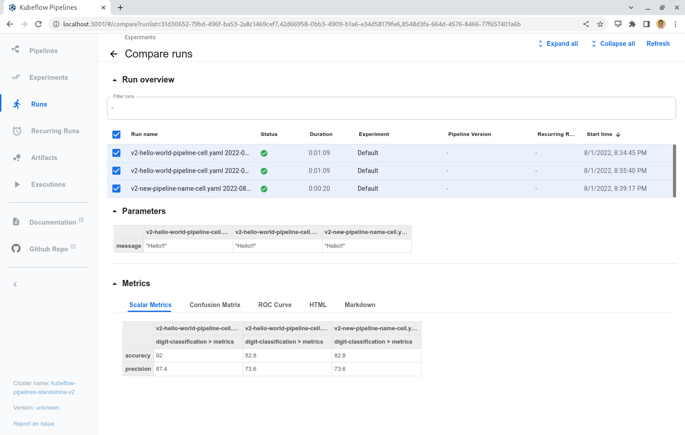
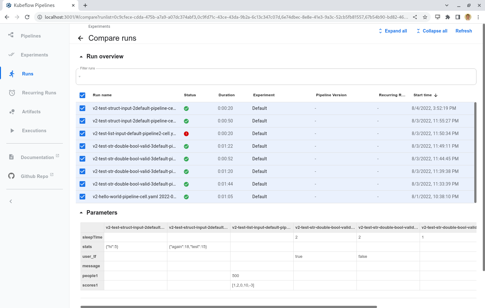
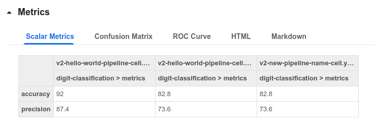
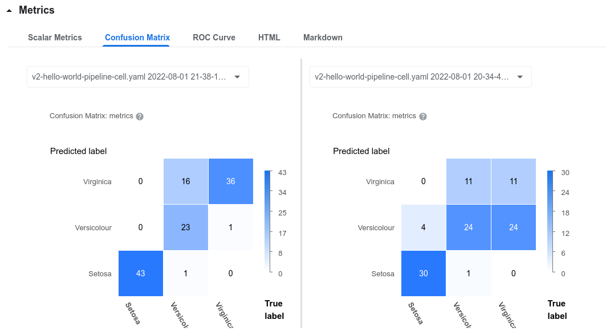
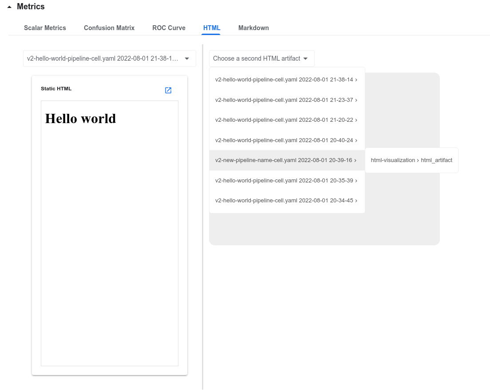
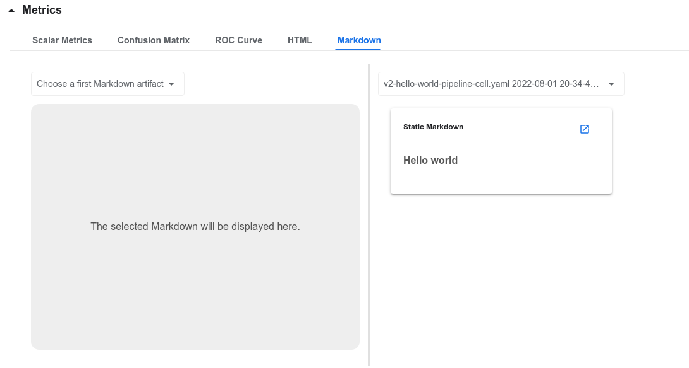
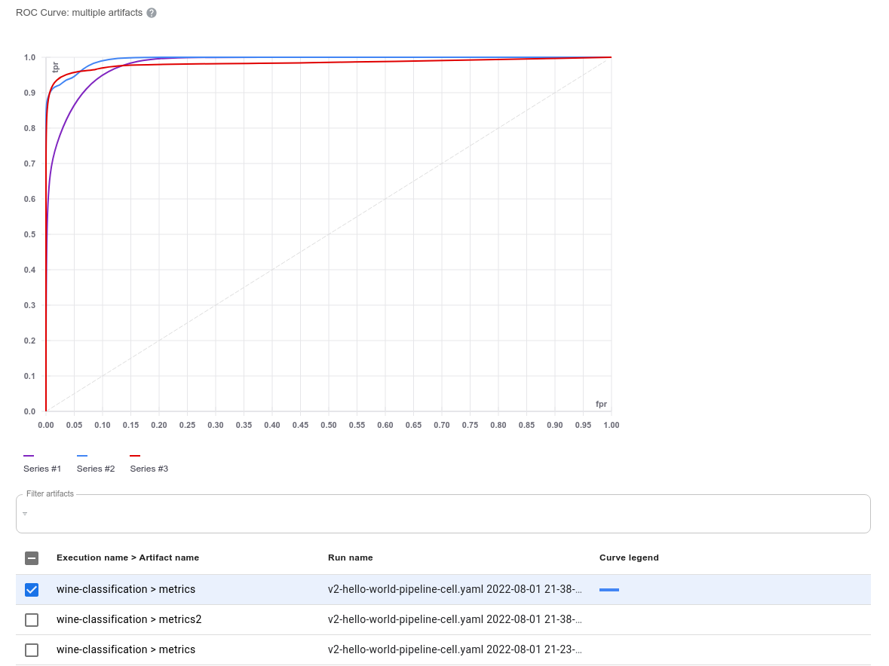
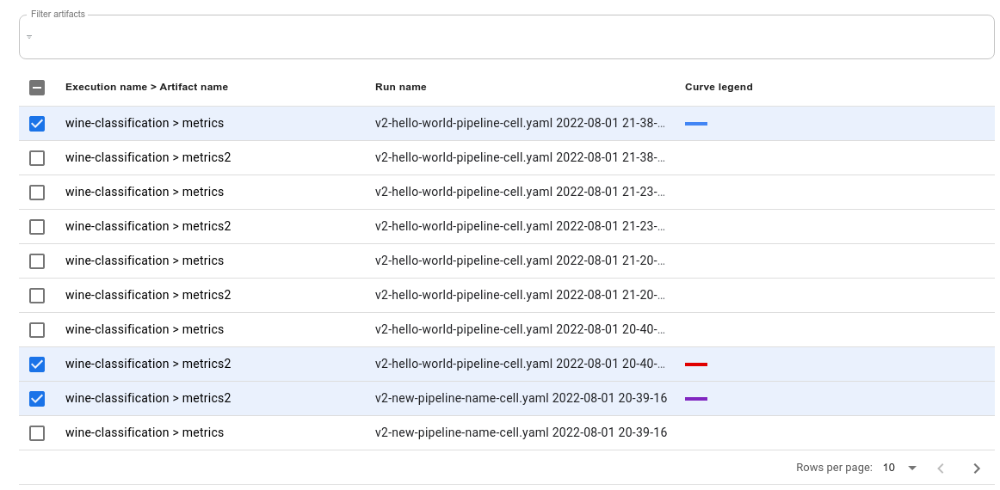

# 管道運行比對

**使用 KFPv2 運行比較頁面比較管道運行中的參數和指標**

## 先決條件

要比較管道運行，您首先需要至少有兩個相同版本的管道運行(pipeline run)！您可以按照管道快速入門指南運行您的第一個管道。

此頁面將顯示 v2 UI，它允許您比較以下可視化類型：

- Scalar Metrics
- Confusion Matrices
- ROC Curves
- HTML
- Markdown

## 基本 Layout

KFPv2 運行比較頁包含三個主要部分：

- Run overview
- Parameters
- Metrics

**KFPv2 Run Comparison Full Page**

運行概覽部分允許用戶查看和選擇特定運行。對這些選擇的任何更改都會相應地自動更新參數和指標部分。頁面右上角的“刷新”按鈕將重新獲取運行，並在頁面上顯示任何新的運行狀態或工件信息。為了最好地使用此頁面，我們建議合理區分運行名稱(run name)，最好在運行名稱的開頭。

Parameters 部分由一個表組成，該表顯示每次運行的運行參數，即使運行沒有參數也是如此。只有在管道運行中明確包含這些參數時才會顯示這些參數（默認參數不存在）。新的 KFPv2 更新允許不同的參數類型（Double、Integer、String、Boolean、List 和 Struct），顯示格式允許用戶區分這些數據類型。

**Run Parameters Compare Table**

指標部分有五個不同的頁籤，每個頁籤對應一種可視化類型。以下部分將回顧每一個頁籤。

## Scalar Metrics

標量指標(Scalar Metrics)頁籤以表格形式比較跨運行(run)的標量指標。該表的第一行將執行和工件分組到它們的運行中。第二行通過 <execution-name>-<artifact-name> 格式顯示每個工件，這允許每個工件被唯一區分。如果運行不存在，則意味著它沒有任何標量度量工件。然後數據顯示在下面的行中。

!!! info
    注意：如果找不到執行或工件名稱，它將顯示其相應的 ID 作為佔位符。

**Scalar Metrics Compare Table**

## Confusion Matrix, HTML, 與 Markdown

比較混淆矩陣、HTML 和 Markdown 的顯示都使用雙面板佈局來並排比較數據。可以通過兩級下拉菜單選擇特定的工件；第一級顯示具有指定工件的運行列表，第二級顯示具有命名模式 <execution-name>-<artifact-name> 的可選工件列表。此下拉列表在下面的 HTML 頁籤上可見。

**Confusion Matrix Comparison**

**HTML Comparison**

**Markdown Comparison**

## ROC 曲線

ROC 曲線頁籤由兩個主要部分組成：顯示所有選定工件的 ROC 曲線圖，以及允許用戶搜索和選擇工件的過濾表。該圖將選擇限制為最多 10 條曲線，之後您必須取消選擇工件才能選擇更多曲線。

用戶可以將鼠標懸停在圖例中的任何“系列”項目上以突出顯示曲線；由於許多曲線可能相同，因此這也會將選定的曲線置於最前面。取消選擇並重新選擇過濾器表上的工件也會將該曲線帶到圖的頂部。

ROC 曲線過濾器表允許您過濾和選擇工件。用戶可以按運行名稱或 `[execution-name] > [artifact-name]` 的組合（顯示在第一列）進行搜索。當您選擇一個工件時，表格會為其分配一種顏色，然後您可以使用該顏色來識別序列號和圖上的線條。如果您選擇了 10 個工件，而還有更多工件可用，則會彈出警告，表明您已達到所選工件的最大數量，並且剩餘的工件複選框選擇將被禁用；這可以防止表格變得過於混亂。

**ROC Curve Filter Table**

## 結論

KFPv2 運行比較頁面允許用戶在比較他們的運行時通過跨管道運行工件比較不同的可視化類型來執行更快的分析。

