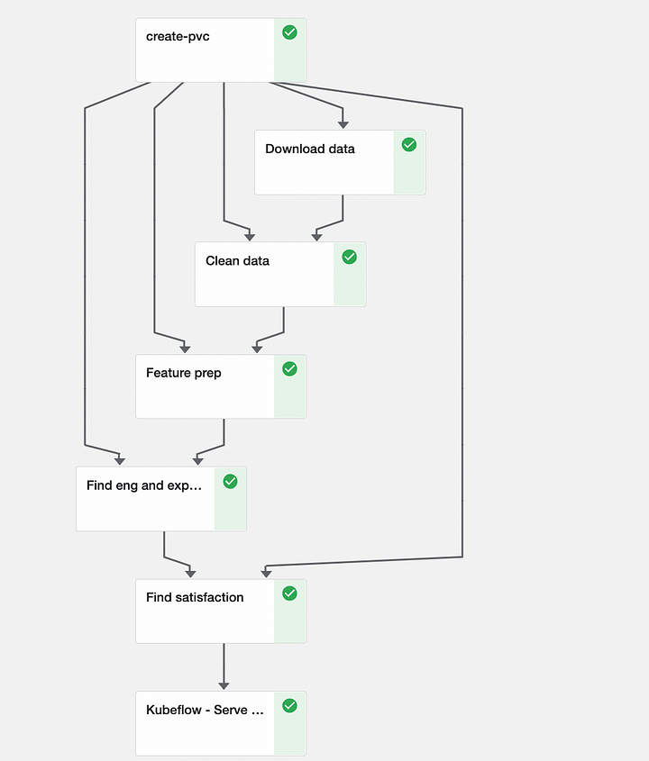

# Kubeflow pipelines — 輕量級組件

原文: [Kubeflow pipelines (part 1) — lightweight components](https://medium.com/@gkkarobia/kubeflow-pipelines-part-1-lightweight-components-a4a3c8cb3f2d)

在機器學習項目中，跟踪數據準備、模型訓練和監控等步驟發生的時間和地點是一項挑戰，端到端管道充當描述需要發生的事情和時間的分步地圖。 

Pipelines 允許構建易於共享、可複制和可拼接的機器學習項目。

Kubeflow 管道是一組服務和 UI，使用戶能夠創建和管理機器學習管道。用戶可以編寫自己的代碼或從大量預定義的組件和算法構建。

一個 Kubeflow 的 task 組件是打包在 Docker 鏡像中並在機器學習管道中執行一個步驟的 Python 代碼，它可以接收參數和產生輸出，並將為管道上的每個步驟啟動一個或多個 Kubernetes pod。（下圖 1 中的每個塊都是一個 Kubeflow 任務組件）

您可以將 Kubeflow 管道視為一個有向無環圖 (DAG)，每個節點上都有一個容器化進程。讓我們開始構建一個。



## 創建 Kubeflow 管道

我們將建立一個端到端的 ML 管道，用於根據無監督數據預測電信公司的客戶滿意度。

該管道涉及從谷歌云存儲桶中獲取數據、清理數據、特徵準備、查找體驗和參與分數、查找滿意度分數以及將模型存儲在谷歌云存儲桶中以用於模型服務。

由於解釋每個組件的作用會使本教程太長，我們將探討一些任務組件，其餘部分將在文章末尾鏈接的 GitHub 存儲庫中進行解釋。

我們還將討論創建 Kubeflow 管道的兩種方法：

- 使用輕量級組件
- 使用可重用組件

在教程中，我們將介紹使用輕量級組件構建的 Kubeflow 管道，並在下一個教程中介紹可重用組件。首先，我們必須通過運行以下命令來安裝 Kubeflow SDK：

```bash
pip install kfp
```

## 創建輕量級組件

為了構建輕量級組件，我們定義了一個獨立的 Python 函數，然後調用 `kfp.components.func_to_container_op(stand_alone_function)` 將該函數轉換為可在管道中使用的任務組件。

例如，對於下載數據任務組件，我們有以下功能：

```python title="download_data.py"
def download_data() -> str:
    import pandas as pd
    from requests import get
    import io

    url = "https://storage.googleapis.com/<GCS bucket>/data/telco.csv"
    s = get(url).content
    df = pd.read_csv(io.StringIO(s.decode("utf-8")))

    data_path = "/data/telco.csv"
    df.to_csv(data_path)

    return data_path
```

要將上述函數轉換為任務組件，我們只需編寫：

```python
download_data_op = kfp.components.func_to_container_op(download_data, packages_to_install=["pandas", "requests"])
```

請注意 `packages_to_install` 關鍵字，這將安裝運行獨立功能所需的所有包。

輕量級任務組件功能有幾個要求：

- 該函數必須是獨立的。
    - 它不應使用在函數定義之外聲明的任何代碼。
    - 任何導入都應添加到主要任務組件函數中。
    - 任何輔助函數也應該在主要任務組件函數中定義。

- 該函數只能導入基礎映像中可用的包，因此您必須使用 `packages_to_install` 關鍵字指定要安裝的包。 （如上例所示）

- 如果函數對數字進行操作，則參數必須具有類型提示。支持的類型有 int、float、bool。所有其他參數都作為字符串傳遞。

- 要構建具有多個輸出值的任務組件，請使用 Python 的 `typing.NamedTuple` 類型提示。

讓我們展行另外一個範例 - `feature_prep()`, 它將執行下列工作:

- 總結我們數據集中的列
- 創建新列
- 創建兩個新數據框並返回數據框的路徑。

由於其功能強大，它滿足了上述大部分要求，如下圖所示：

```python title="feature_prep.py"
from typing import NamedTuple

def feature_prep(input_path: str) -> NamedTuple("feature_paths", [("exp_path", str), ("eng_path", str)]):
    import pandas as pd

    # this sums up all the values in a dataframe col
    def sum_agg(dataframe: pd.DataFrame, col: str) -> pd.DataFrame:
        s = dataframe.groupby("MSISDN/Number")[col].agg("sum").sort_values(ascending=False)
        df = pd.DataFrame({"MSISDN/Number": s.index, col: s.values})

        return df

    df = pd.read_csv(input_path)

    # combine both the download and upload data cols in bytes
    df["Total traffic"] = df["Total DL (Bytes)"] + df["Total UL (Bytes)"]

    # get total duration and traffic for each use and merge them into one dataframe
    df_dur_ms = sum_agg(df, "Dur. (ms)")
    df_total_bytes = sum_agg(df, "Total traffic")
    df_engagement = pd.merge(df_dur_ms, df_total_bytes, on="MSISDN/Number")

    # get the number of sessions each user has
    session_series = df.groupby("MSISDN/Number")["Dur. (ms)"].count().sort_values(ascending=False)
    df_sess_freq = pd.DataFrame({"MSISDN/Number": session_series.index, "sessions freq": session_series.values})

    # merge the engagement dataframe and sessions frequency dataframe
    df_engagement = pd.merge(df_engagement, df_sess_freq, on="MSISDN/Number")

    # Summing the Uploads and Downloads columns to get the Total data columns
    df["Avg RTT"] = df["Avg RTT DL (ms)"] + df["Avg RTT UL (ms)"]
    df["Avg Bearer TP (kbps)"] = df["Avg Bearer TP DL (kbps)"] + df["Avg Bearer TP UL (kbps)"]
    df["TCP Retrans. Vol (Bytes)"] = df["TCP DL Retrans. Vol (Bytes)"] + df["TCP UL Retrans. Vol (Bytes)"]

    # select the required columns for experience analysis
    df_experience = df[["MSISDN/Number", "Avg RTT", "Avg Bearer TP (kbps)", "TCP Retrans. Vol (Bytes)"]]

    df_exp_path = "/data/experience.csv"
    df_eng_path = "/data/engagement.csv"

    df_engagement.to_csv(df_eng_path)
    df_experience.to_csv(df_exp_path)

    # convert the feature paths to a named tuple
    from collections import namedtuple
    feature_paths = namedtuple("feature_paths", ["exp_path", "eng_path"])
    return feature_paths(df_eng_path, df_eng_path)
```

為了滿足輕量級任務組件第一個要求，我們在任務組件函數中導入了 `pandas`，並在主任務組件函數中定義了輔助函數 `sum_agg`。由於每個任務組件函數在運行管道時都打包在容器內，因此在運行任務組件函數的容器內將無法訪問在任務組件函數外部定義的任何導入或任何函數。

為了從任務組件函數中獲得多個輸出，在定義函數時，我們使用 typing 模塊中的 `NamedTuple` 方法並指定我們獲得的每個輸出的類型，在我們的特徵準備函數中，輸出是體驗和參與的路徑 dataframes 並且都是字符串類型，因此我們將輸出的類型提示為：

```python
NamedTuple("feature_paths", [("exp_path", str), ("eng_path", str)])
```

在任務組件函數內部，我們使用 collections 模塊中的 `namedtuple` 方法轉換我們的路徑變量（注意導入發生在任務組件函數內部）：

```python
from collections import namedtuple                                 feature_paths = namedtuple("feature_paths", ["exp_path", "eng_path"])
```

我們在 `feature_prep` 的定義中也有輸入參數的類型提示 `(input_path: str)`。

## 定義管道

使用 `@dsl.pipeline` 裝飾器包裝我們的管道函數會將函數轉換為描述任務組件如何相互交互的管道組件。如下所示;

```python
from kfp import dsl

@dsl.pipeline(name="telco_pipeline", description="lightweight component Telco pipeline for the medium article")
def telco_pipeline():
```

我們項目的管道函數如下所示（您可以在鏈接的 GitHub 存儲庫中找到定義的 `clean_data`、`find_eng_and_exp_score` 和 `find_satisfaction` 任務組件函數）：

```python title="pipeline_definition.py"
from kfp import dsl

@dsl.pipeline(name="telco_pipeline",
              description="Telco pipeline for the medium article")
def telco_pipeline():

    data_op = dsl.VolumeOp(name="create-pvc",
                           resource_name="data-volume",
                           size="2Gi",
                           modes=dsl.VOLUME_MODE_RWO)

    download_data_op = kfp.components.func_to_container_op(download_data,
                                                           packages_to_install=["pandas", "requests"])
    clean_data_op = kfp.components.func_to_container_op(clean_data, packages_to_install=["pandas"])
    feature_prep_op = kfp.components.func_to_container_op(feature_prep, packages_to_install=["pandas"])
    find_eng_and_exp_score_op = kfp.components.func_to_container_op(find_eng_and_exp_score,
                                                                    packages_to_install=["pandas", "numpy",
                                                                                         "scikit-learn",
                                                                                         "google-cloud-storage",
                                                                                         "requests"])
    find_satisfaction_op = kfp.components.func_to_container_op(find_satisfaction,
                                                               packages_to_install=["pandas", "numpy",
                                                                                    "scikit-learn",
                                                                                    "google-cloud-storage",
                                                                                    "requests"])

    step1 = download_data_op().add_pvolumes({"/data": data_op.volume})
    step2 = clean_data_op(step1.output).add_pvolumes({"/data": data_op.volume})
    step3 = feature_prep_op(step2.output).add_pvolumes({"/data": data_op.volume})
    step4 = find_eng_and_exp_score_op(step3.outputs["exp_path"], step3.outputs["eng_path"])\
        .add_pvolumes({"/data": data_op.volume})
    step5 = find_satisfaction_op(step4.output).add_pvolumes({"/data": data_op.volume})
```

首先，我們使用 `kfp.dsl` 模塊中的 `VolumeOp` 類，該任務組件被轉換為創建持久卷聲明 (PVC) 的資源模板。這將創建一個持久卷，我們可以將其附加到其他任務組件，並可以根據指定的模式向其中讀取和寫入數據。

這是 download_data 函數下載我們的數據和特徵準備函數存儲我們的數據的地方。 resource_name 關鍵字定義將要創建的 PVC 的所需名稱，size 關鍵字定義將要創建的 PVC 的大小，而 modes 關鍵字定義 PVC 的訪問模式。如下所示;

```python
data_op = dsl.VolumeOp(name="create-pvc",
                           resource_name="data-volume",
                           size="2Gi",
                           modes=dsl.VOLUME_MODE_RWO)
```

下一步是使用 `kfp.components.func_to_container_op()` 函數（如前面的代碼片段 2 中所述）將所有函數轉換為任務組件。然後，我們使用 add_pvolumes() 函數將創建的持久卷附加到任務組件，該函數接收一個字典，其中包含卷掛載點的鍵、對值以及來自卷任務組件的捲。如下所示:

```python
step1 = download_data_op().add_pvolumes({"/data": data_op.volume})
```

然後我們定義任務組件應遵循的順序。我們還可以通過調用 `earlier_task_component.output` 將早期任務組件的輸出傳遞給當前任務組件。在我們有多個輸出的情況下，我們指定我們想要的輸出的名稱。即 `earlier_task_component.outputs["name_of_output"]` 。如下所示:

```python
step2 = clean_data_op(step1.output).add_pvolumes({"/data": data_op.volume})
step3 = feature_prep_op(step2.output).add_pvolumes({"/data": data_op.volume})
step4 = find_eng_and_exp_score_op(step3.outputs["exp_path"], step3.outputs["eng_path"])\
        .add_pvolumes({"/data": data_op.volume})
```

## 運行管道

有兩種運行 Kubeflow 管道的方法，我們可以直接從我們的代碼運行它，方法是使用我們在第一步中安裝的 SDK (kfp) 創建到 Kubeflow 集群的連接。為了運行我們的管道，我們使用下面的代碼。

```python
kubeflow_gateway_endpoint = <kubeflow istio ingress url>
authservice_session_cookie = <authentication cookie>
namespace = <namespace>

client = kfp.Client(host=f"http://{kubeflow_gateway_endpoint}/pipeline",
                    cookies=f"authservice_session={authservice_session_cookie}")

experiment = client.create_experiment("telco", namespace=namespace)
print(client.list_experiments(namespace=namespace))

kfp.compiler.Compiler().compile(telco_pipeline, "telco_pipeline.zip")
run = client.run_pipeline(experiment_id=experiment.id, job_name="lightweight_pipeline",
                          pipeline_package_path="telco_pipeline.zip")
```

我們使用 `kfp.Client()` 連接到我們的 Kubeflow 集群並指定管道端點以連接到 Kubeflow 管道。您可以在[此處](https://awslabs.github.io/kubeflow-manifests/docs/component-guides/pipelines/)找到有關如何獲取 `authservice_session_cookie` 的說明。

!!! tip
    注意：如果您無法從瀏覽器中找到會話 cookie。您可以按照我的指南了解如何在[此處](https://github.com/Jabor047/Kubeflow-Pipelines/blob/main/lightweight_pipeline/auth_cookie.md)獲取 authservice_session_cookie。

為了讓我們運行管道，我們必須創建一個 `experiment`，將 `experiment` 視為需要端到端機器學習管道的項目的名稱。由於管道在 `experiment` 內部運行，我們可以在一個 `experiment` 中多次運行相同的管道或不同的管道。

`kfp.complier.Compiler().compile(telco, "telco_pipeline.zip")` 將管道轉換為一個 zip 文件，該文件與我們的腳本存儲在同一目錄中。然後我們將這個文件連同我們之前創建的實驗的實驗 ID 一起傳遞給 `client.run_pipeline()` 方法。這將為我們運行我們的管道。


我們還可以通過在 Kubeflow 儀表板中手動創建實驗、上傳管道並為管道創建運行來運行管道。上傳由 `kfp.complier.Compiler().compile(telco, "telco_pipeline.zip")` 方法創建的 zip 文件後，流程就從那裡開始，您所要做的就是點擊按鈕並添加描述性訊息。

## 結論

在本教程中，我們學習了一種在 Kubeflow 上創建和運行端到端 ML 管道的方法。您可以在[此處](https://github.com/Jabor047/Kubeflow-Pipelines)找到為整個項目編寫的代碼。這種方法比可重用組件的方式更容易創建端到端的管道，因為您不必自己配置 docker 容器並編寫它們各自的組件規範 yaml 文件。然而，可重用組件方法具有更好的可重用性，我們將在 Kubeflow 系列的下一個（也是最後一個）博客教程中看到。下一篇見！