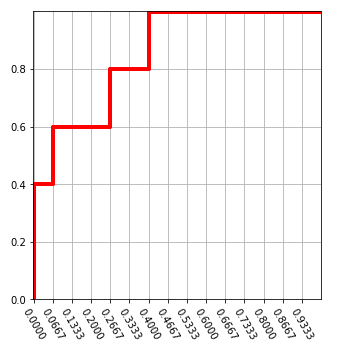

# 機器學習的效能衡量指標

## 前言

初接觸機器學習時，常會被幾個效能衡量指標搞得一個頭兩個大：

1. 混淆矩陣(Confusion Matrix)。
2. 準確率(Accuracy)、精確率(Precision)、召回率(Recall)、F1 Score、真陽率(True Positive Rate)、假陽率(False Positive Rate)...。
3. ROC/AUC 曲線

要衡量演算法的效能，不就是算正確的個數佔全體樣本的比例就好了嗎? 為甚麼發明一堆的比率，搞死一堆腦細胞呢?以下筆者試著用圖表及簡短的說明，釐清一些觀點，囿於才疏學淺，不夠精準的地方，還請不吝指正。

**混淆矩陣(Confusion Matrix)及相關效能衡量指標**

資料來源: [混淆矩陣](https://en.wikipedia.org/wiki/Confusion_matrix)


## 混淆矩陣(Confusion Matrix)

看到上圖，就頭皮發麻了，哪記得那麼多公式啊，不急，我們先拿掉周圍的比率，只留下左上角，並且翻譯為中文，如下圖：


圖中四格(tn, fp, fn, tp)代表的意義如下，口訣是先解讀第二個字母，再解讀第一個字母：

- `tp`：預測為陽性(p)，預測正確(t)。
- `tn`：預測為陰性(n)，預測正確(t)。
- `fp`：預測為陽性(p)，預測錯誤(f)。
- `fn`：預測為陰性(n)，預測錯誤(f)。

其中 fp 又被稱為『**型一誤差**』(Type I Error)，也稱為 `α error`，以假設檢定來說，當H0(虛無假設)為真時，預測 H1 為真。反之，fn 又被稱為『**型二誤差**』(Type II Error)，亦稱為 `β error`，以假設檢定來說，當H0為假時，預測 H1 為假。

### 混淆矩陣計算範例

實際計算很簡單，Scikit-Learn 直接支援混淆矩陣的計算，只要把真實值(Ground Truth)及預測值(Prediction)放入參數中，就搞定了。

```python
from sklearn.metrics import confusion_matrix

actual = [1, 1, 0, 1, 0, 0, 1, 0, 0, 0]
predicted = [1, 0, 0, 1, 0, 0, 1, 1, 1, 0]
tn, fp, fn, tp = confusion_matrix(actual, predicted).ravel()
print(tn, fp, fn, tp)
```

### 準確率、精確率(Precision)、召回率(Recall)、F1 Score

了解混淆矩陣後，就可依據 tn, fp, fn, tp 計算各式比率，以衡量模型的效能，相關公式都很簡單，如下：

- `準確率（Accuracy）` = (tp+tn)/(tp+fp+fn+tn)
- `精確率（Precision）` = tp/(tp+fp)，即陽性的樣本中有幾個是預測正確的。
- `召回率（Recall）` = tp/(tp+fn)，即事實為真的樣本中有幾個是預測正確的。
- `F1` = 2 / ( (1/ Precision) + (1/ Recall) )，即精確率與召回率的調和平均數。


其他比率公式請參看圖一。

一般情況下，我們只要使用`準確率(Accuracy)`衡量模型的效能即可，就是『預測正確的比率』，即 `猜對的個數(tp+tn) / 全部樣本數`。但是，當訓練資料的目標變數不平衡(imbalance)時就要小心了，以下以檢驗設備為例詳細說明。

假設有1000人接受癌症檢查，實際上有2人患有癌症，如果醫療檢驗設備檢查出3人為陽性，則其準確率為 999/1000=99.9%，這結果大家應該都很滿意，但是，如果有一天這台設備故障了，同樣檢查1000人，無人為陽性，這時準確率為 998/1000=99.8%，這結果大家應該很傻眼吧。為了矯正這個現象，我們使用`精確率（Precision）`計算看看：

- 未故障： 2/3
- 故障時：0/0，無法計算。

應該就可以發現設備有問題了。

再舉一個例子，根據統計美國每年有1000萬人次出入境，假設有10個恐怖份子試圖闖關，海關有抓到5個嫌疑犯，如果以準確率計算，(1000萬 - (10-5))/1000萬=99.9999..%，準確率高得嚇人，但是美國政府會滿意嗎? 事實上有一半的恐怖份子沒抓到，這時如果改用召回率（Recall）計算，5/10=50%，就合理多了。

## ROC/AUC 曲線

『ROC/AUC 曲線』，它是一個更全面評估效能的指標。

### 定義

**ROC** (Receiver operator characteristic）:它的定義是在各種『決策門檻』（decision threshold）下，比較『真陽率』（True Positive Rate；TPR）與『假陽率』（False Positive Rate；FPR）間的變化。

- `真陽率(True Positive Rate, TPR)` = TP/(TP+FN)
- `假陽率(False Positive Rate, FPR)` = FP/(TN+FP)


ROC 曲線可以繪製成一條曲線，如下圖，有多條 ROC 曲線，相互比較效能，AUC(Area Under the Curve)就比較容易理解，即 ROC 曲線之下所覆蓋的面積，除以總面積的比率。


基本上我們都希望我們的模型對於正負樣本的辨識力越強越好，所以 AUROC 值就越接近 1越好，而在圖形上的表現就是曲線越靠近左上越好。

以雷達偵測為例，信號要大於某個決策門檻（decision threshold），飛機才會出現在雷達螢幕上，假設雷達螢幕旁有一旋鈕，可以調整門檻值，如果調高一點，則雷達螢幕偵測敵機的能力變差，有些信號弱的飛機就不會顯示，反之，門檻調低一點，則雷達螢幕偵測敵機的能力變強，但是我們可能把天空中的大鳥誤認為飛機(假陽率)。因此，可以在各種門檻下計算真陽率及假陽率，作為樣本點，將所有樣本點連成一線，即ROC曲線，因此，這條線越接近上方，表示真陽率越高，即判斷正確的比率越高，換句話說，ROC曲線下方覆蓋的面積(AUC)越大，表示效能越好。以上就是ROC/AUC 曲線的精髓。

### 圖解決策門檻對『真陽率』與『假陽率』的影響

我們從二分類的分配(分佈)角度來看，如果調整決策門檻，則TP(真陽)、FP(假陽)會随之變化。


二分類的分配差異越顯著，AUC 的分數就越高，見下圖。


### ROC 曲線繪圖

接下來我們就要了解如何繪製 ROC 曲線，範例如下。

資料內容如下，第一欄為預測為真的機率，第二欄為實際值。


繪製 ROC 曲線步驟：

1. 畫一個空白圖如下。

    


2. 計算第二欄的真(1)與假(0)的個數，假設分別為 P 及 N，Y 軸切成 P 格，X 軸切成 N 格，如下圖。

    

3. 以第一欄降冪排序，從大排到小。

4. 依序掃描第二欄，若是1，就往『上』畫一格，反之，若是0，就往『右』畫一格，直到最後一列，如下圖。

    

繪製原理很直覺，實際值為1(真)，表示真陽(預測超過門檻)，故Y軸加1格，反之，為假陽(預測超過門檻，但實際為假)，故X軸加1格。

```csv title="data.csv"
predict,actual
0.11,0
0.35,0
0.72,1
0.10,1
0.99,1
0.44,1
0.32,0
0.80,1
0.22,1
0.08,0
0.56,1
0.48,0
0.42,1
0.73,0
0.03,0
0.65,1
0.71,1
0.82,1
```

### 程式開發

使用 Scikit-Learn套件，程式如下：

```python
import numpy as np
import matplotlib.pyplot as plt
from sklearn.metrics import roc_curve, roc_auc_score, auc

# 讀取資料
import pandas as pd
df=pd.read_csv('./data.csv')

# 在各種『決策門檻』（decision threshold）下，計算 『真陽率』（True Positive Rate；TPR）與『假陽率』（False Positive Rate；FPR）
fpr, tpr, threshold = roc_curve(df['actual'], df['predict'])
print(fpr, tpr, threshold)

auc1 = auc(fpr, tpr)
## Plot the result
plt.title('Receiver Operating Characteristic')
plt.plot(fpr, tpr, color = 'orange', label = 'AUC = %0.2f' % auc1)
plt.legend(loc = 'lower right')
plt.plot([0, 1], [0, 1],'r--')
plt.xlim([0, 1])
plt.ylim([0, 1])
plt.ylabel('True Positive Rate')
plt.xlabel('False Positive Rate')
plt.show()
```

執行結果如下：


