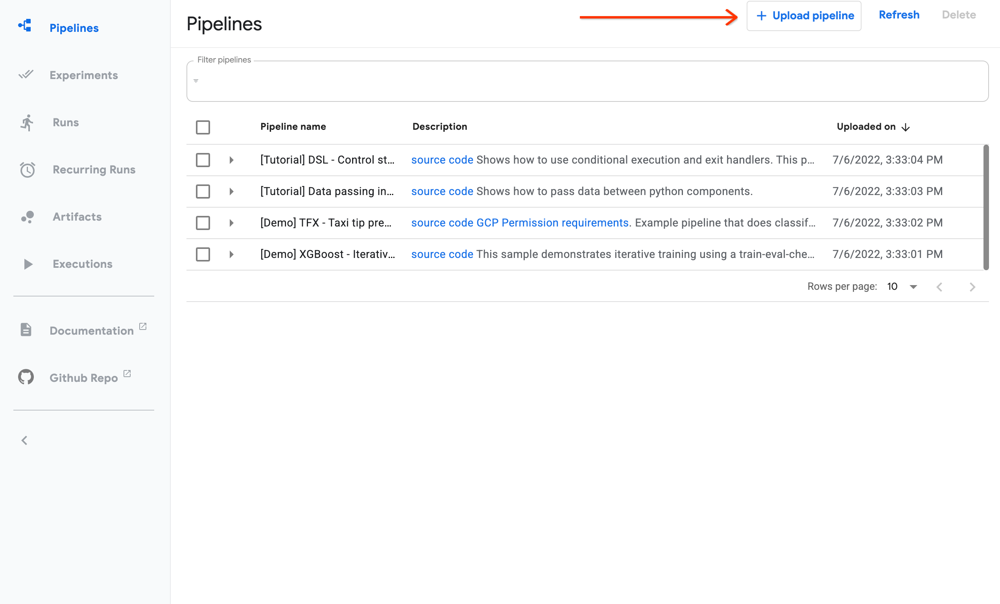
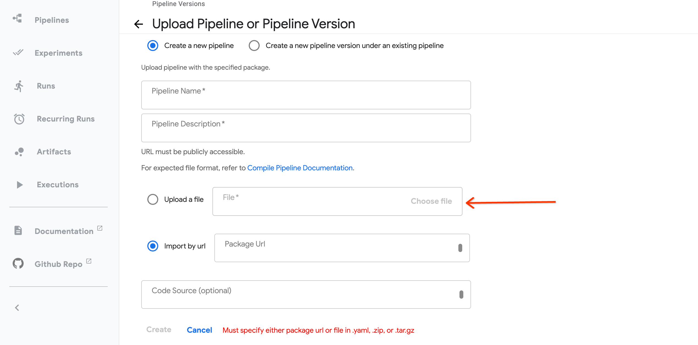
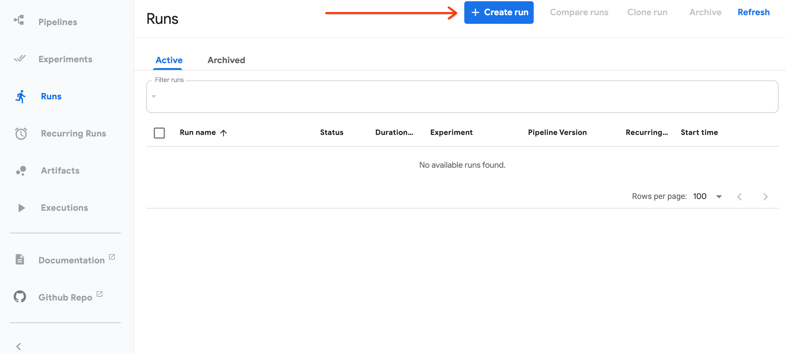
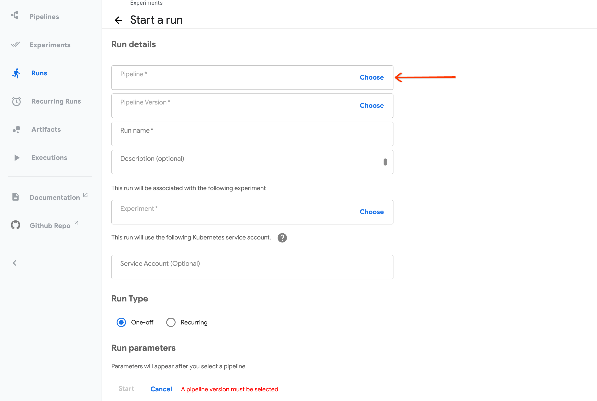

# 運行管道

**在 KFP 後端執行管道**

KFP 提供了三種運行管道的方法。

## 1. 從 KFP 儀表板運行

運行管道的第一種也是最簡單的方法是通過 KFP 儀表板提交它。

要將管道提交到 KFP 儀表板：

1. 將管道編譯為 IR YAML。

2. 從儀表板中，選擇“+ 上傳管道”。

    

3. 將管道 IR YAML 上傳到 “Upload a file”，填寫上傳管道表單，然後點擊 “Create”。

    

4. 從“Runs” 選項卡中，選擇 “+ Create run”：

    

5. 選擇您上傳的管道，提供名稱、任何運行參數，然後點擊 “Start”。

    

## 2. 從 KFP SDK 客戶端運行

您還可以從 KFP SDK 客戶端以編程方式提交管道運行。客戶端支持兩種提交運行的方式：從 IR YAML 或從 Python 管道函數。對於這兩種方法，首先使用您的 KFP 實例的主機 URL 實例化一個客戶端：

```python
from kfp.client import Client
client = Client(host='<YOUR_HOST_URL>')
```

要提交 IR YAML 以供執行，請使用 `.create_run_from_pipeline_package` 方法：

```python
client.create_run_from_pipeline_package('pipeline.yaml', arguments={'param': 'a', 'other_param': 2})
```

要提交 Python 管道函數以供執行，請使用 `.create_run_from_pipeline_func` 便捷方法，它將編譯和運行提交包裝到一個方法中：

```python
client.create_run_from_pipeline_func('pipeline.yaml', arguments={'param': 'a', 'other_param': 2})
```

有關 `Client` 構造函數和方法參數的詳細說明，請參閱 [KFP SDK Client 參考文檔](https://kubeflow-pipelines.readthedocs.io/en/master/source/client.html)。

## 3. 從 KFP SDK CLI 運行

`kfp run create` 命令允許您從命令行提交管道。 `kfp run create --help` 顯示此命令採用以下形式：

```python
kfp run create [OPTIONS] [ARGS]...
```

例如，以下命令將 `path/to/pipeline.yaml` IR YAML 提交到 KFP 後端：

```python
kfp run create --experiment-name my-experiment --package-file path/to/pipeline.yaml
```

有關 `kfp run create` 命令的更多信息，請參閱 [KFP 命令行界面參考文檔](https://kubeflow-pipelines.readthedocs.io/en/master/source/cli.html#kfp-run-create)。有關 KFP CLI 的更多信息，請參閱[命令行界面用戶文檔](https://www.kubeflow.org/docs/components/pipelines/v2/cli/)。