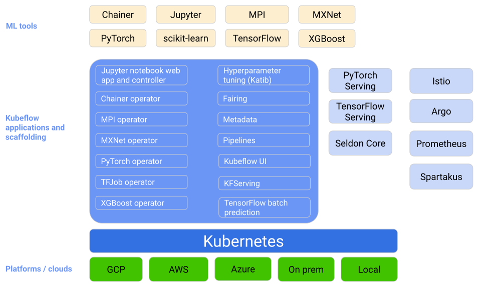
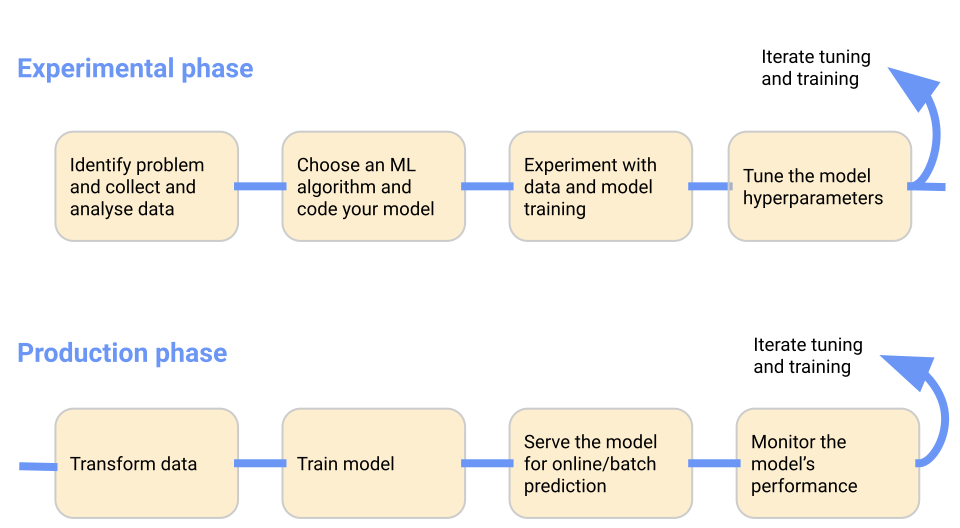
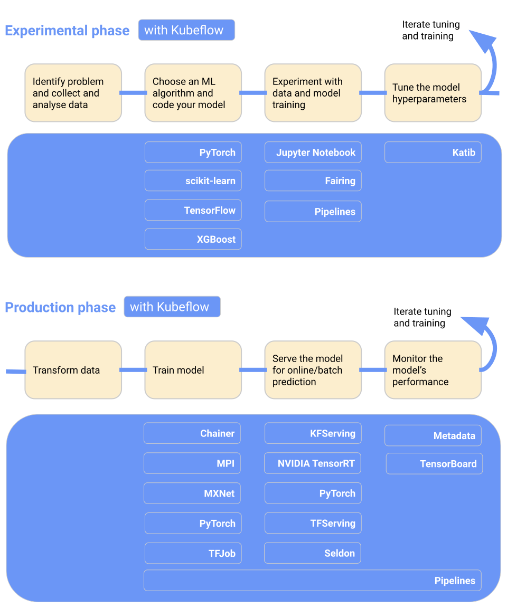
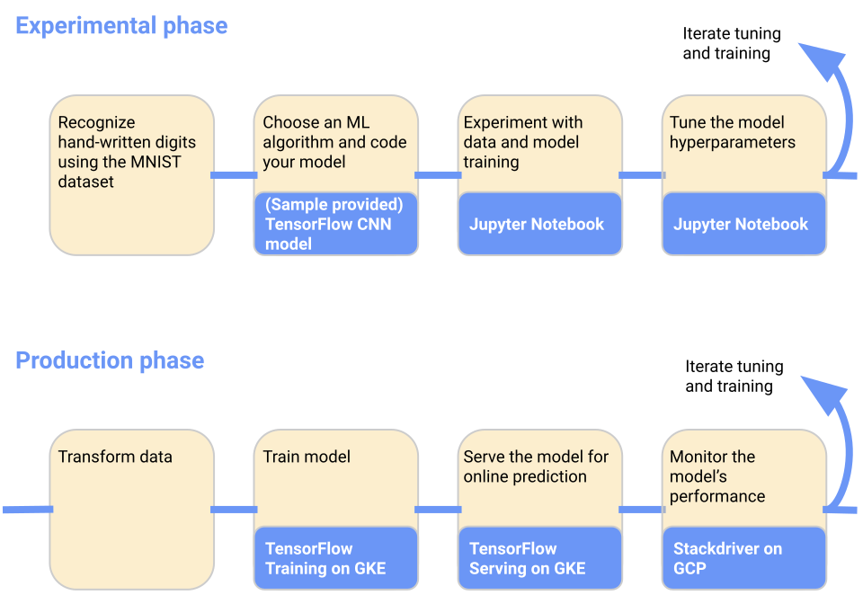

# Kubeflow 架構

原文: [Architecture](https://www.kubeflow.org/docs/started/architecture/)

Kubeflow 是一個面向希望構建和試驗 ML 管道的數據科學家的平台。 Kubeflow 還適用於希望將 ML 系統部署到各種環境以進行開發、測試和生產級服務的 ML 工程師和運營團隊。

## 概念

Kubeflow 是 Kubernetes 的 ML 工具包。

下圖顯示了 Kubeflow 作為在 Kubernetes 之上安排機器學習系統組件的平台：

Kubeflow 建立在 Kubernetes 之上，作為一個用於部署、擴展和管理複雜 ML 元件的系統。

使用 Kubeflow 配置界面，您可以指定工作流所需的 ML 工具。然後，您可以將工作流部署到各種雲、本地和本地平台，以供實驗和生產使用。

## ML 工作流程

當您開發和部署 ML 系統時，ML 工作流程通常包含多個階段。開發機器學習系統是一個迭代過程。您需要評估 ML 工作流各個階段的輸出，並在必要時對模型和參數應用更改，以確保模型持續產生您需要的結果。

為了簡單起見，下圖按順序顯示了工作流階段。工作流末尾的箭頭指向流程以指示流程的迭代性質：

讓我們更詳細地查看各個階段：

- 在**實驗階段**，您根據初始假設開發模型，並迭代測試和更新模型以產生您正在尋找的結果：
    - 確定您希望 ML 系統解決的問題。
    - 收集和分析訓練 ML 模型所需的數據。
    - 選擇 ML 框架和算法，並對模型的初始版本進行編碼。
    - 試驗數據並訓練您的模型。
    - 調整模型超參數以確保最高效的處理和最準確的結果。
- 在**生產階段**，您部署一個執行以下過程的系統：
    - 將數據轉換為訓練系統需要的格式。為確保您的模型在訓練和預測期間表現一致，轉換過程在實驗和生產階段必須相同。
    - 訓練 ML 模型。
    - 為在線預測或以批處理模式運行的模型提供服務。
    - 監控模型的性能，並將結果輸入您的流程以調整或重新訓練模型。

## 支援 ML 工作流的 Kubeflow 組件

下圖將 Kubeflow 添加到工作流中，顯示了哪些 Kubeflow 組件在那一個階段可被使用：

要了解更多信息，請閱讀以下 Kubeflow 組件指南：

- Kubeflow 包括用於生成和管理 Jupyter 筆記本的服務。使用筆記本進行交互式數據科學和 ML 工作流程試驗。
- Kubeflow Pipelines 是一個用於構建、部署和管理基於 Docker 容器的多步驟 ML 工作流的平台。
- Kubeflow 提供了多個組件，您可以使用這些組件來跨多個平台構建 ML 訓練、超參數調整和服務工作負載。

## ML 範例

下圖顯示了一個特定 ML 工作流的簡單範例，您可以使用它來訓練和提供在 MNIST 數據集上訓練的模型：

有關工作流程的詳細信息以及如何自行運行系統，請參閱 GCP 上 [Kubeflow 的端到端教程](https://github.com/kubeflow/examples/tree/master/mnist#mnist-on-kubeflow-on-gcp)。

## Kubeflow 接口

本節介紹可用於與 Kubeflow 交互以及在 Kubeflow 上構建和運行 ML 工作流的接口。

### Kubeflow user interface (UI)

Kubeflow 用戶界面如下所示：

UI 提供了一個中央儀表板，您可以使用它來訪問 Kubeflow 部署的組件。閱讀[如何訪問中央儀表板](https://www.kubeflow.org/docs/components/central-dash/overview/)。

## Kubeflow APIs 與 SDKs

Kubeflow 的各種組件提供 API 和 Python SDK。請參閱以下參考文檔集：

- [Kubeflow Pipelines API 和 SDK 的管道參考文檔](https://www.kubeflow.org/docs/components/pipelines/reference/)，包括 Kubeflow Pipelines 域特定語言 (DSL)。
- [Kubeflow Fairing SDK 的 Fairing 參考文檔](https://www.kubeflow.org/docs/external-add-ons/fairing/reference/)。

