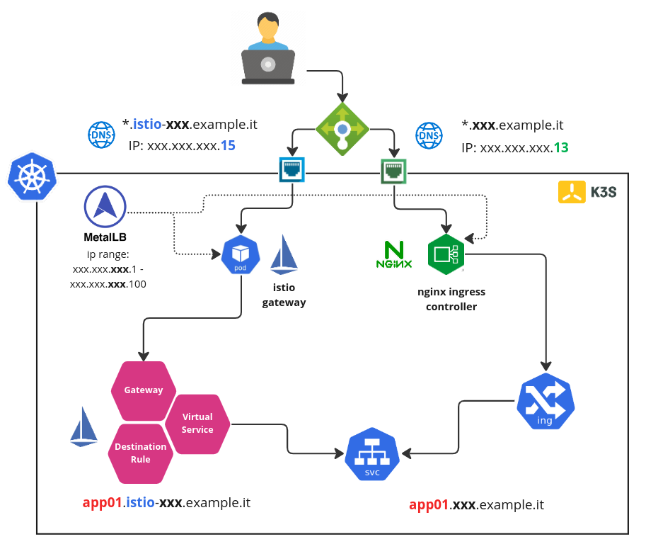

# 手動安裝 Kubeflow

## 概述

Repo: https://github.com/kubeflow/manifests

[Kubeflow Manifests 存儲庫](https://github.com/kubeflow/manifests) 組織在三個主要目錄下，其中包括用於安裝的清單：

| 目錄 | 目的 |
| --------- | ------- |
| `apps` | Kubeflow 的官方組件 |
| `common` | 共用服務組件|
| `contrib` | 第 3 方貢獻的應用程序 |

從 Kubeflow 1.3 開始，所有組件都應該只能使用 [kustomize](https://kustomize.io/) 部署。任何用於在清單之上部署的自動化工具都應該由發行版所有者在外部維護。

## Kubeflow 組件版本

本教程將會使用 **Kubeflow Version: v1.7.0** 來進行安裝與展示。

[Kubeflow Manifests 存儲庫](https://github.com/kubeflow/manifests) 會定期從各自的上游存儲庫同步所有官方 Kubeflow 組件。以下矩陣顯示了 Kubeflow 為每個組件包含的 git 版本：

| Component | Local Manifests Path | Upstream Revision |
| - | - | - |
| Training Operator | apps/training-operator/upstream | [v1.6.0](https://github.com/kubeflow/training-operator/tree/v1.6.0/manifests) |
| Notebook Controller | apps/jupyter/notebook-controller/upstream | [v1.7.0](https://github.com/kubeflow/kubeflow/tree/v1.7.0/components/notebook-controller/config) |
| Tensorboard Controller | apps/tensorboard/tensorboard-controller/upstream | [v1.7.0](https://github.com/kubeflow/kubeflow/tree/v1.7.0/components/tensorboard-controller/config) |
| Central Dashboard | apps/centraldashboard/upstream | [v1.7.0](https://github.com/kubeflow/kubeflow/tree/v1.7.0/components/centraldashboard/manifests) |
| Profiles + KFAM | apps/profiles/upstream | [v1.7.0](https://github.com/kubeflow/kubeflow/tree/v1.7.0/components/profile-controller/config) |
| PodDefaults Webhook | apps/admission-webhook/upstream | [v1.7.0](https://github.com/kubeflow/kubeflow/tree/v1.7.0/components/admission-webhook/manifests) |
| Jupyter Web App | apps/jupyter/jupyter-web-app/upstream | [v1.7.0](https://github.com/kubeflow/kubeflow/tree/v1.7.0/components/crud-web-apps/jupyter/manifests) |
| Tensorboards Web App | apps/tensorboard/tensorboards-web-app/upstream | [v1.7.0](https://github.com/kubeflow/kubeflow/tree/v1.7.0/components/crud-web-apps/tensorboards/manifests) |
| Volumes Web App | apps/volumes-web-app/upstream | [v1.7.0](https://github.com/kubeflow/kubeflow/tree/v1.7.0/components/crud-web-apps/volumes/manifests) |
| Katib | apps/katib/upstream | [v0.15.0](https://github.com/kubeflow/katib/tree/v0.15.0/manifests/v1beta1) |
| KServe | contrib/kserve/kserve | [v0.10.0](https://github.com/kserve/kserve/tree/v0.10.0/install/v0.10.0) |
| KServe Models Web App | contrib/kserve/models-web-app | [v0.10.0](https://github.com/kserve/models-web-app/tree/v0.10.0/config) |
| Kubeflow Pipelines | apps/pipeline/upstream | [2.0.0-alpha.7](https://github.com/kubeflow/pipelines/tree/2.0.0-alpha.7/manifests/kustomize) |
| Kubeflow Tekton Pipelines | apps/kfp-tekton/upstream | [v1.5.1](https://github.com/kubeflow/kfp-tekton/tree/v1.5.1/manifests/kustomize) |

以下也是一個矩陣，其中包含來自常見組件（從 Kubeflow 的不同項目中使用）的版本：

| Component | Local Manifests Path | Upstream Revision |
| - | - | - |
| Istio | common/istio-1-16 | [1.16.0](https://github.com/istio/istio/releases/tag/1.16.0) |
| Knative | common/knative/knative-serving <br /> common/knative/knative-eventing | [1.8.1](https://github.com/knative/serving/releases/tag/knative-v1.8.1) <br /> [1.8.1](https://github.com/knative/eventing/releases/tag/knative-v1.8.1) |
| Cert Manager | common/cert-manager | [1.10.1](https://github.com/cert-manager/cert-manager/releases/tag/v1.10.1) |

## 步驟 01 - 環境安裝

從 Kubeflow 1.3 開始，Manifests WG 提供了兩種安裝 Kubeflow 官方組件和使用 kustomize 的常用服務的選項。目的是幫助最終用戶輕鬆安裝 Kubeflow:

1. 選項#1: Single-command 安裝 `apps` 和 `common` 下的所有組件
2. 選項#2: Multi-command 安裝 `apps` 和 `common` 下的組件

`選項#1`旨在簡化最終用戶的部署。而`選項#2`的目標是自定義和挑選單個組件的能力。

示例目錄 `example` 包含使用單一個命令 (利用 `kustomize`) 來安裝與運行 Kubelfow 的範例。

!!! warn
    在這兩個選項中，都使用了預設的電子郵件 `user@example.com` 和密碼 `12341234` 來作範例使用者帳密。對於任何生產環境的 Kubeflow 部署，您應該按照相關參考文件來更改預設的密碼。

### 先決條件

- 具有預設 `StorageClass` 的 Kubernetes
    - Kubeflow 1.7.0 與 Kubernetes 1.24/1.25

- kustomize (version 5.0.0)
    - https://github.com/kubernetes-sigs/kustomize/releases/tag/v5.0.1
    - {==警告 Kubeflow 與早期版本的 Kustomize 不兼容。這是因為 Kubeflow 需要使用 `sortOptions` 欄位宣告，該欄位宣告僅在 `Kustomize 5` 及更高版本中才有支援 [#2388](https://github.com/kubeflow/manifests/issues/2388)==}。

- kubectl

### 創建本機 Docker Network

使用 docker 創建一個虛擬的網路來做為本次教程的網路架構。

|   |   |
|--- |---|
|CIDR|172.22.0.0/24|
|CIDR IP Range|172.20.0.0 - 172.20.0.255|
|IPs|256|
|Subnet Mask|255.255.255.0|
|Gateay|172.20.0.1|

```bash
docker network create \
  --driver=bridge \
  --subnet=172.20.0.0/24 \
  --gateway=172.20.0.1 \
  lab-network
```

檢查 Docker 虛擬網絡 `lab-network` 的設定。

```bash
docker network inspect lab-network
```

結果:

```json hl_lines="14-15"
[
    {
        "Name": "lab-network",
        "Id": "2e2ca22fbb712cbc19d93acb16fc4e1715488c4c18b82d12dba4c1634ac5b1b6",
        "Created": "2023-02-09T23:07:33.186003336+08:00",
        "Scope": "local",
        "Driver": "bridge",
        "EnableIPv6": false,
        "IPAM": {
            "Driver": "default",
            "Options": {},
            "Config": [
                {
                    "Subnet": "172.20.0.0/24",
                    "Gateway": "172.20.0.1"
                }
            ]
        },
        "Internal": false,
        "Attachable": false,
        "Ingress": false,
        "ConfigFrom": {
            "Network": ""
        },
        "ConfigOnly": false,
        "Containers": {},
        "Options": {},
        "Labels": {}
    }
]
```

讓我們從這個虛擬網段裡的 CIDR IP Range 中保留 5 個 IP (`172.20.0.10-172.20.0.15`) 來做本次的練習。

### 創建 K8S 集群

執行下列命令來創建實驗 Kubernetes 集群:

```bash title="執行下列命令  >_"
k3d cluster create  --api-port 6443 \
  --port 8080:80@loadbalancer --port 8443:443@loadbalancer \
  --k3s-arg "--disable=traefik@server:0" \
  --k3s-arg "--disable=servicelb@server:0" \
  --network lab-network
```

參數說明:

- `--k3s-arg "--disable=servicelb@server:0"` 不安裝 K3D 預設的 traefik (IngressController), 我們將使用　nginx ingress controller
- `--k3s-arg "--disable=traefik@server:0"` 不安裝 K3D 預設的 servicelb (klipper-lb), 我們將使用 metallb
- `--network lab-network` 使用預先創建的 docker 虛擬網段

### 安裝/設定 MetalLB

在本次的結構裡, 有兩個負責南北向 traffic 的亓件, 主要原因是 Nginx Ingress Controller 是很多團隊己經使用的 ingress 的元件, 雖說 Istio Ingress Gateway 也可負責對外開放在 Kubernetes 裡頭的服務, 但是對大多數的團隊來說這樣的轉換需要熟悉與過渡。因此在本次的 lab 架構會同時並存這兩個元件並且使用 metallb 來配置固定的 IP。



#### Helm 安裝

使用 Helm 的手法來進行 Ｍetallb 安裝:

```bash
#　setup helm repo
helm repo add metallb https://metallb.github.io/metallb

helm repo update

# install metallb to specific namespace
helm upgrade --install --create-namespace --namespace metallb-system \
  metallb metallb/metallb
```

!!! tips
    Ｍetallb 在[Version 0.13.2](https://metallb.universe.tf/release-notes/#version-0-13-2) 版本有一個很重大的修改:

    - 新功能:　支持CRD！期待已久的功能 MetalLB 現在可通過 CR 進行配置。
    - 行為變化:　最大的變化是引入了 CRD 並刪除了對通過 ConfigMap 進行配置的支持。

#### 設定 IP Adress Pool

我們將使用 MetalLB 的 Layer 2 模式是最簡單的配置：在大多數的情況下，你不需要任何特定於協議的配置，只需要 IP 地址範圍。

Layer 2 模式模式不需要將 IP 綁定到工作程序節點的網絡接口。它通過直接響應本地網絡上的 ARP 請求來工作，將機器的 MAC 地址提供給客戶端。

讓我們使用 CRD 來設定 Metallb:

```bash hl_lines="9"
cat <<EOF | kubectl apply -n metallb-system -f -
apiVersion: metallb.io/v1beta1
kind: IPAddressPool
metadata:
  name: ip-pool
  namespace: metallb-system
spec:
  addresses:
  - 172.20.0.10-172.20.0.15
---
apiVersion: metallb.io/v1beta1
kind: L2Advertisement
metadata:
  name: l2advertise
  namespace: metallb-system
spec:
  ipAddressPools:
  - ip-pool
EOF
```

結果:

```bash
ipaddresspool.metallb.io/ip-pool created
l2advertisement.metallb.io/l2advertise created
```

!!! tip
    如果只有一個 IP 要讓 Metallb 來給予，那麼 CIDR 的設定可設成 172.20.0.5/32 (也就是只有一個 IP: `172.20.0.5` 可被指派使用)

### 安裝/設定 Nginx Ingress Controller

#### Helm 安裝

使用以下命令添加 Nginx Ingress Controller 的 chart 存儲庫：

```bash
helm repo add ingress-nginx https://kubernetes.github.io/ingress-nginx

helm repo update
```

設定 `ingress-nginx` 要從 metallb 取得特定的預設 IP (`172.20.0.13`):

```yaml title="ingress-nginx-values.yaml"
controller:
  # add annotations to get ip from metallb
  service:
    annotations:
      metallb.universe.tf/address-pool: ip-pool
    loadBalancerIP: "172.20.0.13"
  # set ingressclass as default
  ingressClassResource:
    default: true
```

將 Nginx Ingress Controller 安裝到 kube-system 命名空間中：

```bash
helm upgrade --install \
     --create-namespace --namespace kube-system \
     ingress-nginx ingress-nginx/ingress-nginx \
     --values ingress-nginx-values.yaml
```

檢查:

```bash
kubectl get svc -n kube-system
```

結果:

```
NAME                                 TYPE           CLUSTER-IP      EXTERNAL-IP   PORT(S)                      AGE
ingress-nginx-controller             LoadBalancer   10.43.160.250   172.20.0.13    80:30672/TCP,443:30990/TCP   91s
```

!!! tip
    特別注意 `ingress-nginx-controller` 的 EXTERNAL-IP 是否從 metallb 取得 `172.20.0.13`

#### 驗證 Ingress 設定

創建一個 Nginx 的 Deployment 與 Service:

```bash
kubectl create deployment nginx --image=nginx

kubectl create service clusterip nginx --tcp=80:80
```

創建 Ingress 來曝露這個測試的 Nginx 網站:

```bash
kubectl apply -f -<<EOF
apiVersion: networking.k8s.io/v1
kind: Ingress
metadata:
  name: ingress-nginx-svc
spec:
  rules:
  - host: "nginx.example.it"
    http:
      paths:
      - pathType: Prefix
        path: "/"
        backend:
          service:
            name: nginx
            port:
              number: 80
EOF
```

檢查看這個 ingress 是否有取得 IP ADDRESS:

```bash
kubectl get ing/ingress-nginx-svc
```

結果:

```
NAME                CLASS    HOSTS              ADDRESS       PORTS   AGE
ingress-nginx-svc   <none>   nginx.example.it   172.20.0.13   80      21s
```

修改 `/etc/hosts` 來增加一筆 entry 來模擬 DNS 解析:

``` title="/etc/hosts"
...
172.20.0.13  nginx.example.it
...
```

使用瀏覽器瀏覽 `http://nginx.example.it`:


### 安裝 Kubeflow 

首先使用下列命令來取得安裝 Kubeflow 元件的 `Manifest` repo。

```bash
git clone https://github.com/kubeflow/manifests.git

cd manifests
```

在本次的教程中將使用 Kubeflow v1.7 版本來進行安裝與設定, 因此在 manifests 的 repo 中需要切換到 `v1.7-branch`。

執行下列命令來切換 branch:

```bash
git checkout v1.7-branch
```

接著我們將使用下列一行命令來安裝 Kubeflow 相關的元件:

```bash
# while ! kustomize build example | kubectl apply -f -; do echo "Retrying to apply resources"; sleep 10; done

while ! kustomize build example | awk '!/well-defined/' | kubectl apply -f -; do echo "Retrying to apply resources"; sleep 10; done
```

!!! warning
    `kubectl apply` 命令可能會在第一次嘗試時失敗。這是 Kubernetes 和 kubectl 工作方式所固有的（例如，必須在 CRD 就緒後創建 CR）。解決方案是簡單地重新運行命令，直到它成功。對於單行命令，我們包含了一個 bash 單行命令來重試該命令。

    我們執行 `awk '!/well-defined/'` 的原因是因為 Kustomize 5 中存在一個問題需要後續去修復：
        - 在 stdout 中打印了一行而不是 stderr, 見 [kubernetes-sigs/kustomize#5039](https://github.com/kubernetes-sigs/kustomize/issues/5039)。
        
    一旦 Kustomize 的未來補丁版本可用，我們將刪除此命令。


!!! tip
    安裝的時候可能會發現下列的錯誤訊息:

    ```
    error: resource mapping not found for name: "kubeflow-user-example-com" namespace: "" from "STDIN": no matches for kind "Profile" in version "kubeflow.org/v1beta1" ensure CRDs are installed first
    ```

    根據 [Profiles + KFAM](https://github.com/kubeflow/manifests#profiles--kfam) 來安裝下面的組件:

    - Profile Controller
    - Kubeflow Access-Management (KFAM)

    ```bash
    kustomize build apps/profiles/upstream/overlays/kubeflow | kubectl apply -f -
    ```

### 配置 oidc-authservice

本教程的環境是在本地環境來啟動 Kubeflow, 在身份驗證的整合上會經由 [arrikto/oidc-authservice](https://github.com/arrikto/oidc-authservice) 元件來作 OIDC 的代理。

詳細的架構與說明, 請見: 

- [Kubeflow OIDC 身份感知代理 (OIDC AuthService)](../components/multi-tenancy/authn/oidc-authservice.md)
- [使用 Istio + Dex 進行身份驗證](../components/multi-tenancy/authn/kubeflow-authentication-with-istio-dex.md)

`AuthService` 提供了一些 UI 頁面用來幫助用戶身份驗證的相關流程。 

默認情況下，此 `AuthService` 服務器偵聽端口 8080，其相關 UI 端點為：

| Endpoint|Description|
|----------|-------------|
|/site/homepage	|Landing page|
|/site/after_logout	|After Logout page|
|/site/themes	|Themes|

要在帶有 Istio 的 Kubernetes 等環境中公開 `AuthService` 服務器相關 UI，您需要：

1. 創建指向 `AuthService` 的 Web 服務器端口 (8080) 的服務。
    
    在上述的安裝過程中己經執行完成了, 執行下列命令來檢查:

        ```bash
        kubectl get svc/authservice -n istio-system

        NAME          TYPE        CLUSTER-IP     EXTERNAL-IP   PORT(S)    AGE
        authservice   ClusterIP   10.43.21.152   <none>        8080/TCP   4h2m
        ```

2. 創建一個 Istio `VirtualService` 以將流量與 `$AUTHSERVICE_URL_PREFIX` 路徑前綴匹配，並將其定向到您創建的服務。通常，`AUTHSERVICE_URL_PREFIX` 的格式為 `<url>/<path>`（例如，.`<url>/authservice`）。確保您的 `VirtualService` 使用 `<path>` 來捕獲請求。

    執行下列命令來構建 VirtualSerivce 物件來捕獲對 AuthService 的請求：

    ```bash
    kubectl apply -n istio-system -f -<<EOF
    apiVersion: networking.istio.io/v1alpha3
    kind: VirtualService
    metadata:
      name: authservice-web
    spec:
      gateways:
        - kubeflow/kubeflow-gateway
      hosts:
        - '*'
      http:
        - match:
            - uri:
                prefix: /authservice/
          rewrite:
            uri: /
          route:
            - destination:
                host: authservice.istio-system.svc.cluster.local
                port:
                  number: 8080
    EOF
    ```

    !!! info
        `AuthService` 的配置參數可使用下列命令來查看:

        ```bash
        kubectl get cm/oidc-authservice-parameters -o yaml
        ```

        結果:

        ```yaml hl_lines="7"
        apiVersion: v1
        kind: ConfigMap
        metadata:
          name: oidc-authservice-parameters
          namespace: istio-system
        data:
          AUTHSERVICE_URL_PREFIX: /authservice/
          OIDC_AUTH_URL: /dex/auth
          OIDC_PROVIDER: http://dex.auth.svc.cluster.local:5556/dex
          OIDC_SCOPES: profile email groups
          PORT: '"8080"'
          SKIP_AUTH_URLS: /dex
          STORE_PATH: /var/lib/authservice/data.db
          USERID_CLAIM: email
          USERID_HEADER: kubeflow-userid
          USERID_PREFIX: ""
        ```


## 步驟 02 - Kubeflow 功能驗證

### 連接到 Kubeflow 集群

安裝後，所有 Pod 準備就緒需要一些時間。在嘗試連接之前確保所有 Pod 都準備就緒，否則您可能會遇到意外錯誤。要檢查所有與 Kubeflow 相關的 Pod 是否準備就緒，請使用以下命令：

```bash
kubectl get pods -n cert-manager
kubectl get pods -n istio-system
kubectl get pods -n auth
kubectl get pods -n knative-eventing
kubectl get pods -n knative-serving
kubectl get pods -n kubeflow
kubectl get pods -n kubeflow-user-example-com
```

!!! info
    根據不同的環境與網速，Kubeflow 的安裝時間約莫需要 5 ~ 15 分鐘。

### Kubeflow Central Dashboard

當所有的元件都安裝成功之後，您可以通過登錄到您的集群來訪問 Kubeflow Central Dashboard。

#### Port-Forward

訪問 Kubeflow 的默認方式是通過端口轉發。這使您能夠快速開始，而無需對您的環境提出任何要求。運行以下命令將 Istio 的 `Ingress-Gateway` 端口轉發到本地端口 `7080`：

```bash
kubectl port-forward --address 0.0.0.0 svc/istio-ingressgateway -n istio-system 7080:80
```

!!! tip
    一般來說我們使用 port `8080` 來把網頁應用曝露出來給外部存取, 由於 K3D 會使用 port `8080` 給外部的 load balancer 元件使用, 因此我們避開使用這個 port no。

#### NodePort / LoadBalancer / Ingress

為了使用 NodePort / LoadBalancer / Ingress 連接到 Kubeflow，您需要設置 HTTPS。原因是我們的許多 Web 應用程序（例如 Tensorboard Web App、Jupyter Web App、Katib UI）都使用安全 Cookie，因此無法通過非本地主機域使用 HTTP 訪問 Kubeflow。

使用適當的 HTTPS 公開您的 Kubeflow 集群是一個嚴重依賴於您的環境的過程。因此，請查看針對特定環境的可用 Kubeflow 發行版，然後選擇適合您需求的發行版。

!!! info
    如果您絕對需要通過 HTTP 公開 Kubeflow，您可以通過在每個相關的 Web 應用程序中將 `APP_SECURE_COOKIES` 環境變量設置為 `false` 來禁用安全 Cookie 功能。不建議這樣做，因為它會帶來安全風險。

    修改手法:

    ```title="apps/jupyter/jupyter-web-app/upstream/base/params.env" hl_lines="6"
    JWA_UI=default
    JWA_PREFIX=/jupyter
    JWA_CLUSTER_DOMAIN=cluster.local
    JWA_USERID_HEADER=kubeflow-userid
    JWA_USERID_PREFIX=
    JWA_APP_SECURE_COOKIES=false
    ```

    ```title="apps/tensorboard/tensorboard-web-app/upstream/base/params.env" hl_lines="6"
    TWA_CLUSTER_DOMAIN=cluster.local
    TWA_USERID_HEADER=kubeflow-userid
    TWA_USERID_PREFIX=
    TWA_PREFIX=/tensorboards
    TWA_APP_SECURE_COOKIES=false 
    ```

    ```title="apps/volumes-web-app/upstream/base/params.env" hl_lines="6"
    VWA_CLUSTER_DOMAIN=cluster.local
    VWA_USERID_HEADER=kubeflow-userid
    VWA_USERID_PREFIX=
    VWA_PREFIX=/volumes
    VWA_APP_SECURE_COOKIES=false
    ```


創建 Ingress 來曝露這個測試的 Nginx 網站:

```bash
kubectl apply -n istio-system -f -<<EOF
apiVersion: networking.k8s.io/v1
kind: Ingress
metadata:
  name: svc-istio-ingressgateway
spec:
  rules:
  - host: "kubeflow.example.it"
    http:
      paths:
      - pathType: Prefix
        path: "/"
        backend:
          service:
            name: istio-ingressgateway
            port:
              number: 80
EOF
```

當 Kubeflow Central Dashboard 被正確配置並曝露出來給外部存取後，您可以通過執行以下操作訪問：

- 打開瀏覽器並訪問 `http://localhost:7080` 或是 `http://kubeflow.example.it`。您應該會看到 Dex 登錄屏幕。
- 使用默認用戶的憑據登錄。默認電子郵件地址為 `user@example.com`，默認密碼為 `12341234`。


### 更改默認用戶密碼

出於安全原因，我們不想在對安全敏感的環境中安裝時使用預設的 Kubeflow 用戶的密碼。相反，您應該在部署之前定義自己的密碼。為預設用戶定義密碼：

1. 為預設用戶選擇一個密碼，使用電子郵件 `user@example.com`，並使用 `bcrypt` 對其進行哈希處理：

    ```bash
    python3 -c 'from passlib.hash import bcrypt; import getpass; print(bcrypt.using(rounds=12, ident="2y").hash(getpass.getpass()))'
    ```

    !!! info
        由於 `bcrypt` 需要 `passlib` 模組, 使用下列命令來安裝:

        ```bash
        pip install passlib
        ```

2. 編輯 `common/dex/base/config-map.yaml` 並用您選擇的密碼的哈希值置換相關欄位：

    ```yaml title="common/dex/base/config-map.yaml" hl_lines="22"
    apiVersion: v1
    kind: ConfigMap
    metadata:
      name: dex
    data:
      config.yaml: |
        issuer: http://dex.auth.svc.cluster.local:5556/dex
        storage:
          type: kubernetes
          config:
            inCluster: true
        web:
          http: 0.0.0.0:5556
        logger:
          level: "debug"
          format: text
        oauth2:
          skipApprovalScreen: true
        enablePasswordDB: true
        staticPasswords:
        - email: user@example.com
          hash: <enter the generated hash here>
          # https://github.com/dexidp/dex/pull/1601/commits
          # FIXME: Use hashFromEnv instead
          username: user
          userID: "15841185641784"
        staticClients:
        # https://github.com/dexidp/dex/pull/1664
        - idEnv: OIDC_CLIENT_ID
          redirectURIs: ["/authservice/oidc/callback"]
          name: 'Dex Login Application'
          secretEnv: OIDC_CLIENT_SECRET
    ```
