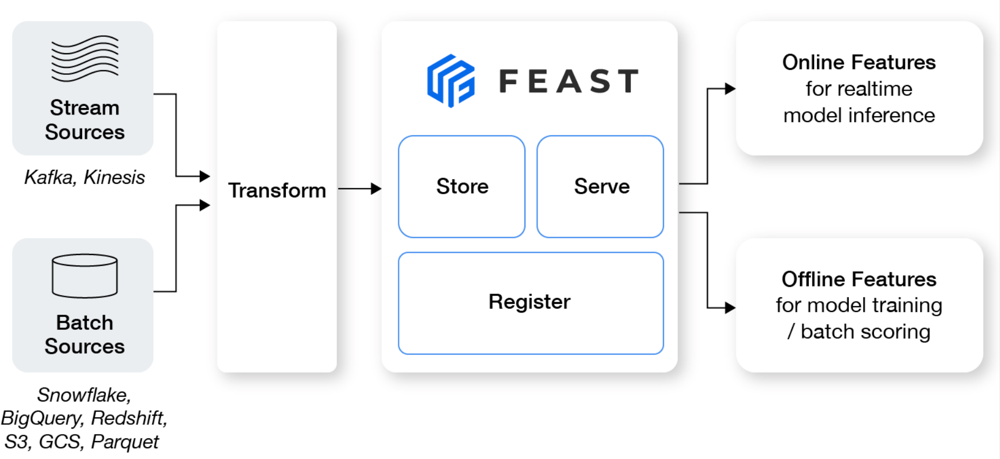

# 簡介

##　什麼是 Feast?

Feast（Feature Store）是一個可定制的　operational data system，它重新使用現有的基礎設施來管理機器學習功能並將其提供給實時模型。

Feast 允許 ML 平台團隊：

- 通過管理離線 data store（處理歷史數據以進行橫向擴展批量評分或模型訓練）、低延遲 online data store（支持實時預測）和久經考驗的功能，使功能始終可用於訓練和服務服務器。

- 通過生成時間點正確的特徵集來避免數據洩漏，這樣數據科學家就可以專注於特徵工程，而不是調試容易出錯的數據集連接邏輯。這確保了未來的特徵值不會在訓練期間洩漏給模型。

- 通過提供單個數據訪問層將 ML 與數據基礎設施分離，該數據訪問層將　{==特徵存儲==}　從特徵檢索中抽像出來，確保模型在您從訓練模型轉移到服務模型、從批處理模型轉移到實時模型以及從一個數據基礎設施系統轉移到另一個時候保持可移植性。

## Feast 是為誰而設?

Feast 幫助具有 DevOps 經驗的 ML 平台團隊生產實時模型。 Feast 還可以幫助這些團隊構建一個功能平台，以改善工程師和數據科學家之間的協作。

Feast 可能不是正確的工具，如果你:

- 在一個剛剛開始使用 ML 的組織中並且尚不確定 ML 對業務影響是什麼
- 主要依賴非結構化數據
- 需要非常低延遲的特徵檢索（例如 p99 特徵檢索 << 10ms）
- 有一個小團隊來支持大量用例

## 常見用例

許多公司已經使用 Feast 為真實世界的 ML 用例提供支持，例如：

- 通過利用預先計算的歷史用戶或項目特徵來個性化在線推薦。
- 在線欺詐檢測，使用與（預先計算的）歷史交易模式進行比較的功能
- 流失預測（離線模型），批量為所有用戶以固定節奏生成特徵值
- 信用評分，使用預先計算的歷史特徵來計算違約概率