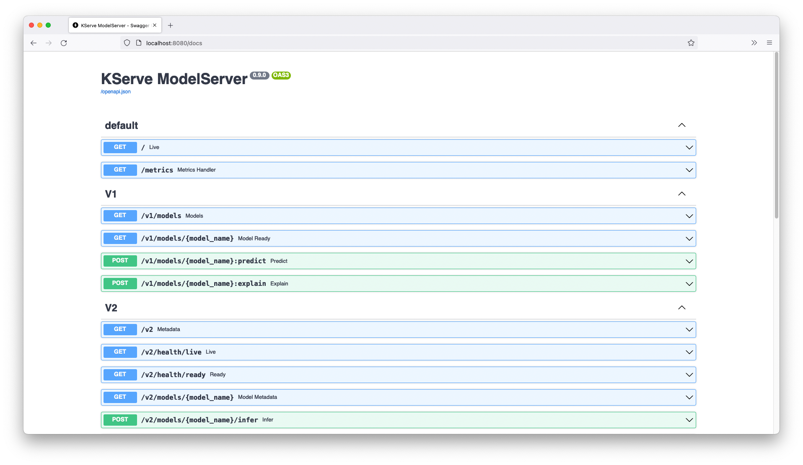
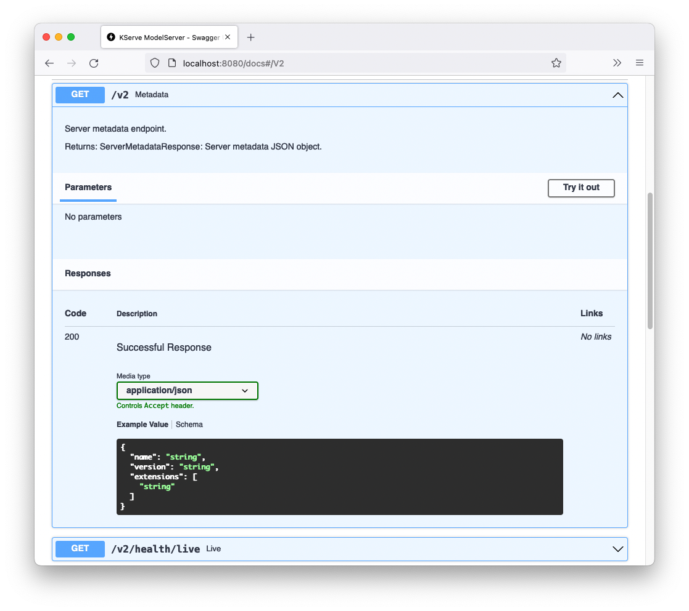
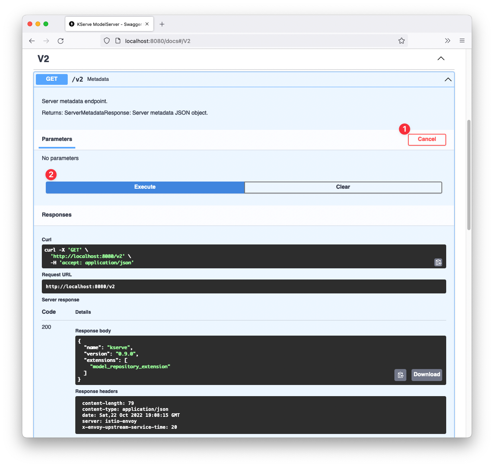

# 啟用 InferenceService 的 Swagger UI

## InferenceService Swagger UI

KServe ModelServer 建立在 [FastAPI](https://github.com/tiangolo/fastapi) 之上，它帶來了對 [OpenAPI 規範](https://www.openapis.org/)和 [Swagger UI](https://swagger.io/tools/swagger-ui/) 的開箱即用支持。

Swagger UI 允許直接在瀏覽器中可視化 KServe InferenceService API 並與之互動，從而無需使用任何命令行工具即可輕鬆探索端點和驗證輸出。



## 啟用 Swagger UI

!!! warning
    目前，POST 請求僅適用於 UI 中的 `v2` 端點。

要啟用 Swagger UI，只需要在 `InferenceService` 裡添加一個額外的參數：

```bash hl_lines="9"
kubectl apply -n kserve-test -f - <<EOF
apiVersion: "serving.kserve.io/v1beta1"
kind: "InferenceService"
metadata:
  name: "sklearn-iris"
spec:
  predictor:
    model:
      args: ["--enable_docs_url=True"]
      modelFormat:
        name: sklearn
      storageUri: "gs://kfserving-examples/models/sklearn/1.0/model"
EOF
```

在 `InferenceService` 準備就緒後，Swagger UI 將在 `/docs` 路徑上提供服務。在我們上面的範例中，Swagger UI 將在 `http://sklearn-iris.kserve-test.example.it/docs` 上可用。

## 使用 Swagger UI 來觸發推理服務

點擊 V2 端點之一，如 `/v2`，它將展開並顯示來自此 API 端點的描述和響應：



現在，當您點擊 "Try it out" 然後點擊 "Execute" 時，Swagger UI 將向 `/v2` 端點發送 GET 請求。服務器響應正文和標頭將顯示在底部：



同樣，我們可以使用 Swagger UI 發送請求以檢查模型元數據並使用 `/v2/models/{model_name}/infer` 端點進行模型推論。

```json title="iris-input.json"
{
  "inputs": [
    {
      "name": "input-0",
      "shape": [2, 4],
      "datatype": "FP32",
      "data": [
        [6.8, 2.8, 4.8, 1.4],
        [6.0, 3.4, 4.5, 1.6]
      ]
    }
  ]
}
```
