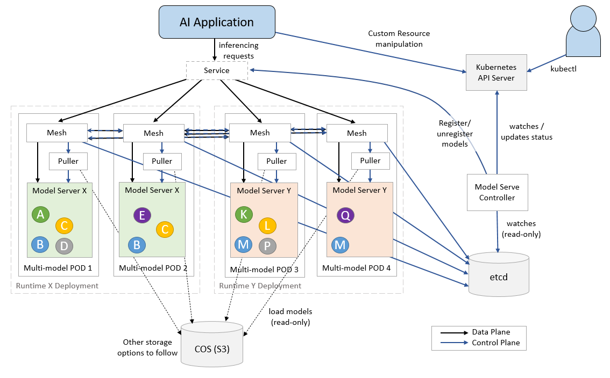

# KServe

**使用 KServe 的模型服務**

KServe 支持在 Kubernetes 上進行無服務器推理，並為 TensorFlow、XGBoost、scikit-learn、PyTorch 和 ONNX 等常見機器學習 (ML) 框架提供高性能、高度抽象的接口，以解決生產模型服務用例。

## 為什麼選擇 KServe?

- KServe 是 Kubernetes 上的標準模型推理平台，專為高度可擴展的用例而構建。
- 跨 ML 框架提供高性能、標準化的推理協議。
- 通過自動縮放支持現代無服務器推理工作負載，包括在 GPU 上縮放到零實例。
- 使用 ModelMesh 提供高可擴展性、密度封裝和智能路由
- 用於生產 ML 服務的簡單且可插拔的生產服務，包括預測、預處理/後處理、監控和可解釋性。
- 具有金絲雀發布、實驗、集成和轉換器的高級部署。

## KServe 組件

### Model Serving

使用常見的 ML 框架 [Scikit-Learn](https://scikit-learn.org/)、[XGBoost](https://xgboost.readthedocs.io/)、[Tensorflow](https://www.tensorflow.org/)、[PyTorch](https://pytorch.org/) 以及可插入的自定義模型運行 runtime，為 CPU/GPU 上的模型推理提供無服務器部署。

### ModelMesh

ModelMesh 專為大規模、高密度和頻繁變化的模型用例而設計。 ModelMesh 智能地將 AI 模型加載到內存和從內存卸載，以在對用戶的響應性和計算足蹟之間進行智能權衡。

### Model Explainability

提供 ML 模型檢查和解釋，KServe 集成了 [Alibi](https://www.seldon.io/solutions/open-source-projects/alibi-explain/)、[AI Explainability 360](https://aix360.mybluemix.net/)、[Captum](https://captum.ai/)，以幫助解釋預測並衡量這些預測的信心度。

### Model Monitoring

啟用負載記錄、離群值、對抗性和漂移檢測，KServe 集成了 [Alibi-detect](https://docs.seldon.io/projects/alibi-detect/en/stable/index.html)、[AI Fairness 360](https://aif360.mybluemix.net/)、[Adversarial Robustness Toolbox (ART)](https://github.com/Trusted-AI/adversarial-robustness-toolbox) 以幫助監控生產中的 ML 模型。

### Advanced Deployment

KServe 推理圖支持四種類型的路由節點：`Sequence`、`Switch`、`Ensemble`、`Splitter`。

