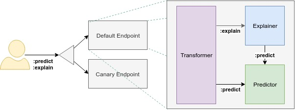

# 數據平面 (Data Plane)

`InferenceService` 數據平面架構由一個靜態組件圖組成，這些組件協調對單個模型的請求。 Ensembling、A/B 測試和 Multi-Arm-Bandits 等高級功能應該將 InferenceServices 組合在一起。

## 介紹

KServe 的數據平面協議引入了一個 inference API，它獨立於任何特定的 ML/DL 框架和模型服務器。這允許跨推理服務進行快速迭代和一致性，並支持易於使用和高性能的用例。

通過實施該協議，inference 客戶端和服務器都將通過在圍繞該 API 標準化的平台上無縫運行來提高它們的實用性和可移植性。 Kserve 的推理協議得到了 NVIDIA Triton 推理服務器、TensorFlow Serving 和 TorchServe 的認可。

!!! info
    注意：協議 `V2` 使用 `/infer` 而不是 `:predict`

### 概念

- **Component**：每個端點由多個組件組成：`predictor`、`explainer` 和 `transformer`。唯一必要的組件是 `predictor`，它是系統的核心。隨著 KServe 的迭代發展，K計劃增加支持的組件數量，以啟用異常值檢測等用例。

- **Predictor**：`predictor` 是推理服務的主力。它只是一個模型和一個模型服務器，使其在網絡端點可用。

- **Explainer**：`explainer` 啟用額外的備用數據平面，除了預測之外還提供模型解釋。用戶可以定義自己的解釋容器，其中配置相關的環境變量，如預測端點。對於常見用例，KServe 提供開箱即用的解釋器，如 `Alibi`。

- **Transformer**： `transformer` 使用戶能夠在預測和解釋工作流之前定義預處理和後處理步驟。和 `explainer` 一樣，它也配置了相關的環境變量。對於常見的用例，KServe 提供開箱即用的轉換器，如 `Feast`。

## 數據平面 V1 & V2

KServe 支持其數據平面的兩個版本，`V1` 和 `V2`。 `V1` 協議使用 HTTP/REST 提供標準的預測工作流程。數據平面協議的第二個版本解決了在 `V1` 數據平面協議中發現的幾個問題，包括跨大量模型框架和服務器的性能和通用性。協議 `V2` 通過添​​加 gRPC API 擴展了 `V1` 的功能。

**主要改變**:

- V2 目前不支持 `explain` 端點
- V2 添加了 Server `Readiness/Liveness/Metadata` 端點
- V2 端點路徑包含 `/` 而不是 `：`
- V2 將 `:predict` 端點重命名為 `/infer`
- V2 允許請求路徑中的模型版本 (optional)

**V1 APIs**:

|API	|Verb	|Path|
|-----|-----|----|
|List Models	|GET	|`/v1/models`|
|Model Ready	|GET	|`/v1/models/<model_name>`|
|Predict	|POST	|`/v1/models/<model_name>:predict`|
|Explain	|POST	|`/v1/models/<model_name>:explain`|

**V2 APIs**:

|API	|Verb	|Path|
|-----|-----|----|
|Inference	|POST	|`v2/models/<model_name>[/versions/<model_version>]/infer`|
|Model Metadata	|GET	|`v2/models/<model_name>[/versions/<model_version>]`|
|Server Readiness	|GET	|`v2/health/ready`|
|Server Liveness	|GET	|`v2/health/live`|
|Server Metadata	|GET	|`v2`|
|Model Readiness	|GET	|`v2/models/<model_name>[/versions/]/ready`|

!!!info
    `Path` 內容有出現 `[]` 代表該內容是 optional 的!!

有關詳細信息，請參閱 [V1 協議](https://kserve.github.io/website/0.10/modelserving/data_plane/v1_protocol/)和 [V2 協議](https://kserve.github.io/website/0.10/modelserving/data_plane/v2_protocol/)文檔。

