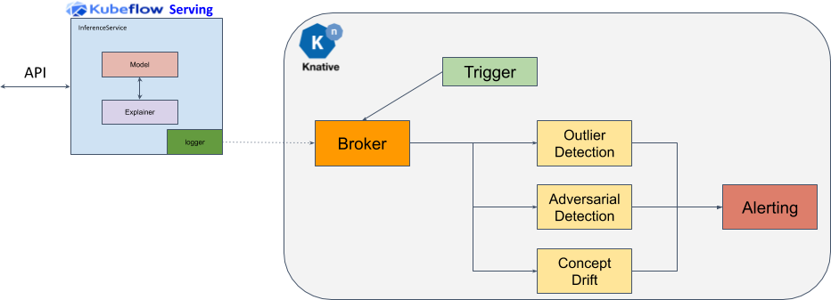

# 使用 Alibi 異常值/漂移檢測器

為了信任模型預測並可靠地採取行動，通過各種不同類型的檢測器{==監視傳入請求的分佈==}至關重要。 KServe 將 [Alibi Detect](https://github.com/SeldonIO/alibi-detect) 與以下組件集成：

- `漂移檢測器(Drift detector)` 檢查傳入請求的分佈何時偏離參考分佈，例如訓練數據的分佈。
- `離群值檢測器(Outlier detector)` 標記不遵循訓練分佈的實例。

使用的架構如下所示，並將 KServe 中可用的有效載荷日誌記錄與 KNative 中這些有效載荷的異步處理聯繫起來，以檢測異常值。

## CIFAR10 Outlier Detector

[CIFAR10](https://www.cs.toronto.edu/~kriz/cifar.html) 離群值檢測器。運行[筆記本演示](https://github.com/kserve/kserve/blob/master/docs/samples/outlier-detection/alibi-detect/cifar10/cifar10_outlier.ipynb)進行測試。

!!! info
  範例 notebook 需要 KNative Eventing >= 0.18。

## CIFAR10 Drift Detector

[CIFAR10](https://www.cs.toronto.edu/~kriz/cifar.html) 漂移檢測器。運行[筆記本演示](https://github.com/kserve/kserve/blob/master/docs/samples/drift-detection/alibi-detect/cifar10/cifar10_drift.ipynb)進行測試。

!!! info
  範例 notebook 需要 KNative Eventing >= 0.18。

