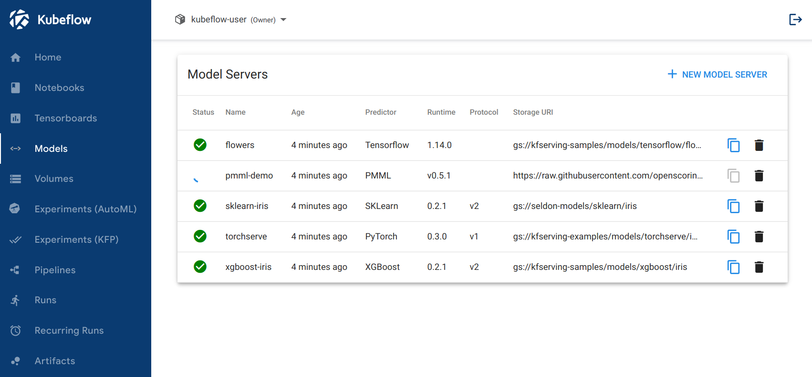
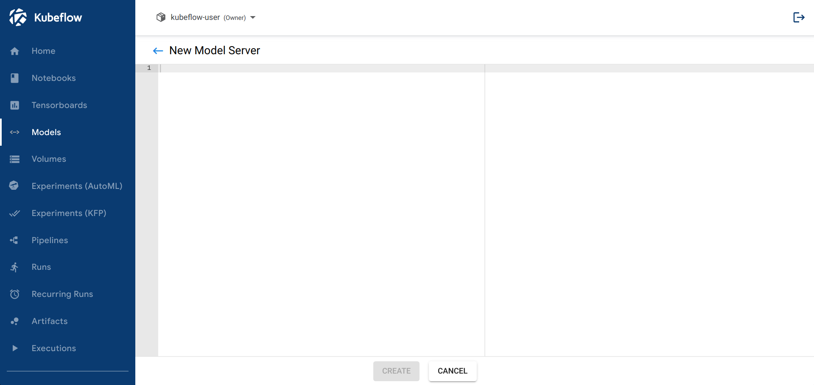
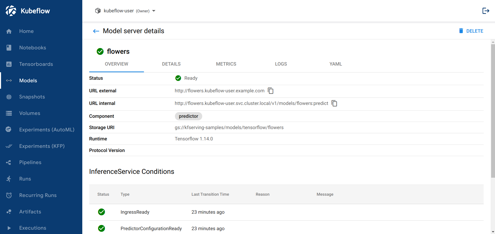
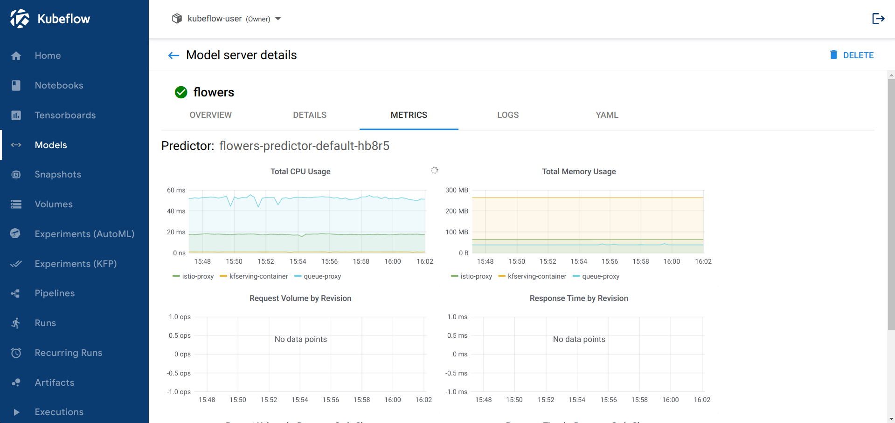

# Models UI

**用於管理模型服務器的 Web 應用程序**

模型 Web 應用程序負責允許用戶在其 Kubeflow 集群中操作模型服務器。為實現這一點，它提供了一種用戶友好的方式來處理 InferenceService CR 的生命週期。

Web 應用程序當前使用 v1beta1 版本的 InferenceService 對象。

Web 應用程序還公開來自底層 Knative 資源的信息，例如來自 Knative 配置的條件、路由和修訂以及來自模型服務器 pod 的實時日誌。

## 安裝和訪問

安裝參考: https://github.com/kserve/models-web-app/#development

Web 應用程序包括以下資源：

- 用於運行後端服務器並提供靜態前端文件的 `Deployment`
- 用於配置集群網絡流量的 `Service`
- `ServiceAccount` 和 `ClusterRole{Binding}` 為網絡應用程序的 Pod 提供必要的權限
- 用於通過集群的 Istio Ingress Gateway 來公開應用程序存取的 `VirtualService`

### Kubeflow

Web 應用程序包含在 Kubeflow 1.5 版本清單中。它通過中央儀表板公開，開箱即用。

### 單機佈署

在這種情況下，Web 應用程序的所有資源都將安裝在 `kserve` 命名空間中。用戶可以通過 `knative-ingress-gateway.knative-serving` Istio Ingress Gateway 或通過端口轉發後端來訪問 Web 應用程序。

#### 端口轉發

```bash
# set the following ENV vars in the app's Deployment
kubectl edit -n kserve deployments.apps kserve-models-web-app
# APP_PREFIX: /
# APP_DISABLE_AUTH: "True"
# APP_SECURE_COOKIES: "False"

# expose the app under localhost:5000
kubectl port-forward -n kserve svc/kserve-models-web-app 5000:80
```

## 授權

### SubjectAccessReviews

Web 應用程序具有執行身份驗證和授權檢查的機制，以確保用戶操作符合集群的 RBAC，該 RBAC 僅在應用程序的 kubeflow 清單中啟用。可以通過利用環境變數 `APP_DISABLE_AUTH: "True" | "False"` 來切換此機制。

此機制僅在 kubeflow 清單中啟用，因為在 Kubeflow 安裝中，最終出現在 Web 應用程序的 Pod 中的所有請求也將包含一個表示用戶的自定義標頭。在 Kubeflow 安裝中，集群前面有一個身份驗證組件，可確保只有登錄的用戶才能訪問集群的服務。在獨立模式下，可能不會始終部署此類組件。

Web 應用程序將使用此自定義標頭中的值來提取發出請求的 K8s 用戶的名稱。然後它將創建一個 SubjectAccessReview 來檢查用戶是否具有執行特定操作的權限，例如刪除命名空間中的 `InferenceService`。

!!! tip
    如果您通過 `kubectl port-forward` 端口轉發應用程序，那麼您需要在 Web 應用程序的 Deployment 中設置 `APP_DISABLE_AUTH=“True”`。端口轉發時不會設置身份驗證標頭，這將導致 Web 應用程序引發 401 錯誤。

### 命名空間選擇

在獨立和 kubeflow 設置中，用戶都需要能夠選擇一個命名空間，以便與其中的 InferenceServices 進行交互。

在獨立模式下，Web 應用程序將顯示一個下拉列表，向用戶顯示所有命名空間並允許他們選擇其中的任何一個。後端將向 API Server 發出 LIST 請求以獲取所有命名空間。在這種情況下，唯一發生的授權檢查是在 K8s API 服務器中進行的，以確保 Web 應用程序 Pod 的 ServiceAccount 具有列出命名空間的權限。

在 kubeflow 模式下，Central Dashboard 負責命名空間的選擇。一旦用戶選擇了命名空間，Dashboard 就會將新選擇的命名空間通知給 iframed Models web 應用程序。模型網絡應用程序本身不會在此模式下公開下拉命名空間選擇器。

## 用例

目前，用戶可以通過此網絡應用執行以下工作流程：

- 查看命名空間中現有 `InferenceService CR` 的列表
- 通過提供 YAML 創建一個新的 `InferenceService`
- 檢查 `InferenceService`
    - 查看 `InferenceService` 的實時狀態
    - 檢查底層 Knative 資源的 K8s 條件
    - 查看為該 `InferenceService` 創建的模型服務器 Pod 的日誌
    - 檢查存儲在 K8s API 服務器中的 YAML 內容
    - 查看一些基本指標

### 清單

該應用程序的主頁提供了部署在所選命名空間中的所有 `InferenceService` 的列表。前端定期輪詢後端以獲取 `InferenceService` 的最新狀態。



### 創造

用於創建新 `InferenceService` 的頁面。用戶可以粘貼他們希望創建的 `InferenceService` 的 YAML 物件。

請注意，後端將覆蓋提交對象的提供的 `.metadata.namespace` 字段，以防止用戶嘗試在其他命名空間中創建 `InferenceService`。



### 刪除

在列出所有命名空間資源的主頁中，用戶可以通過點擊 `InferenceService` 旁邊的圖標來刪除現有的 `InferenceService`。

!!! info
    後端在刪除一個 `InferenceService` 時使用的是前台級聯刪除。這意味著僅當底層資源被刪除後，`InferenceService CR` 才會從 K8s API Server 中刪除。

### 檢查

用戶可以從主頁單擊 `InferenceService` 的名稱，並查看 `CR` 狀態的更詳細摘要。在此頁面中，用戶可以檢查：

- InferenceService 狀態概覽（OVERVIEW）
- InferenceService CR 規範的 UI 用戶友好表示（詳細信息）
- 來自底層資源的指標（METRICS）
- 來自創建的 Pod 的日誌 (LOGS)
- K8s API 服務器 (YAML) 中的 YAML 文件



!!! info 
    為了收集日誌，後端將：
    
    - 過濾所有具有 `serving.knative.dev/revision` 標籤的 pod
    - 從 `kserve-container` 獲取日誌

## 指標

如以上部分所述，Web 應用程序允許用戶檢查來自 `InferenceService` 的指標。默認情況下不會啟用此頁籤。為了公開它，用戶需要安裝 `Grafana` 和 `Prometheus`。

目前，前端希望找到一個暴露在 `/grafana` 前綴中的 Grafana。此 Grafana 實例將需要具有特定的儀表板，以便應用程序將它們嵌入到 `iframe` 中。我們正在努力使它更通用，以允許人們公開他們自己的統計圖表。

您可以安裝 Grafana 和 Prometheus，供 Web 應用程序使用，方法是安裝

1. Knative 0.18 版本中的 `monitoring-core.yaml` 和 `monitoring-metrics-prometheus.yaml` 文件
2. 以下 yaml 文件用於通過允許匿名訪問在集群外部公開 Grafana

=== "ConfigMap"

```yaml
apiVersion: v1
kind: ConfigMap
metadata:
  name: grafana-custom-config
  namespace: knative-monitoring
  labels:
    serving.knative.dev/release: "v0.11.0"
data:
  custom.ini: |
    # You can customize Grafana via changing the context of this field.
    [auth.anonymous]
    # enable anonymous access
    enabled = true
    [security]
    allow_embedding = true
    [server]
    root_url = "/grafana"
    serve_from_sub_path = true    
```

=== "VirtualService"

```yaml
apiVersion: networking.istio.io/v1alpha3
kind: VirtualService
metadata:
  name: grafana
  namespace: knative-monitoring
spec:
  gateways:
  - kubeflow/kubeflow-gateway
  hosts:
  - '*'
  http:
  - match:
    - uri:
        prefix: /grafana/
    route:
    - destination:
        host: grafana.knative-monitoring.svc.cluster.local
        port:
          number: 30802
```

=== "AuthorizationPolicy"

```yaml
apiVersion: security.istio.io/v1beta1
kind: AuthorizationPolicy
metadata:
  name: models-web-app
  namespace: kubeflow
spec:
  action: ALLOW
  rules:
  - from:
    - source:
        principals:
        - cluster.local/ns/istio-system/sa/istio-ingressgateway-service-account
  selector:
    matchLabels:
      kustomize.component: kserve-models-web-app
      app.kubernetes.io/component: kserve-models-web-app
```

!!! info
    如果您在獨立模式下安裝應用程序，則需要改為使用 `knative-serving/knative-ingress-gateway` Ingress Gateway 並將 AuthorizationPolicy 部署在 kserve 命名空間中。

應用這些 YAML 後，根據您的安裝模式，並確保 Grafana 實例在 `/grafana` 下公開，Web 應用程序將顯示 METRICS 頁籤。



## 配置

以下是可以配置應用程序不同方面的 ENV var 列表。

|ENV Var	|Default value	|Description|
|---------|---------------|-----------|
|`APP_PREFIX`	|“/models”	|通過設置 [base-url](https://developer.mozilla.org/en-US/docs/Web/HTML/Element/base) 元素控制應用程序的前綴|
|`APP_DISABLE_AUTH`	|“False”	|控制應用程序是否應使用 `SubjectAccessReviews` 以確保用戶有權執行操作|
|`APP_SECURE_COOKIES`	|“True”	|控制應用程序是否應使用[安全](https://developer.mozilla.org/en-US/docs/Web/HTTP/Headers/Set-Cookie#Secure) CSRF cookie。默認情況下，應用程序希望通過 https 公開|
|`CSRF_SAMESITE`	|“Strict”	|控制 CSRF cookie 的 [SameSite](https://developer.mozilla.org/en-US/docs/Web/HTTP/Headers/Set-Cookie#SameSite) 值|
|`USERID_HEADER`	|“kubeflow-userid”	|每個請求中的標頭將包含登錄用戶的用戶名|
|`USERID_PREFIX`	|""	|要從 `USERID_HEADER` 值中提取已登錄的用戶名(刪除的前綴)|