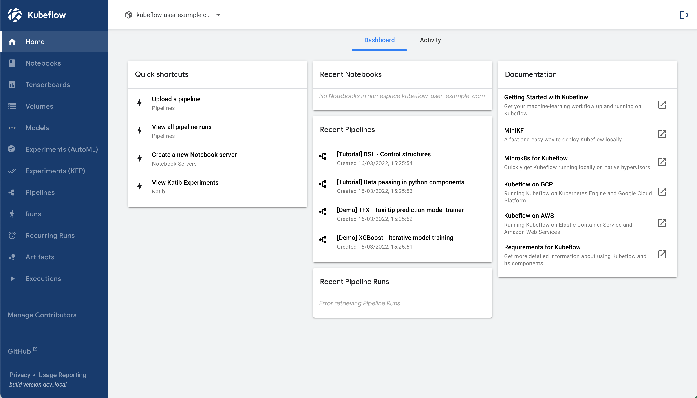
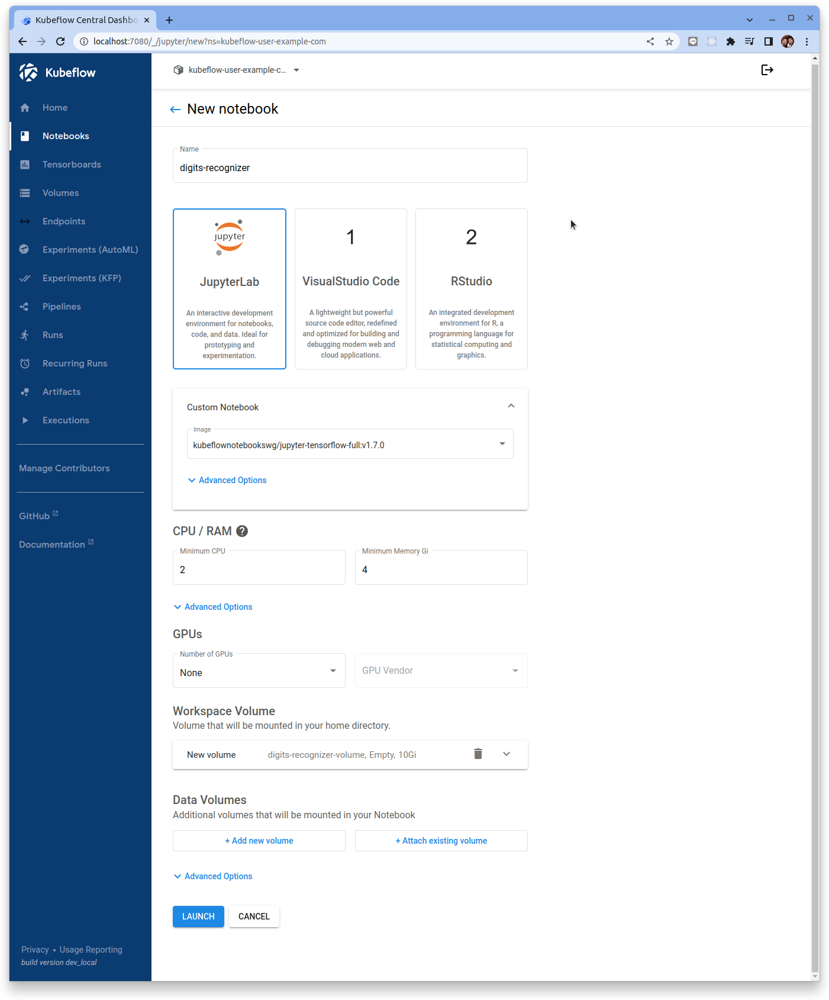
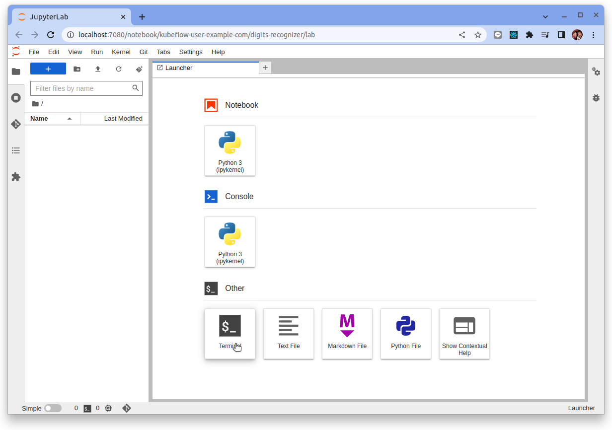
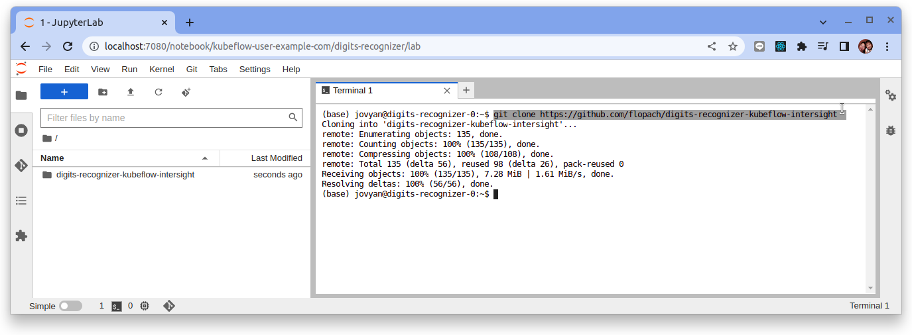
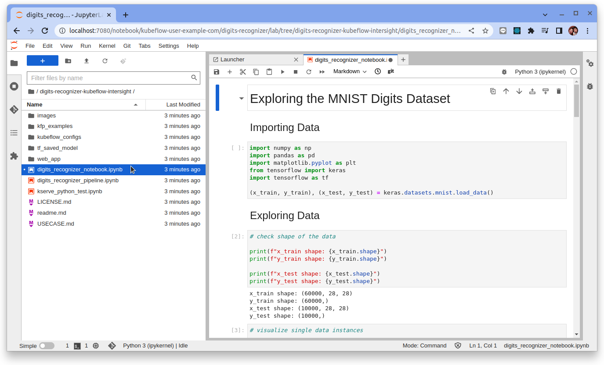
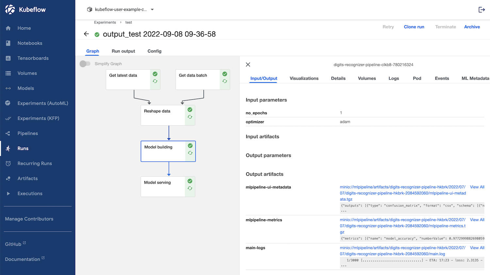
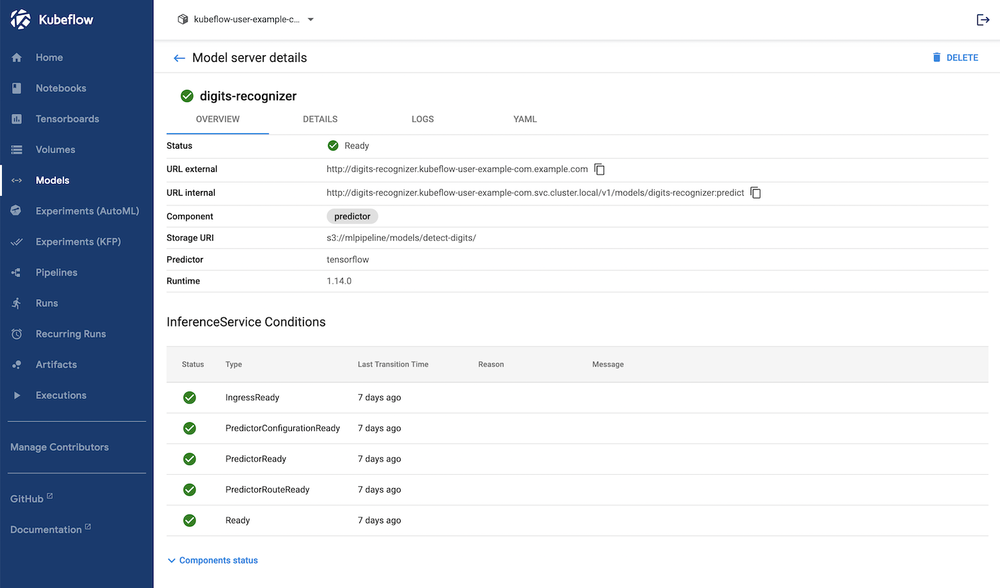
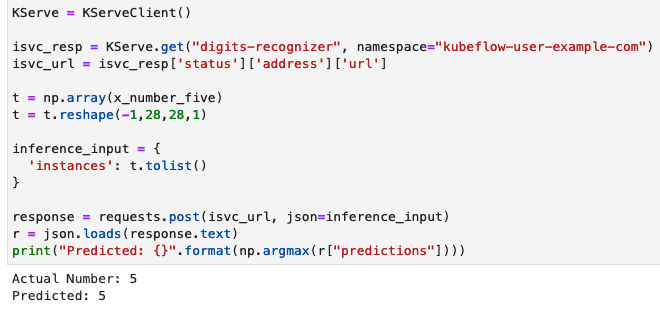

# 使用 Kubeflow 識別數字圖像

原文: [MLOps Workflow: Recognizing Digits with Kubeflow](https://github.com/flopach/digits-recognizer-kubeflow)

[MNIST 手寫數字數據](http://yann.lecun.com/exdb/mnist/)是深度學習的 Hello-World，因此學習本文時不要關注 ML 模型本身，而是多去關注如何在 Kubeflow 中創建 ML 管道。這裡的目標是創建一個自動化的 ML 管道，用於獲取數據、數據預處理以及創建和提供 ML 模型。您可以在下面看到數字識別器應用程序的概述。


您需要按照以下步驟操作：

1. 部署 Kubernetes 集群並安裝 Kubeflow
2. 訪問 Kubeflow 中央儀表板
3. 設置 Jupyter 筆記本
4. 設置 MinIO 成為 Object Storage 服務
5. 設置 Kserve
6. 使用 Kubeflow Pipelines 創建 ML 管道
7. 測試模型推論

使用的組件:

- Kubeflow 1.5.1 - Notebook, Pipelines, Kserve
- MinIO
- Kubernetes 1.21

觀看演練視頻:


## 1. 部署 Kubernetes 集群並安裝 Kubeflow

在 Kubernetes 集群上安裝 Kubeflow。您可以在 [Kubeflow 文檔](https://www.kubeflow.org/docs/started/installing-kubeflow/)中找到更多信息。

也可參考[手動安裝 Kubeflow](../../env/kubeflow-install.md)來構建一個本機 Kubeflow 練習環境。

如果所有 pod 都成功啟動，您可以使用 kubectl 檢查:

```bash
$ kubectl get pod -A
NAMESPACE                   NAME                                                     READY   STATUS    RESTARTS      AGE
kube-system                 local-path-provisioner-79f67d76f8-qjnn9                  1/1     Running   0             20h
kube-system                 coredns-597584b69b-9d5d9                                 1/1     Running   0             20h
kube-system                 metrics-server-5f9f776df5-x6h6q                          1/1     Running   0             20h
metallb-system              metallb-speaker-fr9nc                                    1/1     Running   0             20h
metallb-system              metallb-controller-8764f5bd5-lmhxm                       1/1     Running   1 (20h ago)   20h
kube-system                 ingress-nginx-controller-6b8bfd7f69-qfqsf                1/1     Running   0             20h
default                     nginx-76d6c9b8c-gtt2w                                    1/1     Running   0             20h
cert-manager                cert-manager-cainjector-d9bc5979d-tlm75                  1/1     Running   0             20h
cert-manager                cert-manager-74d949c895-5zgth                            1/1     Running   0             20h
istio-system                istiod-56f7cf9bd6-q8lbc                                  1/1     Running   0             20h
knative-eventing            eventing-webhook-79cd6767-p48r2                          1/1     Running   0             20h
cert-manager                cert-manager-webhook-84b7ddd796-ps2m6                    1/1     Running   0             20h
knative-eventing            eventing-controller-c6f5fd6cd-2zbrn                      1/1     Running   0             20h
istio-system                cluster-local-gateway-6955b67f54-95lfn                   1/1     Running   0             20h
auth                        dex-56d9748f89-5j224                                     1/1     Running   0             20h
istio-system                istio-ingressgateway-67f7b5f88d-v5vfc                    1/1     Running   0             20h
kubeflow                    training-operator-7589458f95-5dmn6                       1/1     Running   0             20h
istio-system                authservice-0                                            1/1     Running   0             20h
knative-serving             net-istio-webhook-7ff9fdf999-bhst7                       2/2     Running   0             20h
kubeflow                    metacontroller-0                                         1/1     Running   0             20h
kubeflow                    cache-server-76cb8f97f9-7wscc                            2/2     Running   0             20h
kubeflow                    notebook-controller-deployment-6bb6578dd8-zkwhw          2/2     Running   1 (20h ago)   20h
knative-serving             net-istio-controller-5fcd96d76f-jhbmx                    2/2     Running   0             20h
knative-serving             autoscaler-6dbcdd95c7-2xt5s                              2/2     Running   0             20h
kubeflow                    katib-controller-8bb4fdf4f-2jzl9                         1/1     Running   0             20h
kubeflow                    katib-db-manager-f8dc7f465-l4tsp                         1/1     Running   1 (20h ago)   20h
knative-serving             domain-mapping-75cc6d667f-gkbgn                          2/2     Running   0             20h
knative-serving             domainmapping-webhook-6dfb78c944-gsgns                   2/2     Running   0             20h
kubeflow                    profiles-deployment-786df9d89d-nd2gs                     3/3     Running   0             20h
knative-serving             webhook-69cc5b9849-tdrrf                                 2/2     Running   0             20h
kubeflow                    ml-pipeline-persistenceagent-798dbf666f-vk2bb            2/2     Running   0             20h
kubeflow                    admission-webhook-deployment-6db8bdbb45-d5l9z            1/1     Running   0             20h
kubeflow                    kserve-models-web-app-99849d9f7-9z48b                    2/2     Running   0             20h
knative-serving             activator-67849589d6-gc288                               2/2     Running   0             20h
knative-serving             controller-b9b8855b8-jm75z                               2/2     Running   0             20h
kubeflow                    katib-mysql-db6dc68c-5w5ss                               1/1     Running   0             20h
kubeflow                    katib-ui-7859bc4c67-wvv67                                2/2     Running   0             20h
kubeflow                    workflow-controller-6547f784cd-c7c6b                     2/2     Running   1 (20h ago)   20h
kubeflow                    tensorboards-web-app-deployment-58469c74bc-whz6x         2/2     Running   0             20h
kubeflow                    centraldashboard-655c7d894c-qvtfb                        2/2     Running   0             20h
kubeflow                    jupyter-web-app-deployment-cbf78fc7d-x5qms               2/2     Running   0             20h
kubeflow                    kserve-controller-manager-85b6b6c47d-n7sg9               2/2     Running   0             20h
kubeflow                    ml-pipeline-viewer-crd-56f7cfd7d9-dnlrr                  2/2     Running   0             20h
kubeflow                    ml-pipeline-scheduledworkflow-859ff9cf7b-dcrrr           2/2     Running   0             20h
kubeflow                    tensorboard-controller-deployment-6664b8866f-gcdhf       3/3     Running   2 (20h ago)   20h
kubeflow                    volumes-web-app-deployment-75b88664f4-r8sg5              2/2     Running   0             20h
kubeflow                    metadata-envoy-deployment-5b6c575b98-rdv4k               1/1     Running   0             20h
kubeflow                    ml-pipeline-ui-6d69549787-p266n                          2/2     Running   0             20h
kubeflow                    kubeflow-pipelines-profile-controller-59ccbd47b9-d5zsg   1/1     Running   0             20h
kubeflow                    mysql-c999c6c8-tl47w                                     2/2     Running   0             20h
kubeflow-user-example-com   ml-pipeline-ui-artifact-6cb7b9f6fd-czl8h                 2/2     Running   0             20h
kubeflow                    minio-65dff76b66-wngnf                                   2/2     Running   0             20h
kubeflow                    metadata-grpc-deployment-784b8b5fb4-g72s8                2/2     Running   3 (20h ago)   20h
kubeflow                    metadata-writer-5899c74595-prr4j                         2/2     Running   0             20h
kubeflow                    ml-pipeline-7d5658846f-vdmjb                             2/2     Running   1 (20h ago)   20h
kubeflow-user-example-com   ml-pipeline-visualizationserver-7b5889796d-fzbv7         2/2     Running   0             20h
kubeflow                    ml-pipeline-visualizationserver-64447ffc76-sz78r         2/2     Running   0             20h
```

## 2. 訪問 Kubeflow 中央儀表板

部署完所有內容後，您可以使用以下命令進行端口轉發：

```bash
kubectl port-forward svc/istio-ingressgateway -n istio-system 7080:80
```

並通過 `http://localhost:7080` 遠程訪問 Kubeflow Central Dashboard。



!!! tip
  Kubeflow 安裝時會預設產生一個使用者 `user@example.com`, 請使用下列用戶帳戶來登入 Kubeflow:

  - User: `user@example.com`
  - Password: `12341234`

## 3. 設置 Jupyter 筆記本

**從 Jupyter 筆記本訪問 Kubeflow 管道:**

在此演示中，您將通過 Jupyter 筆記本中的 Python SDK 訪問 Kubeflow 管道。因此，需要一個額外的設置來實現這一點。

首先在這個 Kubernetes 清單中插入你的 Kubeflow 用戶名（你的 Kubeflow 用戶名也是一個 Kubernetes 命名空間的名稱，你的所有用戶特定容器將在其中啟動）：[kubeflow_config/access_kfp_from_jupyter_notebook.yaml](https://github.com/flopach/digits-recognizer-kubeflow/blob/master/kubeflow_configs/access_kfp_from_jupyter_notebook.yaml)。您可以在 **Manage Contributers** 菜單下提取命名空間名稱。


```yaml title="kubeflow_config/access_kfp_from_jupyter_notebook.yaml"
apiVersion: kubeflow.org/v1alpha1
kind: PodDefault
metadata:
  name: access-ml-pipeline
  namespace: <<<YOUR_USER_PROFILE_NAMESPACE>>>
spec:
  desc: Allow access to Kubeflow Pipelines
  selector:
    matchLabels:
      access-ml-pipeline: "true"
  volumes:
    - name: volume-kf-pipeline-token
      projected:
        sources:
          - serviceAccountToken:
              path: token
              expirationSeconds: 7200
              audience: pipelines.kubeflow.org      
  volumeMounts:
    - mountPath: /var/run/secrets/kubeflow/pipelines
      name: volume-kf-pipeline-token
      readOnly: true
  env:
    - name: KF_PIPELINES_SA_TOKEN_PATH
      value: /var/run/secrets/kubeflow/pipelines/token
```

??? info
    參考: https://github.com/kubeflow/kubeflow/blob/master/components/admission-webhook/README.md

    **目標:**

    Kubeflow 需要一種方法將公共/分享的元數據（環境變量、卷）注入 pod（例如筆記本）。見[問題](https://github.com/kubeflow/kubeflow/issues/2641)。 K8s 在 1.23 版本之前具有類似用例的 PodPreset 資源。Kubeflow 借用了這個 PodPreset 的實現，為 Kubeflow 定制並重新命名為 PodDefault 以避免混淆。

    **如何使用:**

    這是在 Kubeflow 中如何使用它的流程：

    1. 用戶創建 PodDefault，它描述了在創建時要注入到 Pod 中的額外運行時要求（即卷、volumeMounts、環境變量）。 PodDefaults 使用{==標籤選擇器==}來指定應用給定 PodDefault 的 Pod。 PodDefaults 是命名空間範圍，即它們可以在命名空間中應用/查看。

        例如，以下清單在 kubeflow 命名空間中聲明了一個 PodDefault，以將秘密 gcp-secret 添加到給定命名空間中的 pod。

        ```yaml hl_lines="7"
        apiVersion: "kubeflow.org/v1alpha1"
        kind: PodDefault
        metadata:
          name: add-gcp-secret
          namespace: kubeflow
        spec:
          selector:
            matchLabels:
              add-gcp-secret: "true"
          desc: "add gcp credential"
          volumeMounts:
          - name: secret-volume
            mountPath: /secret/gcp
          volumes:
          - name: secret-volume
            secret:
              secretName: gcp-secret
        ```

    2. 負責創建 pod 的 Kubeflow 組件（例如筆記本控制器）會在需要時向 pod 添加一些可用的 PodDefault 標籤。例如，對於 Jupyter 筆記本，Notebook UI 會詢問用戶需要將哪個 PodDefault 應用於筆記本 pod。然後，Notebook-controller 將相應的 PodDefault 標籤添加到 Notebook pod。

    3. Admission webhook controller 通常攔截對 Kubernetes API 服務器的請求，並可以修改和/或驗證請求。此處實施了 admission webhook 以根據可用的 PodDefaults 修改 pod。當收到 pod 創建請求時，admission webhook 會查找與 pod 標籤匹配的可用 PodDefaults。然後，它根據 PodDefault 的規範改變 Pod 規範。對於上面的 PodDefault，當帶有標籤`add-gcp-secret: true` 的 pod 創建請求到來時，它會按照 PodDefault 規範中的描述將 volume 和 volumeMounts 附加到 pod。


完成後，使用下列命令來套用設定它：

```bash
kubectl apply -f access_kfp_from_jupyter_notebook.yaml
```

**啟動一個新的 `Notebook` 實例:**

現在，您需要啟動一個新的 Jupyter notebook 實例。對於容器鏡像，選擇 `jupyter-tensorflow-full:v1.7.0`。這可能需要幾分鐘時間，具體取決於您的下載速度。



**訪問 Jupyter Notebooks 並從 Github clone 程式碼:**

轉到 Notebooks 並點擊 `CONNECT` 以啟動 Jupyter Notebook 容器。

通過 Juypter Lab，您可以在 Web 瀏覽器中訪問終端和 Python notebook。這是您的數據科學團隊和您可以協作探索該數據集並創建您的 Kubeflow 管道的地方。

首先，讓我們 clone 本次範例的存儲庫，以便您可以訪問相關程式碼。您可以使用終端或直接在瀏覽器中執行此操作。



```bash
git clone https://github.com/flopach/digits-recognizer-kubeflow-intersight
```



然後打開 `digits_recognizer_notebook.ipynb` 以了解[數據集](http://yann.lecun.com/exdb/mnist/)及其格式。



**更新 Python 套件:**

啟動後，仔細檢查 Jupyter notebook 容器中是否安裝了最新版本的 Kubeflow python 套件：

`pip list` 應該列出這些下面的版本:

```bash
kfp                      1.8.12
kfp-pipeline-spec        0.1.13
kfp-server-api           1.8.2
kserve                   0.8.0
```

```
pip3 install --upgrade kfp
pip3 install --upgrade kfp-server-api 
pip3 install --upgrade kserve
```

**網路代理（可選）:**

如果您使用網頁代理(web proxy)，請將 `kubeflow_configs/proxy-fix-notebooks.yaml` 修復應用到您的 kubernetes 集群。

```yaml 
apiVersion: networking.istio.io/v1beta1
kind: ServiceEntry
metadata:
  name: proxy
spec:
  hosts:
  - my-company-proxy.com # ignored
  addresses:
  - 64.103.36.135
  ports:
  - number: 80
    name: tcp
    protocol: TCP
  location: MESH_EXTERNAL
```

參考: [kube-proxy](https://www.arhea.net/posts/2020-06-16-kubernetes-http-proxies)

## 4. 設置 MinIO 成為 Object Storage 服務

為了提供所有工作數據（訓練和測試數據、保存的 ML 模型等）可供所有組件使用的單一事實來源，建議使用對象存儲 (Object Storage)。對於我們的應用程序，我們將設置 [MinIO](https://min.io/)。

由於 Kubeflow 已經設置了一個 MinIO 租戶，我們將利用 `mlpipeline` 存儲桶。但您也可以部署自己的 MinIO 租戶。

**從 Kubeflow 的集成 MinIO 獲取憑證:**

1. 使用以下命令獲取 MinIO 的 `accesskey` 和 `secretkey`:

    ```bash
    kubectl get secret mlpipeline-minio-artifact -n kubeflow -o jsonpath="{.data.accesskey}" | base64 --decode

    kubectl get secret mlpipeline-minio-artifact -n kubeflow -o jsonpath="{.data.secretkey}" | base64 --decode
    ```

    - accesskey: `minio`
    - secretkey: `minio123`

2. 為了從 Kubernetes 集群外部訪問 MinIO 並檢查存儲桶，請執行端口轉發：

    ```bash
    kubectl port-forward -n kubeflow svc/minio-service 9000:9000
    ```

3. 然後您可以訪問 `http://localhost:9000` 上的 MinIO 儀表板並檢查存儲桶名稱或創建您自己的存儲桶。或者，您可以使用 [MinIO CLI 客戶端](https://docs.min.io/docs/minio-client-quickstart-guide.html)


預設值應該是:

- accesskey: minio
- secretkey: minio123
- bucket: mlpipeline

## 5. 設置 Kserve

在此步驟中，我們將為模型推論服務設置 Kserve。 Kserve 容器將在我們執行 ML 管道時創建，這將在下一步中發生。

**為 kserve 設置 minIO secret:**

創建 Secret，以便 Kserve 可以訪問保存在 minIO 上的創建模型。 Kserve 會將保存的模型複製到新創建的推論容器中。

```yaml title="kubeflow_configs/set-minio-kserve-secret.yaml"
apiVersion: v1
kind: Secret
metadata:
  name: minio-kserve-secret
  namespace: kubeflow-user-example-com
  annotations:
     serving.kserve.io/s3-endpoint: "minio-service.kubeflow:9000"
     serving.kserve.io/s3-usehttps: "0"
     serving.kserve.io/s3-useanoncredential: "false"
type: Opaque
stringData:
  AWS_ACCESS_KEY_ID: "minio"
  AWS_SECRET_ACCESS_KEY: "minio123"
---
apiVersion: v1
kind: ServiceAccount
metadata:
  name: sa-minio-kserve
  namespace: kubeflow-user-example-com
secrets:
- name: minio-kserve-secret
```

執行下列命令來套用這個 yaml 文件:

```bash
kubectl apply -f kubeflow_configs/set-minio-kserve-secret.yaml
```

**故障排除：無法獲取 docker 鏡像:**

如果 kserve 無法在容器啟動時獲取 docker 鏡像，則需要編輯配置：

```bash
kubectl -n knative-serving edit configmap config-deployment
```

直接在 data 下面添加 key-value `registriesSkippingTagResolving` 並應用：

```yaml hl_lines="3"
apiVersion: v1
data:
registriesSkippingTagResolving: "index.docker.io"
  _example: |
    ################################
    #                              #
    #    EXAMPLE CONFIGURATION     #
    #                              #
    ################################
...
```

查找更多故障排除信息：https://kserve.github.io/website/developer/debug/

## 6. 使用 Kubeflow Pipelines 創建 ML 管道

Kubeflow Pipelines (KFP) 是 Kubeflow 中使用最多的組件。它允許您將 ML 專案中的每個步驟或功能創建一個可重用的容器化管道組件，這些組件可以鏈接在一起作為 ML 管道。

對於 digits recognizer application，管道已使用 Python SDK 創建。您可以在文件 `digits_recognizer_pipeline.ipynb` 中找到範例程式碼:





## 7. 測試模型推論

現在您可以測試模型推論。最簡單的方法是直接在 Jupyter Notebook 中使用 Python 腳本：



或者，您可以使用可以在 `web_app` 文件夾中找到的 Web 應用程序。請注意，如果您想從集群外部訪問推理服務，則需要進行一些配置。

