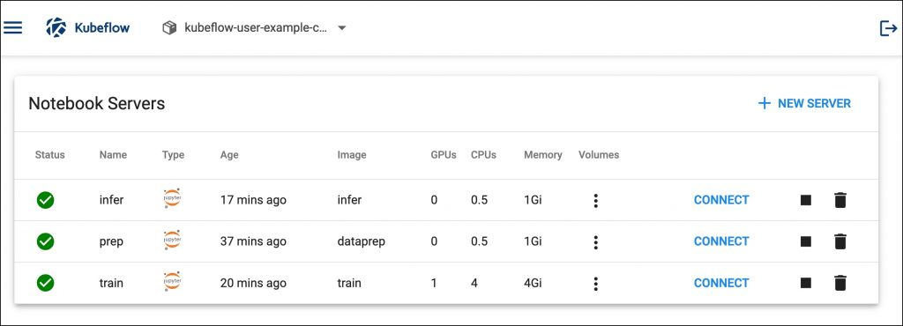

# 為 Kubeflow Notebook 服務器構建自定義容器鏡像

原文: [Tutorial: Build Custom Container Images for a Kubeflow Notebook Server](https://thenewstack.io/tutorial-build-custom-container-images-for-a-kubeflow-notebook-server/)


在本教程中，我們將為 Kubeflow Notebook Server 構建自定義容器鏡像。

##　概述

此練習涉及三個獨立的步驟：數據準備、模型訓練和推理。每個步驟都與專用的 Jupyter Notebook Server 環境相關聯。數據準備和推理環境將以CPU為目標，而用於訓練的Jupyter Notebook將在GPU主機上運行。

數據科學家將執行數據處理任務，並將最終數據集保存到機器學習工程師訓練模型時使用的共享存儲中。訓練後的模型存儲在另一個共享存儲中，DevOps 工程師使用該共享存儲來打包和部署模型以進行推理。

下圖描述了　Notebook Server　如何利用存儲引擎。


每個 Jupyter Notebook 服務器都使用自己的容器鏡像以及適當的工具和框架。這為團隊提供了執行各自任務所需的靈活性。

一旦構建了自定義容器鏡像並配置了存儲，我們的 Kubeflow 環境將如下圖所示：



雖然整個管道只需一個 Notebook Server 實例即可執行，無需共享文件夾，但生產部署需要為每個團隊提供隔離的環境。

##　構建容器鏡像

由於每個　Notebook Server　都有明確定義的使用角色，因此我們將為每個環境構建專用容器鏡像。

讓我們從容器鏡像開始進行數據準備和預處理。這將包含 Pandas 和 Matplotlib 等可用於處理和分析數據的模塊。

```dockerfile
FROM ubuntu:18.04
 
RUN apt-get update && apt-get install -y \
python3 \
python3-pip
 
RUN python3 -m pip --no-cache-dir install --upgrade \
"pip<20.3" \
setuptools
 
RUN python3 -m pip install --no-cache-dir \
jupyter \
matplotlib \
pandas \
scipy \
imutils \
opencv-python
 
RUN apt-get install -y --no-install-recommends \
zip \
unzip \
wget \
git \
libgl1-mesa-glx
 
EXPOSE 8888
 
ENV NB_PREFIX /
 
CMD ["bash","-c", "jupyter notebook --notebook-dir=/home/jovyan --ip=0.0.0.0 --no-browser --allow-root --port=8888 --NotebookApp.token='' --NotebookApp.password='' --NotebookApp.allow_origin='*' --NotebookApp.base_url=${NB_PREFIX}"]
```

我們將此文件稱為 `Dockerfile.prep`

上述 Dockerfile 中使用的命令是不言自明的。我們從 `Ubuntu 18.04` 的基礎鏡像開始，然後安裝 `Python 3` 和 `Pip`。然後，我們安裝所需的 Python 包，然後安裝必要的命令行工具。最後，我們公開端口 `8888` 用於訪問 Jupyter Hub Web 界面，並使用正確的參數集啟動筆記本。

如果您想知道為什麼我們使用環境變量 `NB_PREFIX`，請參閱 Kubeflow 文檔以了解控制器如何使用該變量來配置 URL。本質上，Kubeflow 筆記本控制器使用環境變量 `NB_PREFIX`` 管理筆記本服務器的基本 URL。

構建鏡像並將其推送到 Docker Hub 或任何其他鏡像註冊表(container registry)。

```bash
docker build -t janakiramm/dataprep -f Dockerfile.prep .


docker push janakiramm/dataprep
```

現在是為訓練筆記本服務器構建鏡像的時候了。我們將使用支持 GPU 的最新 TensorFlow 鏡像。

```dockerfile
FROM tensorflow/tensorflow:latest-gpu-jupyter
RUN /usr/bin/python3 -m pip install --upgrade pip
 
RUN pip install pandas \
sklearn \
scipy \
matplotlib \
imutils \
opencv-python
 
RUN apt-get update
RUN apt-get install -y git \
wget \
libgl1-mesa-glx
 
ENV NB_PREFIX /
 
CMD ["sh","-c", "jupyter notebook --notebook-dir=/home/jovyan --ip=0.0.0.0 --no-browser --allow-root --port=8888 --NotebookApp.token='' --NotebookApp.password='' --NotebookApp.allow_origin='*' --NotebookApp.base_url=${NB_PREFIX}"]
```

我們從 TensorFlow GPU 的基礎鏡像開始，其中包含所有必需的 CUDA 庫。然後，我們在公開 Jupyter Notebook URL 之前安裝所需的 Python 庫和操作系統工具。

構建鏡像並將其推送到 Docker Hub 或任何其他鏡像註冊表(container registry)。

```bash
docker build -t janakiramm/train -f Dockerfile.train .
```

最後，為了模型服務和測試，我們將創建一個基於 TensorFlow CPU 的鏡像。

```dockerfile
FROM tensorflow/tensorflow:latest-jupyter
RUN /usr/bin/python3 -m pip install --upgrade pip
 
RUN pip install pandas \
sklearn \
scipy \
matplotlib \
imutils \
opencv-python
 
RUN apt-get update
RUN apt-get install -y git \
wget \
libgl1-mesa-glx
 
ENV NB_PREFIX /
 
CMD ["sh","-c", "jupyter notebook --notebook-dir=/home/jovyan --ip=0.0.0.0 --no-browser --allow-root --port=8888 --NotebookApp.token='' --NotebookApp.password='' --NotebookApp.allow_origin='*' --NotebookApp.base_url=${NB_PREFIX}"]
```

構建鏡像並將其推送到 Docker Hub 或任何其他鏡像註冊表(container registry)。

```bash
docker build -t janakiramm/train -f Dockerfile.infer .


docker push janakiramm/infer
```

