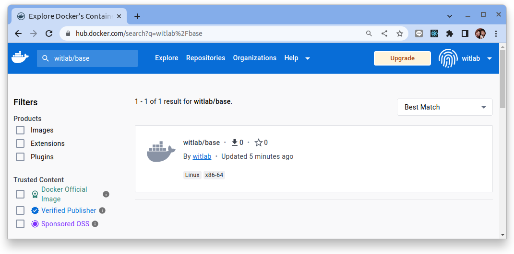
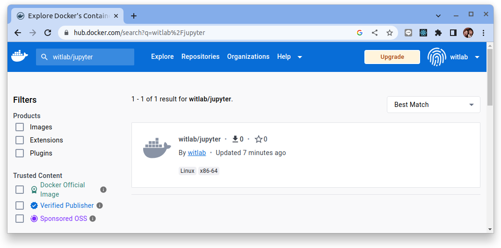
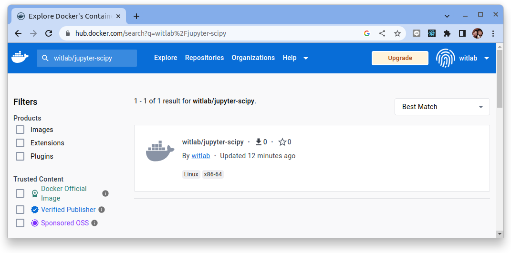
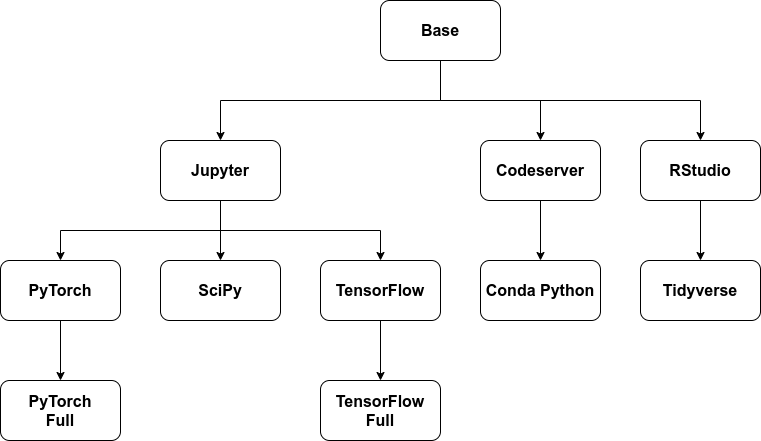

# 客制 Notebook Server 鏡像

要進行本次練習的必要:

- git
- make
- docker
- docker hub 的帳號

首先使用 docker login 來登入 dockerub:

```bash
$ docker login
Login with your Docker ID to push and pull images from Docker Hub. If you don't have a Docker ID, head over to https://hub.docker.com to create one.
Username: witlab
Password: 
WARNING! Your password will be stored unencrypted in /home/dxlab/.docker/config.json.
Configure a credential helper to remove this warning. See
https://docs.docker.com/engine/reference/commandline/login/#credentials-store

Login Succeeded
```

!!! info
    請使用個人或組織的帳密登入。

本教程使用 docker hub 來作為容器鏡像的 registry，如果使用私有 container registry，請依據個自環境的要求來進行登入。

另外也記得修改本次練習所要創建的容器鏡像的 registry　前置名稱。

## 練習重制/客制 Notebook server 容器鏡像

首先使用 `git` 把 [kubeflow repo](https://github.com/kubeflow/kubeflow) 複制至本地。

```bash
git clone https://github.com/kubeflow/kubeflow.git
```

主要的 Notebook Server 的鏡像構建檔案位於 `kubeflow/components/example-notebook-servers` 的目錄之下:

```base
kubeflow/components/example-notebook-servers/
├── base
│   ├── Dockerfile
│   └── Makefile
├── codeserver
│   ├── Dockerfile
│   ├── Makefile
│   └── s6
│       ├── cont-init.d
│       │   └── 01-copy-tmp-home
│       └── services.d
│           └── code-server
│               └── run
├── codeserver-python
│   ├── Dockerfile
│   ├── Makefile
│   ├── requirements.txt
│   └── s6
│       └── cont-init.d
│           └── 02-conda-init
├── image-flow-chart.png
├── jupyter
│   ├── Dockerfile
│   ├── Makefile
│   ├── requirements.txt
│   └── s6
│       ├── cont-init.d
│       │   └── 01-copy-tmp-home
│       └── services.d
│           └── jupyterlab
│               └── run
├── jupyter-pytorch
│   ├── cpu.Dockerfile
│   ├── cpu-requirements.txt
│   ├── cuda.Dockerfile
│   ├── cuda-requirements.txt
│   └── Makefile
├── jupyter-pytorch-full
│   ├── cpu.Dockerfile
│   ├── cuda.Dockerfile
│   ├── Makefile
│   └── requirements.txt
├── jupyter-scipy
│   ├── Dockerfile
│   ├── Makefile
│   └── requirements.txt
├── jupyter-tensorflow
│   ├── cpu.Dockerfile
│   ├── cpu-requirements.txt
│   ├── cuda.Dockerfile
│   ├── cuda-requirements.txt
│   └── Makefile
├── jupyter-tensorflow-full
│   ├── cpu.Dockerfile
│   ├── cuda.Dockerfile
│   ├── Makefile
│   └── requirements.txt
├── Makefile
├── OWNERS
├── README.md
├── rstudio
│   ├── Dockerfile
│   ├── Makefile
│   ├── rsession.sh
│   └── s6
│       ├── cont-init.d
│       │   ├── 01-copy-tmp-home
│       │   └── 02-rstudio-env-fix
│       └── services.d
│           └── rstudio
│               ├── finish
│               └── run
└── rstudio-tidyverse
    ├── Dockerfile
    └── Makefile
```

## 重制/客制 `base`

`base` 所有 Kubelfow Notebook sever 容器鏡像的基礎鏡像，不建議修改此鏡像的配置 `Docckerfile`。

```bash
example-notebook-servers/base/
├── Dockerfile
└── Makefile
```

??? abstract "Dockerfile"
    ```dockerfile
    # Use the respective Makefile to build the image.
    FROM ubuntu:20.04

    # common environemnt variables
    ENV NB_USER jovyan
    ENV NB_UID 1000
    ENV NB_PREFIX /
    ENV HOME /home/$NB_USER
    ENV SHELL /bin/bash

    # args - software versions
    ARG KUBECTL_ARCH="amd64"
    ARG KUBECTL_VERSION=v1.21.0
    ARG S6_ARCH="amd64"
    # renovate: datasource=github-tags depName=just-containers/s6-overlay versioning=loose
    ARG S6_VERSION=v2.2.0.3

    # set shell to bash
    SHELL ["/bin/bash", "-c"]

    # install - usefull linux packages
    RUN export DEBIAN_FRONTEND=noninteractive \
    && apt-get -yq update \
    && apt-get -yq install --no-install-recommends \
        apt-transport-https \
        bash \
        bzip2 \
        ca-certificates \
        curl \
        git \
        gnupg \
        gnupg2 \
        locales \
        lsb-release \
        nano \
        software-properties-common \
        tzdata \
        unzip \
        vim \
        wget \
        zip \
    && apt-get clean \
    && rm -rf /var/lib/apt/lists/*

    # install - s6 overlay
    RUN export GNUPGHOME=/tmp/ \
    && curl -sL "https://github.com/just-containers/s6-overlay/releases/download/${S6_VERSION}/s6-overlay-${S6_ARCH}-installer" -o /tmp/s6-overlay-${S6_VERSION}-installer \
    && curl -sL "https://github.com/just-containers/s6-overlay/releases/download/${S6_VERSION}/s6-overlay-${S6_ARCH}-installer.sig" -o /tmp/s6-overlay-${S6_VERSION}-installer.sig \
    && gpg --keyserver keys.gnupg.net --keyserver pgp.surfnet.nl --recv-keys 6101B2783B2FD161 \
    && gpg -q --verify /tmp/s6-overlay-${S6_VERSION}-installer.sig /tmp/s6-overlay-${S6_VERSION}-installer \
    && chmod +x /tmp/s6-overlay-${S6_VERSION}-installer \
    && /tmp/s6-overlay-${S6_VERSION}-installer / \
    && rm /tmp/s6-overlay-${S6_VERSION}-installer.sig /tmp/s6-overlay-${S6_VERSION}-installer

    # install - kubectl
    RUN curl -sL "https://dl.k8s.io/release/${KUBECTL_VERSION}/bin/linux/${KUBECTL_ARCH}/kubectl" -o /usr/local/bin/kubectl \
    && curl -sL "https://dl.k8s.io/${KUBECTL_VERSION}/bin/linux/${KUBECTL_ARCH}/kubectl.sha256" -o /tmp/kubectl.sha256 \
    && echo "$(cat /tmp/kubectl.sha256) /usr/local/bin/kubectl" | sha256sum --check \
    && rm /tmp/kubectl.sha256 \
    && chmod +x /usr/local/bin/kubectl

    # create user and set required ownership
    RUN useradd -M -s /bin/bash -N -u ${NB_UID} ${NB_USER} \
    && mkdir -p ${HOME} \
    && chown -R ${NB_USER}:users ${HOME} \
    && chown -R ${NB_USER}:users /usr/local/bin \
    && chown -R ${NB_USER}:users /etc/s6

    # set locale configs
    RUN echo "en_US.UTF-8 UTF-8" > /etc/locale.gen \
    && locale-gen
    ENV LANG en_US.UTF-8
    ENV LANGUAGE en_US.UTF-8
    ENV LC_ALL en_US.UTF-8

    USER $NB_UID    
    ```

在本練習的目的在於重制容器鏡像。

修改 `components/example-notebook-srevers/base/Makefile`:

```makefile hl_lines="4 5"
# TAG ?= $(shell git describe --tags --always --dirty)
# REGISTRY ?= kubeflownotebookswg

TAG = v1.7.0
REGISTRY = witlab

docker-build:
	docker build -t ${REGISTRY}/base:${TAG} -f Dockerfile .

docker-push:
	docker push ${REGISTRY}/base:${TAG}
```

- **TAG**: 參考 kubeflow 的 release 版本來設定
- **REGISTRY**: 修改成 dockerhub 的帳號或是組織私有的 registry

### 容器鏡像構建

```bash
$ docker build -t witlab/base:v1.7.0 -f Dockerfile .

[+] Building 6.2s (10/10) FINISHED                                                                                         docker:default
 => [internal] load .dockerignore                                                                                                    0.0s
 => => transferring context: 2B                                                                                                      0.0s
 => [internal] load build definition from Dockerfile                                                                                 0.0s
 => => transferring dockerfile: 2.57kB                                                                                               0.0s
 => [internal] load metadata for docker.io/library/ubuntu:20.04                                                                      5.9s
 => [1/6] FROM docker.io/library/ubuntu:20.04@sha256:c9820a44b950956a790c354700c1166a7ec648bc0d215fa438d3a339812f1d01                0.0s
 => CACHED [2/6] RUN export DEBIAN_FRONTEND=noninteractive  && apt-get -yq update  && apt-get -yq install --no-install-recommends    0.0s
 => CACHED [3/6] RUN export GNUPGHOME=/tmp/  && curl -sL "https://github.com/just-containers/s6-overlay/releases/download/v2.2.0.3/  0.0s
 => CACHED [4/6] RUN curl -sL "https://dl.k8s.io/release/v1.21.0/bin/linux/amd64/kubectl" -o /usr/local/bin/kubectl  && curl -sL "h  0.0s
 => CACHED [5/6] RUN useradd -M -s /bin/bash -N -u 1000 jovyan  && mkdir -p /home/jovyan  && chown -R jovyan:users /home/jovyan  &&  0.0s
 => CACHED [6/6] RUN echo "en_US.UTF-8 UTF-8" > /etc/locale.gen  && locale-gen                                                       0.0s
 => exporting to image                                                                                                               0.0s
 => => exporting layers                                                                                                              0.0s
 => => writing image sha256:f66682cecb6cefc2e17ec97b8dcfa435f52ea34c29e898e9f8e51d291024ef08                                         0.0s
 => => naming to docker.io/witlab/base:v1.7.0
```

檢查結果:

```bash
$ docker image ls

REPOSITORY    TAG       IMAGE ID       CREATED             SIZE
witlab/base   v1.7.0    f66682cecb6c   About an hour ago   437MB
```

### 容器鏡像註冊

```bash
$ make docker-push

docker push witlab/base:v1.7.0
The push refers to repository [docker.io/witlab/base]
b599f779e9c6: Pushed 
54024de395c5: Pushed 
b701d8aa9cf9: Pushed 
af80fc28ecf8: Pushed 
109cae06d90e: Pushed 
f5bb4f853c84: Pushed 
v1.7.0: digest: sha256:6b47306b37d919f71d1010c7ac010885ed26b3ebbbfdd0937cfa7cd31ea5196e size: 1586
```

檢查結果:



## 重制/客制 `jupyter`

`jupyter` 所有 Kubelfow Notebook sever 容器鏡像基於 [JupyterLab](https://github.com/jupyterlab/jupyterlab) 的基礎鏡像，要客制鏡像的配置可著重在 `Docckerfile` 與 `requirements.txt`。

```bash
example-notebook-servers/jupyter
├── Dockerfile
├── Makefile
├── requirements.txt
└── s6
    ├── cont-init.d
    │   └── 01-copy-tmp-home
    └── services.d
        └── jupyterlab
            └── run
```

??? abstract "Dockerfile"

    ```dockerfile
    # Use the respective Makefile to pass the appropriate BASE_IMG and build the image correctly
    ARG BASE_IMG=<base>
    FROM $BASE_IMG

    USER root

    # args - software versions
    ARG MINIFORGE_ARCH="x86_64"
    # renovate: datasource=github-tags depName=conda-forge/miniforge versioning=loose
    ARG MINIFORGE_VERSION=4.10.1-4
    ARG PIP_VERSION=21.1.2
    ARG PYTHON_VERSION=3.8.10

    # install -- node.js
    RUN export DEBIAN_FRONTEND=noninteractive \
    && curl -sL "https://deb.nodesource.com/gpgkey/nodesource.gpg.key" | apt-key add - \
    && echo "deb https://deb.nodesource.com/node_14.x focal main" > /etc/apt/sources.list.d/nodesource.list \
    && apt-get -yq update \
    && apt-get -yq install --no-install-recommends \
        nodejs \
    && apt-get clean \
    && rm -rf /var/lib/apt/lists/*

    # setup environment for conda
    ENV CONDA_DIR /opt/conda
    ENV PATH "${CONDA_DIR}/bin:${PATH}"
    RUN mkdir -p ${CONDA_DIR} \
    && echo ". /opt/conda/etc/profile.d/conda.sh" >> ${HOME}/.bashrc \
    && echo ". /opt/conda/etc/profile.d/conda.sh" >> /etc/profile \
    && echo "conda activate base" >> ${HOME}/.bashrc \
    && echo "conda activate base" >> /etc/profile \
    && chown -R ${NB_USER}:users ${CONDA_DIR} \
    && chown -R ${NB_USER}:users ${HOME}

    # switch to NB_UID for installs
    USER ${NB_UID}

    # install - conda, pip, python
    RUN curl -sL "https://github.com/conda-forge/miniforge/releases/download/${MINIFORGE_VERSION}/Miniforge3-${MINIFORGE_VERSION}-Linux-${MINIFORGE_ARCH}.sh" -o /tmp/Miniforge3.sh \
    && curl -sL "https://github.com/conda-forge/miniforge/releases/download/${MINIFORGE_VERSION}/Miniforge3-${MINIFORGE_VERSION}-Linux-${MINIFORGE_ARCH}.sh.sha256" -o /tmp/Miniforge3.sh.sha256 \
    && echo "$(cat /tmp/Miniforge3.sh.sha256 | awk '{ print $1; }') /tmp/Miniforge3.sh" | sha256sum --check \
    && rm /tmp/Miniforge3.sh.sha256 \
    && /bin/bash /tmp/Miniforge3.sh -b -f -p ${CONDA_DIR} \
    && rm /tmp/Miniforge3.sh \
    && conda config --system --set auto_update_conda false \
    && conda config --system --set show_channel_urls true \
    && echo "conda ${MINIFORGE_VERSION:0:-2}" >> ${CONDA_DIR}/conda-meta/pinned \
    && echo "python ${PYTHON_VERSION}" >> ${CONDA_DIR}/conda-meta/pinned \
    && conda install -y -q \
        python=${PYTHON_VERSION} \
        conda=${MINIFORGE_VERSION:0:-2} \
        pip=${PIP_VERSION} \
    && conda update -y -q --all \
    && conda clean -a -f -y \
    && chown -R ${NB_USER}:users ${CONDA_DIR} \
    && chown -R ${NB_USER}:users ${HOME}

    # install - requirements.txt
    COPY --chown=jovyan:users requirements.txt /tmp
    RUN python3 -m pip install -r /tmp/requirements.txt --quiet --no-cache-dir \
    && rm -f /tmp/requirements.txt \
    && jupyter lab --generate-config \
    && rm -rf ${HOME}/.cache/yarn \
    && chown -R ${NB_USER}:users ${CONDA_DIR} \
    && chown -R ${NB_USER}:users ${HOME}

    # s6 - copy scripts
    COPY --chown=jovyan:users s6/ /etc

    # s6 - 01-copy-tmp-home
    USER root
    RUN mkdir -p /tmp_home \
    && cp -r ${HOME} /tmp_home \
    && chown -R ${NB_USER}:users /tmp_home
    USER ${NB_UID}

    EXPOSE 8888

    ENTRYPOINT ["/init"]
    ```

在　`jupyter` 的 Dockerfile 中, 團隊會比較想調整的是:
  - PYTHON_VERSION=3.8.10

??? abstract "requirements.txt"

    ```
    jupyterlab==3.4.3
    notebook==6.4.12
    ipykernel==6.15.0    
    ```

在 `requirements.txt` 主要是定義了:

  - jupyterlab==3.4.3
  - notebook==6.4.12
  - ipykernel==6.15.0 

在本練習的目的在於重制容器鏡像。

修改 `components/example-notebook-srevers/jupyter/Makefile`:

```makefile hl_lines="4 5"
#TAG ?= $(shell git describe --tags --always --dirty)
#REGISTRY ?= kubeflownotebookswg

TAG = v1.7.0
REGISTRY = witlab

docker-build-base:
	$(MAKE) docker-build -C ../base TAG=${TAG}

docker-build: docker-build-base
	docker build -t ${REGISTRY}/jupyter:${TAG} --build-arg BASE_IMG=${REGISTRY}/base:${TAG} -f Dockerfile . 

docker-push:
	docker push ${REGISTRY}/jupyter:${TAG}
```

- **TAG**: 參考 kubeflow 的 release 版本來設定
- **REGISTRY**: 修改成 dockerhub 的帳號或是組織私有的 registry

###　基礎 `base` 容器鏡像構建

```bash
$ make docker-build-base
make docker-build -C ../base TAG=v1.7.0
make[1]: Entering directory '/home/dxlab/workspace/ws_custom_nb/kubeflow/components/example-notebook-servers/base'
docker build -t witlab/base:v1.7.0 -f Dockerfile .
[+] Building 17.7s (11/11) FINISHED                                                                                        docker:default
 => [internal] load build definition from Dockerfile                                                                                 0.0s
 => => transferring dockerfile: 2.57kB                                                                                               0.0s
 => [internal] load .dockerignore                                                                                                    0.0s
 => => transferring context: 2B                                                                                                      0.0s
 => [internal] load metadata for docker.io/library/ubuntu:20.04                                                                     17.6s
 => [auth] library/ubuntu:pull token for registry-1.docker.io                                                                        0.0s
 => [1/6] FROM docker.io/library/ubuntu:20.04@sha256:c9820a44b950956a790c354700c1166a7ec648bc0d215fa438d3a339812f1d01                0.0s
 => CACHED [2/6] RUN export DEBIAN_FRONTEND=noninteractive  && apt-get -yq update  && apt-get -yq install --no-install-recommends    0.0s
 => CACHED [3/6] RUN export GNUPGHOME=/tmp/  && curl -sL "https://github.com/just-containers/s6-overlay/releases/download/v2.2.0.3/  0.0s
 => CACHED [4/6] RUN curl -sL "https://dl.k8s.io/release/v1.21.0/bin/linux/amd64/kubectl" -o /usr/local/bin/kubectl  && curl -sL "h  0.0s
 => CACHED [5/6] RUN useradd -M -s /bin/bash -N -u 1000 jovyan  && mkdir -p /home/jovyan  && chown -R jovyan:users /home/jovyan  &&  0.0s
 => CACHED [6/6] RUN echo "en_US.UTF-8 UTF-8" > /etc/locale.gen  && locale-gen                                                       0.0s
 => exporting to image                                                                                                               0.0s
 => => exporting layers                                                                                                              0.0s
 => => writing image sha256:f66682cecb6cefc2e17ec97b8dcfa435f52ea34c29e898e9f8e51d291024ef08                                         0.0s
 => => naming to docker.io/witlab/base:v1.7.0                                                                                        0.0s
make[1]: Leaving directory '/home/dxlab/workspace/ws_custom_nb/kubeflow/components/example-notebook-servers/base'
```

檢查結果:

```bash
$ docker image ls

REPOSITORY    TAG       IMAGE ID       CREATED             SIZE
witlab/base   v1.7.0    f66682cecb6c   About an hour ago   437MB
```

###　容器鏡像構建

```bash
$ make docker-build

make docker-build -C ../base TAG=v1.7.0
make[1]: Entering directory '/home/dxlab/workspace/ws_custom_nb/kubeflow/components/example-notebook-servers/base'
docker build -t witlab/base:v1.7.0 -f Dockerfile .
[+] Building 6.0s (10/10) FINISHED                                                                                         docker:default
 => [internal] load build definition from Dockerfile                                                                                 0.0s
 => => transferring dockerfile: 2.57kB                                                                                               0.0s
 => [internal] load .dockerignore                                                                                                    0.0s
 => => transferring context: 2B                                                                                                      0.0s
 => [internal] load metadata for docker.io/library/ubuntu:20.04                                                                      6.0s
 => [1/6] FROM docker.io/library/ubuntu:20.04@sha256:c9820a44b950956a790c354700c1166a7ec648bc0d215fa438d3a339812f1d01                0.0s
 => CACHED [2/6] RUN export DEBIAN_FRONTEND=noninteractive  && apt-get -yq update  && apt-get -yq install --no-install-recommends    0.0s
 => CACHED [3/6] RUN export GNUPGHOME=/tmp/  && curl -sL "https://github.com/just-containers/s6-overlay/releases/download/v2.2.0.3/  0.0s
 => CACHED [4/6] RUN curl -sL "https://dl.k8s.io/release/v1.21.0/bin/linux/amd64/kubectl" -o /usr/local/bin/kubectl  && curl -sL "h  0.0s
 => CACHED [5/6] RUN useradd -M -s /bin/bash -N -u 1000 jovyan  && mkdir -p /home/jovyan  && chown -R jovyan:users /home/jovyan  &&  0.0s
 => CACHED [6/6] RUN echo "en_US.UTF-8 UTF-8" > /etc/locale.gen  && locale-gen                                                       0.0s
 => exporting to image                                                                                                               0.0s
 => => exporting layers                                                                                                              0.0s
 => => writing image sha256:f66682cecb6cefc2e17ec97b8dcfa435f52ea34c29e898e9f8e51d291024ef08                                         0.0s
 => => naming to docker.io/witlab/base:v1.7.0                                                                                        0.0s
make[1]: Leaving directory '/home/dxlab/workspace/ws_custom_nb/kubeflow/components/example-notebook-servers/base'
docker build -t witlab/jupyter:v1.7.0 --build-arg BASE_IMG=witlab/base:v1.7.0 -f Dockerfile . 
[+] Building 317.0s (13/13) FINISHED                                                                                       docker:default
 => [internal] load build definition from Dockerfile                                                                                 0.0s
 => => transferring dockerfile: 3.01kB                                                                                               0.0s
 => [internal] load .dockerignore                                                                                                    0.0s
 => => transferring context: 2B                                                                                                      0.0s
 => [internal] load metadata for docker.io/witlab/base:v1.7.0                                                                        0.0s
 => [internal] load build context                                                                                                    0.0s
 => => transferring context: 747B                                                                                                    0.0s
 => [1/8] FROM docker.io/witlab/base:v1.7.0                                                                                          0.1s
 => [2/8] RUN export DEBIAN_FRONTEND=noninteractive  && curl -sL "https://deb.nodesource.com/gpgkey/nodesource.gpg.key" | apt-key   40.3s
 => [3/8] RUN mkdir -p /opt/conda  && echo ". /opt/conda/etc/profile.d/conda.sh" >> /home/jovyan/.bashrc  && echo ". /opt/conda/etc  0.4s 
 => [4/8] RUN curl -sL "https://github.com/conda-forge/miniforge/releases/download/${MINIFORGE_VERSION}/Miniforge3-${MINIFORGE_VE  202.9s 
 => [5/8] COPY --chown=jovyan:users requirements.txt /tmp                                                                            0.0s 
 => [6/8] RUN python3 -m pip install -r /tmp/requirements.txt --quiet --no-cache-dir  && rm -f /tmp/requirements.txt  && jupyter l  69.2s 
 => [7/8] COPY --chown=jovyan:users s6/ /etc                                                                                         0.2s 
 => [8/8] RUN mkdir -p /tmp_home  && cp -r /home/jovyan /tmp_home  && chown -R jovyan:users /tmp_home                                0.4s 
 => exporting to image                                                                                                               3.4s 
 => => exporting layers                                                                                                              3.4s 
 => => writing image sha256:7241d0b53f0aa7264e78f11c844336d03d707e69ee56a7ea3b048c1b3a2b03f1                                         0.0s
 => => naming to docker.io/witlab/jupyter:v1.7.0                                                                                     0.0s
```

檢查結果:

```bash
$ docker image ls

REPOSITORY       TAG       IMAGE ID       CREATED         SIZE
witlab/jupyter   v1.7.0    7241d0b53f0a   5 minutes ago   1.1GB
witlab/base      v1.7.0    f66682cecb6c   2 hours ago     437MB
```

###　容器鏡像註冊

```bash
$ make docker-push

docker push witlab/base:v1.7.0
The push refers to repository [docker.io/witlab/base]
b599f779e9c6: Pushed 
54024de395c5: Pushed 
b701d8aa9cf9: Pushed 
af80fc28ecf8: Pushed 
109cae06d90e: Pushed 
f5bb4f853c84: Pushed 
v1.7.0: digest: sha256:6b47306b37d919f71d1010c7ac010885ed26b3ebbbfdd0937cfa7cd31ea5196e size: 1586
```

檢查結果:



## 重制/客制 `jupyter-scipy`

`jupyter-scipy` 可作為要客制 Kubelfow Notebook sever 容器鏡像的範例，要客制鏡像的配置可著重在 `Docckerfile` 與 `requirements.txt`。

```bash
example-notebook-servers/jupyter-scipy
├── Dockerfile
├── Makefile
└── requirements.txt
```

??? abstract "Dockerfile"

    ```dockerfile
    # Use the respective Makefile to pass the appropriate BASE_IMG and build the image correctly
    ARG BASE_IMG=<jupyter>
    FROM $BASE_IMG

    # install - requirements.txt
    COPY --chown=jovyan:users requirements.txt /tmp/requirements.txt
    RUN python3 -m pip install -r /tmp/requirements.txt --quiet --no-cache-dir \
    && rm -f /tmp/requirements.txt
    ```

??? abstract "requirements.txt"

    ```
    # kubeflow packages
    kfp==1.6.3
    kfp-server-api==1.6.0
    kfserving==0.5.1

    # scipy packages
    # https://github.com/jupyter/docker-stacks/blob/master/scipy-notebook/Dockerfile
    beautifulsoup4==4.9.3
    bokeh==2.3.2
    #Bottleneck==1.3.2 Could not build wheels for Bottleneck which use PEP 517 and cannot be installed directly
    cloudpickle==1.6.0
    cython==0.29.23
    dask==2021.6.1
    dill==0.3.4
    h5py==3.2.1
    ipympl==0.7.0
    ipywidgets==7.6.3
    jupyterlab-git==0.30.1
    matplotlib==3.4.2
    numba==0.53.1
    numexpr==2.7.3
    pandas==1.2.4
    patsy==0.5.1
    protobuf==3.17.3
    scikit-image==0.18.1
    scikit-learn==0.24.2
    scipy==1.7.0
    seaborn==0.11.1
    SQLAlchemy==1.4.18
    statsmodels==0.12.2
    sympy==1.8
    tables==3.6.1
    vincent==0.4.4
    xlrd==2.0.1
    ```

客制的重點增修開發團隊所需的相關 package　外, 還有一些 kubflow 的基礎關鍵 package:

- kfp==1.6.3
- kfp-server-api==1.6.0
- kfserving==0.5.1

在本練習的目的在於重制容器鏡像。

修改 `components/example-notebook-srevers/jupyter-scipy/Makefile`:

```makefile hl_lines="4 5"
# TAG ?= $(shell git describe --tags --always --dirty)
# REGISTRY ?= kubeflownotebookswg

TAG = v1.7.0
REGISTRY = witlab

docker-build-jupyter:
	$(MAKE) docker-build -C ../jupyter TAG=${TAG} 

docker-build: docker-build-jupyter
	docker build -t ${REGISTRY}/jupyter-scipy:${TAG} --build-arg BASE_IMG=${REGISTRY}/jupyter:${TAG} -f Dockerfile . 

docker-push:
	docker push ${REGISTRY}/jupyter-scipy:${TAG}
```

- **TAG**: 參考 kubeflow 的 release 版本來設定
- **REGISTRY**: 修改成 dockerhub 的帳號或是組織私有的 registry

###　基礎 `jupyter` 容器鏡像構建

```bash
$ make docker-build-jupyter
make docker-build -C ../jupyter TAG=v1.7.0 
make[1]: Entering directory '/home/dxlab/workspace/ws_custom_nb/kubeflow/components/example-notebook-servers/jupyter'
make docker-build -C ../base TAG=v1.7.0
make[2]: Entering directory '/home/dxlab/workspace/ws_custom_nb/kubeflow/components/example-notebook-servers/base'
docker build -t witlab/base:v1.7.0 -f Dockerfile .
[+] Building 17.6s (11/11) FINISHED                                                                                                             docker:default
 => [internal] load .dockerignore                                                                                                                         0.0s
 => => transferring context: 2B                                                                                                                           0.0s
 => [internal] load build definition from Dockerfile                                                                                                      0.0s
 => => transferring dockerfile: 2.57kB                                                                                                                    0.0s
 => [internal] load metadata for docker.io/library/ubuntu:20.04                                                                                          17.5s
 => [auth] library/ubuntu:pull token for registry-1.docker.io                                                                                             0.0s
 => [1/6] FROM docker.io/library/ubuntu:20.04@sha256:c9820a44b950956a790c354700c1166a7ec648bc0d215fa438d3a339812f1d01                                     0.0s
 => CACHED [2/6] RUN export DEBIAN_FRONTEND=noninteractive  && apt-get -yq update  && apt-get -yq install --no-install-recommends     apt-transport-http  0.0s
 => CACHED [3/6] RUN export GNUPGHOME=/tmp/  && curl -sL "https://github.com/just-containers/s6-overlay/releases/download/v2.2.0.3/s6-overlay-amd64-inst  0.0s
 => CACHED [4/6] RUN curl -sL "https://dl.k8s.io/release/v1.21.0/bin/linux/amd64/kubectl" -o /usr/local/bin/kubectl  && curl -sL "https://dl.k8s.io/v1.2  0.0s
 => CACHED [5/6] RUN useradd -M -s /bin/bash -N -u 1000 jovyan  && mkdir -p /home/jovyan  && chown -R jovyan:users /home/jovyan  && chown -R jovyan:user  0.0s
 => CACHED [6/6] RUN echo "en_US.UTF-8 UTF-8" > /etc/locale.gen  && locale-gen                                                                            0.0s
 => exporting to image                                                                                                                                    0.0s
 => => exporting layers                                                                                                                                   0.0s
 => => writing image sha256:f66682cecb6cefc2e17ec97b8dcfa435f52ea34c29e898e9f8e51d291024ef08                                                              0.0s
 => => naming to docker.io/witlab/base:v1.7.0                                                                                                             0.0s
make[2]: Leaving directory '/home/dxlab/workspace/ws_custom_nb/kubeflow/components/example-notebook-servers/base'
docker build -t witlab/jupyter:v1.7.0 --build-arg BASE_IMG=witlab/base:v1.7.0 -f Dockerfile . 
[+] Building 0.1s (13/13) FINISHED                                                                                                              docker:default
 => [internal] load .dockerignore                                                                                                                         0.0s
 => => transferring context: 2B                                                                                                                           0.0s
 => [internal] load build definition from Dockerfile                                                                                                      0.0s
 => => transferring dockerfile: 3.01kB                                                                                                                    0.0s
 => [internal] load metadata for docker.io/witlab/base:v1.7.0                                                                                             0.0s
 => [1/8] FROM docker.io/witlab/base:v1.7.0                                                                                                               0.0s
 => [internal] load build context                                                                                                                         0.0s
 => => transferring context: 268B                                                                                                                         0.0s
 => CACHED [2/8] RUN export DEBIAN_FRONTEND=noninteractive  && curl -sL "https://deb.nodesource.com/gpgkey/nodesource.gpg.key" | apt-key add -  && echo   0.0s
 => CACHED [3/8] RUN mkdir -p /opt/conda  && echo ". /opt/conda/etc/profile.d/conda.sh" >> /home/jovyan/.bashrc  && echo ". /opt/conda/etc/profile.d/con  0.0s
 => CACHED [4/8] RUN curl -sL "https://github.com/conda-forge/miniforge/releases/download/${MINIFORGE_VERSION}/Miniforge3-${MINIFORGE_VERSION}-Linux-${M  0.0s
 => CACHED [5/8] COPY --chown=jovyan:users requirements.txt /tmp                                                                                          0.0s
 => CACHED [6/8] RUN python3 -m pip install -r /tmp/requirements.txt --quiet --no-cache-dir  && rm -f /tmp/requirements.txt  && jupyter lab --generate-c  0.0s
 => CACHED [7/8] COPY --chown=jovyan:users s6/ /etc                                                                                                       0.0s
 => CACHED [8/8] RUN mkdir -p /tmp_home  && cp -r /home/jovyan /tmp_home  && chown -R jovyan:users /tmp_home                                              0.0s
 => exporting to image                                                                                                                                    0.0s
 => => exporting layers                                                                                                                                   0.0s
 => => writing image sha256:7241d0b53f0aa7264e78f11c844336d03d707e69ee56a7ea3b048c1b3a2b03f1                                                              0.0s
 => => naming to docker.io/witlab/jupyter:v1.7.0                                                                                                          0.0s
make[1]: Leaving directory '/home/dxlab/workspace/ws_custom_nb/kubeflow/components/example-notebook-servers/jupyter'
```

檢查:

```bash
$ docker image ls

REPOSITORY       TAG       IMAGE ID       CREATED          SIZE
witlab/jupyter   v1.7.0    7241d0b53f0a   26 minutes ago   1.1GB
witlab/base      v1.7.0    f66682cecb6c   2 hours ago      437MB
```

###　容器鏡像構建

```bash
$ make docker-build

make docker-build -C ../jupyter TAG=v1.7.0 
make[1]: Entering directory '/home/dxlab/workspace/ws_custom_nb/kubeflow/components/example-notebook-servers/jupyter'
make docker-build -C ../base TAG=v1.7.0
make[2]: Entering directory '/home/dxlab/workspace/ws_custom_nb/kubeflow/components/example-notebook-servers/base'
docker build -t witlab/base:v1.7.0 -f Dockerfile .
[+] Building 6.0s (10/10) FINISHED                                                                                                              docker:default
 => [internal] load .dockerignore                                                                                                                         0.0s
 => => transferring context: 2B                                                                                                                           0.0s
 => [internal] load build definition from Dockerfile                                                                                                      0.0s
 => => transferring dockerfile: 2.57kB                                                                                                                    0.0s
 => [internal] load metadata for docker.io/library/ubuntu:20.04                                                                                           5.8s
 => [1/6] FROM docker.io/library/ubuntu:20.04@sha256:c9820a44b950956a790c354700c1166a7ec648bc0d215fa438d3a339812f1d01                                     0.0s
 => CACHED [2/6] RUN export DEBIAN_FRONTEND=noninteractive  && apt-get -yq update  && apt-get -yq install --no-install-recommends     apt-transport-http  0.0s
 => CACHED [3/6] RUN export GNUPGHOME=/tmp/  && curl -sL "https://github.com/just-containers/s6-overlay/releases/download/v2.2.0.3/s6-overlay-amd64-inst  0.0s
 => CACHED [4/6] RUN curl -sL "https://dl.k8s.io/release/v1.21.0/bin/linux/amd64/kubectl" -o /usr/local/bin/kubectl  && curl -sL "https://dl.k8s.io/v1.2  0.0s
 => CACHED [5/6] RUN useradd -M -s /bin/bash -N -u 1000 jovyan  && mkdir -p /home/jovyan  && chown -R jovyan:users /home/jovyan  && chown -R jovyan:user  0.0s
 => CACHED [6/6] RUN echo "en_US.UTF-8 UTF-8" > /etc/locale.gen  && locale-gen                                                                            0.0s
 => exporting to image                                                                                                                                    0.0s
 => => exporting layers                                                                                                                                   0.0s
 => => writing image sha256:f66682cecb6cefc2e17ec97b8dcfa435f52ea34c29e898e9f8e51d291024ef08                                                              0.0s
 => => naming to docker.io/witlab/base:v1.7.0                                                                                                             0.0s
make[2]: Leaving directory '/home/dxlab/workspace/ws_custom_nb/kubeflow/components/example-notebook-servers/base'
docker build -t witlab/jupyter:v1.7.0 --build-arg BASE_IMG=witlab/base:v1.7.0 -f Dockerfile . 
[+] Building 0.1s (13/13) FINISHED                                                                                                              docker:default
 => [internal] load build definition from Dockerfile                                                                                                      0.0s
 => => transferring dockerfile: 3.01kB                                                                                                                    0.0s
 => [internal] load .dockerignore                                                                                                                         0.0s
 => => transferring context: 2B                                                                                                                           0.0s
 => [internal] load metadata for docker.io/witlab/base:v1.7.0                                                                                             0.0s
 => [1/8] FROM docker.io/witlab/base:v1.7.0                                                                                                               0.0s
 => [internal] load build context                                                                                                                         0.0s
 => => transferring context: 268B                                                                                                                         0.0s
 => CACHED [2/8] RUN export DEBIAN_FRONTEND=noninteractive  && curl -sL "https://deb.nodesource.com/gpgkey/nodesource.gpg.key" | apt-key add -  && echo   0.0s
 => CACHED [3/8] RUN mkdir -p /opt/conda  && echo ". /opt/conda/etc/profile.d/conda.sh" >> /home/jovyan/.bashrc  && echo ". /opt/conda/etc/profile.d/con  0.0s
 => CACHED [4/8] RUN curl -sL "https://github.com/conda-forge/miniforge/releases/download/${MINIFORGE_VERSION}/Miniforge3-${MINIFORGE_VERSION}-Linux-${M  0.0s
 => CACHED [5/8] COPY --chown=jovyan:users requirements.txt /tmp                                                                                          0.0s
 => CACHED [6/8] RUN python3 -m pip install -r /tmp/requirements.txt --quiet --no-cache-dir  && rm -f /tmp/requirements.txt  && jupyter lab --generate-c  0.0s
 => CACHED [7/8] COPY --chown=jovyan:users s6/ /etc                                                                                                       0.0s
 => CACHED [8/8] RUN mkdir -p /tmp_home  && cp -r /home/jovyan /tmp_home  && chown -R jovyan:users /tmp_home                                              0.0s
 => exporting to image                                                                                                                                    0.0s
 => => exporting layers                                                                                                                                   0.0s
 => => writing image sha256:7241d0b53f0aa7264e78f11c844336d03d707e69ee56a7ea3b048c1b3a2b03f1                                                              0.0s
 => => naming to docker.io/witlab/jupyter:v1.7.0                                                                                                          0.0s
make[1]: Leaving directory '/home/dxlab/workspace/ws_custom_nb/kubeflow/components/example-notebook-servers/jupyter'
docker build -t witlab/jupyter-scipy:v1.7.0 --build-arg BASE_IMG=witlab/jupyter:v1.7.0 -f Dockerfile . 
[+] Building 138.9s (8/8) FINISHED                                                                                                              docker:default
 => [internal] load .dockerignore                                                                                                                         0.0s
 => => transferring context: 2B                                                                                                                           0.0s
 => [internal] load build definition from Dockerfile                                                                                                      0.0s
 => => transferring dockerfile: 374B                                                                                                                      0.0s
 => [internal] load metadata for docker.io/witlab/jupyter:v1.7.0                                                                                          0.0s
 => [internal] load build context                                                                                                                         0.0s
 => => transferring context: 739B                                                                                                                         0.0s
 => [1/3] FROM docker.io/witlab/jupyter:v1.7.0                                                                                                            0.1s
 => [2/3] COPY --chown=jovyan:users requirements.txt /tmp/requirements.txt                                                                                0.1s
 => [3/3] RUN python3 -m pip install -r /tmp/requirements.txt --quiet --no-cache-dir  && rm -f /tmp/requirements.txt                                    133.0s
 => exporting to image                                                                                                                                    5.6s 
 => => exporting layers                                                                                                                                   5.6s 
 => => writing image sha256:3571c47c857ac3324874472c01ce6629a2546bd519f023cabd7b4fb918015a2b                                                              0.0s 
 => => naming to docker.io/witlab/jupyter-scipy:v1.7.0 
```

檢查:

```bash
$ docker image ls

REPOSITORY             TAG       IMAGE ID       CREATED          SIZE
witlab/jupyter-scipy   v1.7.0    3571c47c857a   46 seconds ago   2.03GB
witlab/jupyter         v1.7.0    7241d0b53f0a   30 minutes ago   1.1GB
witlab/base            v1.7.0    f66682cecb6c   3 hours ago      437MB
```

###　容器鏡像註冊

```bash
$ make docker-push

docker push witlab/jupyter-scipy:v1.7.0
The push refers to repository [docker.io/witlab/jupyter-scipy]
658d39d74a2b: Pushed 
1242be7c6c38: Pushed 
1b9b9e8982b3: Mounted from witlab/jupyter 
51b2b884a797: Mounted from witlab/jupyter 
feae82a575b3: Mounted from witlab/jupyter 
7df526f7fa08: Mounted from witlab/jupyter 
d81311f35af7: Mounted from witlab/jupyter 
9ad7b0916352: Mounted from witlab/jupyter 
5ea73f35aff2: Mounted from witlab/jupyter 
b599f779e9c6: Mounted from witlab/jupyter 
54024de395c5: Mounted from witlab/jupyter 
b701d8aa9cf9: Mounted from witlab/jupyter 
af80fc28ecf8: Mounted from witlab/base 
109cae06d90e: Mounted from witlab/base 
f5bb4f853c84: Mounted from witlab/base 
v1.7.0: digest: sha256:c635197ffeaf753c2e88a4e84691ca411832d6e118cf0cd92d381104e61af2c2 size: 3473
```

檢查結果:



## 添加 CA 憑證到 Notebook 容器

下列的圖顯示了 Kubeflow 的 Notebook server 容器鏡像的相互依賴關係。



在一般企業裡通常會有自建私有的 CA 憑證來作為內部相關服務溝通加密之用。本節主要說明的是如何在既有的 Notebook 容器鏡像的基礎上把私有 CA 憑證設置進容器中。

### 創建 root CA 憑證

前提條件: 

- 在本機安裝好 `openssl`

使用下列的步驟來構建一個 root CA。

**1. 創建CA根目錄**

```bash
mkdir -p ~/internalca
cd ~/internalca
```

**2. 生成根CA的私鑰**

```bash
openssl genrsa -out rootCAKey.pem 2048
```

結果:

```bash
internalca/
└── rootCAKey.pem
```

**3. 生成自簽名 root CA 證書**

```bash
$ openssl req -x509 -sha256 -new -nodes -key rootCAKey.pem -days 3650 -out rootCACert.pem

You are about to be asked to enter information that will be incorporated
into your certificate request.
What you are about to enter is what is called a Distinguished Name or a DN.
There are quite a few fields but you can leave some blank
For some fields there will be a default value,
If you enter '.', the field will be left blank.
-----
Country Name (2 letter code) [AU]:tw
State or Province Name (full name) [Some-State]:taiwan
Locality Name (eg, city) []:taipei
Organization Name (eg, company) [Internet Widgits Pty Ltd]:dxlab
Organizational Unit Name (eg, section) []:it
Common Name (e.g. server FQDN or YOUR name) []:example.it
Email Address []:admin@example.it
```

結果:

```bash
internalca/
├── rootCACert.pem
└── rootCAKey.pem
```

由於 Kubeflow 相關的 Notebook server 容器的最上層的 `base` 容器是基於 `ubuntu:20.04`。

根據 Ubuntu 官網的文章 [Installing a root CA certificate in the trust store](https://ubuntu.com/server/docs/security-trust-store) 說明, root CA 的根式必需是 `PEM` 并且檔案 ext 必需是 `.crt`。

下面列出在本機的指令:

```bash
$ mv rootCACert.pem rootCACert.crt
$ sudo apt-get install -y ca-certificates
$ sudo cp rootCACert.crt /usr/local/share/ca-certificates
$ sudo update-ca-certificates
```

###　在既有容器鏡像添加 rootCA

下列容器鏡像是由 Kubeflow 發佈出來的容器鏡像。

|Dockerfile 	|Registry 	|Notes|
|---------------|-----------|-----|
|[codeserver-python](https://github.com/kubeflow/kubeflow/tree/master/components/example-notebook-servers/codeserver-python) 	|[kubeflownotebookswg/codeserver-python:{TAG}](https://hub.docker.com/r/kubeflownotebookswg/codeserver-python) 	|code-server (Visual Studio Code) + Conda Python|
|[jupyter-pytorch (CPU)](https://github.com/kubeflow/kubeflow/tree/master/components/example-notebook-servers/jupyter-pytorch) 	| 此版只有源碼但沒有 push 到 dockerhub|JupyterLab + PyTorch (CPU)|
|[jupyter-pytorch (CUDA)](https://github.com/kubeflow/kubeflow/tree/master/components/example-notebook-servers/jupyter-pytorch) 	| 此版只有源碼但沒有 push 到 dockerhub 	|JupyterLab + PyTorch (CUDA)|
|[jupyter-pytorch-full (CPU)](https://github.com/kubeflow/kubeflow/tree/master/components/example-notebook-servers/jupyter-pytorch-full) 	|[kubeflownotebookswg/jupyter-pytorch-full:{TAG}](https://hub.docker.com/r/kubeflownotebookswg/jupyter-pytorch-full) 	|JupyterLab + PyTorch (CPU) + [common packages](https://github.com/kubeflow/kubeflow/blob/master/components/example-notebook-servers/jupyter-pytorch-full/requirements.txt)|
|[jupyter-pytorch-full (CUDA)](https://github.com/kubeflow/kubeflow/tree/master/components/example-notebook-servers/jupyter-pytorch-full) 	|[kubeflownotebookswg/jupyter-pytorch-cuda-full:{TAG}](https://hub.docker.com/r/kubeflownotebookswg/jupyter-pytorch-cuda-full) 	|JupyterLab + PyTorch (CUDA) + [common packages](https://github.com/kubeflow/kubeflow/blob/master/components/example-notebook-servers/jupyter-pytorch-full/requirements.txt)|
|[jupyter-scipy](https://github.com/kubeflow/kubeflow/tree/master/components/example-notebook-servers/jupyter-scipy) 	|[kubeflownotebookswg/jupyter-scipy:{TAG}](https://hub.docker.com/r/kubeflownotebookswg/jupyter-scipy) 	|JupyterLab + [SciPy packages](https://github.com/kubeflow/kubeflow/blob/master/components/example-notebook-servers/jupyter-scipy/requirements.txt)|
|[jupyter-tensorflow (CPU)](https://github.com/kubeflow/kubeflow/blob/master/components/example-notebook-servers/jupyter-tensorflow) 	| 此版只有源碼但沒有 push 到 dockerhub|JupyterLab + TensorFlow (CPU)|
|[jupyter-tensorflow (CUDA)](https://github.com/kubeflow/kubeflow/blob/master/components/example-notebook-servers/jupyter-tensorflow) 	| 此版只有源碼但沒有 push 到 dockerhub 	|JupyterLab + TensorFlow (CUDA)|
|[jupyter-tensorflow-full (CPU)](https://github.com/kubeflow/kubeflow/blob/master/components/example-notebook-servers/jupyter-tensorflow-full) 	|[kubeflownotebookswg/jupyter-tensorflow-full:{TAG}](https://hub.docker.com/r/kubeflownotebookswg/jupyter-tensorflow-full) 	|JupyterLab + TensorFlow (CPU) + [common packages](https://github.com/kubeflow/kubeflow/blob/master/components/example-notebook-servers/jupyter-tensorflow-full/requirements.txt)|
|[jupyter-tensorflow-full (CUDA)](https://github.com/kubeflow/kubeflow/blob/master/components/example-notebook-servers/jupyter-tensorflow-full) 	|[kubeflownotebookswg/jupyter-tensorflow-cuda-full:{TAG}](https://hub.docker.com/r/kubeflownotebookswg/jupyter-tensorflow-cuda-full) 	|JupyterLab + TensorFlow (CUDA) + [common packages](https://github.com/kubeflow/kubeflow/blob/master/components/example-notebook-servers/jupyter-tensorflow-full/requirements.txt)|
|[rstudio-tidyverse](https://github.com/kubeflow/kubeflow/blob/master/components/example-notebook-servers/rstudio-tidyverse) 	|[kubeflownotebookswg/rstudio-tidyverse:{TAG}](https://hub.docker.com/r/kubeflownotebookswg/rstudio-tidyverse) 	|RStudio + [Tidyverse packages](https://www.tidyverse.org/)|

本次選擇 `jupyter-scipy` 來作範例。

**1. 創建一個目錄**

```bash
mkdir ~/custom-notebook-image
```

**2. 將 rootCA 檔案複製到目錄下**

```bash
cp ~/internalca/rootCACert.pem ~/custom-notebook-image/rootCACert.crt
```

**3. 構建 Dockerfile**

```dockerfile
FROM kubeflownotebookswg/jupyter-scipy:v1.7.0

# switch to root for installs
USER root
COPY ./rootCACert.crt /usr/local/share/ca-certificates/.
RUN update-ca-certificates

# switch back NB_UID
USER ${NB_UID}
```

- line 1: `FROM` 定義要添加 rootCA的容器鏡像
- line 4: 切換的 `root` 使用者
- line 5: `COPY` 將 root CA 複製進特定目錄
- line 7: `RUN` 執行添加 rootCA的程式
- line 9: 回復到容器所設定的使用者

**4. 容器鏡像構建**

最後的檔案目錄如下:

```bash
/home/dxlab/custom-notebook-image/
├── Dockerfile
└── rootCACert.crt
```

```bash
$ cd ~/custom-notebook-image

$ docker build -t witalb/jupyter-scipy:v1.7.0-rootca .

[+] Building 12.8s (9/9) FINISHED                                                                                                               docker:default
 => [internal] load build definition from Dockerfile                                                                                                      0.0s
 => => transferring dockerfile: 247B                                                                                                                      0.0s
 => [internal] load .dockerignore                                                                                                                         0.0s
 => => transferring context: 2B                                                                                                                           0.0s
 => [internal] load metadata for docker.io/kubeflownotebookswg/jupyter-scipy:v1.7.0                                                                      11.7s
 => [auth] kubeflownotebookswg/jupyter-scipy:pull token for registry-1.docker.io                                                                          0.0s
 => [internal] load build context                                                                                                                         0.0s
 => => transferring context: 36B                                                                                                                          0.0s
 => [1/3] FROM docker.io/kubeflownotebookswg/jupyter-scipy:v1.7.0@sha256:5499efaf779ff4dcedc7eeb7aea5c759347dda7b4b3ecbcb9b14d0bc4ae53eed                 0.0s
 => CACHED [2/3] COPY ./rootCACert.crt /usr/local/share/ca-certificates/.                                                                                 0.0s
 => [3/3] RUN update-ca-certificates                                                                                                                      0.9s
 => exporting to image                                                                                                                                    0.0s 
 => => exporting layers                                                                                                                                   0.0s
 => => writing image sha256:1b2efaee57642c0313c1c553df7a62c58bd9295a9e8785a5f790a2e4fe98e005                                                              0.0s
 => => naming to docker.io/witalb/jupyter-scipy:v1.7.0-rootca  
```

結果:

```
$ docker image ls

REPOSITORY             TAG             IMAGE ID       CREATED         SIZE
witalb/jupyter-scipy   v1.7.0-rootca   1b2efaee5764   4 minutes ago   1.85GB
```