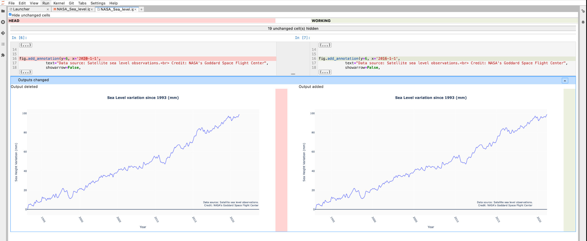

# 如何使用 JupyterLab Git 擴展

原文:[How to use the JupyterLab Git extension](https://blog.reviewnb.com/jupyterlab-git-extension/)

版本控制對於 Jupyter Notebooks 中的協作是不可或缺的。您可以將 Git 和 GitHub 等版本控制工具與 Jupyter Notebook 結合使用：

- 跟踪 notebook 的更改。
- 與您的團隊共享筆記本。
- 審閱 notebook。
- 協作您的工作。

如果您尚未將 GitHub 與 Jupyter 結合使用，請查看[基本教程](./use-git-with-jupyter-nb.md]，該教程將向您展示在 notebook中使用 Git/GitHub 的命令行工作流程。

在本文中，我們將討論 [JupyterLab Git 擴展](https://github.com/jupyterlab/jupyterlab-git)，它直接在 JupyterLab UI 中提供基於 UI 的筆記本 git 工作流程（git clone、push、pull、diff、merge）。

## 設定

如果您使用的是較新版本的 JupyterLab（版本 3.0 或更高版本），則可以使用 `pip`` 或 `Conda`` 以與安裝任何其他 Python 套件相同的方式安裝 Git 擴展：

```bash
pip install --upgrade jupyterlab-git
```

或

```bash
conda install -c conda-forge jupyterlab-git
```

## Git 工作流程

安裝擴展程序後，通過運行以下命令啟動 JupyterLab 服務器：

```bash
jupyter-lab
```

JupyterLab 將自動在您的網絡瀏覽器中打開。

您將在頂部看到一個新的 `Git` menu item，並在左側面板上看到一個 `Git` 圖標(以紅色顯示):

點擊圖標來設定 Git 擴展：


這裡列出了三個按鈕：

- 導航到 Git 存儲庫中已有的文件夾。
- 創建一個新的 Git 存儲庫。
- Clone 現有的 Git 存儲庫。

### Git 工作流程: clone

讓我們 clone 一個現有的 Git 存儲庫。我們將克隆 naas.ai 項目提供的[示例筆記本存儲庫](https://github.com/jupyter-naas/awesome-notebooks)。

讓我們 fork 存儲庫，以便我們可以進行一些更改。接下來，導航到 fork 存儲庫，點擊綠色 `Code` 按鈕，然後復制鏈接以克隆存儲庫：


!!! tip
    您可以按照[這些說明](https://github.com/jupyterlab/jupyterlab-git#authentication-to-remote-repository-hosts)來了解有關設置適當的身份驗證協議以連接到私有存儲庫的更多信息。

點擊 JupyterLab Git 擴展面板上的 `Clone a Repository` 按鈕，然後粘貼我們上面複製的存儲庫鏈接：


現在存儲庫已克隆到您的本地計算機，您可以在導航面板中看到 `awesome-notebooks` 文件夾。


我們現在位於 Git 存儲庫中，因此 Git 面板顯示各種 Git 信息：您所在的分支、您所做的未提交的更改以及用於提交更改的面板。

### Git 工作流程: branch

在編輯任何筆記本之前，讓我們創建一個單獨的 branch 來跟踪所有更改。

導航回 Git 面板來創建新分支。點擊 “Current Branch” 面板，然後點擊 “New Branch” 按鈕。


我們將我們的分支稱為 `text-left`：


### Git 工作流程: diff

現在讓我們編輯一個名為 `NASA_Sea_level.ipynb` 的筆記本。我們的更改會將 “data source” 文本移至繪圖上的更左側。進行更改並保存筆記本後，您將看到 “Changed” 下列出的筆記本。


如果將鼠標懸停在已更改文件的名稱上，您將看到以下圖標：

- open the file
- view the diff between the current branch and your change
- revert the changes
- stage the change

讓我們看看 JupyterLab git 擴展顯示的豐富的筆記本 diff -



### Git 工作流程: commit

在 diff 的比對中，我們可以看到對繪圖線所做的編輯。如果更改看起來令人滿意，我們可以通過將鼠標懸停在 “Changed” 下已更改文件的名稱上，並點擊 `+`` 圖標來提交更改。輸入提交消息並點擊“COMMIT”。這將創建一個本地提交/檢查點。


### Git 工作流程: push

現在我們將本地提交推送到遠程 GitHub 存儲庫。看看下面的截圖 -


左側的雲將最新更改拉取到本地分支。相反，右側的雲將本地更改推送到遠程存儲庫。

右側雲上現在有一個紅點，表示未推送的更改。讓我們點擊右側的雲將我們的更改推送到 GitHub。這會將我們新創建的分支 `text-left` 推送到遠程 GitHub 存儲庫。該分支包含我們對 `NASA_Sea_level.ipynb` 筆記本所做的更改。

### Git 工作流程: merge conflict

也許您的團隊中存在一些溝通不暢的情況。在您有機會合併主分支中的更改之前，您的一位同事先於您更改了 plot text 並發出了 pull request。

您不同意她選擇的 plot end date，因此您仍然想對您的更改提出拉取請求。現在，當您從分支發出拉取請求時，會出現衝突：


如果您現在在 JupyterLab 上更改回 master 分支，則會出現一個彈出窗口，讓您知道遠程版本文件已更改：


讓我們繼續將您同事所做的最新更改拉到 `master` 中。

先切換回 `text-left` 分支，這樣我們就可以將 master 的更新合併到我們的分支中。點擊任務欄中的 Git 選項並選擇　“Merge Branch”，然後選擇要合併到 text-left 分支的 master 分支：


此操作將失敗，您將看到 `NASA_Sea_level.ipynb` 筆記本出現在左側 Git 面板的 “Conflicted” 部分中。雙擊來查看 conflict。您將看到三個版本：

- 我們在當前分支中所做的更改
- original master
- new master（由您的同事更新）


將底部單元格更改為您想要的日期 - 例如 2016-01-01 - 然後點擊 “Mark as resolved”。您將看到筆記本文件從 “Conflicted” 部分移至 “Staged” 部分。已準備好提交。使用底部的提交框進行提交，推送提交，就完成了！

您已經在 JupyterLab git 擴展的幫助下解決了筆記本合併衝突。現在，如果您返回 GitHub，您將看到衝突已經消失，並且我們的 pull request 已準備好進行審核：


## 結論

JupyterLab Git 擴展為我們提供了一種可視化的方式來跟踪我們的分支和提交，所有這些都在筆記本內部 - 真是太高興了！

借助內置差異和對合併衝突的支持，此擴展使您的日常分支、提交和推送變得簡單，只需點擊幾下即可。我們都需要一點推動力來更加一致地控制我們的筆記本的版本 - 這可能是您的團隊需要的推動力！