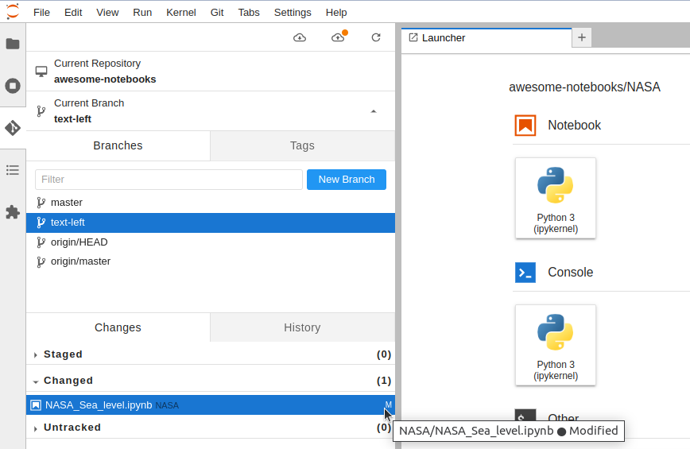

# 如何使用 JupyterLab Git 擴展

原文:[How to use the JupyterLab Git extension](https://blog.reviewnb.com/jupyterlab-git-extension/)


版本控制對於 Jupyter Notebooks 中的協作是不可或缺的。您可以將 Git 和 GitHub 等版本控制工具與 Jupyter Notebook 結合使用：

- 跟踪 notebook 的更改。
- 與您的團隊共享 notebook 。
- 審閱 notebook。
- 協作您的工作。

如果您尚未將 GitHub 與 Jupyter 結合使用，請查看[基本教程](./use-git-with-jupyter-nb.md)，該教程將向您展示在 notebook　中使用 Git/GitHub 的 command 工作流程。

在本文中，我們將討論 [JupyterLab Git 擴展](https://github.com/jupyterlab/jupyterlab-git)，它直接在 JupyterLab UI 中提供基於 UI 的 git 工作流程（git clone、push、pull、diff、merge）。

## 設定

如果您使用的是較新版本的 JupyterLab（版本 3.0 或更高版本），則可以使用 `pip` 或 `Conda` 以與安裝任何其他 Python 套件相同的方式安裝 Git 擴展：

```bash
pip install --upgrade jupyterlab-git
```

或

```bash
conda install -c conda-forge jupyterlab-git
```


## Git 工作流程

安裝擴展程序後，通過運行以下命令啟動 JupyterLab 服務器：

```bash
jupyter-lab
```

JupyterLab 將自動在您的網絡瀏覽器中打開。

您將在頂部看到一個新的 `Git` menu item，並在左側面板上看到一個 `Git` icon(以紅色顯示):

點擊 icon 來設定 Git 擴展：


這裡列出了三個按鈕：

- 導航到 Git 存儲庫中已有的文件夾。
- 創建一個新的 Git 存儲庫。
- Clone 現有的 Git 存儲庫。


### Git 工作流程: clone

為了練習 git 的工作流程，我們將克隆 naas.ai 專案在 Github 上的 repo: [jupyter-naas/awesome-notebooks](https://github.com/jupyter-naas/awesome-notebooks)。

1. 首先登入 Github

    

2. 導覽到要 `fork` 的 Github 專案頁 ([jupyter-naas/awesome-notebooks](https://github.com/jupyter-naas/awesome-notebooks))

3. 在讓我們先對　[jupyter-naas/awesome-notebooks](https://github.com/jupyter-naas/awesome-notebooks) 進行　`fork` 存儲庫，以便我們可以進行一些更改。

    

    點擊 "Fork" 按鈕:

    

    點擊 "Creak fork" 按鈕。
    

4. 導航到 fork 的 repo 頁面，點擊綠色 `Code` 按鈕，然後 `copy` 鏈接以便 clone 存儲庫至本機目錄：

    

    !!! tip
        您可以按照[這些說明](https://github.com/jupyterlab/jupyterlab-git#authentication-to-remote-repository-hosts)來了解有關設置適當的身份驗證協議以連接到私有存儲庫的更多信息。

5. 點擊 JupyterLab Git 擴展面板上的 `Clone a Repository` 按鈕，然後粘貼我們上面複製的 git repo 鏈接：

    

    現在存儲庫已克隆到您的本地計算機，您可以在導航面板中看到 `awesome-notebooks` 文件夾。

    

    我們現在位於 Git 存儲庫中，因此 Git 面板顯示各種 Git 信息：您所在的分支、您所做的未提交的更改以及用於提交更改的面板。


### Git 工作流程: branch

在編輯任何 notebook 之前，讓我們將創建一個新的 `branch` 來追踪所有更改。

1. 導航回 Git 面板來創建新分支。點擊 “Current Branch” 面板，然後點擊 “New Branch” 按鈕。

    

2. 輸入分支名稱 `text-left` 然後點擊 “Create Branch” 按鈕。

    

3. 點擊 JupyterLab Git 擴展面板上可檢視到新的分支 `text-left` 己經創建起來

    


### Git 工作流程: diff

接著讓我們來試試如何在 notebook 中進行修改，並且使用 `diff` 來顯示修改的地方與內容。

1. 從左側 JupyterLab 的導覽欄切換到 `File Browser` 並點選 `NASA` 檔案夾

        

2. 編輯一個位於 `NASA` 目錄下名為 `NASA_Sea_level.ipynb` 的 notebook 。    

    我們把下列兩行的程式碼進行位置上的挪動:

    ```python hl_lines="2 3"
    fig.add_annotation(
        y=6,
        x="2020-1-1",
        text="Data source: Satellite sea level observations.<br> Credit: NASA's Goddard Space Flight Center",
        showarrow=False,
    )
    ```

    

    修改後的結果如下:

    ```python hl_lines="1"
    fig.add_annotation(y=6, x="2020-1-1",
        text="Data source: Satellite sea level observations.<br> Credit: NASA's Goddard Space Flight Center",
        showarrow=False,
    )
    ```

3. 點選 Disk icon 保存 notebook 後，在左側的 git panel 裡，您將看到 “Changed” 下會列出的被修改的 notebook 。

    

    如果將鼠標懸停在已更改文件的名稱上，您將看到以下可選擇的動作 icon：

    - `Open the file`: 開啟檔案
    - `Diff this file`:　比較修改前後的差異
    - `Discard changes`:　丟棄修改
    - `Stage this change`: 拋轉修改至暫存區

    

4. 點選 `Diff this file`，讓我們看看 JupyterLab git 擴展顯示的差異比對 `diff`

    

### Git 工作流程: commit

在 `diff` 的比對中，我們可以看到對程式碼所做的編輯與內容。

如果程式碼的編輯看起來令人滿意，我們準備把修改的結果進行本地提交。

1. 將鼠標懸停在 “Changed” 下已更改文件的名稱上，並點擊 `+` icon 來提交更改。

    

2. 輸入本次提交的註解訊息並點擊 “COMMIT”。這將創建一個本地提交/檢查點(check-point)。

    

3. 在跳出的視窗中輸入name與email 後點擊 `OK` 按鈕。

    

4. 點選 `History` 頁籤可檢視最新的提交訊息

    


### Git 工作流程: push

接著我們來練習把本地修改後的 `commits` 要提交推送到遠程 GitHub 存儲庫來進行儲存。

看看下面的截圖:


左側的雲的 icon 代表著將最新更改從遠端 repo 拉取到本地分支。相反，右側雲的 icon 代表者將本地更改推送到遠端的 repo。

在前一個步驟我們修改了程式碼並在本地的 repo 提交的修改的 commit。因此在右側雲的 icon 上現在有一個紅點，表示有本地未推送到遠端 repo 的更改。

1. 讓我們點擊右側的雲的 icon 將我們的本地的更改推送到遠端的 GitHub 之上。

    

2. 在跳出來的視窗中輸入遠端 repo 所註冊的使用者帳號與密碼(Personal Access Token)

    

3. 成功之後回到遠端的 github repo 去檢視分支被推送上來的結果

    

上述的步驟將我們新創建的分支 `text-left` 推送到遠程 GitHub 存儲庫。該分支包含我們對 `NASA_Sea_level.ipynb`  notebook 所做的更改。


### Git 工作流程: merge conflict

也許您的團隊中存在一些溝通不良的情況。在您有機會合併主分支中的更改之前，您的一位同事先於您更改了同一個 notebook 裡頭的程式碼並發出了 `pull request`。

您不滿意這位同事的修改，因此您仍然想對您的更改提出拉取請求。現在，當您從分支發出拉取請求時，會出現衝突：


如果您現在在 JupyterLab 上更改回 `master` 分支，則會出現一個彈出窗口，讓您知道遠程版本文件已更改：


讓我們繼續將您同事所做的最新更改拉到 `master` 中。

先切換回 `text-left` 分支，這樣我們就可以將 `master` 的更新合併到我們的分支中。點擊任務欄中的 Git 選項並選擇　“Merge Branch”，然後選擇要合併到 `text-left` 分支的 `master` 分支：


此操作將會失敗，您將看到 `NASA_Sea_level.ipynb` notebook 出現在左側 Git 面板的 “Conflicted” 部分中。雙擊來查看 conflict。您將看到三個版本：

- `current branch`: 我們在當前分支 `text-left` 中所做的更改
- `original master`: 原本的內容
- `new master`: 您同事更新後的版本


將底部單元格更改為您想要的日期 - 例如 `2016-01-01`, 然後點擊 {==“Mark as resolved”==}。您將看到 notebook 文件從 “Conflicted” 部分移至 “Staged” 部分。已準備好提交。使用底部的提交框進行提交，推送提交，就完成了！

在上述的步驟中, 我們在 JupyterLab git 擴展的幫助下解決了 notebook 合併衝突。現在，如果您返回 GitHub，您將看到衝突已經消失，並且我們的 pull request 已準備好進行審核：


## 結論

JupyterLab Git 擴展為我們提供了一種可視化的方式來跟踪我們的分支和提交，所有這些都在 notebook 的工具上提供了直接的支持。

借助內置差異分析 (diff) 和對合併衝突 (conflic resolve) 的支持，此 Jupyter Git擴展使日常分支、提交和推送變得簡單，只需點擊幾下即可。

我們都需要一點推動力來更加一致地控制我們的 notebook 的版本 - 這可能是您的團隊需要的推動力！